# 三星 Galaxy Book 2 业务的最佳配件

> 原文：<https://www.xda-developers.com/best-accessories-samsung-galaxy-book-2-business/>

三星 Galaxy Book 2 业务是三星首次大举进军商用笔记本电脑。以前有面向商业的笔记本电脑版本，但这是我们第一次拥有专为商业设计的设备。它也是一款不错的产品，具有支持博锐技术的英特尔第 12 代酷睿处理器、安全内核电脑认证等等。但是，笔记本电脑再好，也总有你想要的更多。在这篇文章中，我们收集了一些你可以买到的最好的配件，以充分利用三星 Galaxy Book 2 业务。

您可能需要的附件范围很广，从简单的鼠标或键盘到第二块屏幕、外部 GPU 或扩展坞。有许多不同类别的配件，我们将尝试涵盖所有主要的配件。事不宜迟，让我们来看看您可能需要的所有三星 Galaxy Book 2 配件。

**浏览本文:**

## 三星 Galaxy Book 2 商务显示器

三星 Galaxy Book 2 业务并没有给你太多的显示器配置选项，即使有，第二块屏幕对许多用户来说也是必不可少的，因为它可以提高生产力。有了两个屏幕，你可以同时看到和做更多的事情——例如，你可以在一个屏幕上参考内容，而在另一个屏幕上写作。除非你尝试过，否则很难意识到第二个屏幕有多有用，但是一旦你尝试过，就很难回头了。如果你想完成工作，外接显示器是三星 Galaxy Book 2 业务的必备配件。

*   <picture></picture>

    LG ultra wide 34 WP 65 c-B

    ##### LG 34 WP 65 c-B

    这款 LG 显示器拥有 21:9 的超宽宽高比，是完成工作的理想选择。大工作空间意味着您可以并排打开多个应用程序，此外，您还可以获得清晰的 3440 x 1440 分辨率、160Hz 刷新率和内置的 7W 立体声扬声器，从而获得出色的媒体体验。

*   <picture></picture>

    惠普 E27u G4

    ##### 惠普 E27 G4 显示器

    惠普 E27u 是一款非常棒的四核高清显示器，尽管很简单。27 英寸的面板具有清晰的 2560 x 1440 分辨率，它采用现代时尚的设计，在任何空间都看起来很棒。它支持 HDMI、DisplayPort 和 USB-C 输入，提供 65W 的功率，另外还支持高度和枢轴旋转。

*   <picture>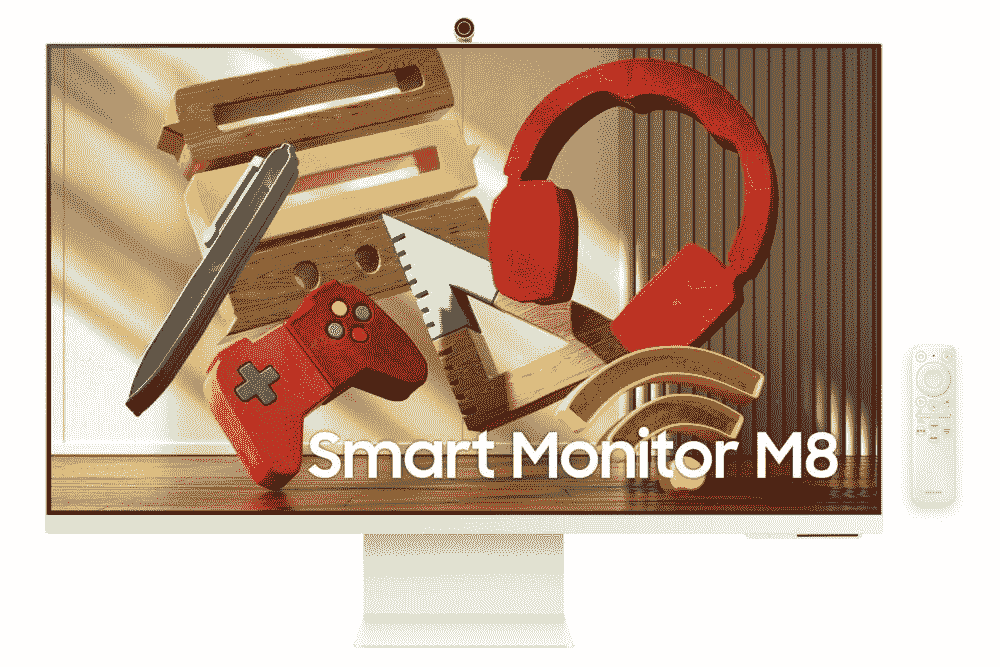</picture>

    三星智能显示器 M8

    ##### 三星智能显示器 M8

    这是目前你能找到的最佳选择之一，三星智能显示器 M8 配备了支持 HDR10+的 32 英寸 4K 面板，另外它还包括一个用于视频通话的磁性附着网络摄像头。除了显示器，它还具有智能电视功能，因此您可以使用它的流媒体应用程序，甚至访问云中的 Microsoft Office。

*   <picture></picture>

    HP 24MH

    ##### HP 24MH FHD 显示器

    如果你想要一台价格实惠但功能强大的显示器，你不可能得到比这款更好的了。这款显示器采用全高清面板，刷新率为 75Hz，甚至还有两个内置 2W 扬声器。该支架也支持高度和倾斜调节，并且它的四周都有相当小的挡板。考虑到它的价格，这对任何人来说都是一个极好的选择。

*   <picture></picture>

    联想 ThinkVision M14

    ##### 联想 ThinkVision M14

    如果你离不开第二块屏幕，甚至是在旅途中，那么联想 ThinkVision M14 也许就是你要找的。这是只需要一根电缆就能工作的便携式监视器。它通过 USB-C 连接显示器和电源，并配有 14 英寸全高清显示屏，是您笔记本电脑的完美搭配。

如果您愿意，您可以在我们的[最佳显示器](https://www.xda-developers.com/best-monitors/)汇总中找到更多选项。

## 坞站和适配器

开箱即用，三星 Galaxy Book 2 业务已经有了稳定的端口供应。你有一个 Thunderbolt 4 端口，一个标准 USB Type-C 端口，两个 USB Type-A 端口，HDMI，以太网，一个耳机插孔和一个 microSD 读卡器。坦率地说，这是一个很好的选择，很难在这样一个小笔记本电脑上要求更多。但是如果你在有很多外围设备的桌子上工作，这些端口仍然会很快填满，而且每次你想移动笔记本电脑时，你都需要插拔所有的外围设备。

如果您想简化设置，坞站是三星 Galaxy Book 2 业务中最重要的附件之一。它们允许您使用笔记本电脑上的单个端口连接大量设备，使一次性设置一切变得更加容易，同时也释放了笔记本电脑本身的端口。以下是一些建议:

*   <picture>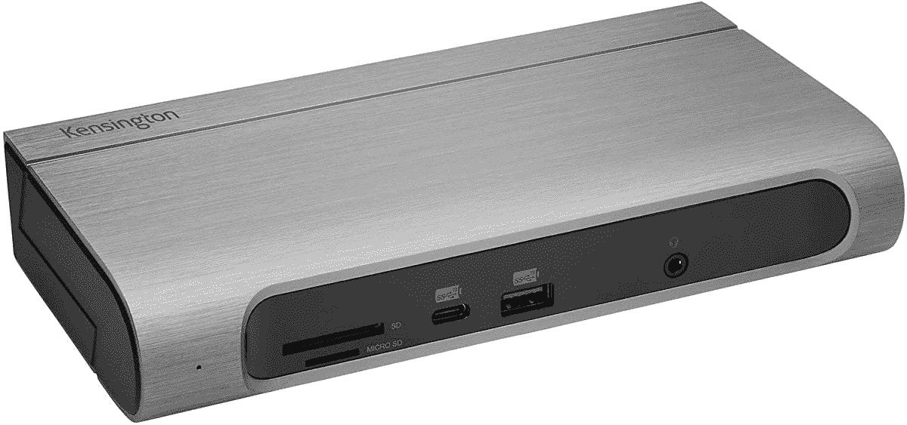</picture>

    肯辛顿 SD5600T

    ##### 肯辛顿 SD5600T 雷电 3 坞

    它可能不是最新的型号，但肯辛顿 SD 5600t 仍然是极其通用的，并且比许多其他型号的价格更令人满意。您可以在一个时尚的机箱中获得六个 USB Type-A 端口、两个 HDMI 和两个 DisplayPort 连接、千兆以太网接口、SD 读卡器和 USB-C。所有这些都可以水平或垂直使用。

*   <picture>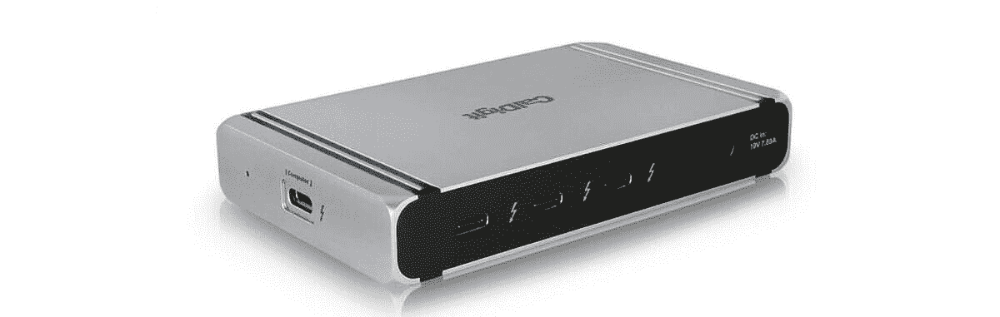</picture>

    CalDigit Element Hub

    ##### CalDigit Element Thunderbolt 4 Dock

    如果你大多有 Thunderbolt 和基于 USB 的外设，CalDigit Element Hub 是一款极其紧凑且相对实惠的扩展坞。它为您提供了三个 Thunderbolt 下游端口和四个 USB 端口，因此您可以连接所有外围设备，其微小的设计使您的设置尽可能干净。

*   <picture>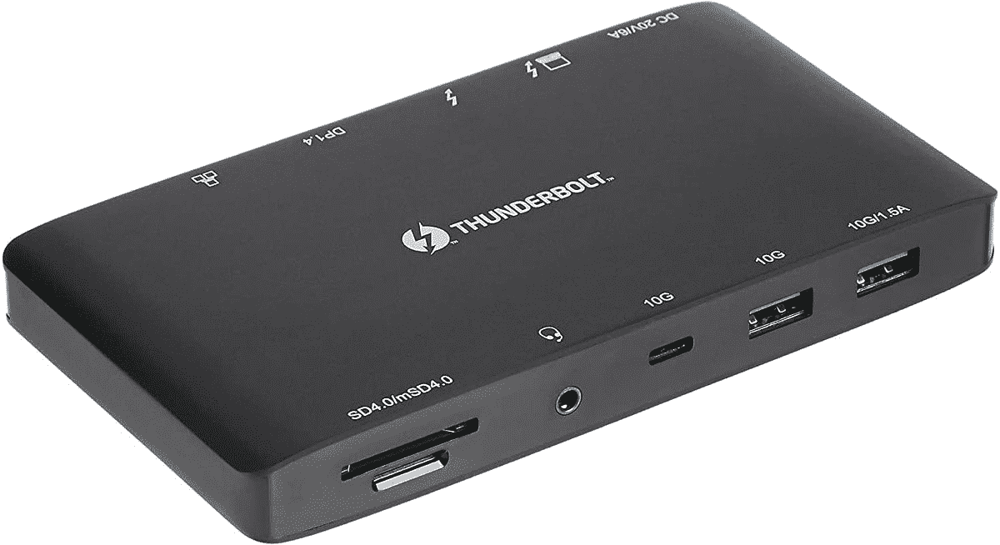</picture>

    亚马逊基础款 10 合 1 雷电 3 坞

    ##### 亚马逊基础款 10 合 1 雷电 3 坞

    Thunderbolt 坞价格可能会比较贵，但这一款是相对实惠的选择，还是多功能的。它为您提供了两个 USB Type-A 端口、一个 USB-C、DisplayPort 输出、千兆以太网、SD 读卡器和 Thunderbolt 下游连接。它还可以为您的笔记本电脑提供 60W 的功率，因此对于这个价格来说，它是一款非常全面的产品。

*   <picture></picture>

    qu uge USB-C 扩展坞

    ##### qu uge USB-C 扩展坞

    如果你想省点钱，你可以得到一个 USB 扩展坞，那可不是霹雳。这是一个很好的选择，它总共提供了 11 个端口，包括 USB Type-A、USB-C、HDMI、VGA 和以太网。它还可以兼作笔记本电脑支架，让您更加舒适或改善笔记本电脑的通风。它还支持高达 100W 的直通充电。

*   <picture></picture>

    Totu 9 合 1 集线器

    ##### Totu 9 合 1 USB-C 集线器

    在旅途中需要更多端口？这款 TOTU USB-C 集线器将三个 USB Type-A 端口、两个 HDMI 输出、VGA 和 SD 读卡器放在一个非常紧凑、价格实惠的包中，您可以随身携带。它甚至支持高达 100 瓦的直通充电，这是一个为笔记本电脑添加更多端口的好方法，而不会使它更难携带。

## 鼠标和键盘

笔记本电脑的便携性使你可以在任何地方工作，但它也有一些缺点。笔记本电脑的键盘不如台式机的舒适，而且你用的是触摸板而不是合适的鼠标，这对大多数用户来说都不理想。如果你想在办公室使用三星 Galaxy Book 2 业务来完成工作，鼠标和键盘是非常有用的配件，可以让你更加舒适和高效。以下是一些建议:

*   <picture></picture>

    Razer Pro Type Ultra

    ##### Razer Pro Type Ultra

    机械键盘是许多用户的首选，Razer Pro Type Ultra 是工作的绝佳选择，采用时尚坚固的金属设计。它使用 Razer 的静音线性开关来舒适地打字，白色和银色的干净设计非常适合办公室。此外，它包括一个额外的舒适软垫手腕休息。

*   <picture></picture>

    Surface 人体工学键盘

    ##### 微软 Surface 人体工学键盘

    乍一看可能不像，但 Surface 人体工学键盘旨在长时间给用户带来出色的舒适性。弯曲的形状让所有的中央按键都触手可及，中间较大的按键也有助于这一点。此外，内置的腕托可以在打字时提供更好的支撑。

*   <picture></picture>

    罗技 MK545 Combo

    ##### 罗技 MK545 Combo

    如果你想要一套价格实惠的完整设置，罗技 MK 545 键盘鼠标 Combo 是一个不错的选择。它包括一个带有舒适按键的全尺寸键盘和一个用于打字的掌托，以及一个带有侧按钮的全尺寸鼠标。这两款设备使用统一的 USB 加密狗，因此您只需要一个端口就可以同时使用这两款设备。

*   <picture></picture>

    HP 280 静音鼠标

    ##### HP 280 静音鼠标

    想要一款实惠又可靠的鼠标？HP 280 静音无线鼠标采用舒适的全尺寸设计，具有静音开关，因此您可以在不打扰自己和周围人的情况下完成工作，此外，它还具有惠普蓝光技术跟踪器，可在大多数表面上工作。它并不花哨，但它是一个坚实的基本选项。

*   <picture></picture>

    罗技 MX Master 3S

    ##### 罗技 MX Master 3

    罗技的 MX Master 家族以其巨大的品质而闻名，最新成员也不例外。这款鼠标采用了符合人体工程学的高端设计，带有 SmartShift 的 MagSpeed 金属滚轮(外加一个水平滚轮)和可编程按钮，可能是目前最好的鼠标。

## 耳机和耳塞

如果你独自一人，三星 Galaxy Book 2 商务版的扬声器可能适合一般用途，但耳塞或耳机等配件在某些情况下也非常重要。如果你周围有人，你可能不想让扬声器发出的声音打扰他们。同时，耳机还可以帮助过滤背景噪音，帮助你集中注意力。此外，耳机使麦克风更靠近你的嘴，所以如果你用笔记本电脑打电话，别人可能会听得更清楚。如果你想要一副很棒的耳塞或耳机，这里有一些选择:

*   <picture></picture>

    LG Tone Free FP9

    ##### LG Tone Free FP9

    LG Tone Free FP9 是高端耳塞，具有出色的音频、ANC 和所有你期望的功能，但它有一些独特的好处。首先，UVnano 外壳可以使用紫外线对你的耳塞进行消毒。还有即插即用的无线功能，所以你甚至可以在不支持蓝牙的设备上使用它们。

*   <picture></picture>

    森海塞尔气势真无线 2

    ##### 森海塞尔气势真无线 2

    如果你想要一些不同于 mst 其他耳塞的东西，森海塞尔气势真无线 2 是一个很棒的选择。它们配有 7 毫米驱动器和 ANC，但设计也很独特，采用织物覆盖的外壳和中性颜色的优质耳塞，无论放在哪里都很好看。

*   <picture></picture>

    Bose QuietComfort 700

    ##### Bose 降噪耳机 700

    Bose 在音频产品方面颇有名气，quiet comfort 700 是其迄今为止最好的耳机之一。11 级噪音消除、触摸控制和超薄设计，非常适合任何人。它们通过蓝牙工作，但如果你想为你的笔记本电脑提供更可靠的连接，可以单独购买 USB 加密狗。

*   <picture></picture>

    Surface 耳机 2

    ##### 微软 Surface 耳机 2

    喜欢一款特定耳机的原因有很多，Surface 耳机 2 勾选了很多框。它们提供高质量的全向声音和 ANC，但除了触摸手势之外，它们还具有在耳罩上使用直观的基于转盘的控制的额外功能。此外，您可以使用 Windows 的 Surface 应用程序轻松管理它们。

*   <picture></picture>

    Razer Barracuda X

    ##### Razer Barracuda X

    如果你发现蓝牙耳机过一段时间会变得很麻烦，Razer Barracuda X 是一款很酷的耳机，它使用 USB-C 加密狗来连接你的笔记本电脑、手机和其他设备。不过，它仍然可以无线工作，而且它有一个可拆卸的麦克风，所以你只有在需要的时候才能使用它。再加上相对实惠。

## 三星 Galaxy Book 2 业务的网络摄像头

三星 Galaxy Book 2 业务已经有了一个非常坚固的开箱即用的网络摄像头。它捕捉全高清视频，支持 Windows Hello，考虑到网络摄像头直到最近的状态，我们不能要求更多。尽管如此，在某些情况下，您可能想要最好的质量，或者您可能会关闭笔记本电脑并连接到外部显示器。虽然你不太可能需要新的网络摄像头，但这里有一些你可能会喜欢的选项:

*   <picture>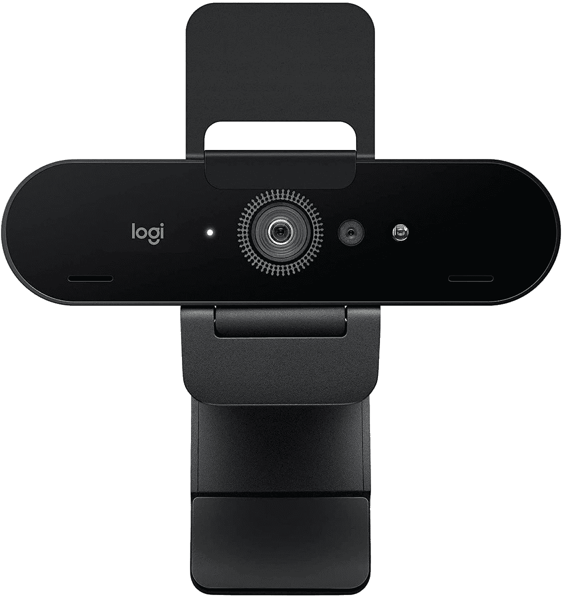</picture>

    罗技布里奥 4K 网络摄像头

    ##### 罗技布里奥 4K 专业网络摄像头

    如果你不喜欢戴尔 UltraSharp 网络摄像头的外观或价格，罗技布里奥是一个不错的替代选择。它仍然支持 4K、HDR、灯光调节等功能，此外它还有两个降噪麦克风。它有点旧，但这意味着您通常会发现它比戴尔的产品更便宜。

*   <picture>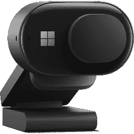</picture>

    微软现代网络摄像头

    ##### 微软现代网络摄像头

    如果你不需要那种高端的东西，微软现代网络摄像头是全高清分辨率的绝佳替代品。它仍然具有 HDR 和面部修饰等功能，所以你总是保持最佳状态，还有一个内置的隐私快门，以防你担心被监视。

## 外部 GPU 外壳

GPU 性能通常不是商业用户最优先考虑的问题，因此三星 Galaxy Book 2 Business 配备了低功耗 GPU，无论是集成的 Iris Xe 显卡还是可选的 NVIDIA GeForce MX570。然而，由于 Thunderbolt 的支持，如果你想获得游戏、3D 渲染、机器学习或任何用例的额外性能，你可以连接一个外部 GPU。外部 GPU 外壳是非常棒的附件，可以将您的三星 Galaxy Book 2 业务变成一台更加多功能的机器。以下是一些不错的选择:

*   ##### 十四行诗分离盒 750

    十四行诗分离盒 750 是一款时尚现代设计的高级 GPU 外壳。它具有 750 瓦的 PSU，可为 GPU 提供 375 瓦的持续功率(外加 100 瓦的峰值负载)，还支持为笔记本电脑提供 100 瓦的功率。

*   <picture></picture>

    冷却器主控器 EG200

    ##### 冷却器主控器 EG200

    冷却器主控器 eg 200 没有最好的规格，但它有 550 瓦的 PSU，可以为您的笔记本电脑提供 60 瓦的功率。它有三个 USB 端口和一个 SATA 驱动器插槽，另外它还可以兼作笔记本电脑支架，因此您可以有一个更整洁的设置。

想要其他选择吗？查看我们的[最佳外部 GPU 附件列表](https://www.xda-developers.com/best-external-gpus-for-your-laptop/)。

## 三星 Galaxy Book 2 业务案例

三星 Galaxy Book 2 业务并不完全是廉价的笔记本电脑，这种投资绝对值得保护。外壳是相当标准的配件，但这并不意味着它们对于保护您的三星 Galaxy Book 2 业务安全不可或缺。以下是我们推荐的一些案例:

*   <picture></picture>

    Kinmac 360 笔记本电脑保护套

    ##### Kinmac 360 保护套

    如果你想让自己的笔记本电脑安全，但又想要一件与自己风格相符的东西，这款适合你。Kinmac 保护套具有多层保护，具有大量缓冲和加固框架。另外，它有很多款式可供选择。

*   <picture>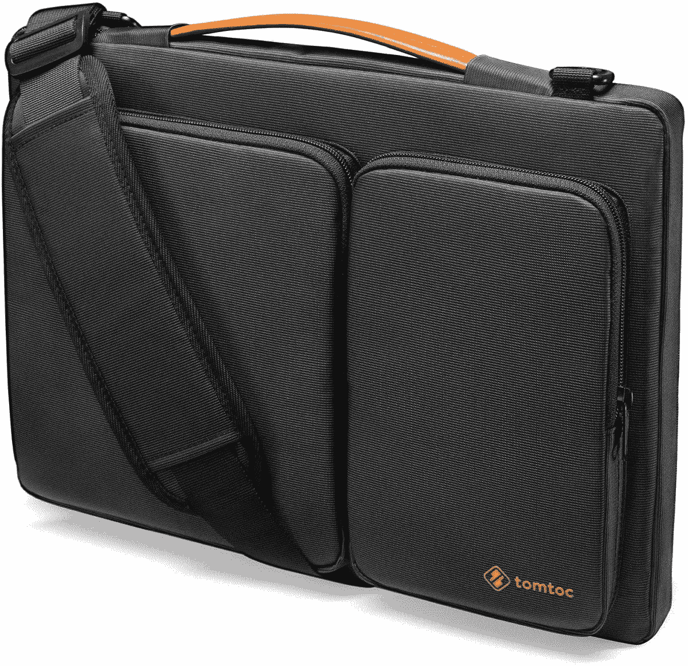</picture>

    Tomtoc 笔记本电脑单肩包

    ##### Tomtoc 笔记本电脑单肩包

    如果你不想把笔记本电脑拿在手中，这款单肩包可能会给你更舒适的体验。它有一些额外的口袋放配件，也提供了足够的保护。它也有一些经典的颜色可供选择。

## 外部存储器

你可以为联想 ThinkPad X1 Carbon 配置高达 2TB 的 SSD 存储，坦率地说，这对大多数人来说应该足够了。但是，升级到这些更高的存储层可能会很昂贵，所以不是每个人都会这样做。另外，尽管 2TB 很多，但肯定有可能用光。如果您需要一些额外的空间来存放文件，外部固态硬盘或硬盘是 ThinkPad X1 Carbon 非常重要的附件。以下是我们目前推荐的最佳选择:

*   <picture>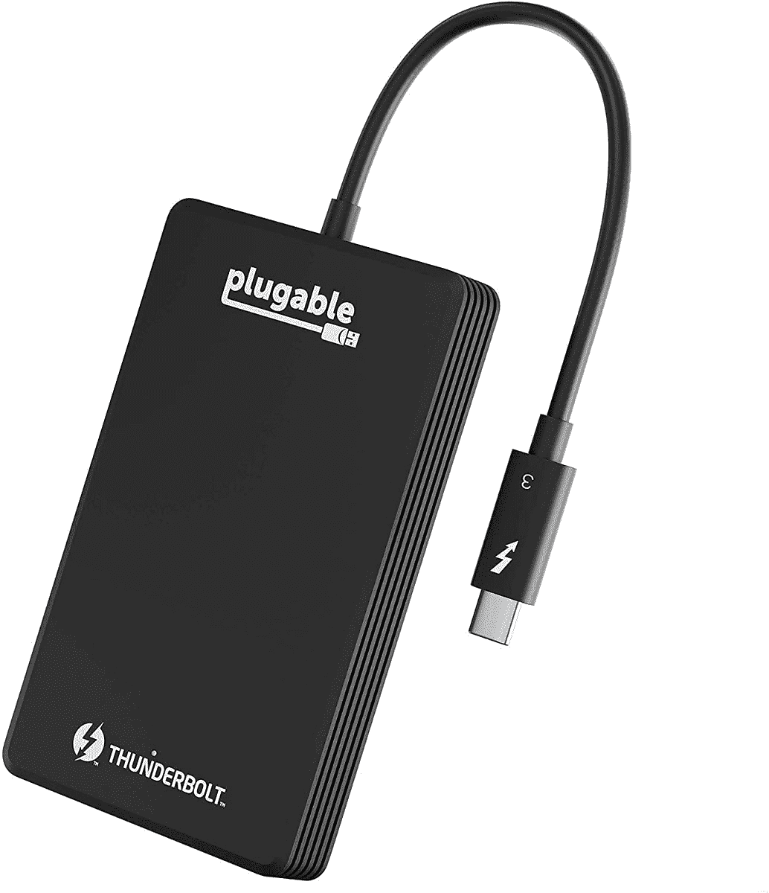</picture>

    可插拔的雷电 3 固态硬盘

    ##### 可插拔的雷电 3 外置固态硬盘

    在将线缆和设备放在一起时遇到了一些问题？这款可插拔固态硬盘内置电缆，因此您不必担心会丢失。此外，您的速度高达 2，400MB/s，因此您仍然可以享受 Thunderbolt 连接的好处。

*   <picture>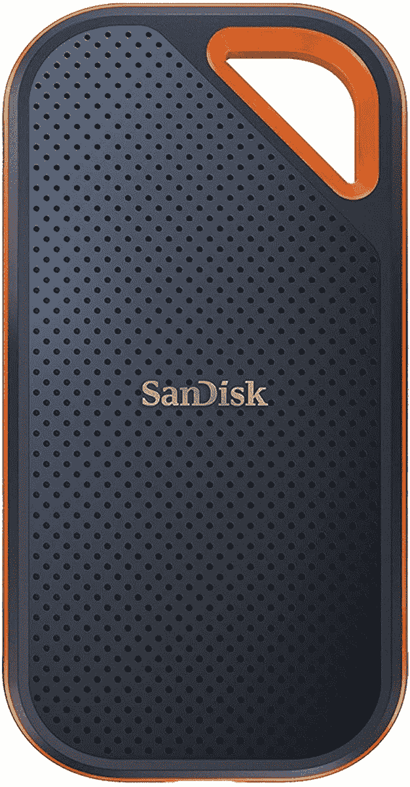</picture>

    SanDisk Extreme Pro 固态硬盘

    ##### SanDisk Extreme Pro 便携式固态硬盘

    【219.99 美元节省 290 美元

    SanDisk Extreme Pro 是一款设计用于抵御恶劣天气的固态硬盘它具有 2 米的跌落保护，加上 IP55 防水和防尘性能。即使没有 Thunderbolt，USB 3.2 Gen 2 也可以提供高达 2000 MB/s 的速度，因此非常快。

*   <picture>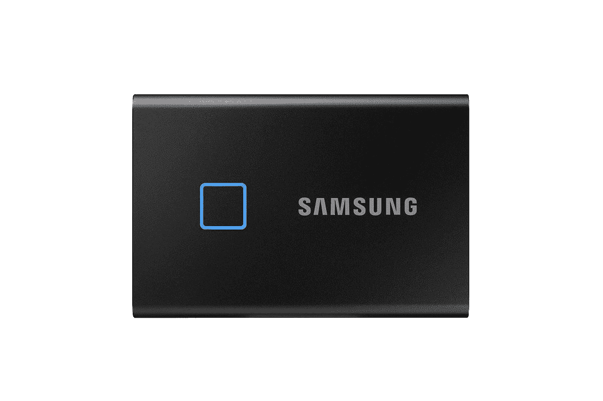</picture>

    三星 T7 Touch

    ##### 三星 T7 Touch 便携式固态硬盘

    想要安全轻松地访问您的文件吗？三星 T7 Touch SSD 内置指纹识别器，保护您的文件免受窥探，无需您输入密码即可访问。它支持高达 1，050MB/s 的速度，这一点也不差。

*   <picture></picture>

    WD My Book Duo

    ##### WD My Book Duo 外置硬盘

    拥有快速 SSD 存储固然很好，但也可能相当昂贵。这款大容量硬盘为您提供高达 24TB 的存储空间，几乎可以存储您的所有文件，而且价格合理。当然，它没有那么快，速度高达 360MB/s，但这是备份所有文件的好方法。

*   <picture>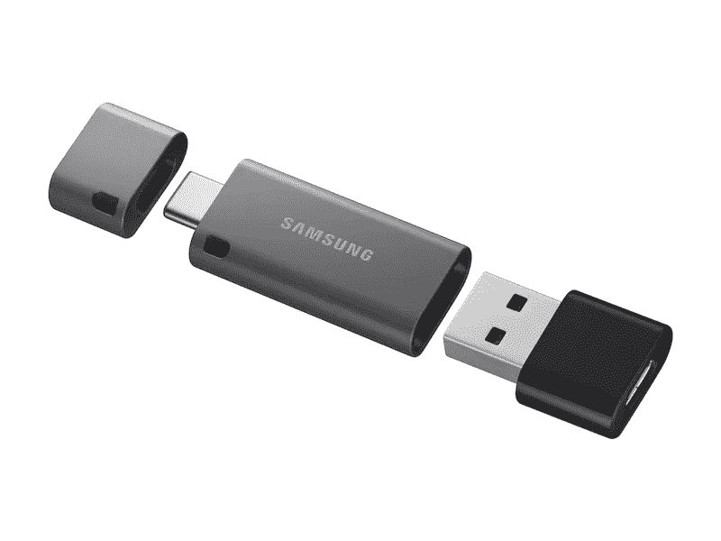</picture>

    三星 DUO Plus 闪存盘

    ##### 三星 DUO 闪存盘

    如果您需要快速共享文件或随身携带文件，小型闪存盘可能是比固态硬盘更好的选择。这款来自三星的产品有 USB Type-C 和 Type-A 端口，因此它可以在 PC、平板电脑和大多数安卓手机上工作，容量高达 256GB。

## 电光队

显然，我们希望任何拥有三星 Galaxy Book 2 业务的人仍然有一个正常工作的充电器，但有时意外会发生。无论你是把包装盒里的充电器放错了地方，还是因为某种原因它停止了工作，我们都收集了一些你可以购买的替换选项。因为它使用 USB-C 充电，所以很容易找到替代品。

*   <picture>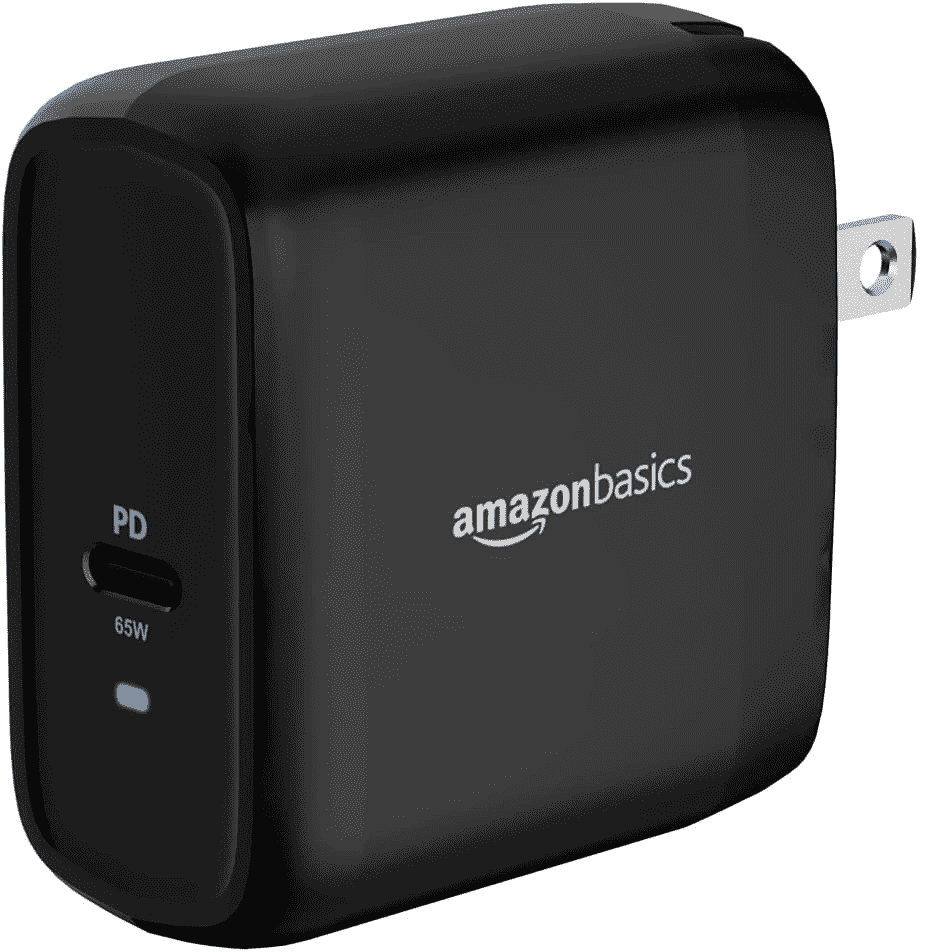</picture>

    亚马逊基础款 65W GaN 充电器

    ##### 亚马逊基础款 65W GaN 充电器

    如果你不想花很多钱买一个新充电器，这款亚马逊基础款充电器是个很棒的选择。它可以提供 65W 的功率，线缆也包括在内，所以你不必担心其他任何事情。

*   <picture>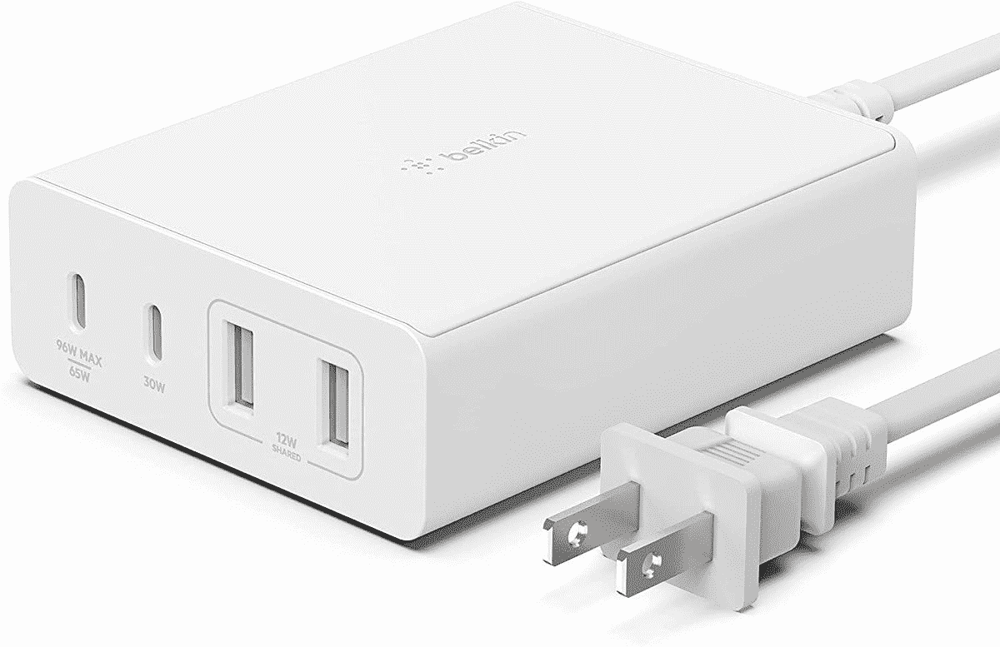</picture>

    Belkin 108 w 4 口充电器

    ##### Belkin boost charge Pro 108 w GaN 4 口充电器

    有很多设备？您可以使用 Belkin Boost Charge Pro 为它们充电。主端口本身可以提供高达 96 瓦的功率，或者在使用其他端口为平板电脑、手机和其他低功耗设备充电时提供 65 瓦的功率。

## 多方面的

到目前为止，你可能已经找到了三星 Galaxy Book 2 业务所需的大部分配件，但还有一些东西你可能会喜欢。由于它们不属于特定的类别，我们将把它们留在下面:

*   <picture>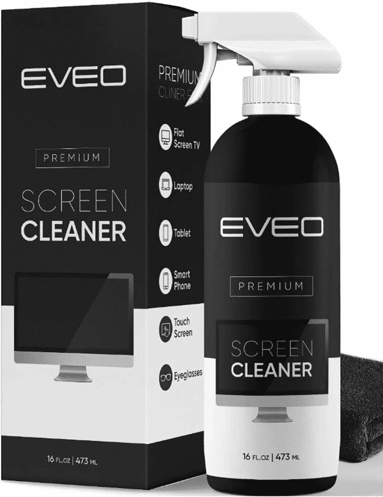</picture>

    Eveo 屏幕清洁套装

    ##### Eveo 屏幕清洁套装

    笔记本电脑很容易收集灰尘、指纹以及其他任何东西，所以时不时地清理一下是有好处的。这款屏幕清洁剂和 microfober 布可以让你做到这一点，而且价格实惠。

*   <picture></picture>

    雷蛇 Anzu 智能眼镜

    ##### 雷蛇 Anzu 智能眼镜

    雷蛇 Anzu 是一副眼镜，手臂上有微型扬声器，可以私下听音乐，不会阻挡外界声音。此外，他们包括电脑和太阳镜镜头，所以你可以在任何地方使用它们。

* * *

这就是我们为三星 Galaxy Book 2 业务推荐的所有配件。我们已经涵盖了广泛的类别，你几乎可以保证在这里找到你感兴趣的东西。不过，也有其他方法可以提升你的体验，比如，如果你想站着工作而不是坐着，可以使用立式办公桌。我们最近[对 FlexiSpot EG8 立式办公桌](https://www.xda-developers.com/flexispot-eg8-standing-desk-review/)进行了评估，如果你对此感兴趣的话。

如果你想购买三星 Galaxy Book 2 业务，可以使用下面的链接。否则，如果你想看到更多的选择，也许可以看看今天你能买到的[最好的三星笔记本电脑](https://www.xda-developers.com/best-samsung-galaxy-laptops/)，或者是[最好的笔记本电脑](https://www.xda-developers.com/best-laptops/)。

 <picture></picture> 

Samsung Galaxy Book 2 Business

##### 三星 Galaxy Book 2 商务版

三星 Galaxy Book 2 Business 专为工作而设计，采用经典设计和第 12 代英特尔博锐处理器。