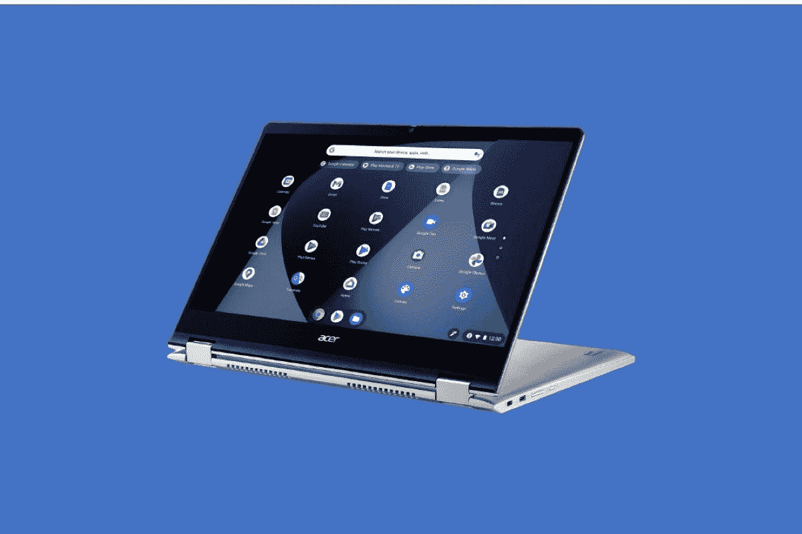
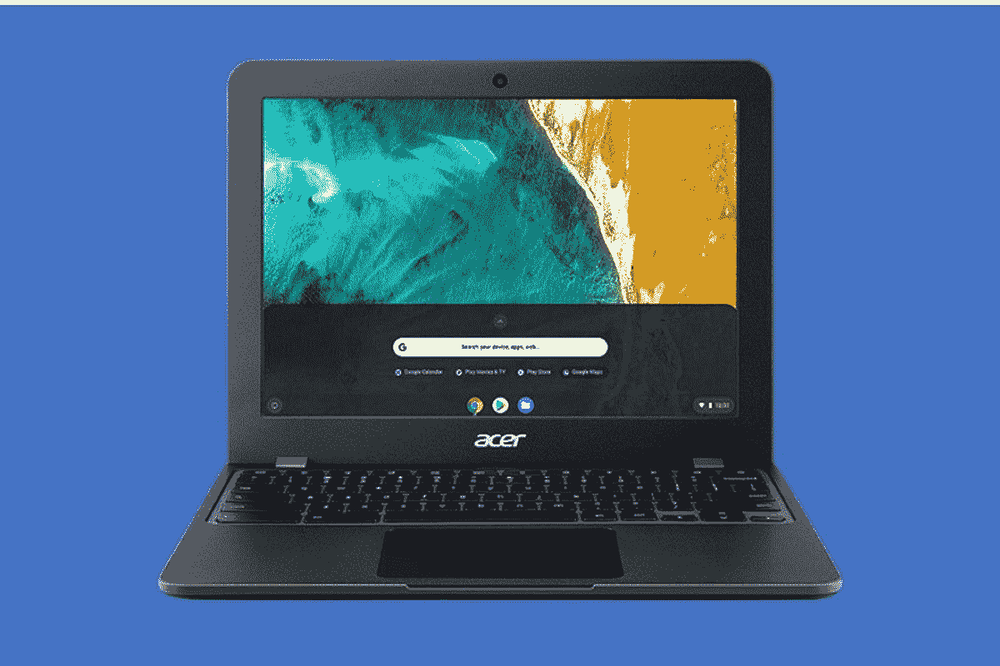
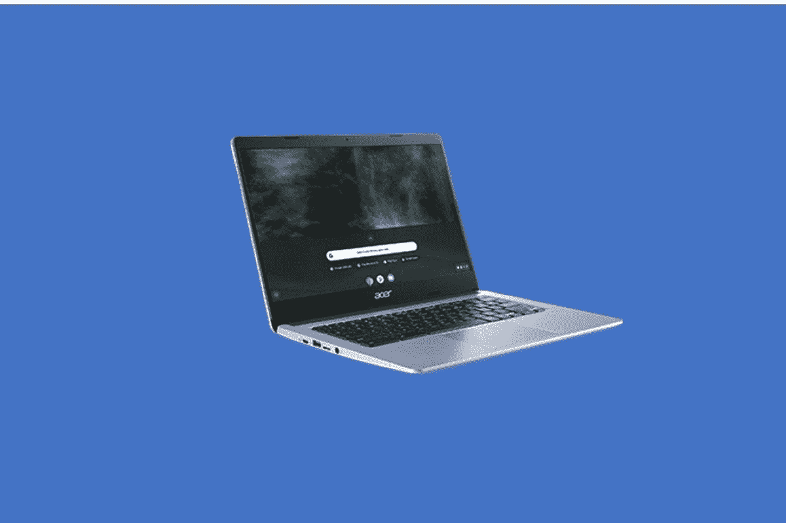
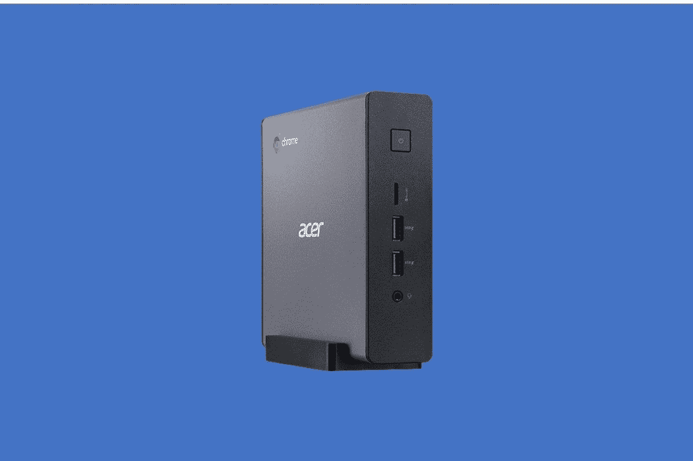
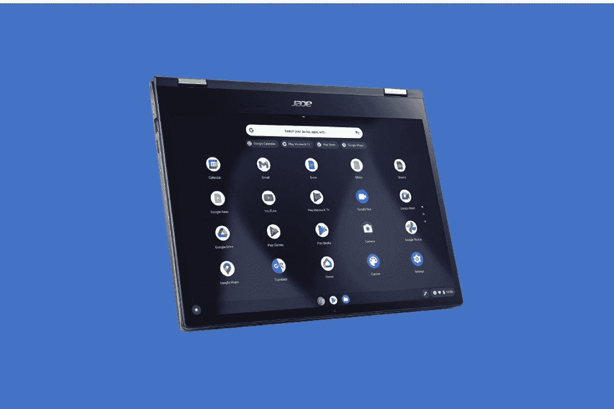

# 2023 年最佳宏碁 Chromebooks

> 原文：<https://www.xda-developers.com/best-acer-chromebooks/>

惠普、戴尔和联想有许多受欢迎的 Chromebook 型号，但你也不能忘记宏碁。宏碁不仅生产个人电脑[笔记本电脑](https://www.xda-developers.com/best-acer-laptops/),而且实际上是第三大 Chromebook 制造商，是目前市场上一些最受欢迎的选择的幕后推手。从 Acer Spin 系列到普通翻盖式 chrome book、游戏 chrome book，甚至是教育友好型机型，都有很多可供选择。

因此，如果你现在想要一台宏碁 Chromebook，你来对地方了。本指南将介绍你能买到的最好的 Chromebook，最好的预算友好型 Chromebook，以及许多其他不同的类别。每个人都有一台 Acer Chromebook，我们邀请您跟随我们的指南，帮助您做出购买决定。

## 最佳整体:宏碁 Chromebook Spin 714

 <picture></picture> 

Acer Chromebook Spin 714

首先从你现在可以花钱买到的最好的 Acer Chromebook 开始，它就是 Acer Chromebook Spin 714。这是宏碁最新的 Chromebooks 之一，因此定价为 729 美元。它的价格也有很多值得喜欢的地方，包括 CPU、车库笔、显示屏、整体设计等等。这是独家新闻。

看看引擎盖下的东西，这些是 Chromebook 的最新和最棒的。您将获得与 Windows 2-in-1 相似的 CPU，但价格却是后者的一小部分。我们谈论的是第 12 代英特尔处理器。更具体地说，它是第 12 代英特尔酷睿 i5-1235U CPU。这些 CPU 得益于高性能内核和高效内核，可帮助您快速高效地浏览日常网页。在 Chromebook 中也很少能找到这种 CPU。至于内存，这款机型总共有 8GB，非常适合支持基本的多任务处理，甚至可以运行 Android 应用程序。与我们名单上的其他 Chromebooks 不同，这款宏碁也使用了传统的固态硬盘。这意味着你将获得更快的速度和启动时间，以及更快的文件传输。

我们喜欢这款 Chromebook 的另一点是显示屏和键盘。你典型的 Chromebook 可能会有一个低分辨率的屏幕，但这一款却不是。它还调整到了更新的 16:10 宽高比，这要高得多，因此您可以一次在屏幕上显示更多内容。但是回到分辨率，设置为 1920 x 1200。由于这是一款 2 合 1 设备，高分辨率意味着您可以在各种使用模式(帐篷、支架、平板电脑或笔记本电脑)下欣赏屏幕上的所有内容。)这是一个非常薄的面板，显示屏边缘也没有令人讨厌的黑条。

至于键盘，这是典型的海岛风格，但鉴于这是一款高级 Chromebook，它有点特别。你会发现它有谷歌的一切关键快速访问谷歌助理。键盘也有背光，因此您可以在黑暗中工作。不是每个 Chromebook 都有这个功能，而且看起来也挺棒的。

甚至连端口在这款 Chromebook 上都很棒。尽管它轻薄，重量仅为 3.04 磅，厚度约为 0.70 英寸，但选择余地很大。你会发现 1 个 USB-A，2 个 Thunderbolt 端口，一个耳机插孔和 HDMI。正如我们通常期待的那样，这意味着如果您选择购买这款设备，您将不再需要加密狗。

我们想提到的其他东西包括 garaged 手写笔。你可以用它在屏幕上画画而不用担心。通常情况下，你必须将笔连接到 Chromebook 的侧面或屏幕的顶部。这款手写笔内置在机箱中，当您想要在屏幕上书写时，您可以保持它的安全。

##### 宏碁 Chromebook Spin 714

宏碁 Chromebook Spin 714 是你花钱能买到的最好的宏碁 Chromebook

## 最佳中端 2 合 1 设备:Acer Chromebook Spin 514

 <picture></picture> 

Acer Chromebook Spin 514

紧随其后的是 Acer Chromebook Spin 514。这款 Chromebook 在一些方面与我们的首选非常相似，但它有一些旧的规格，这使它处于这个位置。它也更便宜，打折时 549 美元就能找到。听我们说说你为什么想买这款 Chromebook。

为这款 Chromebook 提供动力的是 AMD 锐龙处理器。是的，你没听错。这些锐龙 CPU 通常是你会在类似的中端 Windows 笔记本电脑中找到的，但现在它们也出现在许多 Chromebooks 中。这一个是一个较低层次的 AMD 锐龙 3 5000 系列 CPU，锐龙 3 512C 双核。不过，不要让这种情况欺骗了你，因为 ChromeOS 确实针对这些类型的处理器进行了优化。使用 Chrome 处理日常任务不会给你带来任何问题。这是因为宏碁配置了 8GB 内存，这是我们在大多数新笔记本电脑中寻找的基本内存。存储容量也有 128GB，但属于较慢的 eMMC 类型。不过，这不应该是一个问题，因为 CPU 有能力在 Chromebook 上拾取东西。

接下来看看显示屏，你会在这款 Chromebook 上看到一个全高清 1920 x 1080 面板。不像我们的首选，它有一个更身临其境的显示器，这个仍然是两侧有挡板，但它是一个 2 合 1，所以你可以在各种模式下使用它，帐篷，平板电脑，支架或笔记本电脑。如果你打算将设备作为平板电脑使用，这些较厚的边框会有所帮助，因为它给了你用手抓住屏幕的空间。请记住，没有笔的支持，但是，这将是这个价格的牺牲。不过，它确实有助于电池，因为该设备的额定电池寿命为 10 小时。屏幕笔技术通常会耗尽 Chromebook 的电池。

在键盘和端口上，您将得到一个背光键盘。这意味着你可以在晚上使用这款 Chromebook 进行深夜学习和其他任务。在一个有趣的设计选择中，键盘两侧还有扬声器，这有助于让您观看的内容听起来更好。但是回到端口，这里没有足够的信息来帮助避免使用加密狗。混音包括 2 个 USB-C、USB-A 和一个耳机插孔。没有 HDMI，所以如果你打算在家里使用这款 Chromebook 或使用显示器工作，你需要购买一个转换器。

##### 宏碁 Chromebook Spin 514

Acer Chromebook Spin 是一款价格不到 600 美元的出色二合一设备。

## 最佳 17 英寸:宏碁 Chromebook 317 笔记本电脑

 <picture></picture> 

Acer Chromebook 317

也许你是不喜欢连接外部显示器的人，你需要最大的 Chromebook。嗯，这就是我们的 3 号选秀权。Acer Chromebook 317 是目前你能买到的最好的 17 英寸 Chromebook 之一。它拥有令人惊叹的 17.3 英寸屏幕，以及键盘上的数字键盘，这只是我们喜欢它 500 美元价格的两个原因。

如果你想知道这款 Chromebook 的动力是什么，那就是英特尔奔腾银色 N6000 处理器。这是一个较低端的 CPU，但它比你可能在其他预算 Chromebooks 中找到的赛扬 CPU 要好。请记住，这款 CPU 也是四核的，所以你仍然可以在这款 Chromebooks 的大显示屏上进行多任务处理，完成很多工作，就像在更昂贵的设备上一样。Chromebook 317 的其他规格包括 8GB 内存和 64GB eMMC 存储。同样，8GB 是获得良好性能和多任务处理的基础，eMMC 存储可能也不太重要。Chromebooks 主要是基于云的设备。

键盘是我们喜欢 Chromebook 317 的另一个原因。它是全尺寸的，很大，给在谷歌文档中输入文档留出了很大的空间。数字键盘也是另一个巨大的好处，因为你可以更容易地处理电子表格中的数字，而不用使用 shift 键。哦，这也是一个背光键盘，对于这个 500 美元的价格来说非常棒。没有多少 17 英寸的 Chromebooks 有背光键盘。

总的来说，对于 17 英寸的 Chromebook 来说，这也不是一个太重的设备。由于拥有 GPU，典型的 17 英寸 Windows 笔记本电脑可能接近 6 磅，但这款笔记本电脑仅重 4.85 磅，不到 5 磅。它也没有那么厚，大约 0.89 英寸，适合合适的人携带。

除了键盘和 CPU，我们还想突出显示。它的尺寸为 17.3 英寸，分辨率为 1920 x 1080。如此大的屏幕为您提供了大量空间来并排堆叠窗口，并进行多任务处理。请注意，屏幕也是触摸的，这有助于在您不想触摸鼠标时移动东西。

我们也很喜欢这里的端口选择，尽管缺少 HDMI 意味着你需要一个加密狗。17.3 英寸的设计给了宏碁很大的端口空间，他们确实做到了。左侧是 USB Type-C、USB-A、microSD 和耳机插孔。右侧还有另外一个 USB-A 口和 USB-C，两个 USB-A 口都是 USB 3.0，所以你获得了一点额外的速度。

##### 宏碁 Chromebook 317

宏碁 Chromebook 317 是一款出色的 17 英寸 Chromebook

## 最适合游戏:宏碁 Chromebook 516 GE

谷歌的合作伙伴推出了一种新型的云游戏 Chromebook，Acer Chromebook 516 GE 就是其中之一。我们最近评测了这款 Chromebook，发现它是我们用过的最好的产品之一，因此很难不建议您是否有兴趣从宏碁购买一款出色的 Chromebook。这款特别的 Chromebook 集强大的功能、出色的设计、大量端口和令人惊叹的云游戏键盘于一身。

我们先来说说这款 Chromebook 的强大之处。与我们的顶级宏碁 Chromebook 非常相似，这款笔记本电脑采用了英特尔最新、最强大的第 12 代英特尔 CPU。我们评测的型号配备了英特尔酷睿 i5-1240P CPU，以及 8GB 内存。对于 Steam 上的游戏，以及选择 Android 游戏的本地游戏，这款 CPU 足够强大，我们没有遇到任何延迟。我们甚至可以毫无问题地运行我们最喜欢的 Android 应用程序，毫无问题地加速我们的大量标签和大量 Chrome 的工作流程。

至于云游戏，由于这款 Chromebook 拥有 120Hz 高分辨率 16:10 纵横比的屏幕，可以达到 2560 x 1600 的分辨率，我们在 Nvidia GeForce Now 和 Xbox 云游戏上最喜欢的游戏都活了过来，感觉反应灵敏，流畅。我们喜欢像*赛博朋克 2077、堡垒之夜、顶点传说和刺客信条*这样的快节奏游戏看起来和玩起来都很棒。

即使在游戏之外，16:10 的宽高比屏幕也非常适合一般工作效率。并排堆叠窗口非常容易，多任务处理也没有问题。特别是因为显示器有超薄边框，可以变得非常亮。

键盘呢？虽然 Chromebook 上的 RGB 键盘曾经几乎不可能找到，但宏碁在 Chromebook 516 GE 上提供了一个。这些按键反应灵敏，宏碁选择突出显示 W、A、S 和 D 键，因此您可以在玩游戏时轻松找到它们。背光也可以完全定制。你可以选择七种不同的颜色，或者选择彩虹选项，所有这些都可以从 ChromeOS 设置页面中选择。

以设计和端口结束，宏碁 Chromebook 516 GE 在这些方面都很棒。它是市场上为数不多的 16 英寸 chrome book 之一，帮助 chrome book 赶上了不断扩大的 16 英寸 Windows 笔记本电脑市场。宏碁也没有放弃优质材料。盖子经过酷炫的拉丝处理，底部底座由铝制成。键盘面板的左右两侧甚至还有扬声器格栅，使这款 Chromebook 看起来像戴尔 XPS Windows 笔记本电脑。港口呢？嗯，有很多。有 USB-A、HDMI、以太网、耳机插孔和 USB-C。无论是游戏还是工作，您都不需要加密狗。

##### 宏碁 Chromebook 516 GE

Acer Chromebook 516 GE 是一款出色的 Chromebook，适用于云游戏等领域。

## 最便宜的:宏碁 512 Chromebook

 <picture></picture> 

Acer Chromebook 512 Laptop

需要便宜的 Chromebook？这就是宏碁 512 Chromebook 的全部。你可以在大多数零售商那里找到不到 150 美元的 Chromebook，它还包含一些非常基本的规格。这使得这款 Chromebook 成为大多数人在购买新 Chromebook 之前的绝佳入门选择。

为这款 Chromebook 提供动力的是英特尔赛扬 N4020 CPU。然后再搭配总共 4GB 的内存和 32GB 的 eMMC 存储。再说一遍，从基础来说，这是一款很棒的 Chromebook。你可能无法在上面进行多任务处理，但你可以打开网页，甚至可以试试 Android 应用程序。Chromebooks 是基于云的和基于网络的机器，谷歌文档、表格和幻灯片等东西排在第一位，我们认为所有这些都可以在他的设备上很好地工作。我们不建议同时处理 10 个以上的标签，因为那样会降低速度。

这款 Chromebook 的另一个优点是什么？这是一台耐用的机器。它符合 MIL-STD 810G 标准，可以承受高达 122 厘米的跌落。键盘还具有排水防溢功能，以备意外发生时使用。这使得它成为学生的一个很好的选择。

除此之外，显示屏还拥有你通常在更高端的 Chromebook 机型上看到的东西，3:2 的宽高比。这意味着有更多的垂直空间来阅读文件和滚动网页。据宏碁称，它的垂直高度增加了 18%。当然，对于一个 12 英寸 1255 x 912 分辨率的小屏幕，你可能不会同时处理很多任务，但对于阅读单个网页，你会很好。

另一件值得注意的事情是端口和网络摄像头。左侧有一个 USB-C 口，一个 USB-A 口，还有一个 microSD 卡扩展。右边有 USB-A 和 USB-C，这个价位是个不错的现代搭配。即使是网络摄像头也很棒，因为它是 1080p，如果我们的下一个选择不适合你，它也非常适合在教育中使用。

就电池寿命而言，额定为 12 小时。CPU 功率低得多，屏幕分辨率低，这是购买像这样的低端 Chromebook 的好处之一。您可以远离电源插座生活，或在旅途中使用 USB-C 电源充电。

##### 宏碁 Chromebook 512

Aver Chromebook 512 是一款出色的首款 Chromebook 和经济型 Chromebook

## 最适合教育:宏碁 Chromebook 314

 <picture></picture> 

Acer Chromebook 314

如果你需要一台用于教学的 Chromebook，那么你可能需要一个好的组合。Acer Chromebook 14 实现了大部分目标，成为我们的最佳教育选择。所有这些售价为 319 美元，打折时为 270 美元。

英特尔赛扬 N4020 是这款 Chromebook 的动力。它还配有 4GB 内存和 128GB 闪存。对于这个价格来说，存储真的很棒，因为它为学生最终离线保存文档留下了很大的空间，而不是在云存储上。甚至 4GB 的 RAM 也足够好了，可以确保高效的多任务处理，这样学生就不会偏离重要工作太远，也不会在谷歌 Play 商店上下载和使用不必要的应用程序。

宏碁指出，它的显示屏是为在强光条件下工作而设计的。这是一个 14 英寸的大显示屏，带有 7.3 毫米的边框。这并不令人印象深刻，尽管底部下巴。我们仍然认为它将有助于正确完成大多数任务，因为 14 英寸的屏幕比典型的 11 英寸或 12 英寸的 Chromebook 更大。分辨率也是 1366 x 768，这是典型的教育设备。它可能不是像素密度最高的显示器，但它确实为打开文档和其他学校文件提供了足够的空间。

和设计，这是宏碁最紧凑的设备之一。宏碁表示，它大约有一张 A4 纸那么大。它的重量还不到 2 磅，这对于便携性和将这款笔记本电脑放入小袋子来说是非常棒的。在便携性方面，我们也考虑到了电池寿命，在这里，宏碁表示，一次充电可以使用 12 个小时。这超过了我们在 Chromebook 中寻找的 10 小时平均时间。

当然，你可能需要考虑一下教育版 Chromebook 上的扬声器和端口，在这方面，我们很高兴地说这款机型让我们满意。船上有 2 个扬声器，都是立体声，所以课程听起来很清楚。至于端口，学生们根本不用担心连接他们的附件。左边有 USB-C、USB-A、耳机插孔，右边有 USB-A、USB-C。使用监视器时，需要一个加密狗。

这款 Chromebook 唯一的缺点之一就是网络摄像头。它的额定分辨率为 1280 x 720。现在的标准是 1080p，但在合适的照明条件下，720p 对于基本的网络通话仍然很好。

##### 宏碁 Chromebook 314

Acer Chromebook 314 是一款可靠的教育用 Chromebook

## 最佳 Chromebox:宏碁 Chromebox CXI4-I58G

 <picture></picture> 

Acer Chromebox CXI4

不是每个人都会需要传统的 Chromebook，这也是我们建议购买 Chromebox 的原因。宏碁生产了很多这种产品，Chromebox 非常适合那些手头有自己的显示器和键盘，主要在办公桌前工作，而不是外出的人。Chromebox 比 Chromebooks 更具可定制性，这也是我们为什么要特别提到宏碁 Chromebox CXI4-I58G 的原因。

这个特定的 Chromebox 在引擎盖下有很多处理能力。它由英特尔酷睿 i5-10210U 处理器以及 8GB 内存和 256GB 固态硬盘驱动。这是一个四核 CPU，所以你可以同时运行很多应用程序而不用担心。你也可以运行安卓应用，因为芯片是四核的。或者，如果你打算在商业中使用它，把它放在信息亭或显示器的显示器后面，让它整天运行。不过有趣的是，这款 Chromebox 还提供了 Nvidia MX 330 显卡的选项，这意味着它可以提供更高的功率，非常适合运行要求更高的商业应用。

我们也很喜欢这款华硕 Chromebox 的设计。我们已经提到过如何将它塞在显示器下，但紧凑的尺寸和附带的支架意味着你可以将它放在普通 Chromebook 不能放的任何地方。它的高度为 1.6 英寸，宽度为 5.8 英寸，深度为 5.9 英寸，重量仅为 1.34 磅。如果你愿意，你甚至可以获得一个 VESA 安装套件，因为这个 Chromebox 与一个兼容。

这就是 Chromebox 的情况，但端口也值得注意。总共有 5 个 USB 端口，一个 RJ45 插孔，音频线路输出和 2 个 HDMI 端口。这意味着这个 Chromebox 可以链接到多个显示器。

##### 宏碁 Chromebox CXI4

Acer Chromebox CXI4 是一款出色的 Chromebox，具有现代规格和紧凑的设计

## 最佳后辈:宏碁 Chromebook Spin 713

 <picture></picture> 

Acer Chromebook Spin 713

唉，我们名单上的最后一个选择实际上是上一代设备。如果你认为我们的首选 Acer Chromebook Spin 714 对你来说太贵了，我们这里有这款设备。它拥有最新一代的规格，曾经是一款旗舰产品，这意味着它仍然是一款不错的设备，你会经常发现它在打折。

在内部，您会发现高达英特尔酷睿 i7-10510U 处理器。它是 1.80 GH 的四核处理器，除了这款强大的处理器，Spin 713 还配备了 16 GB 的 DDR4 SDRAM 和 128 GB 的 SSD 存储。正如我们到目前为止所提到的，四核处理器非常适合高效的多任务处理，甚至可以在 Chromebook 上运行 Android 应用程序。如果你想做一些需要大量电力的事情，那么这款 Chromebook 将帮助你完成它。

在这款 Chromebook 的显示屏方面，你得到的是 13.5 英寸 2K 2256 x 1504 3:2 IPS 触摸屏面板。它有一些出色的最大亮度和干净的视角。显示屏也受到康宁大猩猩玻璃的保护，触控板也是如此。作为一款 2 合 1 设备，凭借 360 度可转换模式，您还可以在空间有限的环境中工作，例如在飞机上或火车上，同时还可以通过方便、协作的方式轻松进行演示或共享屏幕。

如果您需要在旅途中保持连接，这款 Chromebook 配备了数量惊人的功能，包括 Wi-Fi 6、背光键盘、内置 HDMI 端口以及双 USB Type-C 端口，以满足工作需求。对于平均使用时间超过 10 小时的高性能 Chromebook 来说，电池续航时间非常出色。除此之外，你还可以无缝地运行 Chrome Enterprise，这对于商业客户来说是一个很有吸引力的选择。所有这些功能都封装在设计精美的金属机箱中，这使得这款产品成为 Acer Chromebook 的最佳整体产品，即使它是最后一代产品。

##### 宏碁 Chromebook Spin 713

Acer Chromebook Spin 713 是一款坚固的顶级 Chromebook，即使它具有最新一代的规格。

好了，你知道了。这些是你能买到的最好的宏碁 Chromebooks。从保费到预算和教育，我们的清单很满。如果我们没有列出你喜欢的东西，那么看看我们列出的你能买到的最好的 Chromebooks。