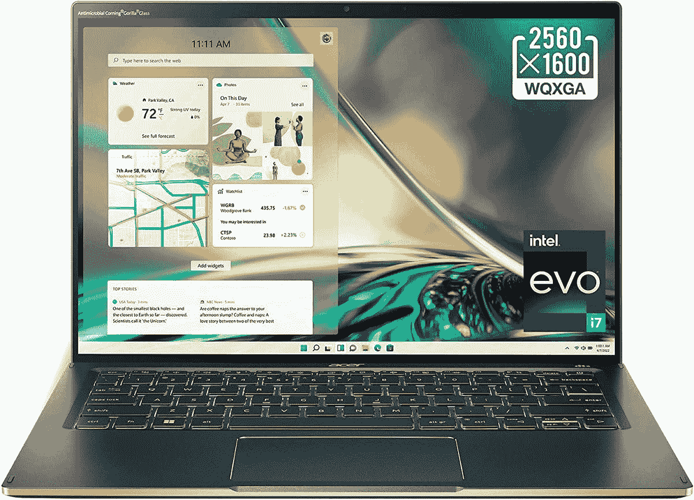
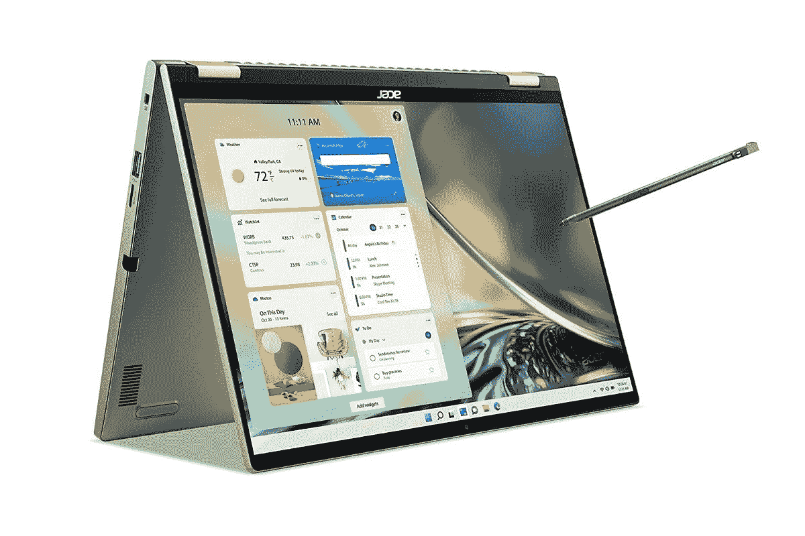
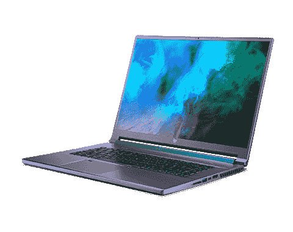
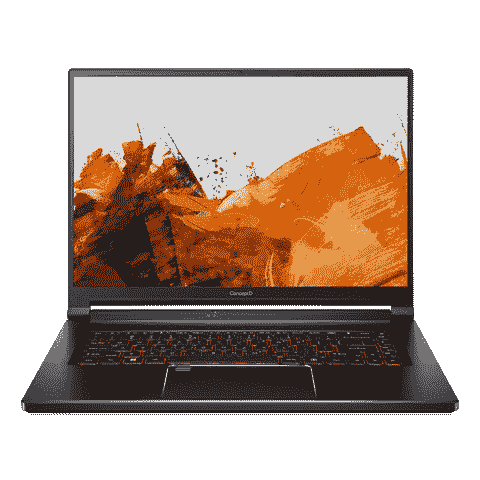
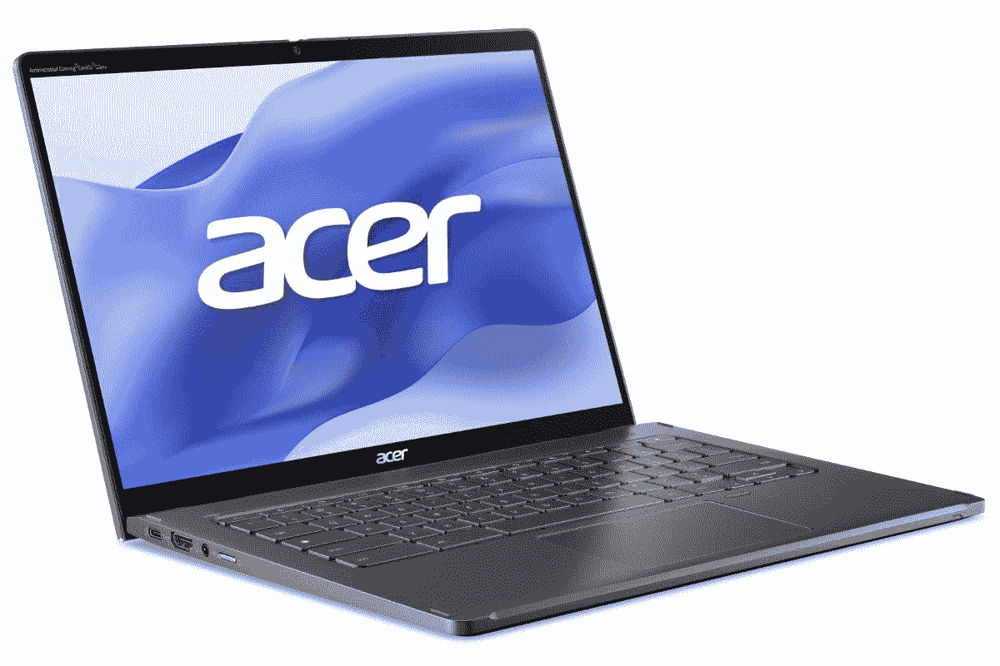

# 2023 年最佳宏碁笔记本电脑

> 原文：<https://www.xda-developers.com/best-acer-laptops/>

在寻找[最佳笔记本电脑](https://www.xda-developers.com/best-laptops/)时，少数品牌会不断出现在各种榜单上。像惠普、戴尔和宏碁这样的公司都制造出了很棒的设备，因此，它们几乎总是在我们的推荐名单上。不过，通常这些列表都有不同品牌的设备，所以如果你有一个真正喜欢的品牌，可能很难找到你想要的。为此，我们在几个不同的类别中收集了您今天能买到的最好的宏碁笔记本电脑。这样，你应该能找到适合你的特定需求的东西。

宏碁在各种细分市场制造出色的笔记本电脑。无论是顶级的轻薄设备、面向创作者的独特外形、强大的游戏设备，还是经济实惠的 Chromebooks，您一定会在这里找到自己喜欢的东西。让我们开始吧。

## 整体最佳:宏碁 Swift 5

2022 [宏碁 Swift 5](https://www.xda-developers.com/acer-swift-5-2022-hands-on/) 是今年最漂亮的笔记本电脑之一，凭借强大的规格和出色的显示屏，它是一款非常全面的机器。我们毫不怀疑它是你今天能买到的最好的宏碁笔记本电脑之一。

首先，Acer Swift 5 采用第 12 代英特尔酷睿处理器，特别是 P 系列处理器。您可以选择酷睿 i7-1260P 处理器，它拥有 12 个内核、16 个线程，速度最高可达 4.7GHz，因此您可以获得出色的性能来处理各种任务。这款处理器集成了英特尔 iris Xe 显卡，笔记本电脑由 16GB RAM 和 1TB SSD 支持，尽管也有其他配置。这带来了全面的优质体验，您可能永远不会感到性能受到限制。

Acer Swift 5 的另一大亮点是显示屏。这款笔记本电脑配备了 14 英寸的面板，采用了越来越流行的 16:10 宽高比。这个更高的屏幕为生产力提供了一个奇妙的画布，有更多的空间来查看您正在进行的工作，而无需滚动。最重要的是，它具有非常清晰的 Quad HD+ (2560 x 1600)分辨率，因此一切看起来都非常清晰。该屏幕还支持触摸，亮度高达 425 尼特，因此在户外仍然可见。

在显示屏上方是一个 1080p 网络摄像头，这是一个更好的消息。宏碁已经更新到一个更高分辨率的传感器，具有时间降噪功能，它显示，你可以从这款相机获得非常好的图像质量。不幸的是，仍然没有 Windows Hello 面部识别(与大多数宏基笔记本电脑一样)，但如果你想更方便地解锁你的电脑，有一个指纹识别器。

设计是宏碁 Swift 5 的最佳之处之一，尽管这显然是一个主观问题。这款笔记本电脑的表面是“薄雾绿”，一种带有绿色底色的深灰色，并通过笔记本电脑边缘、触控板和按键标签上的金色点缀来补充。它给人一种非常高级的感觉，既漂亮又不过分浮华。这款笔记本电脑重量仅为 2.65 磅，厚度为 14.9 毫米，因此它也是一款非常便携的机器，尤其是对于铝制笔记本电脑而言。

至于港口，你有很多选择。两个 Thunderbolt 4 端口、两个 USB Type-A 端口、HDMI 和一个耳机插孔确保您拥有所有基本功能，同时还可以通过 [Thunderbolt 坞站](https://www.xda-developers.com/best-thunderbolt-docks/)为您提供扩展空间。

毫无疑问，宏碁 Swift 5 是该公司制造的最好的笔记本电脑之一，几乎在各个方面都很全面。然而，值得记住的是，Acer Swift 14 的继任者已经在路上了。

 <picture></picture> 

Acer Swift 5 (2022)

##### 宏碁 Swift 5 (2022)

Acer Swift 5 是一款轻薄的笔记本电脑，具有高端设计、高端规格和出色的显示屏。

## 最佳敞篷车:宏碁 Spin 5

如果你想要一台既能用作笔记本电脑又能用作平板电脑的电脑，那么 Acer Spin 5 就是你的不二之选。这是一款高级敞篷车，具有坚固的规格和出色的屏幕，会给您带来出色的体验。它与宏碁 Swift 5 非常相似，只是它是一款敞篷车。

首先，宏碁 Spin 5 采用英特尔第 12 代酷睿处理器，最高可达酷睿 i7-1260P。正如我们上面提到的，这是一个具有 12 个内核、16 个线程的处理器，速度高达 4.7GHz，此外，它还包括英特尔 Iris Xe 显卡，以帮助处理一些轻量级 GPU 任务。它还配有 16GB 的内存和 1TB 的固态硬盘，因此在性能方面，它与 Acer Swift 5 一样出色。

在许多方面，显示器也是如此。它有一个 14 英寸的面板，纵横比为 16:10，分辨率为 Quad HD+分辨率。这是一个非常清晰的显示器，看起来很棒，高纵横比使它更适合作为一个平板电脑来绘图和记笔记。这就是与上述设备的核心区别:除了支持触摸输入，这个面板还支持笔记本电脑附带的笔，因此用手记笔记变得容易得多。

Acer Spin 5 上的网络摄像头也很棒，是一个具有时间降噪功能的全高清传感器。奇怪的是，宏碁不愿意在其笔记本电脑中加入 Windows Hello 面部识别功能，所以你仍然必须用指纹识别器来凑合。

设计是 Acer Spin 5 区别于 Swift 5 的地方。它不是双色外观，而是一款单色笔记本电脑，并且有轻微的银色色调。它看起来和感觉上仍然是高档的，尽管没有那么独特。它的厚度刚刚超过 17 毫米，重量为 2.87 磅，对于这种尺寸的全金属敞篷车来说，这仍然是相当轻薄的。我们还应该注意到，笔记本电脑被设计成将附带的笔存放在专用的车库中，因此您不必担心丢失它。

最后，宏碁 Spin 5 上的端口选择涵盖了所有底座。你有两个 Thunderbolt 4 端口，两个 USB Type-A 端口，HDMI，一个 3.5 毫米耳机插孔和一个 microSD 读卡器。这是一个非常好的供应，由于 Thunderbolt，还有扩展的空间。

总而言之，宏碁 Spin 5 是一款非常棒的笔记本电脑，当然也是该公司产品线中最好的一款。它的外观和感觉都很高档，性能卓越，并且提供了只有敞篷车才能提供的多功能性。有兴趣的可以看看下面。

 <picture></picture> 

Acer Spin 5

##### 宏基 Spin 5

Acer Spin 5 是一款高级敞篷车，具有轻薄的设计、顶级的性能和出色的显示屏。

## 最佳有机发光二极管显示器:宏碁 Swift Edge

有机发光二极管显示器在笔记本电脑领域变得越来越普遍，宏碁最近的尝试让它脱颖而出。Acer Swift Edge 不仅拥有梦幻般的 OLED 面板，还拥有一些顶级规格和超轻设计。

让我们从这些规格开始。宏碁 Swift Edge 采用 AMD 锐龙 7 6800U 处理器，这已经相当罕见。这款强大的 CPU 可为您提供 8 个内核、16 个线程和高达 4.7GHz 的速度，因此您可以依靠出色的性能处理日常任务。它还包括 16GB 的内存和 1TB 的固态硬盘，因此您可以获得全方位的出色体验。

然而，宏碁 Swift Edge 的显示屏是其主要吸引力之一。这是一个 16 英寸的面板，长宽比为 16:10，并且具有超清晰的超高清分辨率(3840 x 2400)。最重要的是，正如我们已经提到的，这是一款 OLED 面板，所以它看起来非常适合工作和看电影。它还涵盖了 100%的 DCI-P3，所以它只是一个很好的展示。在显示屏上方，有一个全高清网络摄像头，因此视频通话和会议的视频质量应该很稳定。

宏碁 Swift Edge 的另一个特别之处是它非常轻，宏碁称它是市场上最轻的 16 英寸笔记本电脑。事实上，2.4 磅的重量，你不会找到比这更轻的 16 英寸笔记本电脑，13.95 毫米的厚度也同样令人印象深刻。这款笔记本电脑有一种叫做橄榄绿黑色的深绿色，所以它看起来柔和而不乏味。

最后，在端口方面，我们考虑两个 USB Type-C 端口、两个 USB Type-A 端口、HDMI 和一个耳机插孔。对于这种轻薄的笔记本电脑，这是一个很好的端口选择，很难要求更多。

总而言之，宏碁 Swift Edge 是一款出色的笔记本电脑，就其提供的一切而言，1，499.99 美元实际上非常合理。

 <picture></picture> 

Acer Swift Edge

##### 宏碁 Swift Edge

Acer Swift Edge 的重量仅为 2.4 磅，是一款极其轻便的笔记本电脑，它仍然配备了 16 英寸的大有机发光二极管显示屏和适合日常使用的高端性能。

## 最佳游戏笔记本电脑:宏碁 Predator Triton 500 SE

现在我们进入了有趣的领域，对于游戏玩家来说，宏碁 Predator Triton 500 SE 是一款糟糕的笔记本电脑。它很强大，但它仍然有一个圆滑的外观，有足够的天赋，使它感觉独特而不令人讨厌。在我们对它的评论中，我们有很多好的东西要说。

先说性能，Predator Triton 500 SE 自带英特尔 45W 处理器，最高可配一颗酷睿 i9-12900H。这是一个强大的 14 核 20 线程处理器，可以提升到 5GHz，是这个列表中最强大的笔记本电脑。作为备份，你可以使用 16GB 显存的 NVIDIA GeForce RTX 3080 Ti 显卡，这意味着你可以在高设置下运行任何现代游戏，并享受流畅的帧速率(稍后将详细介绍)。四舍五入，你可以得到高达 32GB 的内存和 2TB 的固态硬盘存储，使这成为一个野兽笔记本电脑的所有方面。

然而，这还不是这台笔记本电脑的全部优点。Predator Triton 500 SE 上的显示器是一个 16 英寸的 IPS 大面板，它的长宽比为 16:10，这对于游戏笔记本电脑来说有点不寻常。这对于生产力来说是一个很好的纵横比，对于游戏来说也很好，但这并不常见。更好的是，这是一个非常清晰的 Quad HD+ (2560 x 1600)显示器，它还具有超级平滑的 240Hz 刷新率，在游戏中提供了清晰度和流动性的巨大平衡。这也使它成为您完成工作的理想笔记本电脑。

当然，如果有一种笔记本电脑经常忽略网络摄像头，那就是游戏笔记本电脑，这也没什么不同。它是另一个 720p 网络摄像头(这是 Windows 10 笔记本电脑的最低要求)，而且没有 Windows Hello 支持。你得到的是一个内置在触摸板上的指纹识别器，所以你可以用它来更容易地解锁你的笔记本电脑。

尽管内部充满了所有的动力，掠夺者 Triton 500 SE 仍然设法达到了 20 毫米以下的厚度，尽管它无法掩盖其 5.29 磅的重量。尽管如此，对于一款高端游戏笔记本电脑来说，这还不错，就外观而言，Triton 500 SE 非常时尚。没有过多的棱角设计或令人讨厌的 RGB 照明。键盘是 RGB 背光的，但它主要只通过按键标签发光，所以它仍然足够微妙，令人愉快。

得益于其结实的设计，宏碁 Predator Triton 500 SE 还拥有大量端口的空间。你可以获得两个 Thunderbolt 4 端口、两个 USB Type-A 端口、HDMI 2.1、千兆以太网、一个耳机插孔和一个全尺寸 SD 读卡器，它们均匀分布在笔记本电脑的两侧，使设置更容易。就有线连接而言，这是宏碁最好的笔记本电脑之一，也是最好的笔记本电脑之一。

如果你想要一个功能强大的游戏装备，但又有点便携，宏碁 Predator Triton 500 SE 是一个简单的推荐。

 <picture></picture> 

Acer Predator Triton 500 SE

##### 宏基掠夺者 Triton 500 SE

凭借强大的英特尔处理器、顶级的 RTX 显卡和出色的显示屏，Predator Triton 500 SE 拥有您想要的游戏笔记本电脑的一切。

## 最佳商务笔记本电脑:宏基 TravelMate Spin P4

虽然几乎任何笔记本电脑都可以用于工作，但由于 Pro Windows 许可证和额外的安全性等功能，适当的商用笔记本电脑仍然有好处。如果你想要一些可以在专业环境中使用的东西，宏基 TravelMate Spin P4 是该公司产品线中最好的笔记本电脑之一。当然是 Windows 10 Pro 自带的，可以免费升级到 Windows 11 Pro。

最新型号由高达英特尔酷睿 i7-1260P 处理器提供支持，该处理器具有 12 个内核、16 个线程，速度高达 4.7GHz，因此您可以获得大量日常任务的性能，尽管由于 28W TDP，电池续航时间可能不是最好的。此外，根据当前可用的配置，您可以获得高达 16GB 的内存和 512GB 的固态硬盘。

TravelMate Spin P4 的显示屏是一个 14 英寸的面板，宽高比为 16:10，比之前的型号有了很大的升级，并且具有全高清+ (1920 x 1200)分辨率。这是一个 IPS 面板，由康宁大猩猩玻璃保护，强调这是一个优质的笔记本电脑和可转换的，配有触摸和主动笔支持。网络摄像头仍然是 720p 传感器，这对于视频质量来说并不理想，但如果你不经常使用它，它应该足够了。

TravelMate Spin P4 是为适应商业环境而设计的，所以看起来绝对低调但不失优雅。它有一种隐秘的黑色，盖子上的宏碁品牌看起来不同，所以它更专业一些。在便携性方面，TravelMate Spin P4 的重量为 3.48 磅，厚度为 17.99 毫米，因此它显然不是非常便携。然而，它的设计符合 MIL-STD-810H 的抗冲击性能标准，而且它应该能够承受跌落和水(在合理的范围内)。它应该是耐用的，这是商业用户可能会喜欢的。

商务笔记本电脑擅长的一件事是连接，而 TravelMate Spin P4 提供了这一功能。它包括两个 Thunderbolt 4 端口、两个 USB Type-A 端口、HDMI、RJ45 以太网和一个耳机插孔。这几乎涵盖了您的所有需求，包括有线互联网连接。理论上，支持 LTE 的型号也应该可用，但我们无法找到它的销售。

凭借耐用和专业的设计、充足的端口供应和 Windows 10 Pro 许可证，宏碁 TravelMate Spin P4 是该公司最好的商用笔记本电脑之一，具有敞篷车的多功能性。

##### 宏碁 TravelMate Spin P4 (2022 年，英特尔)

宏基 TravelMate Spin P4 是一款功能强大的商用笔记本电脑，采用第 12 代英特尔处理器和 16:10 显示屏。

## 最适合创作者:Acer ConceptD 5

有些笔记本电脑需要电源来玩游戏，但有些则是出于职业原因。如果您需要一台笔记本电脑来处理高级内容创作， [Acer ConceptD 5](https://www.xda-developers.com/acer-conceptd-5-hands-on/) 是您目前的最佳选择。

事实上，这是一款功能强大的笔记本电脑，采用 14 核 20 线程的英特尔酷睿 i7-12700H 处理器，搭配 Nvidia GeForce RTX 3070 Ti 显卡，可以快速处理各种创造性工作负载，无论是编辑视频还是渲染 3D 场景。此外，这种配置包括一个巨大的 32GB 内存，使多任务处理和较重的工作负载变得更加容易。你还会得到一个 1TB 的固态硬盘，应该可以存储相当多的项目。

显示器也是像这样的 creator 笔记本电脑的一个重要因素，宏碁 ConceptD 5 无疑具有这一点。它有一个大的 16 英寸 IPS 面板，长宽比为 16:10，分辨率为 3072 x 1920。该屏幕还覆盖了 100%的 DCI-P3，其额定色彩准确度为 Delta E < 2，因此非常适合图像或视频编辑等对色彩敏感的工作。在显示屏之上，您还可以获得一个全高清 1080p 网络摄像头，确保您在视频通话和在线会议期间保持最佳状态。遗憾的是，没有面部识别支持，但你可以在 Windows Hello 的触摸板上找到指纹读取器。

就设计而言，宏碁 ConceptD 5 相当简单，但这可能是最好的，它采用全黑机箱，虽然没有 RGB，但按键采用柔和的琥珀色背光，看起来独特而不令人讨厌。这款笔记本电脑整体重量为 5.29 磅，厚度为 19.81 毫米，这并不算轻，但这大约是你对这种强大机器的预期。

至于港口，有很多。两个 Thunderbolt 4 端口、两个 USB Type-A 端口、HDMI、RJ45 以太网、一个耳机插孔和一个全尺寸 SD 读卡器，你别无所求。这是这个列表中最完整的设置之一。

ConceptD 5 确实错过了 ConceptD 3 Ezel 或 ConceptD 7 Ezel 的酷炫敞篷设计，但宏碁已经很久没有更新这些机型了。这仍然是一台非常强大的机器，当然，是宏碁目前为创作者制造的最好的笔记本电脑。

 <picture></picture> 

Acer ConceptD 5

##### 宏碁概念 D 5

Acer ConceptD 5 是一款功能强大的笔记本电脑，具有时尚的设计和色彩准确的显示屏，是创意专业人士的理想选择。

## 最佳经济型笔记本电脑:宏碁 Aspire Vero

高端笔记本电脑可能会贵得离谱，但你不必花一大笔钱就能拥有良好的笔记本电脑体验。宏碁在 Aspire Vero 上做了一些出色的工作，这不仅是一款性能稳定、价格实惠的笔记本电脑，也象征着对环保电子产品的大力推动。我们[回顾了 14 英寸的 Aspire Vero](https://www.xda-developers.com/acer-aspire-vero-review/) ，但我们在这里关注的是 15.6 英寸的型号。

宏碁 Aspire Vero 采用第 12 代英特尔处理器，最高可配酷睿 i7-1255U 处理器，不过我们在这里关注的是酷睿 i5-1235U 型号。该版本为您提供了一个 10 核、12 线程的 CPU，加速速度高达 4.4GHz，这应该已经为您的各种日常任务提供了出色的性能，无论您只是随便浏览网页还是用它来完成学校作业。它还有 8GB 的内存和一个大的 512GB 的固态硬盘，在这个价格上非常好看。

显示屏并不起眼，但它完全在这个价格范围内的笔记本电脑的预期之内。这是一个 15.6 英寸的面板，具有常规的 16:9 纵横比，并且具有全高清分辨率。这不会是最清晰的显示，但对于基本的使用来说已经足够好了。显示屏上方是一个 1080p 的网络摄像头，对于这种价格实惠的笔记本电脑来说，这也是很好的选择。

宏碁 Aspire Vero 的一大亮点是环保设计，采用回收材料制成的未上漆机箱，笔记本电脑表面的斑点实际上有助于它看起来独一无二。笔记本电脑的许多部分使用回收材料，包括用于触摸板的海洋塑料。R 和 E 字母印反了，有点让人分心，但如果你能克服这一点和有点吱吱作响的按键，你应该可以用这台笔记本电脑。

总之，我们有港口，这里有不错的选择。你得到了一个 Thunderbolt 4 端口，在这个价位上看起来非常好，另外还有三个 USB Type-A 端口、HDMI、以太网和一个耳机插孔。这是一个令人惊讶的完整设置，包含 Thunderbolt 支持尤其有趣，

售价 630 美元的宏碁 Aspire Vero 是一款非常好的笔记本电脑，涵盖了你可能要求它提供的所有基本功能。它拥有出色的性能、坚固的显示屏和网络摄像头，以及环保的设计，这使得它与该价格范围内的大多数笔记本电脑相比显得非常独特。

##### 宏碁 Aspire Vero 15 英寸

Acer Aspire Vero 是一款环保型笔记本电脑，采用第 12 代英特尔酷睿处理器，价格极具吸引力。

## 最佳 Chromebook:宏碁 Chromebook Spin 714

Acer Chromebook Spin 714 是我们有史以来最受好评的 Chromebook 之一 Spin 713 的继任者。虽然它在某些方面有所削减，但它也做出了一些非常受欢迎的改进，如果你想要一台最好的 Chromebooks，它仍然是一个不错的选择。

首先，它已经升级了最新的第 12 代英特尔酷睿处理器，特别是具有 10 个内核和 12 个线程的酷睿 i5-1235U，其性能内核可提升至 4.4GHz。就像以前一样，集成的英特尔 Iris Xe 显卡也可以为轻量级游戏提供一些轻度 3D 渲染。此外，你还获得了 8GB 的内存和 256GB 的固态硬盘存储，这应该给你所需的一切顺利浏览 Chrome OS 没有任何问题。

从 Spin 713 到 Spin 714 的名称变化实际上是指显示器，因为宏碁已经从 13.5 英寸的面板转移到更大的 14 英寸屏幕，同时也从 3:2 的纵横比切换到更常见的 16:10 格式。这个稍微宽一点，但是对很多人来说可能感觉更自然。宏碁确实削减了分辨率，使其达到了全高清+ (1920 x 1200)，但这仍然是一个非常清晰的屏幕，而且由于这是一个可转换的，它支持触摸和笔输入(加上，笔甚至内置在笔记本电脑本身！).在屏幕顶部，网络摄像头已经从 720p 传感器升级到 1080p 传感器，因此在视频通话或在线课程中，你应该看起来更清晰。

在设计方面，宏碁 Chromebook Spin 714 使用了优质的铝制机箱，它也设法看起来不像它的前辈那样乏味。这款腕表没有采用经典的银色，而是采用了暗蓝色，这是一种近乎黑色的色调，但更具个性。不过，银色配置也存在。总重量达到 3.09 磅，这对于一辆铝制敞篷车来说相当轻。

来到端口，我们看到一个非常好的设置，有两个 Thunderbolt 4 端口，一个 USB Type-A 端口，HDMI 和一个耳机插孔，为您可能有的所有需求提供可靠的覆盖。对于一款相对轻薄的笔记本电脑来说，一点都不差。

 <picture></picture> 

Acer Chromebook Spin 714

##### 宏碁 Chromebook Spin 714

Acer Chromebook Spin 714 是性价比最高的 Chromebook 之一，具有稳定的性能和高端的设计。

* * *

这就是我们认为你今天能买到的最好的宏碁笔记本电脑，从轻便的日常笔记本电脑到强大的游戏设备。我们选择了 [Acer Swift 5](#BestOverall) 作为整体最佳，因为它是一款令人惊叹的笔记本电脑，具有轻薄的设计，此外还配备了强大的处理器和出色的显示屏。当然，如果你有更具体的需求，有很多其他选项可能更适合你。

你不是宏碁那种人吗？别担心——看看我们的[最佳惠普笔记本电脑](https://www.xda-developers.com/best-hp-laptops/)列表，或者甚至是[最佳联想笔记本电脑](https://www.xda-developers.com/best-lenovo-laptops/)，如果你更感兴趣的话。