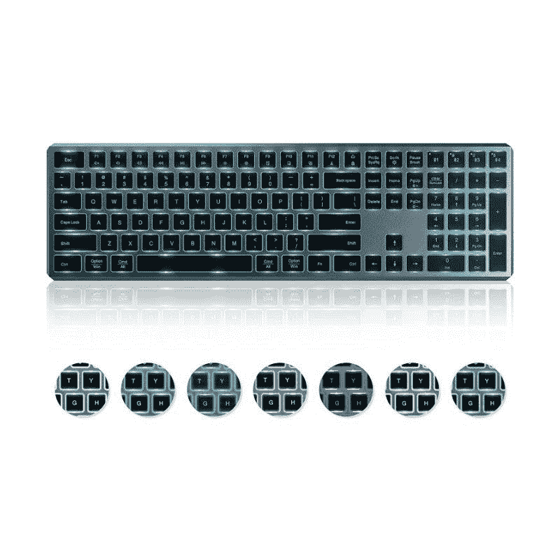
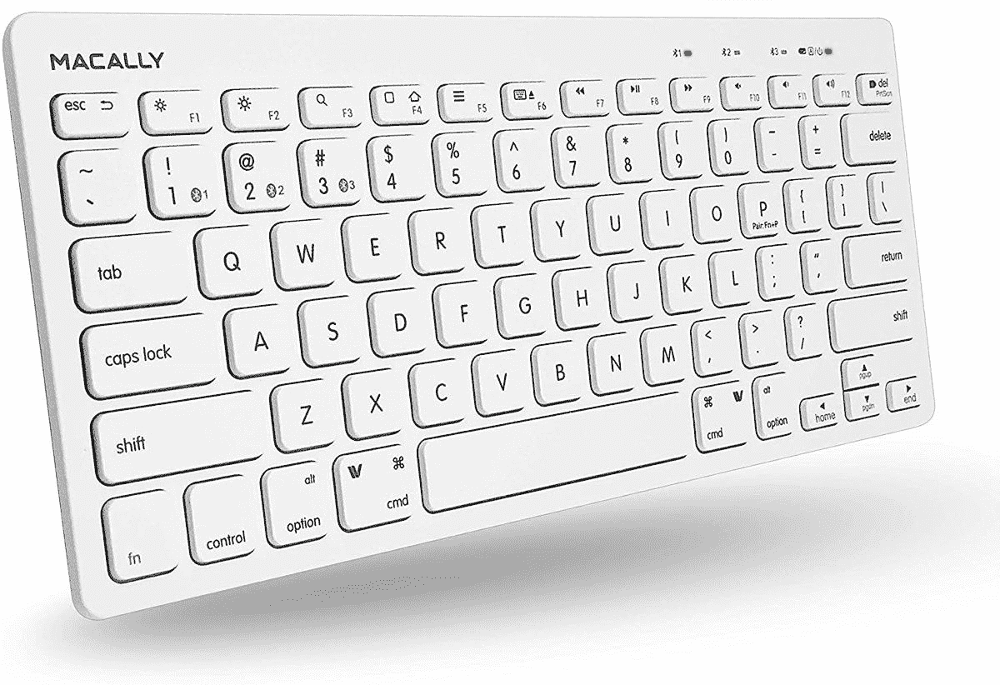
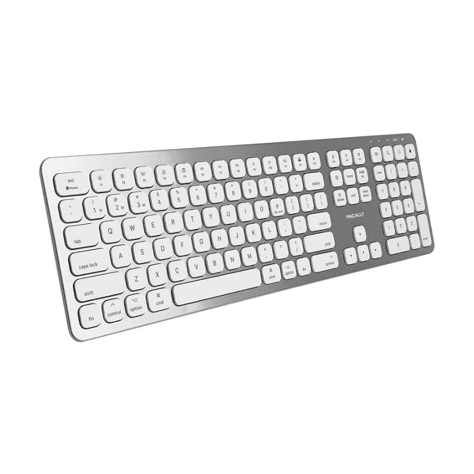

# 2023 年最佳苹果魔术键盘替代品

> 原文：<https://www.xda-developers.com/best-alternatives-apple-magic-keyboards/>

# 2023 年最佳苹果魔术键盘替代品

苹果 Magic Keyboard 是 Mac 用户的可靠选择。尽管如此，市场上还有很多其他优秀的键盘。

苹果产品通常在与同一家公司生产的配件搭配时效果最佳。毕竟，库比蒂诺公司知道其硬件和软件的来龙去脉。因此，它可以赋予自己某些特权，并构建第三方有时无法访问的深层次的相互通信设备。尽管如此，其他公司也有很多优秀的替代品，价格不一定那么高。更不用说苹果的产品通常过于普通，而且没有超级用户附加功能。如果你打算[购买一台 Mac](http://xda-developers.com/best-macs) ，并且不想搭配该公司的魔法键盘，我们为你挑选了一些你现在可以购买的最佳替代键盘。

*   ##### 雷蛇黑寡妇 V3 Mini HyperSpeed

    雷蛇新推出的黑寡妇 V3 Mini HyperSpeed 是一款 65%无线键盘，适合寻求无延迟无线连接体验的游戏玩家。不出所料，它采用了 RGB 背光。

*   <picture></picture>

    Satechi 铝制蓝牙键盘

    ##### sate chi 铝制蓝牙键盘

    如果你正在寻找全尺寸苹果魔法键盘的第三方模仿者，请选择 sate chi 铝制蓝牙键盘

*   <picture></picture>

    可插拔可折叠蓝牙键盘

    ##### 可插拔可折叠蓝牙键盘

    市面上有很多键盘，但它们都不太容易随身携带。如果你想要可以在任何地方使用的东西，可插拔可折叠蓝牙键盘可以非常紧凑。

*   <picture></picture>

    key chron K2

    ##### key chron K2

    key chron K2 是一款小巧的机械键盘，带有 84 个按键。它具有 Gateron 红色开关，非常适合一般用途。你还会得到白色 LED 背光和相对更大的电池。

*   <picture></picture>

    罗技 MX 按键照亮无线键盘

    ##### 罗技 MX 按键

    如果你想要键盘上的几乎所有东西，这就是它。Logitech MX Keys 是一款全尺寸背光键盘，可提供出色的打字体验。它也是我们精选中最贵的。

*   <picture></picture>

    Seenda 背光蓝牙键盘

    ##### Seenda 背光蓝牙键盘

    喜欢 Seenda 多设备键盘但缺少背光？这款 Seenda 键盘拥有充足的背光。它可以有七种颜色的背光，所以它永远不会看起来无聊。此外，它可以连接多达四个设备。

*   <picture></picture>

    Macally 小型蓝牙无线键盘

    ##### Macally 小型蓝牙无线键盘

    如果你打算在 Mac 和 iPad 或 iPhone 之间切换，这款 Macally 键盘就是为你准备的它具有内置的智能手机和平板电脑支架，可以更容易地安装平板电脑或手机。它还可以连接多达三个设备。

*   <picture></picture>

    Macally 蓝牙无线键盘

    ##### Macally 蓝牙键盘

    如果你对列表中的其他键盘印象不深，也许这款会引起你的兴趣 Macally 蓝牙无线键盘采用超薄铝合金设计和剪刀式开关机制，提供流畅的打字体验。

*   <picture></picture>

    罗技 K780

    ##### 罗技 K780

    如果你喜欢罗技 K380，但也需要数字键盘，那么罗技 K780 是你最好的选择。它可以轻松地在三个设备之间切换。此外，该键盘还具有操作系统适应性，因此无论您使用的是 macOS 还是 Windows，它都会识别设备和映射键，从而提供熟悉的布局。

*   <picture></picture>

    安妮 Pro 2

    ##### 安妮 Pro 2

    除了 Keychron K2，安妮 Pro 2 也是一款优秀的机械键盘。您可以在有线和无线模式下使用它。此外，键盘可用于各种 Gateron 和 Kailh 开关。此外，您还可以获得完整的 RGB 背光和宏可编程键。

*   <picture></picture>

    罗技 Ergo K860

    ##### 罗技 Ergo K860

    如果你花大量时间在键盘上，想要一些符合人体工程学的东西，罗技 Ergo K860 是一款出色的无线键盘。它应该能减轻你手腕的压力。你还可以得到进一步舒适的手腕支撑。

*   <picture></picture>

    HHKB 职业混血儿

    ##### HHKB 职业混血儿

    Happy Hacking 是日系机械键盘中的大腕之一。如果金钱对你来说不成问题，它的专业混合键盘是你 Mac 电脑的绝佳无线键盘。它可以使用 Type-C 电缆或蓝牙连接，您可以获得一个只有 60 个按键的紧凑外形。

在购买任何新键盘之前，想想您真正需要的功能。数字键盘真的有必要吗？你需要背光吗？您要连接多少台设备？对这些问题的回答可以帮助您做出明智的选择。

同时，如果您想购买 MacBook Pro 机箱，我们已经编辑了一些您可以购买的最好的 MacBook Pro 机箱。此外，为了提升您的苹果操作系统体验，我们发布了关于[如何强制退出应用程序](https://www.xda-developers.com/how-to-force-quit-mac/)和[如何完全卸载应用程序](https://www.xda-developers.com/how-to-uninstall-app-mac/)的指南。