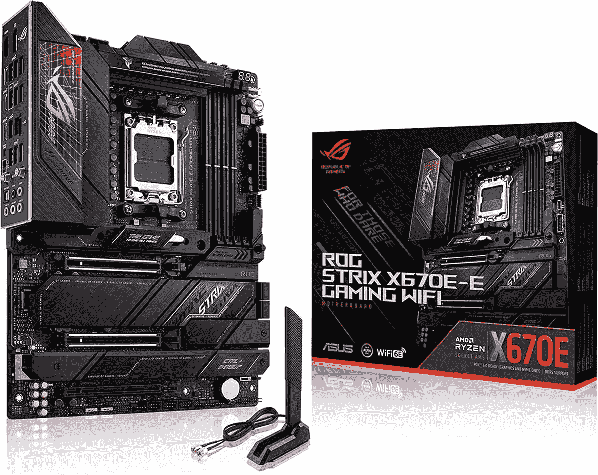

# 2023 年最佳 AM5 主板

> 原文：<https://www.xda-developers.com/best-am5-motherboards/>

锐龙 7000 CPUs 的发布不仅开创了另一代 AMD 芯片，也是使用 AMD 全新 AM5 插座的第一批主板。除了支持新的锐龙 7000 系列，AM5 主板还支持 DDR5 内存、PCIe 5.0 和 USB4。所有这些特性对于实现[最好的 GPU](https://www.xda-developers.com/best-gaming-graphics-cards/)、[最好的固态硬盘](https://www.xda-developers.com/best-m-2-ssd/)以及你可能想要插入主板的其他尖端外设都将非常重要。

由于 AM5 太新了，所以没有太多的主板可供选择，虽然这通常会使选择更简单，但这一代事情并不简单。AMD 拥有前所未有的四个芯片组来覆盖中高端，这有点大材小用。然而，我们梳理了这些芯片组和主板，以确定哪些值得您考虑。

## 最佳 X670E 主板:华硕 ROG Strix X670E-E 游戏 Wi-Fi

华硕 ROG Strix X670E-E 游戏是锐龙 7000 能买到的最好的主板之一。首先，它配备了过多的 PCIe x16 和 M.2 插槽，但使这款主板与众不同的是，其中大多数都以 PCIe 5.0 的速度运行(两个 x16 和三个 M.2 插槽)。即使对于 X670E 来说，这也是一吨 PCIe 5.0，大多数 X670E 仅提供两个 PCIe 5.0 M.2 端口用于固态硬盘。Strix 还为其 VRM 设计了 18+2 级设计，即使对于最高端的锐龙 9 7950X 也绰绰有余，并支持 DDR5-6600。

这个版块也不吝啬无聊的内容。Strix 有八个风扇接头、一个错误代码显示器、SSD 散热器和大量前置 USB 端口。后面的 I/O 也有大量的 USB 端口:12 个 USB 3.2 Gen 2 和一个 3.2 Gen 2x2。Strix 上的以太网是英特尔的 2.5 千兆位，不是最快的，但对游戏玩家甚至内容创作者来说仍然是一个不错的数量，更不用说英特尔的以太网网卡通常是最好的。如果你喜欢这种东西，五个音频插孔加上光学音频可能也很有吸引力。

即使你不太关心技术规格，也有一件事值得欣赏:这块板看起来很棒。Strix 拥有经典深黑色和 RGB 美学，且没有令人讨厌的商标。Strix 的设计适合各种各样的主题。

 <picture></picture> 

ASUS ROG Strix X670-E

##### 华硕 ROG Strix X670E 游戏 Wi-Fi

该主板具有 18+2 个电源级，结合了一对 PCIe 5.0 x 16 插槽、四个 m.2 SSD 插槽(其中三个是 PCIe 5.0)、散热器、大量端口和 ARGB。它是一个绝对的主板怪兽，甚至内置了 Wi-Fi。

## X670E 主板的最佳替代品:华硕 X670E Taichi

华硕长期以来一直是华硕的挑战者，其 X670E Taichi 确实比 Strix X670E-E 有一些优势，首先，它在 24+2 阶段拥有更大的 VRM 配置，明显多于 Strix 的 18+2。后面板 I/O 包括两个 USB4 端口，Strix 没有这些端口。它还在 DDR5 支持方面与华硕匹配，双 PCIe 5.0 x16 插槽，英特尔 2.5 千兆以太网，并且还配备了 8 个 SATA 端口，而不是 4 个(尽管这种价值值得怀疑)。

然而，太极在其他一些方面有点落后。它只有一个 M.2 插槽运行 PCIe 5.0，其他三个运行 PCIe 4.0。后面板 I/O 上的 USB 端口较少，其中一些以 3.2 Gen 1 的速度运行，而不是 3.2 Gen 2。太极是 EATX 的尺寸，而不是 ATX 的，这也可能造成机箱兼容性的问题。最后，太极的美学与 Strix 相似，但也有一些值得商榷的地方；棋盘左侧的金色可能会与一些颜色冲突，你必须决定是否喜欢这种风格的齿轮。

总的来说，太极是 Strix 的一个有价值的替代品，即使它在一些领域有所欠缺。但对于超频来说，鉴于其更大的 VRM，理论上它是更好的选择，所以如果你计划超频你的锐龙 7000 以获得乐趣或获得严重的性能提升，太极可能是更好的选择。

##### 华硕 X670E 太极

ASRock X670E Taichi 是一款高端 EATX 主板，具有出色的内置质量和巨大的 24 级 VRM。它支持高速 DDR5 内存、PCIe 5.0 显卡和多个 NVME 固态硬盘。

## 最佳 X670 主板:技嘉 X670 Aorus Elite AX

向下移动到 X670 芯片组，我们发现许多主板大约有 80%达到 X670E 级别，但删除了对游戏不重要的功能。由于其 16+2 级 VRM(我们应该注意到实际上是两个 8 级，但应该没问题)和对 DDR5-6666 内存的支持，技嘉在与 X670 Aorus Elite AX 的平衡方面做得很好。还有三个 M.2 插槽，其中一个运行在 PCIe 5.0，另外两个运行在 4.0。不幸的是，x16 插槽运行的是 PCIe 4.0，而不是 5.0，但这是可以原谅的，因为甚至还没有任何 PCIe 5.0 GPU 出来。

连接是这款主板的一个弱点。在 13 个 USB 端口中，数量很多，但其中四个运行速度较慢。Aorus Elite AX 拥有 2.5 千兆以太网，但它使用的是 Realtek 网卡，而不是英特尔网卡，虽然 Realtek 很好，但英特尔无疑更可靠。内置 Wi-Fi 也不是英特尔而是联发科。该板缺少的另一个功能是错误代码显示；就其口径而言，这里应该有一个。至于外观，Aorus Elite AX 有点简单，但它会很好地适应许多主题，这要归功于它的深色和银色口音。

X670 Aorus Elite AX 是一款出色的游戏和生产力全能产品，不像大多数 X670E 主板那样需要大量资金。它可以处理高端锐龙 7000 CPUs 和现代 PCIe 5.0 固态硬盘，这些是许多用户最重要的特征。

##### 技嘉 X670 AORUS Elite AX

Gigabyte X670 Aorus Elite AX 拥有高端游戏 PC 的必备功能，包括支持 DDR5-6666 内存、三个固态硬盘 M.2 插槽和一个 16 级 VRM。

## 最佳 B650E 主板:华硕 B650E 钢传奇

B650E 是一个有点奇怪的芯片组。它保证为 GPU 和固态硬盘提供 PCIe 5.0 支持，但应该比 X670 更低，X670 不保证图形的 PCIe 5.0。因此，由于其 PCIe 5.0 x16 插槽，ASRock 的 B650E Steel Legend 优于许多 X670 主板。它在 PCIe 5.0 上也有一个 M.2 插槽，在 4.0 上有两个，与 X670 Aorus Elite AX 相当。它甚至有一个真正的 16+2 级 VRM 和对 DDR4-6400 的支持，使它成为其芯片组的高端产品。

Steel Legend 的后部 I/O 相当不错，有八个 USB 端口——只有两个是 USB 2.0，其余的从 3.2 Gen 1 到 3.2 Gen 2x2 不等。它还有一个 2.5 千兆以太网端口，但它是 Realtek，而不是英特尔。主板上没有错误代码显示(这并不意外，因为它应该是中端产品)，但它确实有六个风扇接头和散热器，用于所有三个 M.2 SSD 插槽。

B650E Steel Legend 和其他 B650E 板处于一个奇怪的位置。他们保证拥有用于 GPU 和固态硬盘的 PCIe 5.0，这是比 B650 和 X670 明显的优势。然而，他们的其他一切都是相当中端的，而价格大约与 X670 板相同。如果你重视 x16 插槽上的 PCIe 5.0 支持，但也有价格限制，B650E 可能会吸引你。

##### ASRock B650E 钢图例

ASRock B650E Steel Legend 是一款介于中端和高端之间的主板。它支持 PCIe 5.0 图形和三个 NVME 固态硬盘，同时由于其相对较大的 16 级 VRM，还支持 AM5 插槽的高端锐龙 CPU。

## 最佳 B650 主板:华硕 B650 PG Lightning

B650 主板仅具备游戏和工作效率的基本功能，但其功能仍可与采用更好芯片组的高端主板相媲美。ASRock 的 B650 PG Lightning 是更坚固的型号之一。它有三个 M.2 插槽，其中一个是 PCIe 5.0，另一个是 4.0，最后一个是 4.0，但有两个车道，实际上是 PCIe 3.0。PG Lightning 甚至可以容纳高端锐龙 7000 CPU，因为它支持 DDR5-6400，使用双 8 针插头作为 CPU 电源(不像其他 B650 板)，以及 14+2 级 VRM，这虽然不理想，但应该足够了。

这个板上的其他功能出奇的好。主板的后部 I/O 具有 12 个 USB 端口，其中 7 个以 3.2 Gen 1 速度运行，1 个以 fast 3.2 Gen2x2 规格运行。PG Lighting 使用 Realtek 的 2.5 千兆以太网，考虑到主板相对较低的价格，这是可以接受的。主板的六个风扇头对于一台中型电脑来说应该绰绰有余。设计多为黑色但也有 PCB 上的黑白条纹，看起来大多没问题。

PG Lightning 唯一令人失望的是价格。在撰写本文时，它的价格约为 200 美元，这对于目前的 B650 主板来说并不罕见。这远远高于你通常花费 100-150 美元购买一款中档主板的价格。但在 B650 主板中，PG Lightning 拥有一些最好的功能和特性，所以如果你购买 B650，这款主板应该是一个强有力的竞争者。

##### ASRock B650 PG 闪电

ASRock B650 PG Lightning 是一款中端 AM5 主板，在功能和价格之间取得了平衡。它支持固态硬盘的 PCIe 5.0，并在后部 I/O 中有几个 USB 端口，但仅支持 PCIe 4.0 图形，并有一个中端 14 级 VRM。

## 最佳预算 X670E 主板:华硕 X670E PG Lightning

虽然 X670E 应该是锐龙 7000 CPUs 的高端芯片组，但 ASRock 的 X670E PG Lightning(不要与 B650 型号混淆)的价格像 B650E 或 X670 主板一样。该型号具有芯片组的核心功能:x16 插槽和主 M.2 插槽上的 PCIe 5.0 以及对 DDR5-6600 的支持。就价值而言，X670E PG Lightning 是使用相同芯片组的其他主板无法比拟的。

ASRock 是如何以如此低的价格提供如此高端的芯片组的？好吧，许多其他的特征必须被删除。VRM 只有 14+2 级，并且 CPU 功率限于 8+4 个引脚，这限制了 CPU 性能。次要的 M.2 插槽也降低了速度，只有一个全速运行在 PCIe 4.0；在后两个版本中，一个运行在 PCIe 3.0，另一个运行在 PCIe 4.0，但只有一半的车道，所以实际上是 PCIe 3.0。后面的 I/O 混合了 USB 2.0 端口和更快的 USB 3.2 Gen 1 和 Gen 2 端口，加上 2.5 千兆位以太网端口(当然是 Realtek)。

总的来说，X670E PG Lightning 基本上是 B650 PG Lightning，但 x16 插槽上有 PCIe 5.0，由于 B650E 芯片组的存在，这使主板处于一个有点尴尬的位置。ASRock 自己的 B650E Steel Legend 可能是一款更好的主板，但价格差不多，理论上芯片组更差。X670E 有更多的 PCIe 车道，但它们没有在 X670E PG Lightning 上得到充分利用。尽管如此，在所有的 X670E 主板中，这款是最便宜的，同时也足够好，这是值得的。

 <picture></picture> 

ASRock X670E PG Lightning

##### 华硕 X670E PG Lightning

X670E 不一定很贵，这款主板就证明了这一点。你不会得到那么多(例如，只有一个 PCIe 5.0 SSD 插槽)，但它可以匹配其他地方更昂贵的主板。它甚至有一个内置的 I/O 屏蔽，一个很好的端口选择，以及采用微妙的无 RGB 设计的 2.5G 网络。

## 最佳迷你 ITX 主板:华硕 ROG Strix B650E-I

AM5 很年轻，ITX 的主板很少，但似乎华硕的 ROG Strix B650E-I 已经是一个强有力的竞争者。作为 B650E 板，它当然在 x16 插槽和主 M.2 插槽上都有 PCIe 5.0。此外，它还有一个 10+2 级 VRM，虽然这是相当低的，但 ITX 机器倾向于运行低瓦数的 CPU，特别是因为这种板只有一个 8 针插头用于 CPU 电源。对 DDR5-6400 的支持至少将有助于 CPU 发挥其最佳性能。

至于不利方面，这个委员会对 ITX 来说相当不错。也许它的八个 USB 端口还不够，但其中五个以 3.2 代 2 的速度运行，其中一个具有超快的 3.2 代 2x2 规格。2.5 千兆以太网由英特尔网卡驱动，这是一大优势。像其他 ROG 主板一样，这款主板的配色方案是黑色带银色，但没有任何 RGB。

还有其他 ITX 板可用。华硕拥有更高端的 ROG Strix X670E-I，但它带来的唯一东西是两个 USB4 端口和一个方便的前面板插卡。ASRock 的竞争对手 B650E PG-ITX 也非常类似于 Strix B650E-I，但成本更低，但后部 I/O 稍差，因为它使用了更多的 USB 2.0 端口。总的来说，ROG Strix B650E-I 在价格和功能之间取得了最佳平衡。

##### 华硕 ROG Strix B650E-I

华硕 ROG Strix B650E-I 是一款 ITX 主板，在一个小尺寸中集成了许多功能:用于图形的 PCIe 5.0，两个 M.2 插槽，以及用于几乎任何东西的大量后置 I/O。它很小的 10 级 VRM 使它无法全速运行锐龙 CPU，但迷你 ITX 版本经常会限制性能。

## 最佳工作站主板:华硕 ProArt X670E-Creator

虽然 AMD 的 Threadripper CPUs 是为工作站的生产力和使用而制造的，但没有什么可以阻止你使用锐龙 CPU 来代替，除非你需要大量的 RAM，AM5 可以成为工作站 PC 的一个很好的平台。如果您正在为工作构建一台 PC，我们推荐华硕的 ProArt X670E-Creator，这是一款不折不扣的主板。

这款主板拥有一切:两个运行于 5.0 的 PCIe x16 插槽(如果两个都被填充，它们会降至半通道，这实际上是 PCIe 4.0 的速度)，四个 M.2 插槽，其中两个运行于 PCIe 5.0，其他运行于 4.0，并支持 DDR5-6400 和 DDR5-4800 ECC RAM。VRM 使用 16+2 级，低于许多其他 X670E 主板，但对于高端 CPU 来说仍然足够。每个 M.2 SSD 插槽都配有散热器。后部 I/O 令人印象深刻，它具有 10 千兆位和 2.5 千兆位以太网端口以及两个 USB4 端口，外加九个其他 USB 端口。

ProArt X670E-Creator 在工作站使用方面基本上是无与伦比的，特别是由于其 ECC 内存支持。然而，如果你不打算使用 ECC 内存，ASRock 的 X670E Taichi Carrara 可能是一个可行的替代方案。它有一个更大的 24+2 级 VRM，更多的 SATA 端口，以及相同数量的 M.2 和 USB4 插槽，但缺乏 10 千兆以太网和对 ECC RAM 的支持。

##### 华硕 ProArt X670E-Creator

华硕 ProArt X670E-Creator 专为需要高端硬件的专业人士和创作者打造。这款主板配备了四个用于固态硬盘的 M.2 插槽，一对支持 PCIe 5.0 的 x16 显卡插槽，以及一个大型 VRM，基本上可以处理任何事情。

## 最后的想法

一方面，锐龙 7000 和 AM5 充满了全新的技术，但另一方面，比通常情况下要贵得多。特别值得关注的是，所谓的中端 B650 主板的售价比上一代 B550 主板高得多，但也许事情会随着时间的推移而变化。至少这些主板配备了大量的高速 PCIe 通道，即使你不会使用所有的通道。

如果你正在构建一台拥有各种功能的现代电脑，AM5 是最好的平台之一。如果你正在创建一个全新的游戏或工作环境，那么我们也建议你看看我们为你的电脑提供的关于[最佳显示器](https://www.xda-developers.com/best-monitors/)、[最佳键盘](https://www.xda-developers.com/best-mechanical-keyboards/)和[最佳网络摄像头](https://www.xda-developers.com/best-webcams/)的指南。