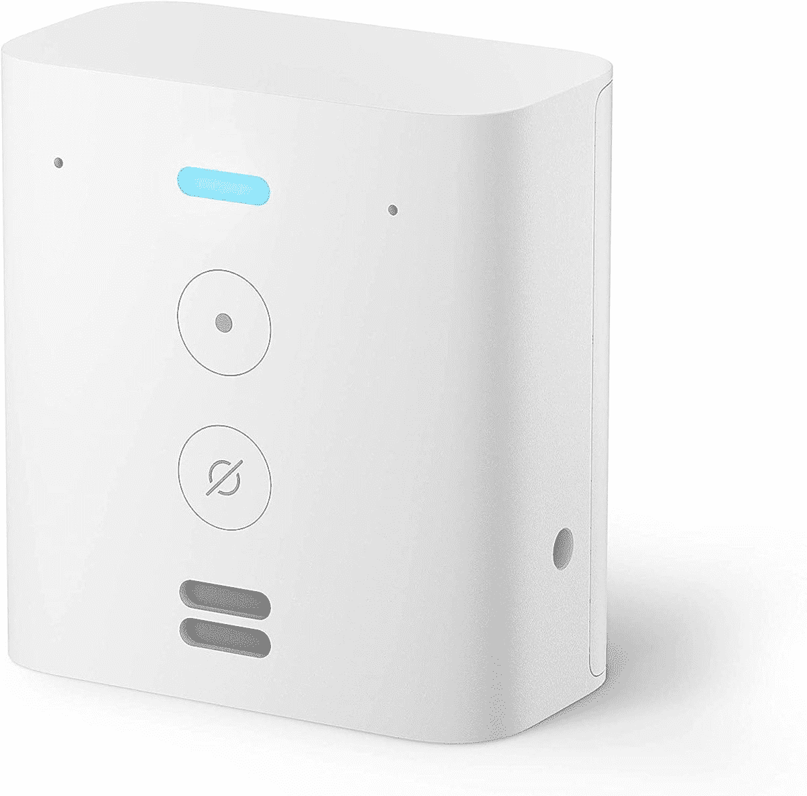
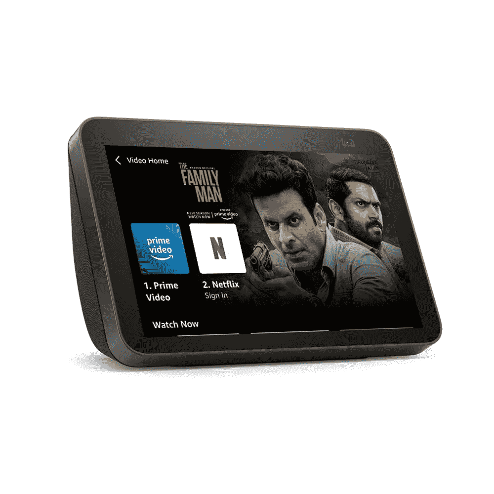
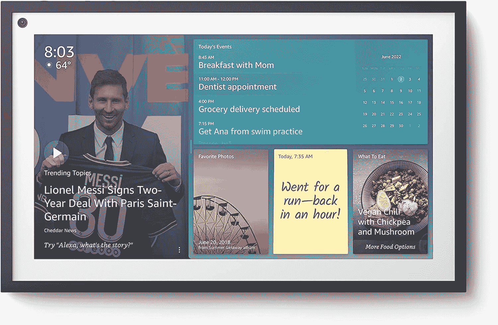

# 2023 年最佳亚马逊 Echo 设备

> 原文：<https://www.xda-developers.com/best-amazon-echo-devices/>

亚马逊经常更新其不断增长的 Echo 设备列表，以包括更新更好的选项。这些支持 Alexa 的 Echo 设备允许您仅通过语音来控制您的智能家居、播放音乐、获取新闻和天气预报等。这些年来，Echo 设备已经有了很大的发展，现在它们可以满足更多不同类别用户的需求。无论你是在为你的厨房寻找一个带显示屏的扬声器，还是为你的客厅寻找一个强大的智能扬声器，亚马逊的 Echo 系列都有适合每个人的东西。

如果你被所有的 Echo 设备弄得不知所措，不知道该买哪一个，那么我们可以帮助你。在本文中，我们将分解目前可用的所有选项，以帮助您确定哪种亚马逊 Echo 设备最适合您。

## 整体最佳回声音箱:亚马逊回声(第四代)

市场上并不缺乏 Echo 扬声器，但亚马逊 Echo(第四代)是我们向大多数人推荐的产品。对于那些想买一个听起来不错的可靠智能扬声器的人来说，这是完美的选择。正如我们在[亚马逊 Echo(第四代)评论](https://www.xda-developers.com/amazon-echo-4th-gen-review/)中提到的，对于音乐爱好者来说，在 Echo Dot 上额外花费是值得的，因为它的三扬声器设置提供了强大的声音。它的音频输出远不如 Echo Studio 强大，但仍有很多令人喜欢的地方，尤其是它的尺寸和要价。

这个 Echo 的设计，你也看到了，和之前的一些圆柱形 Echo 音箱也有很多不同。新的球形球设计看起来非常整洁，控制装置放在顶部便于使用。向球形设计的转变确实意味着新的亚马逊 Echo 扬声器比它的任何前辈都要宽得多，但 Echo(第四代)的整体形状因子对于大多数设置和房间来说都是完美的。它不像回声点那么小，也不像回声潜艇那么大。你可以很容易地在家里的每个房间里放一个这样的东西。

当然，Echo 完全支持 Alexa，这意味着你可以用你的声音与亚马逊的数字语音助手互动，播放音乐，从网络上获取信息，控制你的智能家居设备，等等。你可以通过 Alexa 应用程序轻松地[将它与你的安卓手机或 iPhone](https://www.xda-developers.com/how-to-connect-android-iphone-to-amazon-echo/) 配对，并开始使用它。也很容易将这些回声扬声器配对成一组，并同时播放音乐。您也可以将两个 Echos 配对，创建一个立体声对，并与您的电视配合使用。

关于亚马逊 Echo 的另一个有趣的事情是，它带有内置的 Zigbee 智能集线器。对于那些不知道的人来说，本地 Zigbee 集线器不需要数据连接就可以连接到兼容设备，例如飞利浦 Hue lights。Alexa 仍然很棒，将像广告宣传的那样工作，但内置 Zigbee 集线器使它更加通用。亚马逊 Echo 没有留下太多抱怨的空间，但如果我们吹毛求疵，那么我们会喜欢一个带 LED 时钟的亚马逊 Echo 变体，类似于 Echo Dot。这并不一定是一个交易破坏者，尽管对于一个在几乎所有其他方面都与回声点相似的扬声器来说，这似乎是一个明显的疏忽。

不过，总的来说，亚马逊 Echo 是一款出色的扬声器，如果你正在购买智能扬声器，并且你只有 100 美元的闲钱，我们很容易向你推荐。它可能不是最好的回声扬声器，但它会在很大程度上完成工作。

##### 亚马逊 Echo(第四代)

最新一代的原始智能扬声器继续以漂亮的设计、出色的声音和 Alexa 生态系统的巨大可能性树立标杆。

## 新手最佳 Echo 音箱:亚马逊 Echo Dot(第五代)

本文的前一版本强调了 [Echo Dot(第四代)](https://www.xda-developers.com/amazon-echo-dot-4th-gen-review/)是初学者的最佳 Echo 扬声器，我们现在对其进行了更新，以突出新版本。由于一些非常令人信服的原因，该变体优于其前身，并且在价格范围内轻松击败了许多其他智能扬声器。这款新车型看起来与上一代车型非常相似，但它在发动机罩下进行了一些实质性的改进。它带来了所有的变化，同时保留了我们熟悉和喜爱的相同外形和价格，因此我们很容易推荐它。

今年最大的变化之一是在音频部门。新的 Echo Dot(第五代)有一个新的扬声器，驱动器略大——1.73 英寸的前置扬声器，而不是上一代版本中的 1.6 英寸驱动器。亚马逊表示，这是他们迄今为止最好的回声点，所以你可以期待一个来自，比如说，第三代或第四代点的改进。它听起来仍然没有普通的 Echo 扬声器或 Echo Studio 那么好，所以请记住这一点。

新 Echo Dot 的另一个有趣之处是新的传感器。现在有一个温度传感器，回声点将能够读取它所在房间的温度。你也可以使用温度读数来自动完成一些 Alexa 程序。例如，你可以设定一个程序，当房间达到一定温度时，打开风扇或空调。此外，新的 Echo Dot 扬声器还具有一个加速度计，可以实现点击交互。这意味着你现在可以轻触来暂停闹钟，或者只是轻触来暂停音乐，而不是按下按钮或与 Alexa 交谈。

最后，值得注意的是，新的 Echo Dot 扬声器也可以成为 Eero 网络的一部分，以扩展您家中现有网络的覆盖范围。然而，这一特殊功能并不是第五代 Echo Dot 扬声器独有的。据说，最新一代机型也将通过未来的更新获得这一功能。但如果你不想等待现有的第四代 Echo Dot 扬声器实现这一功能，那么升级到新的扬声器可能是值得的。

即使你忽略了 Eero 连接功能，新的选项也带来了足够的升级，超过了前代扬声器。我们不一定建议从第四代版本升级，但如果你来自第三代 Dot，你肯定应该考虑新版本。我们也建议新用户选择最新款，尽管你可以通过选择旧型号而不是新的 Echo Dot 扬声器来节省一些钱。

##### 亚马逊回声点(第五代)

新的 Echo Dot 扬声器稍微升级了扬声器以获得更好的音频质量，新的温度传感器，加速度计和内置 Eero 以增加兼容网络的覆盖范围。

## 最佳基本选项:Echo Flex

如果你只是需要一些回音魔法在满单位之间，Echo Flex 是一个不错的选择。这是一个插入式回声设备，可以让你用语音控制兼容的智能家居设备。你可以把它想象成一个插在墙上插座上的微型回声扬声器。而且因为它甚至比 Echo Dot 还便宜，所以买一堆这些，给你家里所有的房间都加上 Alexa，相对来说还是比较实惠的。例如，如果你已经有一套好的扬声器，如果你需要发出语音命令，你可以简单地购买一个 Echo Flex，然后将其插入墙上的插座。这不仅能为你节省一些钱，还能为你省去为另一个演讲者腾出空间的麻烦。

Echo Flex 最好的一点是它还有一个 USB 端口来给手机充电，并且它可以接受附加模块。例如，您可以添加一个运动检测器，并在检测到运动时触发 Alexa 例程，或者购买带可调光彩色 led 的夜灯插件。这两者都是相对便宜的附加组件，可以大大增加 Flex 的功能。

Echo Flex 扬声器的音频质量不是很好，所以它不是 Echo Dot 的替代品。比方说，它不会比一个质量一般的智能手机扬声器更好。它的声音足以让一个小房间充满音乐，但它缺乏任何形式的低音或保真度。但是，您可以通过 3.5 毫米连接器将更好的扬声器连接到它，或者配对蓝牙扬声器以获得更好的音频输出。

长话短说，Echo Flex 作为一款可以控制智能家居设备的始终监听 Alexa 设备大放异彩。它只有两个麦克风——比回声点中的七个麦克风少——但应该足以在短距离内捕捉到你的声音。这些附件可以让 Echo Flex 更加有用，但它最好用作支持 Alexa 的智能家居设备的语音控制接入点。

 <picture></picture> 

Amazon Echo Flex

##### 亚马逊 Echo Flex

如果音乐不是你优先考虑的事情，最便宜的 Echo 是开始你的智能家居之旅的完美地方。

## 最佳儿童 Echo 音箱:亚马逊 Echo Dot 儿童版(第五代)

如果你想给你的孩子买一个智能音箱，那么 Echo Dot 儿童版(第五代)是一个不错的选择。它比普通的 Echo Dot 贵 10 美元，但硬件几乎一样。与前代 Echo Dot 相比，你也获得了所有的新功能和改进，但织物上有一个有趣的猫头鹰或龙图案，以及一些儿童专用功能。

如果需要额外付费，儿童版还会附带一个带有家长控制功能的亚马逊家长仪表盘。你还可以获得两年的保修，就像亚马逊 Fire Kids 平板电脑一样，这样你就可以在你的孩子决定把 Echo Dot 用作球的情况下，毫无疑问地得到一个替代品。此外，你还可以订阅一年的 Amazon Kids+,里面有一系列适合孩子的过滤内容。值得注意的是，一旦您激活新的 Echo Dot 儿童版，您的有效 Amazon Kids+订阅将会自动被替换。从您开始使用新的扬声器起，您将获得为期一年的 Amazon Kids+。

亚马逊表示，它正在夜以继日地努力使 Alexa 更适合儿童使用。你可能会听到一些来自 Alexa 的定制响应，但总体体验在很大程度上是相同的。不过，亚马逊已经在儿童版上禁用了一些标准的 Alexa 功能，包括语音购买，以防止你的孩子随意订购玩具和游戏。另外，默认情况下，亚马逊音乐、苹果音乐或 Spotify 的露骨歌词会被屏蔽。

总的来说，Echo Dot 儿童版(第五代)是一款非常棒的儿童智能音箱。你是否想让你的孩子在他们的房间里有一个智能音箱完全取决于你。和上一代普通 Echo Dot 一样，如果想省钱的话，第四代儿童版会更实惠。

##### 亚马逊回声点儿童(第五代)

Echo Dot 儿童版不仅有有趣的新设计，还为已经很棒的 Echo Dot 带来了儿童友好的内容和家长友好的保修。

## 最佳音乐回音音箱:亚马逊回音工作室

亚马逊目前的 Echo 扬声器在大多数情况下听起来都很棒。但是，如果你真的想享受听音乐，那么你应该考虑购买回声工作室。是的，它应该进行更新，以对抗市场上的其他一些优质扬声器，但它仍然有足够的冲击力来提供 Echo 系列中最好的音频。这是对 Echo Sub 的重大升级，也比音频部门的其他 Echo 扬声器好得多。售价 200 美元，这是目前你能买到的最贵的 Echo 扬声器，但与市面上许多其他支持 Alexa 的第三方扬声器相比，它相对便宜。

至于硬件本身，Echo Studio 大约 8 英寸高，大约 7 英寸宽。它也是一个织物覆盖的圆柱体，就像一年前问世的回声潜艇一样。然而，与 Sub 相比，Studio 配备了更好的音频驱动。它有五个驱动器，包括一个 5.25 英寸的向下发射低音扬声器，一个 1 英寸的前向高音扬声器，以及三个 2 英寸的中音扬声器，分别在左侧、右侧和顶部发射音频。所有这些驱动器都由一个 330 瓦放大器和一个 24 位 DAC 供电。

Echo Studio 最好的一点是，它是一个独立的扬声器，可以独立工作，不需要依赖其他 Echo 扬声器进行连接。与 Echo Sub 不同，这款产品完全支持 Alexa，这意味着你可以只通过你的声音来控制你的智能家居设备或播放音乐和获取其他信息。Echo Studio 甚至内置了 Zigbee 集线器，让您可以直接连接智能家居设备。关于硬件，你可以在顶部获得物理控制，以及一个 LED 环，让你知道何时触发 Alexa。

Echo Studio，我们前面提到过，比其他 Echo 音箱略大。它会在你的房间里占据更多的空间，但是它仍然比回声潜艇小。更不用说，它不需要其他扬声器来连接，这意味着你不需要任何额外的空间来设置这些配套的扬声器。

如果你发现自己在回声潜艇和回声工作室之间左右为难，我们建议你选择工作室。它比 Echo Sub 贵，但你可以得到一个听起来更好的独立扬声器，甚至支持 3D 音频。有了回声潜艇，你将不得不花更多的钱买另一个回声扬声器来使用它，因为它没有自己的大脑。如果你想了解这两种回声设备之间的更多差异，你可以查看我们的[回声子与工作室对比](https://www.xda-developers.com/amazon-echo-sub-vs-amazon-echo-studio/)。

##### 亚马逊 Echo 工作室

Echo Studio 是在 Echo Sub 问世一年后发布的，它在音频质量和可用性方面都提供了明显更好的体验。你可以购买这款木炭色和全新冰川色的扬声器。

## 最佳智能显示器:Echo Show 8(第二代)

Echo Show 8(第二代)是一款非常棒的 Echo 设备，正好适合亚马逊不断增长的 Echo Show 产品线。这是一款吸收了以前 Echo Show 设备所有优点的产品，并将其放在一个易于使用的外形中。它没有 Echo Show 10(第三代)大，也没有 Echo Show 5 小，可以轻松观看视频或进行视频通话，而不会占用太多空间。

Echo Show 8 配备了更大的 Echo Show 10(第三代)上的高质量高清屏幕，它还配备了一些强大的扬声器，可以非常轻松地填满一个小房间。值得注意的是，它还有许多很棒的隐私功能，包括物理相机快门和屏幕隐私集线器控制。另一个值得注意的是 1300 万像素的摄像头，与 Echo Show 10(第三代)上的摄像头相同。这是对上一代 Echo Show 8 的重大升级，上一代 Echo Show 8 只有 1MP 摄像头。更不用说，它也比竞争对手的许多产品要好。

Echo Show 8，对于那些不知道的人来说，也支持 Alexa，这意味着你可以将其作为一个智能扬声器来完成任务。新增的显示屏还可以让您更轻松地控制智能家居设备，此外还可以帮助您观看视频、接听视频电话、阅读食谱(如果它放在您的厨房中)等。

如果你在所有不同的回声节目之间犹豫不决，回声节目 8 对大多数人来说是一个最佳选择。这三种设备之间的购买决定实际上取决于屏幕大小、一些附加功能和价格。对于大多数人来说，Echo Show 5 可能太小，因此出于所有实用目的，选择 Echo Show 8 更有意义。另一方面，Echo Show 10 可能有点太大，难以放置在家中的许多地方。然而，它配备了一个旋转屏幕和更好的扬声器，所以请记住这一点。

使用 Echo Show 8，您可以在更小的尺寸上获得相同分辨率的显示器，因此图片和视频将看起来更加清晰。当你进行视频通话时，你在其他人面前也会看起来一样好，因为它配备了与 Echo Show 10 相同的 1300 万像素摄像头。对于大多数人来说，Echo Show 8(第二代)是一个可靠的选择，但根据您的需要，Show 10 或 Show 5 不会出错。

 <picture></picture> 

Amazon Echo Show 8 (2nd Gen)

##### 亚马逊 Echo Show 8(第二代)

Echo Show 8 位于 Echo Show 5 和 Echo Show 10 之间的最佳位置，它带来了许多出色的功能，包括高清屏幕、1300 万像素的摄像头和像样的扬声器。

## 最高端的智能显示屏:Echo Show 15(第三代)

Echo Show 15 因其规模而真正脱颖而出。顾名思义，Echo Show 15 配备了一个 15.6 英寸的大显示屏，比其他 Echo Show 设备大得多。您还可以将 Echo Show 15 安装在墙上，这是其他 Echo Show 设备无法做到的。

最近，亚马逊还在 Echo Show 15 中添加了 Fire TV，使其成为一款可靠的娱乐设备。随着新的更新，你不仅可以流化亚马逊自己的视频内容，还可以从第三方内容提供商如 Paramount+、Showtime 等获得它们。此外，它现在还可以通过 Alexa 访问你想看的内容。你可以让 Alexa 根据节目名称播放特定的节目，而不是调用它可用的服务。我们认为这是一个很好的补充，因为它使使用 Echo Show 15 的整体体验更加直观。Fire TV 支持尚未在其他 Echo Show 设备上提供，亚马逊也没有确认是否会提供这一支持，这本身就使 Echo Show 15 脱颖而出。

即使你不考虑 Fire TV 的支持，Echo Show 15 仍然有很多值得喜欢的地方。这是该系列中唯一可以安装在墙上的 Echo Show 设备。分辨率为 1080p 的 15.6 英寸显示屏更大、更清晰，因此可以从远处观看。这使得它成为一个伟大的设备，可以通过各种 Alexa 小工具浏览信息。

相框功能在 Echo Show 15 上也最有效，因为它可以在大屏幕上展示你对亚马逊照片和脸书的回忆。Echo Show 15 还配有内置的 500 万像素摄像头，用于视频通话，以及相机快门和麦克风关闭按钮，就像其他 Echo 设备一样。不过，这个特殊的 Echo Show 只配备了两个 1.6 英寸的扬声器。它们无论如何都不差，但你会从 Echo Show 10 获得更好的音频质量，它有两个 1 英寸的高音扬声器和一个 3 英寸的低音扬声器。然而，你可以将 Echo Show 15 与你家周围的其他 Echo 扬声器配对使用，因此它不一定是一个障碍。

Echo Show 15 现在可以以 249 美元的价格购买，这使得它成为最昂贵的 Echo 设备之一。它的价格与 Echo Show 10 相同，但它将音频设置换成了可以安装在墙上的更大的显示器。

 <picture></picture> 

Echo Show 15

##### 亚马逊回声秀 15

亚马逊 Echo Show 15 是 Echo Show 家族中最大的成员，拥有 15.6 英寸的超大 FHD 显示屏。它以大量功能换取了更大的外形，但它也可以安装在墙上，并且很快将支持亚马逊的 Fire TV。

* * *

这就把我们带到了 Echo 购买指南的最后。我们已经强调了许多不同的选项，所以请务必仔细阅读整个列表，并选择符合您需求的选项。然而，亚马逊 Echo(第四代)是大多数用户的最佳选择。这是一个声音很棒的扬声器，可以让你的房间充满美好的音乐，它还支持 Alexa 控制你的智能家居设备。另一方面，如果你是智能扬声器的新手，那么 Echo Dot(第五代)是一款不错的扬声器。当你将它与智能灯泡等智能家居产品配对，并在升级到更大、更贵的扬声器之前，开始尝试用回声控制你的设备时，它特别好。

最后，如果你想看看市场上有哪些智能音箱可供选择，那么一定要停下来看看我们收集的最好的智能音箱。