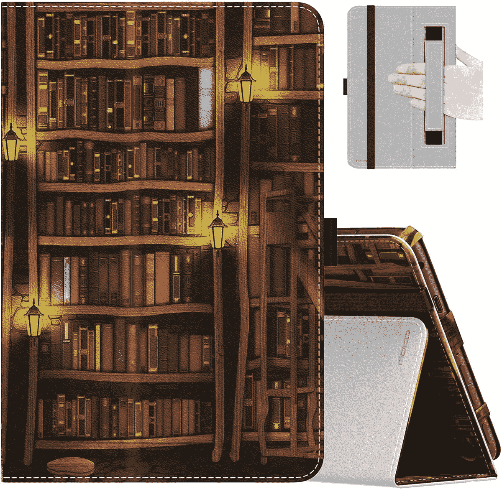
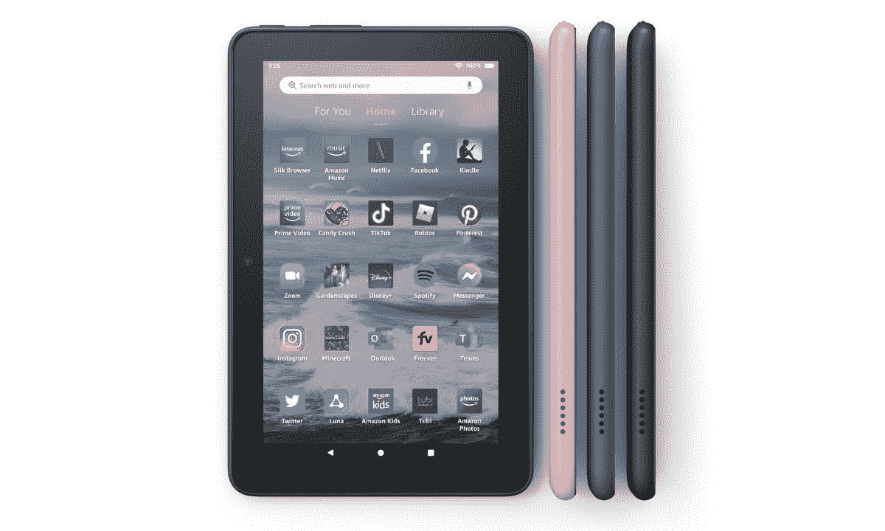

# 亚马逊大火 7 的最佳案例(2022)

> 原文：<https://www.xda-developers.com/best-amazon-fire-7-2022-cases/>

亚马逊 Fire 7 (2022) 是市场上[最好的廉价安卓平板电脑](https://www.xda-developers.com/best-android-tablets/)之一。最新的 2022 年版本比 2019 年版本有了一些显着的升级，包括更快的芯片组、USB-C、更多的 RAM 和更长的电池寿命。虽然它还没有达到顶级水平，但它唯一的优点是价格便宜，所以很容易原谅它所有的缺点。

如果你刚刚拿起 Fire 7 (2022)，投资一个保护你全新平板电脑的箱子将是一个好主意。Fire 7 (2022)太便宜了，你可能不想花太多钱在一个别致的盒子上。毕竟，这东西只要 60 美元。但值得庆幸的是，有很多负担得起的情况下，提供良好的保护和风格。有些外壳还内置了一个支架，可以让你从不同角度支撑你的 Fire 7，以便观看视频或接听视频电话，而其他外壳则添加了非常方便的自动唤醒/睡眠功能。为了帮助您节省时间和精力，我们收集了以下最佳 Fire 7 (2022)平板电脑保护套。

*   ##### Fintie slim Fire 7 表壳

    这款来自 Fintie 的全机身表壳轻巧耐用。它采用优质 PU 皮革外壳和柔软、耐刮擦的超细纤维内饰。内置磁条使设备安全封闭，同时还支持自动唤醒/睡眠功能。同时，双支架模式让您可以将机箱转换为观看支架和打字支架。

*   <picture></picture>

    fol uu

    ##### fol uu Trifold Fire 7 保护套

    这是一款三折对开本保护套，可提供全身保护，防止跌落、划伤和污迹。磁性锁将前盖安全地固定在适当的位置，同时还添加了自动唤醒/睡眠功能，支架允许您从多个角度支撑 Fire 7，以获得舒适的观看和打字体验。

*   <picture></picture>

    CoBak

    ##### CoBak 皮火 7 表壳

    这款纤薄、通体的表壳是由高级 PU 皮制成的，价格实惠，并能提供良好的保护。它有一个超细纤维内部和磁性关闭，便于打开和关闭您的火 7。它还提供自动唤醒/睡眠功能，有三种颜色:蓝色、黑色或粉色。

*   <picture></picture>

    MoKo

    ##### MoKo 印火 7 案

    MoKo 的纤薄折叠案提供了可靠的保护，又不会增加太多重量。它由高级 PU 皮革制成，配有弹性丝带封口和一条手提带。你可以把它支撑在两个角度来看视频或打字。它也有一些简洁的设计。

*   <picture></picture>

    Plobors

    ##### Plobors Fire 7(2022)保护套

    这是一款适合儿童使用的保护套，提供坚固的跌落保护，并有多种颜色可选。它在每个角上都有四个缓冲气孔，由减震硅胶材料制成，并具有纹理化的侧面，以更好地抓握。它还具有凸起的嘴唇，以保护显示器。

*   <picture></picture>

    Ubearkk

    ##### Ubearkk Kid-Friendly Fire 7 case

    这是一款外观有趣的儿童友好型保护套，由重型 EVM 泡沫制成，具有额外的防震保护作用，可以承受粗暴搬运和相当大的磨损。它还配有一个提手和一个带两个角度的内置支架。

*   <picture></picture>

    DTTO

    ##### DTTO 高级真皮 Fire 7 保护套

    由高级纯素皮革制成，这款来自 DTTO 的复古风格对开本保护套可以保护您的 Fire 7 免受跌落、碰撞和刮擦，同时还可以让您单手使用内置手带。它还有一个双向支架，可以将平板电脑支撑在平面上观看视频

这就是我们对《烈火 7》(2022)最佳案例的总结。一个保护套将大大有助于保护您闪亮的新 Fire 7 (2022)免受意外损坏、指纹和一般磨损。为了获得最佳保护，我们推荐 DJ&RPPQ 的 Plobors 保护套或加固保护套。如果你正在寻找轻便和多功能的东西，Fintie 和 Foluu 都是很好的选择，它们提供了自动唤醒/睡眠功能，多角度支架和磁性外壳。

虽然 Fire 7 (2022)和 Fire 7 (2019)看起来完全相同，但在设计上有一些细微的差异。这意味着为旧型号制造的箱子不适合新型号。因此，在点击购买按钮之前，请确保检查与您的型号的兼容性。当你在这里的时候，一定要看看 Fire 7 (2022) 的[最佳配件。](https://www.xda-developers.com/best-accessories-amazon-fire-7)

 <picture></picture> 

Amazon Fire 7 2022

##### 亚马逊大火 7 (2022)

新款亚马逊 Fire 7 平板电脑配备了 7 英寸显示屏、USB-C 充电、高达 32GB 的存储空间和免提 Alexa。