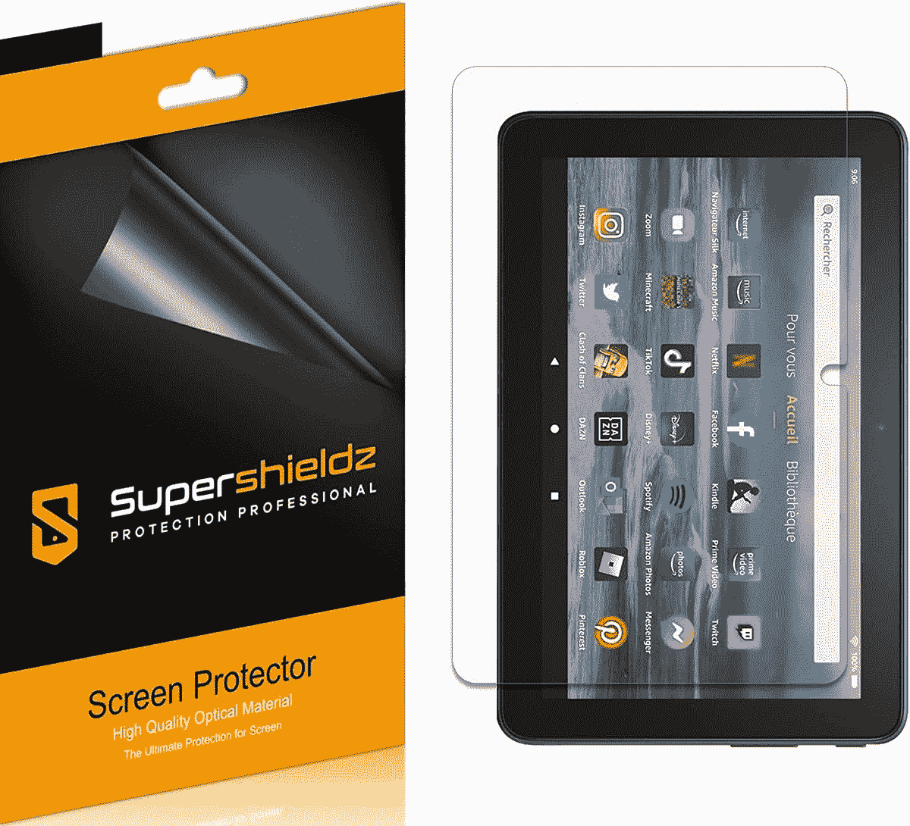

# 2023 年亚马逊 Fire 7 平板电脑最佳配件

> 原文：<https://www.xda-developers.com/best-amazon-fire-7-accessories/>

亚马逊 Fire 7 可能不是最现代的平板电脑，但它的价格提供的价值无可争议。虽然它不会取代你的 [iPad](https://www.xda-developers.com/best-ipad/) 或你的主要安卓平板电脑，但它是一个很棒的小设备，你可以用来控制你的智能家居设备，流媒体网飞和媒体，或阅读书籍。由于有大量的应用程序和家长控制，它也是你的小家伙们的一个很好的平板电脑，如果你想要一些更适合孩子的功能，还有一个专门针对孩子的版本。

亚马逊最近用新硬件更新了 Fire 7 平板电脑，增加了 USB-C 端口、更快的处理器和更大的电池。如果你已经决定为自己挑选一件，带上一些配饰会是个不错的主意。下面，我们为 Fire 7 (2022)搜罗了最好的配件。

*   <picture></picture>

    CoBak

    ##### CoBak 皮火 7 表壳

    这款纤薄、通体的表壳是由高级 PU 皮制成的，价格实惠，并能提供良好的保护。它有一个超细纤维内部和磁性关闭，便于打开和关闭您的火 7。它还提供自动唤醒/睡眠功能，有三种颜色:蓝色、黑色或粉色。

*   <picture></picture>

    super shieldz

    ##### super shieldz 哑光宠物 Fire 7 屏幕保护器

    Supershieldsz 哑光屏幕保护器不仅可以保护 Fire 7 的显示器免受指纹、灰尘和划痕的影响，还可以减少眩光，从而获得更好的可读性和观看体验。这个包里有三个屏幕保护器。

*   <picture></picture>

    DTTO

    ##### DTTO 高级真皮 Fire 7 保护套

    由高级纯素皮革制成，这款来自 DTTO 的复古风格对开本保护套可以保护您的 Fire 7 免受跌落、碰撞和刮擦，同时还可以让您单手使用内置手带。它还有一个双向支架，可以将平板电脑支撑在平面上观看视频

*   ##### 三星 EVO Plus microSD

    Fire 7 的基本款只有 16GB 的内部存储，如果你打算安装很多应用和媒体，这是不够的。谢天谢地，这款平板电脑支持 microSD 卡扩展，因此添加更多存储空间很容易。这款 64GB 的三星 EVO microSD 卡应该可以为您提供足够的空间来存储照片、视频、文档和应用程序。

*   <picture></picture>

    亚马逊基本型入耳式有线耳机

    ##### 亚马逊基本型入耳式有线耳机

    Fire 7 有单扬声器，听起来一般。谢天谢地，它有一个 3.5 毫米的音频插孔，所以你可以随时插上耳机看电影或听音乐。这些亚马逊品牌的入耳式有线耳机制作精良，音质良好。他们还有一个内置麦克风，可以进行视频通话。

*   <picture></picture>

    Eaxxfly 18W USB-C 壁式充电器

    ##### Eaxxfly 18W USB-C 壁式充电器

    新款 Fire 7 2022 带有 USB-C 端口但其充电速度却没什么值得大书特书的。捆绑的充电砖最高可达 5W，从 0 到 100%需要大约四个小时。但幸运的是，你可以使用快速充电器来减少这种情况。这款来自 Eaxxfly 的快速充电器提供了一个 18W 的电源适配器和一根 3.3 英尺的 USB-C 到 USB-C 电缆。

如果你主要是为儿童购买 Fire 7，那么选择儿童机型比普通机型更好。Fire 7 Kids 的价格要贵 49 美元，但它有额外的好处，包括一个儿童友好型保护保险杠、两年无忧保证和一年亚马逊 Kids Plus 订阅。

Fire 7 可能不是亚马逊提供的最强大的平板电脑，但它是一款功能强大的平板电脑，可以运行几乎所有的现代应用程序，包括 Instagram、抖音、网飞、Spotify 和 Apple Music。你还可以访问全套亚马逊应用和服务，包括亚马逊 Prime Video、Prime Music、Kindle 和免提 Alexa。

如果内容消费是重中之重，或许 Fire HD 8 或者 Fire HD 10 会更适合你的需求。查看我们对 [Fire 7 Vs Fire HD 8 Vs Fire HD 10](https://www.xda-developers.com/amazon-fire-7-vs-amazon-fire-hd-8-vs-amazon-fire-hd-10/) 的深入比较，找出哪一款平板电脑最适合你。