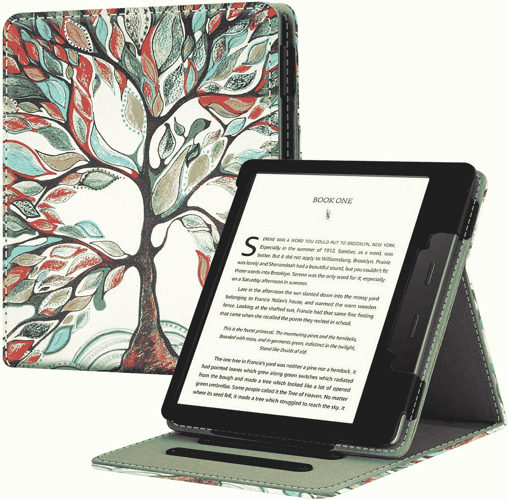
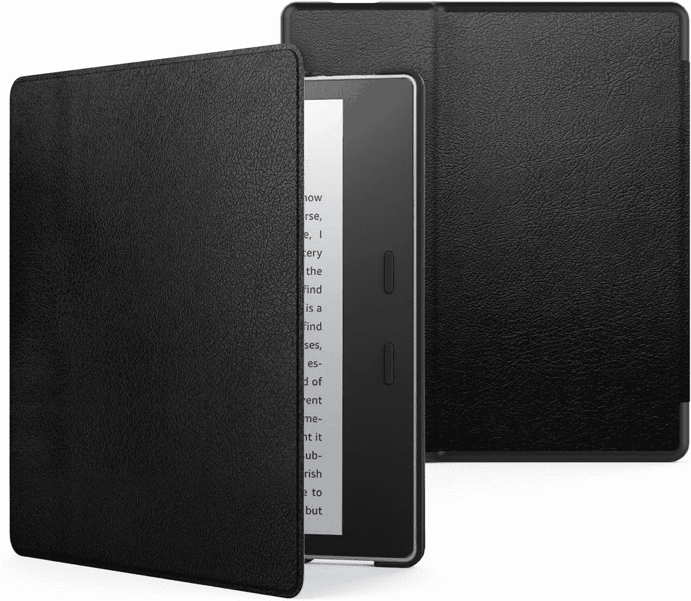
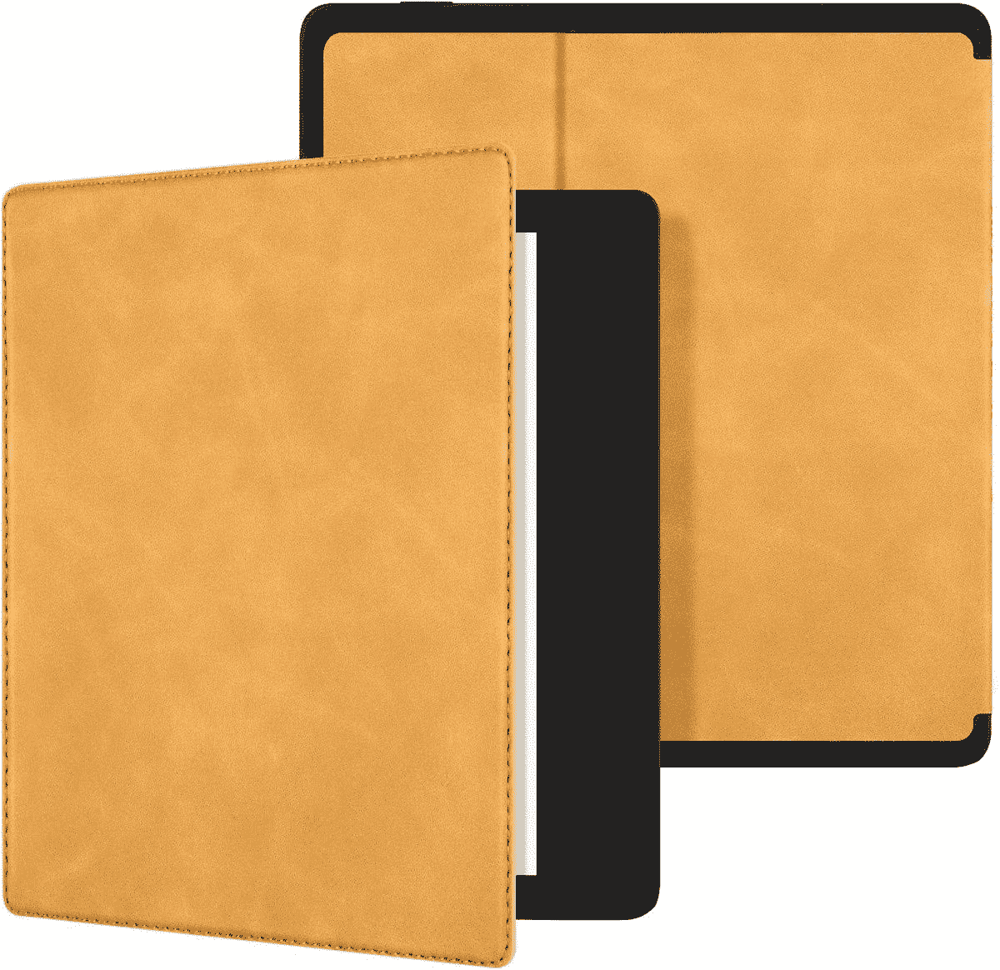

# 2023 年 Kindle Oasis(第 10 代)的最佳案例

> 原文：<https://www.xda-developers.com/best-amazon-kindle-oasis-cases/>

# 2023 年 Kindle Oasis(第 10 代)的最佳案例

想为您的 Kindle Oasis(第 10 代)购买保护套吗？我们已经收集了最好的选择。请继续阅读，了解更多信息。

说到电子书阅读器，base [Kindle](http://www.xda-developers.com/best-amazon-kindle-ereader/) 和 Kindle Paperwhite 是市场上最受欢迎的。然而，对于那些想要真正优质阅读体验的人来说， [Kindle Oasis](https://www.xda-developers.com/editorial-amazon-kindle-oasis-best-ever/) (第 10 代)是一个不错的选择。凭借 Kindle 系列中最大的显示屏和握在手中感觉很棒的优雅金属机身，Oasis 是一款非常适合图书爱好者的高端设备。虽然 Oasis 的机身相当耐用，但它的显示屏可能会出现划痕和损坏。如果你喜欢带着你的电子阅读器旅行和通勤，意外损坏的风险会更大。这就是为什么最好用一个盒子或盖子来保护你昂贵的东西。

如果你花 270 美元买了一个电子书阅读器，你当然会想保护它免受磨损、跌落和摔伤。Kindle Oasis(第 10 代)有太多的保护套。为了帮助你选择一个，我们收集了以下最佳选项。

*   ##### Kindle Oasis 面料保护套

    官方的面料保护套完美贴合 Kindle Oasis 的人体工程学轮廓，采用防溅面料，手感很好。重量为 111 克，非常轻，握起来非常舒适。它有三种颜色:炭灰色、打孔红色和海洋蓝色

*   <picture></picture>

    case bot

    ##### case bot 皮套 Kindle Oasis cover

    这款套套应有尽有:一个内置支架用于免提阅读，一个背带可以舒适地单手握持设备，一个卡槽可以存放信用卡和现金。有点笨重，重 164g 左右。只有当你打算使用这些附加功能时才购买它。

*   <picture></picture>

    官方皮套

    ##### 亚马逊皮套 Kindle Oasis 皮套

    有点贵，但官方皮套提供了最好的手感，与你的 Kindle Oasis 的高级设计完美互补。由于表壳由真皮制成，随着时间的推移，它只会变得更好，在其自然老化过程中会形成自然光泽

*   <picture></picture>

    芬铁翻盖外壳

    ##### 芬铁翻盖外壳

    采用耐用合成革制成，芬铁外壳内置支架，可在三个不同角度之间调节，以实现最佳视角。它有四种不同的设计。

*   <picture></picture>

    MoKo

    ##### MoKo Kindle Oasis cover

    MoKo 的外壳采用了坚硬的 PC 背板和柔软的超细纤维内饰。该外壳具有精确的按钮和端口开孔，以及自动唤醒/睡眠功能。

*   <picture></picture>

    Ayotu

    ##### Ayotu Kindle Oasis Case

    这款修身硅胶手感柔软，握感舒适。内盖采用蜂窝设计，以改善散热。它有精确的端口和按钮切口，并提供自动唤醒/睡眠功能。

*   ##### CoBak Kindle Oasis Cover

    这款轻巧耐用的 Kindle Oasis 保护套是外出阅读的完美伴侣。贴身的设计和精确的切口可确保轻松触及所有端口和按钮，而内置的智能外壳功能可在您打开或合上外壳时自动唤醒或让您的设备进入睡眠状态。这款保护套有多种有趣的配色。

这就结束了我们对最佳 Kindle Oasis 案例的总结。虽然 Kindle Oasis 还有很多其他外壳，但在我们看来，这些是最好的选择。购买一个外壳将大大有助于保护你珍贵的电子阅读器免受划痕、跌落和指纹的影响。如果你想保持简单，亚马逊的官方面料保护套和 Ayotu 的软硅胶保护套都是很好的选择。对于优质的手感，没有什么能打败麂皮制成的官方皮革封面。这里介绍的大多数案例都向后兼容旧的 Oasis 模型。但是，请务必在下单前查看描述。

 <picture></picture> 

Kindle Oasis

##### 亚马逊 Kindle Oasis

Kindle Oasis 是业内最好的，配备了华丽的 7 英寸显示屏和优雅的金属机身。

拥有一个不同的 Kindle 电子书阅读器？查看 Kindle Paperwhite 第十代的[最佳案例](https://www.xda-developers.com/best-amazon-kindle-paperwhite-cases/)和 Kindle 第十代的[最佳案例](https://www.xda-developers.com/best-amazon-kindle-cases/)。