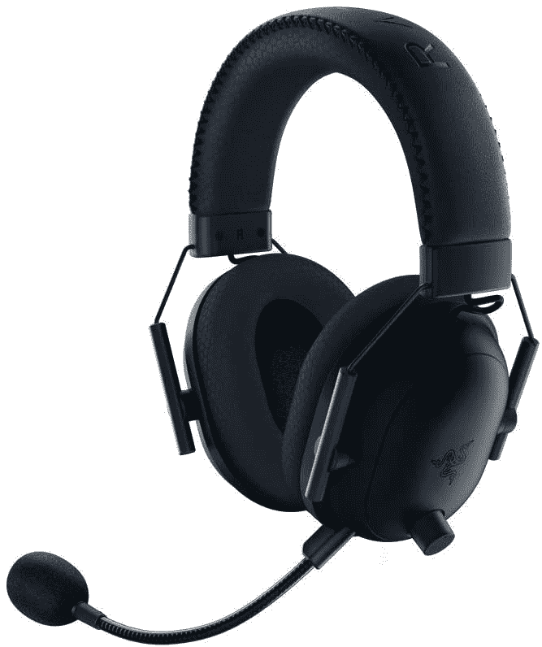
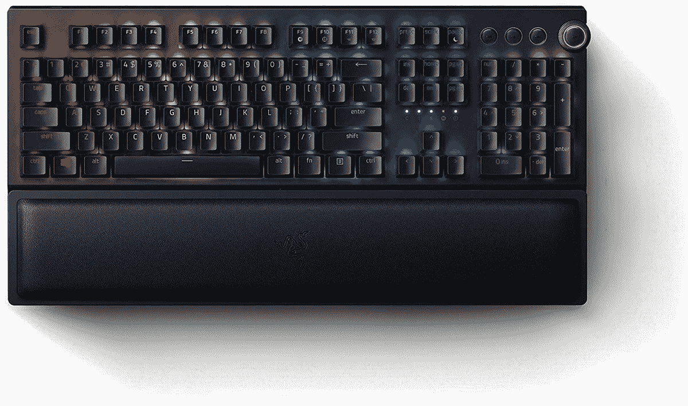
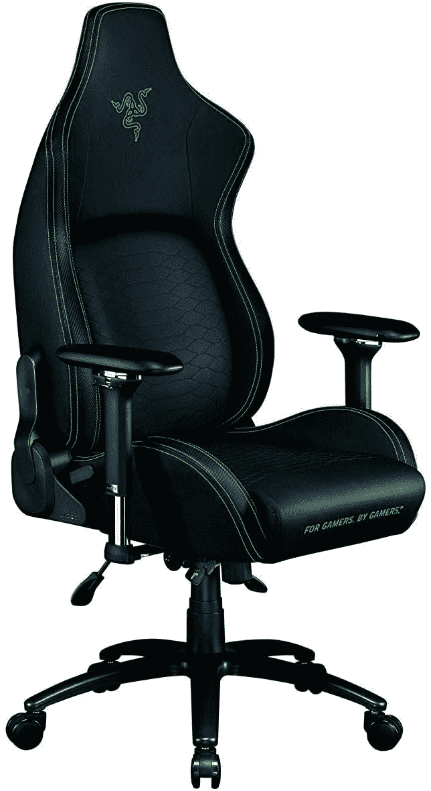

# 亚马逊 Prime Day 2021:Razer 笔记本电脑、键盘、鼠标和耳机最优惠

> 原文：<https://www.xda-developers.com/best-amazon-prime-day-deals-razer/>

# 亚马逊 Prime Day 2021:Razer 笔记本电脑、键盘、鼠标和耳机最优惠

以下是 Razer 笔记本电脑、键盘、鼠标和耳机的最佳亚马逊 Prime Day 交易。在存货用完之前购买！

亚马逊 Prime Day [正在进行](https://www.xda-developers.com/amazon-prime-day-sales-june-21/)，和往常一样，各品牌正在对一些最受欢迎的产品提供大幅折扣。因此，无论您一直在关注时尚的 RGB 键盘还是舒适的游戏椅，Prime Day 都是一个绝佳的机会，可以用比平时低得多的价格买到一些您最想要的外围设备。Razer 正在为游戏玩家提供一些关于笔记本电脑、键盘、耳机以及介于两者之间的所有东西的惊人交易。下面，我们为您收集了 Razer 产品的最佳交易，以节省您的时间和麻烦。

 <picture></picture> 

Razer Blade 15

##### 雷蛇之刃 15

Razer 的 Blade 15 笔记本电脑在紧凑的空间中提供强大的游戏体验。它配备了 15.6 英寸 FHD 120Hz 显示屏，第 10 代英特尔 i7-10750H，时钟速度高达 5.0GHz，NVIDIA GeForce GTX 1660 Ti 显卡，16GB 内存，256GB 固态硬盘，当然还有 Chroma RGB 照明。

 <picture></picture> 

Razer DeathAdder V2

##### 雷蛇死亡骑士 V2

Razer DeathAdder 是最受欢迎的有线游戏鼠标之一。它使用新的 Razer 光学开关，该公司称其速度比传统开关快 3 倍。它支持多达 1650 万种颜色，包括预设配置文件，并与其他 Razer Chrome 和 Phillips Hue 产品同步。

 <picture></picture> 

Razer BlackShark V2 Headset

##### 雷蛇黑鲨 V2

Razer 的 Blackshark V2 游戏耳机通过 THX 7.1 空间环绕声提供真正真实的声音，并通过特殊的封闭式耳罩提供卓越的隔音效果。它们配备了 50 毫米 Triforce 钛金属声音驱动器、冷却凝胶灌注垫和可拆卸麦克风。

 <picture></picture> 

Razer BlackShark V2 Headset

##### 雷蛇黑鲨 V2

雷蛇黑鲨 V2 专业版就像黑鲨 V2，但提供无线和有线连接。它们有现成的中性声音，并配有可拆卸的麦克风。

 <picture></picture> 

Razer Huntsman Mini Keyboard

##### 雷蛇猎人迷你

60%的游戏键盘，配有 Razer 的新型线性光学开关，其驱动距离比其他线性开关短 15-30%。该键盘具有耐油 PBT 键帽，色度照明，以及支持 Razer Hypershift 的完全可编程宏。

 <picture></picture> 

Razer BlackWidow V3 Pro Keyboard

##### 雷蛇黑寡妇 V3 Pro

Razer 的黑寡妇 V3 Pro 机械键盘具有光滑的黄色开关，驱动点仅为 1.2 毫米。它还具有符合人体工程学的腕垫，双镜头 ABS 键帽，以及透明的开关外壳，允许明亮的 RBG 照明。

 <picture></picture> 

Razer Iskur Gaming Chair

##### 雷蛇伊斯库尔

Razer 的 Iskur 游戏椅具有符合人体工程学的完全可调的腰部曲线，为您的下背部提供全面支撑。它由多层合成革和高密度泡沫垫制成，具有最大的耐用性和舒适性。

 <picture></picture> 

Razer Firefly V2 Mat

##### 雷蛇萤火虫 V2

Razer 萤火虫硬盘 V2 鼠标垫是您的 RGB 鼠标和键盘的完美伴侣。除了它的主要亮点 RGB 照明，它还提供了一个用于精确像素跟踪的微纹理表面，一个防滑橡胶底座和一个内置的鼠标电缆管理器。

 <picture></picture> 

Razer Kiyo Pro

##### Razer Kiyo Pro

不，这款网络摄像头没有 RGB 照明，但它提供了用于清晰视频通话和游戏流的未压缩全高清 1080p 60fps 镜头，以及支持 HDR 的超敏感 CMOS 传感器，可适应任何照明。

 <picture></picture> 

Razer Viper Ultimate Mouse

##### 雷蛇毒蛇终极版

Razer Viper Ultimate 是目前市场上最好的游戏鼠标之一。它仅重 74 克，提供多达 5 个板载内存配置文件、20K DPI 光学传感器、色度照明、8 个可编程按钮和基于光束驱动的新型光学鼠标开关。

* * *

你有它:Razer 最受欢迎的键盘，鼠标，耳机和笔记本电脑的最佳交易。Razer 在 Prime Day 期间为大多数产品提供至少 22%至 25%的折扣。其中最划算的是 Razer Viper Ultimate(T1)鼠标，售价 89.99 美元，比标价低了 60 美元。 [Razer Blade 15](https://www.amazon.com/Razer-Blade-Base-Gaming-Laptop/dp/B08LZYN1ZF/?tag=xda-4psvk0i-20&ascsubtag=UUxdaUeUpU2680&asc_refurl=https%3A%2F%2Fwww.xda-developers.com%2Fbest-amazon-prime-day-deals-razer%2F&asc_campaign=Short-Term) 也在其正常价格的基础上获得了 500 美元的大幅折扣。与此同时， [Razer Huntsman Mini](https://www.amazon.com/Razer-Huntsman-Mini-Gaming-Keyboard/dp/B08B3JSKGR?tag=xda-4psvk0i-20&ascsubtag=UUxdaUeUpU2680&asc_refurl=https%3A%2F%2Fwww.xda-developers.com%2Fbest-amazon-prime-day-deals-razer%2F&asc_campaign=Short-Term) 和 [BlackWidow V3 Pro](https://www.amazon.com/Razer-BlackWidow-Mechanical-Wireless-Keyboard/dp/B08J8C7D8C?tag=xda-4psvk0i-20&ascsubtag=UUxdaUeUpU2680&asc_refurl=https%3A%2F%2Fwww.xda-developers.com%2Fbest-amazon-prime-day-deals-razer%2F&asc_campaign=Short-Term) 游戏键盘分别比标价下降了 22%和 23%。

如果你一直在寻找一些高品质的 RGB 耳机，而又没有倾家荡产，那么你可以以 79.99 美元的价格买到[雷蛇黑鲨 V2](https://www.amazon.com/Razer-BlackShark-Wireless-Gaming-Headset/dp/B08FQG96RP?tag=xda-4psvk0i-20&ascsubtag=UUxdaUeUpU2680&asc_refurl=https%3A%2F%2Fwww.xda-developers.com%2Fbest-amazon-prime-day-deals-razer%2F&asc_campaign=Short-Term) 。与此同时，[黑鲨 V2 专业版](https://www.amazon.com/Razer-BlackShark-Gaming-Headset-Detachable/dp/B086PKMZ1Q?tag=xda-4psvk0i-20&ascsubtag=UUxdaUeUpU2680&asc_refurl=https%3A%2F%2Fwww.xda-developers.com%2Fbest-amazon-prime-day-deals-razer%2F&asc_campaign=Short-Term)，V2 的无线版本，现在售价 139.99 美元。请注意，这些 Prime Day 交易仅适用于亚马逊 Prime 会员。

*在今年的黄金日促销活动中，你会从清单中挑选哪些产品？请在下面的评论中告诉我们。*