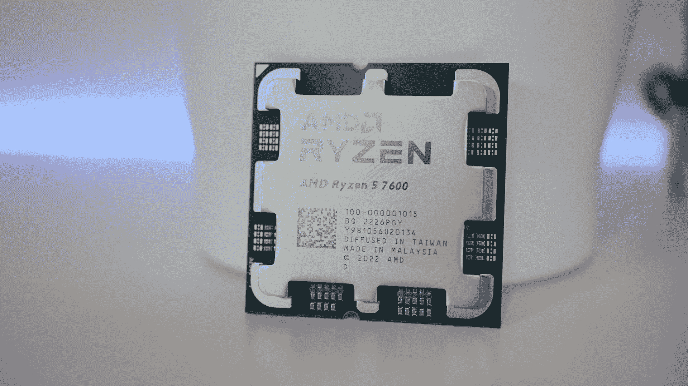

# 2023 年最佳 AMD CPUs

> 原文：<https://www.xda-developers.com/best-amd-cpu/>

AMD 处理器经过多年的发展，已经不仅仅是英特尔处理器的廉价替代品。事实上，在某些领域，他们已经在英特尔芯片上踩了几代人了，以诱人的性价比提供了难以置信的价值。

AMD 的 CPU 一直出现在目前市场上的[最佳 CPU](https://www.xda-developers.com/best-cpus/)和[最佳游戏 CPU](https://www.xda-developers.com/best-cpu-gaming/)的集合中。虽然英特尔在其第 13 代处理器上做了一些令人印象深刻的工作，但 AMD 没有懈怠，红队与蓝队并肩作战。如果你和锐龙一起去，现在，这些是 CPU。

## 总体最佳:AMD 锐龙 5 7600 

| 

规格

 | 

AMD 锐龙 5 7600

 |
| --- | --- |
| 体系结构 | 禅宗 4 |
| 放 | 2023 |
| 核心 | 6 |
| 线 | 12 |
| 基准时钟速度 | 3.8 千兆赫 |
| 提高时钟速度 | 5.1 千兆赫 |
| (电源)插座 | AM5 |
| 随机存取存储 | DDR5-5200 |
| 隐藏物 | 38 兆字节 |
| PCIe | 5.0 |
| 尖端扭转型室性心动过速 | 65 瓦 |

当中档 CPU 是最好的整体套件时，这是成为 PC 制造商的绝佳时机。与锐龙 7000 系列一样，大多数人会觉得锐龙 5 就像在家一样。在这种情况下， [AMD 锐龙 5 7600](https://www.xda-developers.com/amd-ryzen-5-7600-review/) 可以在 320 美元左右买到。AMD 最新 CPU 的性能跃升使这款产品成为一个疯狂的超值套装。你甚至不再需要显卡来启动电脑。

所有锐龙 7000 CPUs 现在都带有非常基本的集成显卡，但如果你只是需要系统启动，它就派上用场了。锐龙 5 7600 基于 AMD 的 Zen 4 架构，采用 5 纳米工艺制造。它与 AMD 的第一个新插座 AM5 一起到来，因此需要一个新的主板。新插座看起来更像传统的英特尔插座，与 CPU 上的新型散热器合作。与传统的锐龙 5 一样，你可以获得 6 核和 12 线程，尽管 TDP 较低，仅为 65W。

新的 AM5 平台有一些限制。锐龙 5 7600 支持 PCIe 5.0，但它也**只**支持 DDR5 内存，所以你也需要考虑到这一点。其他重要规格包括 38MB 总缓存、5.1GHz 的升压时钟和 95C 的 TjMax。总的来说，锐龙 5 7600 将比英特尔的芯片运行效率更高，而且大多更酷。单核性能在新芯片上也有显著提高，这对游戏来说很重要。

锐龙 5 7600 是 AMD 当前产品系列中的佼佼者。除非你正在构建一个工作站或者需要尽可能多的线程的东西，比如说用于流或者创造性的工作，否则购买这个是显而易见的。

##### AMD 锐龙 5 7600

AMD 锐龙 5 7600 是该公司新推出的入门级处理器，以更实惠的价格提供六核性能。这款 65W 芯片能够提升至 5.1GHz，是一款强大的封装，具有适合杀手级 PC 构建的高效架构。

## 最佳锐龙 5000 CPU: AMD 锐龙 5 5600X

| 

规格

 | 

AMD 锐龙 5 5600X

 |
| --- | --- |
| 体系结构 | 禅 3 |
| --- | --- |
| 放 | 2020 |
| --- | --- |
| 核心 | 6 |
| --- | --- |
| 线 | 12 |
| --- | --- |
| 基准时钟速度 | 3.7 千兆赫 |
| --- | --- |
| 提高时钟速度 | 4.6 千兆赫 |
| --- | --- |
| (电源)插座 | AM4 |
| --- | --- |
| 随机存取存储 | DDR4-3200 |
| --- | --- |
| 隐藏物 | 33 兆字节 |
| --- | --- |
| PCIe | 4.0 |
| --- | --- |
| 尖端扭转型室性心动过速 | 65 瓦 |
| --- | --- |

虽然锐龙 9 5950X 和锐龙 9 5900X 是锐龙 5000 系列中最强大的 CPU，但我们认为锐龙 5 5600X CPU 提供了最佳的整体封装。锐龙 5 5600X 配备了 6 个内核和 12 个线程，采用 AMD 的 Zen 3 架构，采用 7 纳米工艺制造。与前代处理器相比，这款处理器的每周期指令数(IPC)提高了约 19%。它还带来了大量其他值得注意的功能，包括改进的内存超频、新的高速缓存拓扑结构等。锐龙 5 5600X 也是一款 65W TDP 芯片，这意味着它是 AMD 锐龙 5000 系列中最节能的芯片之一，并为您提供了广泛的冷却选择。

AMD 锐龙 5 5600X 的基本频率为 3.7GHz，一直提升到 4.6GHz。虽然官方峰值频率为 4.6GHz，但众所周知，在有利的条件下，该芯片经常超过 5GHz。超频也是锐龙 5 5600X 的一个选项，用户可以从这款芯片中获得更高的性能。超频性能显然不会像锐龙 9 5950X 那样好，但它接近其成本的一小部分。它还拥有 36MB 的三级高速缓存，足以击败竞争对手。

在性能方面，锐龙 5 5600X 击败了同类产品中的大多数英特尔芯片，并与蓝队的一些高端芯片进行了较量。5600X 甚至在大多数单线程工作负载中击败了酷睿 i9-10900K，包括 1080p 的游戏。这使得它成为你可以为你的游戏装备购买的最好的处理器之一，而不会在你的口袋里烧一个巨大的洞。

锐龙 5 5600X 的额外诱人之处在于，它可以直接插入带有 AM4 插槽的现有主板，从而降低整体平台入门成本。如果没有全新的主板和一套 DDR5 RAM，你将无法升级到锐龙 7000，但 5600X 仍然物有所值，值得在 2022 年购买。

##### AMD 锐龙 5 5600X

如果你倾向于基于 AMD 的构建，AMD 锐龙 5 5600X 是我们选择的最佳整体 CPU。它没有锐龙 9 5950X 那么强大，但它更便宜，并且几乎击败了同类及更高级别的所有英特尔芯片。

## 最适合爱好者和创作者:AMD 锐龙 9 7950X

| 

规格

 | 

AMD 锐龙 9 7950X

 |
| --- | --- |
| 体系结构 | 禅宗 4 |
| --- | --- |
| 放 | 2022 |
| --- | --- |
| 核心 | 16 |
| --- | --- |
| 线 | 32 |
| --- | --- |
| 基准时钟速度 | 4.5 千兆赫 |
| --- | --- |
| 提高时钟速度 | 5.7 千兆赫 |
| --- | --- |
| (电源)插座 | AM5 |
| --- | --- |
| 随机存取存储 | DDR5-5200 |
| --- | --- |
| 隐藏物 | 65 兆字节 |
| --- | --- |
| PCIe | 5.0 |
| --- | --- |
| 尖端扭转型室性心动过速 | 170 瓦 |
| --- | --- |

AMD 最新、最强大的锐龙 CPU 会让创造者竖起耳朵。自首次上市以来，锐龙的优势之一就是令人难以置信的多线程性能，这对繁重的工作负载非常重要。英特尔通过其混合设计走上了一条不同的道路，但 AMD 仍然保持它的传统，AMD 锐龙 9 7950 x T1 是 16 核和 32 线程的原始，强大的功能。

游戏玩家可以更好地花钱，因为 16 核是多余的，但 7950X 是那些想要游戏**和**的人创造的。当你在这样的背景下考虑时，它就更有意义了。想游戏**和**流？渲染高分辨率视频？用 Blender 或者虚幻引擎之类的软件？在所有这些征税过程中，有时没有什么可以替代更多。更多内核、更多线程、更高性能。

锐龙 9 7950X 是 AMD 的第一批 Zen 4，AM5 芯片之一，这是几年来我们第一次有新的插座。因此，你需要升级你的装备。它只支持 DDR5 内存，所以你也需要一个新的主板。它是为支持 PCIe 5.0 而构建的，尽管不可否认目前只有有限的用例。但是您可以通过现有的 PCIe 4.0 驱动器进行传输。

在我们的测试中，锐龙 9 7950X 正如你所希望的那样令人印象深刻。它在几乎所有基准测试中都远远超过了英特尔酷睿 i9-12900K，甚至有时在单核性能方面也是如此。温度可能会稍微偏暖，但不会超过 AMD 之前宣布的 95C (203F)。在空闲时，它会很高兴地坐在 40 摄氏度(104 华氏度)的 AIO 冷却器下，你可以通过一些严重的液体冷却进一步降低温度。不过，它仍然比英特尔的竞争对手 CPU 略胜一筹，我们还没有在测试台上看到第 13 代酷睿 i9。

最终，AMD 对锐龙家族进行了相当有意义的更新，其旗舰机型将会受到创作者的欢迎。例如，由于这种进步，需要两台电脑进行传输的日子越来越像是一去不复返了。是的，它很贵，但是它的功能是你现在在消费平台上能得到的最强大的。AM5 将在未来许多年内继续存在，因此您现在就能适应未来。

##### AMD 锐龙 9 7950X

AMD 最新的旗舰产品是一款完美的 CPU，适合需要大量内核来处理密集型工作负载的创作者。对游戏来说也不算太糟。

## 最佳预算 AMD 处理器:AMD 锐龙 7 5700G

| 

规格

 | 

AMD 锐龙 7 5700G

 |
| --- | --- |
| 体系结构 | 禅 3 |
| --- | --- |
| 放 | 2021 |
| --- | --- |
| 核心 | 8 |
| --- | --- |
| 线 | 16 |
| --- | --- |
| 基准时钟速度 | 3.8 千兆赫 |
| --- | --- |
| 提高时钟速度 | 4.6 千兆赫 |
| --- | --- |
| (电源)插座 | AM4 |
| --- | --- |
| 随机存取存储 | DDR4-3200 |
| --- | --- |
| 隐藏物 | 17 兆字节 |
| --- | --- |
| PCIe | 4.0 |
| --- | --- |
| 尖端扭转型室性心动过速 | 65 瓦 |
| --- | --- |

AMD 的 APU 多年来一直是强劲的预算购买，锐龙 7 5700G 是该系列的最新产品。传统上，购买 APU 的理由是能够在预算紧张且没有显卡的情况下构建一个强大的系统，即使是游戏系统。这仍然是事实，但如果你给它添加显卡，5700G 也将表现良好，使它成为所有场合的预算选择。

锐龙 7 5700G 是 AMD 新“Cezzane”APU 的一部分，它是一款 8 核 APU，位于 AMD APU 产品系列中的锐龙 5 5600G 和四核锐龙 3 5300G 之上。它基于 Zen 3 架构，并带来了 8 核和 16 线程。我们正在考虑 3.8GHz 的基频和 4.6GHz 的提升频率。然而，它仍然具有相对较低的 TDP 额定值，仅为 65W，这非常令人印象深刻。这意味着它与大多数其他 5000 系列芯片一样节能。

也就是说，锐龙 7 5700G 并不完全是带有 iGPU 的锐龙 7 5800X。AMD 降低了三级高速缓存，也放弃了对 PCIe 4.0 的支持。这意味着锐龙 7 5700G 总体上更受限制。你可以获得高达 DDR4-3200 的内存支持，这很好，因为你可以获得更高的内存速度，锐龙蓬勃发展。值得注意的是，锐龙 7 5700G 还配备了 AMD 公司优秀的幽灵隐形冷却器，这是一个很好的补充。

锐龙 7 5700G 还可以直接插入市场上现有的 AM4 主板中，因此如果您正在从旧的 AMD CPU 升级，这是一个很好的选择。集成 GPU 基于 Vega 架构，包括 8 个计算单元和 512 个 2GHz 的 GCN 内核。不过，你需要记住，APU 会为集成显卡分配一部分系统内存。所以一定要确保在预算允许的范围内得到尽可能多的钱。

##### AMD 锐龙 7 5700G

如果你想现在就构建一台预算游戏 PC，而不必在独立 GPU 上花很多钱，AMD 锐龙 7 5700G 是你的最佳选择。

## 最佳 AMD APU: AMD 锐龙 5 5600G

| 

规格

 | 

AMD 锐龙 5 5600G

 |
| --- | --- |
| 体系结构 | 禅 3 |
| --- | --- |
| 放 | 2021 |
| --- | --- |
| 核心 | 6 |
| --- | --- |
| 线 | 12 |
| --- | --- |
| 基准时钟速度 | 3.9 千兆赫 |
| --- | --- |
| 提高时钟速度 | 4.4 千兆赫 |
| --- | --- |
| (电源)插座 | AM4 |
| --- | --- |
| 随机存取存储 | DDR4-3200 |
| --- | --- |
| 隐藏物 | 17 兆字节 |
| --- | --- |
| PCIe | 4.0 |
| --- | --- |
| 尖端扭转型室性心动过速 | 65 瓦 |
| --- | --- |

虽然 AMD 锐龙 7 5700G 是你现在可以买到的性能最好的 APU，但我们认为锐龙 5 5600G 更好，因为它的性价比令人难以置信。它的性能接近 5700G，而价格却比它低得多，是放入微型 PC 的完美芯片。锐龙 5 5600G 基于 Zen 3 架构，并配有镭龙织女星图形引擎。5600G 配有六个内核和十二个线程。它的基本频率为 3.9GHz，提升频率为 4.4GHz。这种特殊的 APU 的额定功率为 65W TDP。

锐龙 5000G 还支持 DDR4-3200 内存速度，这已经足够了。集成的 GPU 依赖于共享的系统内存，所以在预算允许的情况下，尽可能多地为其配备内存是一个好主意。与锐龙 5 5600X 相比，你得到了集成显卡，但你错过了 PCIe 4.0 支持。您还将牺牲 200Mhz 的基本时钟速度和一半的三级高速缓存。

至于游戏性能，锐龙 5 5600G 不一定是性能最好的 CPU，但绝对不逊色。我们可以说 5600G 对于休闲游戏来说已经足够好了，但在玩一些现代游戏时，你仍然会看到较低的视觉保真度。但你当然可以不用显卡，如果你只限于像 Valorant 或 Rocket League 这样的轻量级游戏，这就是你需要的一切，甚至更多。

##### AMD 锐龙 5 5600G

AMD 锐龙 5 5600G 是一款出色的 APU，结合了强大的 CPU 性能和一流的集成显卡。

## 最佳工作站 AMD 处理器:AMD Threadripper Pro 5995WX

| 

规格

 | 

AMD Threadripper Pro 5995WX

 |
| --- | --- |
| 体系结构 | 禅 3 |
| --- | --- |
| 放 | 2022 |
| --- | --- |
| 核心 | 64 |
| --- | --- |
| 线 | 128 |
| --- | --- |
| 基准时钟速度 | 2.7 千兆赫 |
| --- | --- |
| 提高时钟速度 | 4.5 千兆赫 |
| --- | --- |
| (电源)插座 | sWRX8 |
| --- | --- |
| 随机存取存储 | DDR4-3200 |
| --- | --- |
| 隐藏物 | 257 兆字节 |
| --- | --- |
| PCIe | 4.0 |
| --- | --- |
| 尖端扭转型室性心动过速 | 280 瓦 |
| --- | --- |

AMD 的 Threadripper 5000 处理器凭借令人难以置信的强大 CPU 绝对主导了 HEDT 领域。你猜怎么着？Threadripper Pro CPUs 甚至更好，因为它们通过启用所有八个内存通道和所有 PCIe 通道带来了一些有意义的升级。我们将 AMD Threadripper Pro 5995WX 添加到该列表中，作为那些只想获得绝对最佳原始计算能力的人的一个选项。这款芯片配有 64 个内核和 128 个线程，在纯计算能力方面处于领先地位。

AMD Threadripper Pro 带来了许多值得注意的功能，使其成为市场上最好的工作站 CPU 之一。5995WX 可以单独超越配备多达 56 个内核的双插槽英特尔系统。嗯，考虑到 AMD 已经在工作站 CPU 领域领先很长时间了，这并不奇怪。与其他 Threadripper 5000 系列芯片一样，5995WX 具有一些你无法忽视的高级功能，包括八个带 ECC 的 DDR4-3200 内存通道。

AMD 之前在支持每个通道多达两个 DIMMs 的系统中将最大内存容量提高到 2TB。这也是对 AMD 自己的仅支持高达 256GB 的消费者模型的巨大冲击。值得注意的是，AMD 还将 PCIe 4.0 的支持从标准 Threadripper 型号的 72 通道增加到 Pro 型号的 128 通道。这使得它非常适合希望利用高性能 PCIe 外设的专业用户。客观地说，你可以在一个单插槽机箱中连接多达四个 Nvidia Quadro GPUs，这令人难以置信。

然而，值得指出的是，这个特殊的 CPU 需要特别注意。“WX”后缀表示它是一种专业的工作站芯片，可以集成到采用 sWRX8 插槽的专用单插槽 WRX80 主板中。受支持的主板是您现在可以在市场上找到的最昂贵的主板之一，因为它们往往提供一个强大的功率传输系统，能够处理这些巨大的 CPU 的原始功率。280 瓦 AMD Threadripper Pro 5995WX 的最大频率为 4.5 GHz。您还会看到更高的主频 2.7 GHz，高于 EPYC 64 核处理器的最高主频 2.25 GHz。

##### AMD 锐龙 Threadripper Pro 5995WX

AMD Threadripper Pro 5995WX 是一款工作站主力，最适合 3D 渲染、视频编辑等繁重的多线程应用程序。

## 现在买最好的 AMD 处理器:最后的想法

AMD CPUs 的阵容大有可为。我们很可能已经到了平台发生变化的时候，但即便如此，还是有很多好的选择。如果你想继续使用 AM4，那么锐龙 5 5600X 是一个选择，如果你想升级到最新最好的，那就是锐龙 5 7600X。不过，AMD 的旧芯片还有很长的寿命。AMD 的 APU 在预算领域仍然像以往一样有吸引力，锐龙 5 5600G 是廉价 CPU 的真正冠军。

随着 2022 年接近尾声，AMD 和英特尔之间的战斗真正开始了，赢家是我们；个人电脑制造商。从零开始构建您自己的 PC，这是前所未有的好时机。

一如既往，为了找到其他志同道合的爱好者，我们也鼓励您加入我们的 [XDA 计算论坛](https://forum.xda-developers.com/c/xda-computing.12289/)，从我们的社区专家那里获得更多关于 PC 硬件领域的建议。