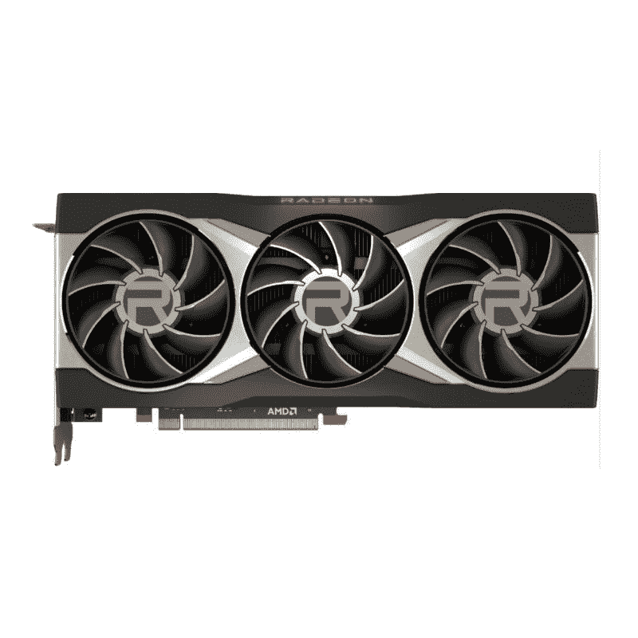
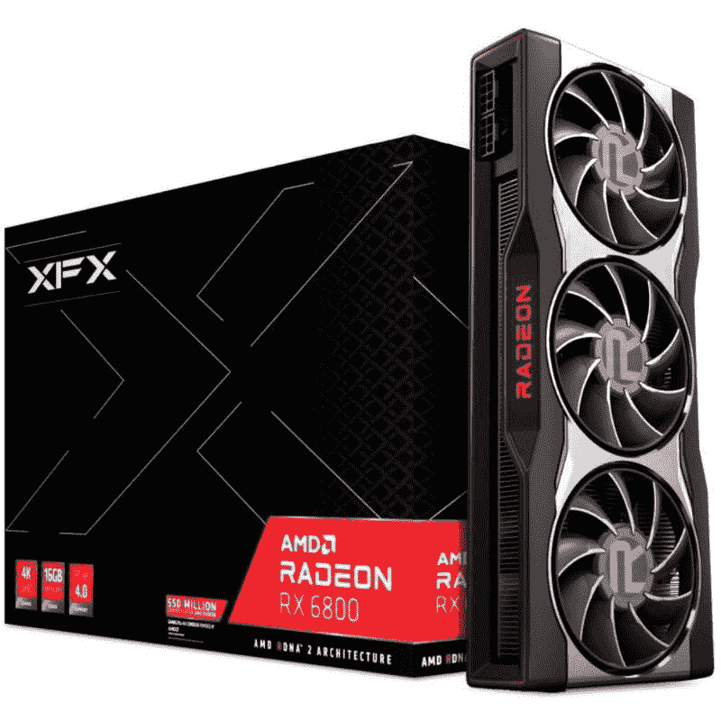
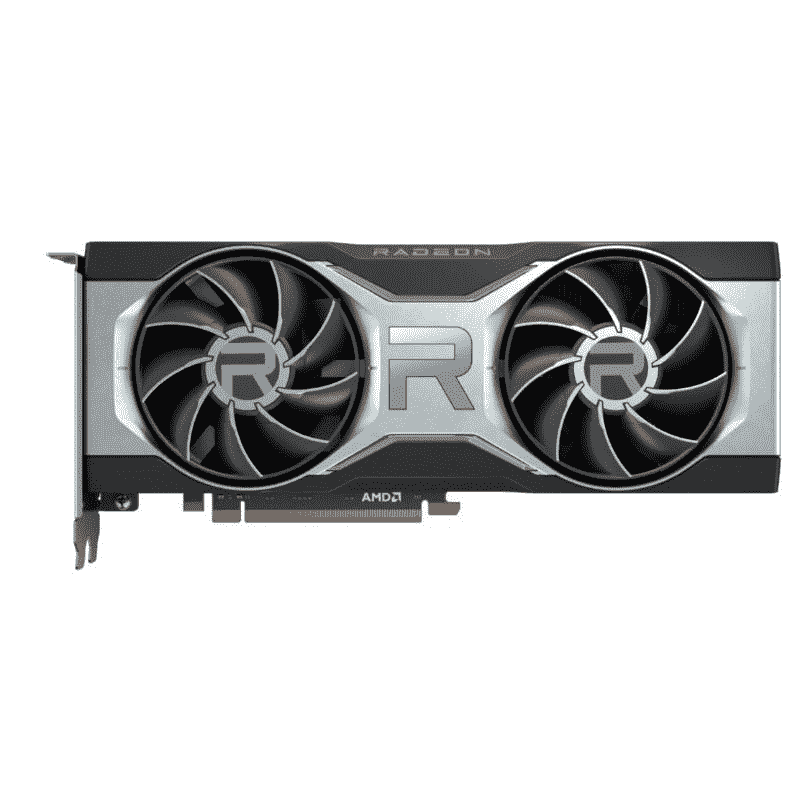
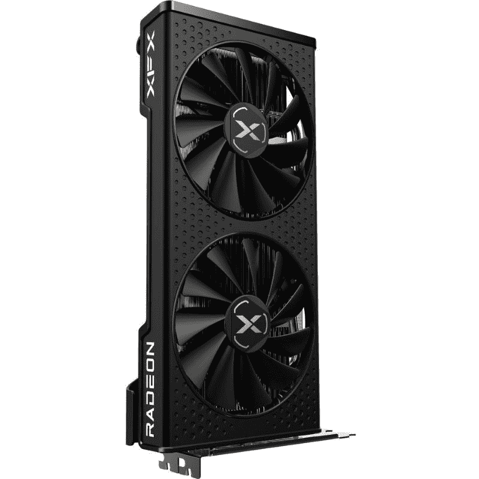
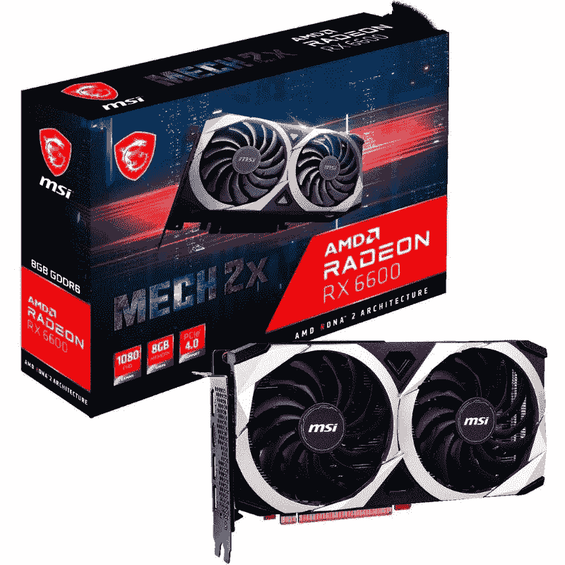
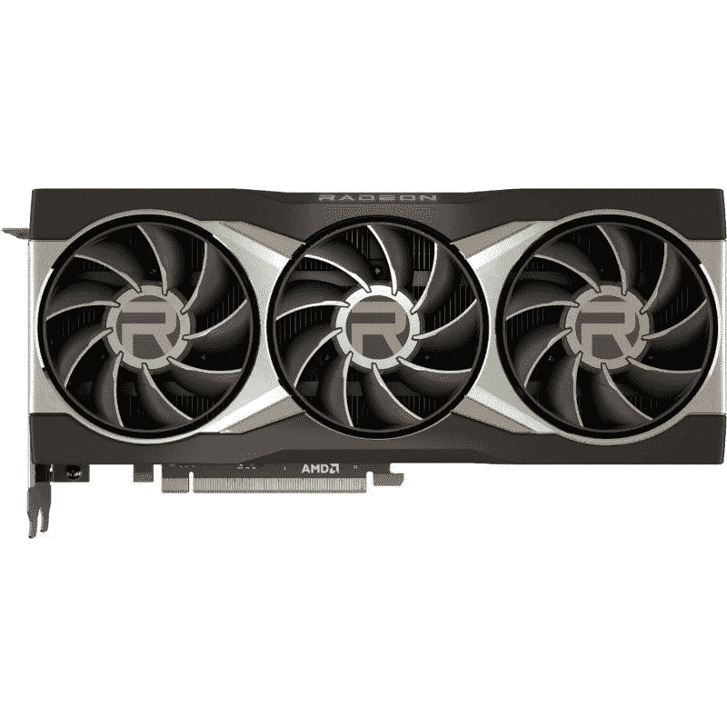
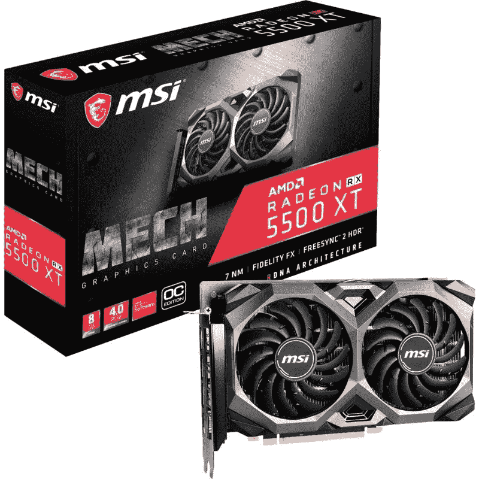

# 这些是 2021 年你能买到的最好的 AMD 显卡

> 原文：<https://www.xda-developers.com/best-amd-graphics-card/>

AMD 凭借其锐龙处理器在通勤领域掀起了巨大的波澜。尽管英特尔新的第 12 代 Alder Lake CPUs 提供了令人印象深刻的性能，但我们仍然认为锐龙处理器将留在我们的最佳 CPU 名单中。AMD 的显卡也是如此。尽管 Nvidia 的 GeForce RTX 系列 GPU 更受欢迎，并且在我们的[最佳显卡](https://www.xda-developers.com/these-are-the-best-graphics-cards-you-can-buy-nvidia-geforce-rtx-3080-amd-radeon-rx-6800-xt-and-more/)列表中占据了大多数席位，但 AMD 在市场上也有一些非常强大和可靠的显卡。在这篇文章中，我们将看看 2021 年你能买到的最好的 AMD 显卡。

就像我们所有的系列一样，这也是一个不断发展的列表，我们将列出目前最好的 AMD 显卡，供您选择符合您要求的显卡。我们在这个集合中提到了 AMD 的股票参考卡，但根据你的预算和 GPU 的可用性，你可能需要从一个原始设备制造商那里寻找合作伙伴卡。也就是说，这个列表应该帮助你了解市场上 AMD 显卡的现状，我们还会根据你的需求为你指出应该购买的显卡。所以，不要再浪费时间了，让我们从这个列表开始吧:

**浏览这篇文章:**

## 最佳 AMD 显卡:AMD 镭龙 RX 6800XT

AMD 新推出的 6000 系列 GPU 可谓恰逢其时。他们来这里是为了动摇 Nvidia 在不同价格区间的显卡市场上的据点。AMD 的新 Big Navi aka RDNA2 提供了一些令人印象深刻的性能增益。它加入了光线跟踪的战斗，无论是其 PC 桌面显卡还是下一代游戏机。在更多的原始设备制造商加入并开始用定制散热器搅动我们的卡之前，AMD 还有很长的路要走，但即使是参考卡也有很大的潜力来对抗 Nvidia 的顶级 GPU。

AMD 公司的镭龙 RX 6800 XT 建立在以前的卡，如镭龙七，当谈到设计。我们正在为 RX 6800 XT 寻找熟悉的工业设计和美学。然而，它配备了更好的散热器，有助于应对更高的 TDP 值。RX 6800 XT 采用三风扇设计，配有三个 77 毫米风扇。在 AMD 的典型时尚中，还有一个红色的镭龙标志。RX 6800 XT 配备了两个 8 针 PEG 连接器和背面的一系列端口，包括两个 DisplayPort 输出，一个 HDMI 2.1 连接器和一个 USB Type-C 端口。HDMI 2.1 端口是一个很好的补充，因为它允许您连接支持的电视和其他显示器，以达到更高的帧速率。

请注意，镭龙 RX 6800 XT 位于镭龙 GPU 产品堆栈的顶部，就在更高性能的 RX 6900 XT 之下。因此，在经过优化的环境中搭配高性能 CPU，对于 4K 游戏来说是一件好事。在 4K，英伟达的 RTX 3080 仅领先 RX 6800 XT 几个百分点，这意味着它们都同样擅长在高分辨率下提供可玩的帧速率。事实上，AMD 的 RX 6800 XT 在许多情况下都比 RTX 3080 表现得更好，比如《红色死亡救赎 2》、《地铁出埃及记》等等。

在 1440 便士和 1080 便士，两张卡都有效地捆绑在一起，这意味着 RX 6800 XT 是 RTX 3080 的绝佳替代品。也就是说，很难在库存中找到两张卡，所以祝你好运。你也可以超频 RX 6800 XT，以获得更多的 GPU 性能，但这里没有什么实质性的东西。超频能力在很大程度上也取决于合作伙伴卡的散热器，因此您的里程数可能会有所不同。不过，就光线追踪性能而言，RX 6800 XT 并不是最好的。英伟达的 RT 技术仍然比 AMD 提供的要好。这也是因为英伟达的 DLSS 2.0 大幅提升了帧速率。相比之下，AMD 的 FidelityFX 超分辨率无法实现，但我们将看到 AMD 卡在未来是否会发生变化。

总的来说，我们认为 AMD 镭龙 RX 6800 XT 是一款可靠的显卡，值得考虑作为 Nvidia GeForce RTX 3080 的替代产品。当然，当谈到整体游戏性能时，两种 GPU 都一样好，但 AMD 还有更多工作要做，特别是在光线跟踪部门，以取代 Nvidia。但不可否认的是，RX 6800 XT 是一个非常棒的卡，应该是大多数人应该购买 6900XT 的卡。

 <picture></picture> 

AMD Radeon RX 6800 XT

##### AMD 镭龙 RX 6800 XT

RX 6800 XT 是 6000 中最好的显卡。除了时钟速度稍低之外，它与 RX 6900 XT 完全相同。

## 第二好的 AMD 显卡:AMD 镭龙 RX 6800

AMD 镭龙 RX 6800 是 AMD 显卡产品线的坚实入口。它是 Nvidia 高性能 GPU 的可行替代方案。因此，它是我们在市场上可以买到的第二好的 AMD GPU，仅次于镭龙 RX 6800 XT。RX 6800 提供可靠的 4K 游戏性能和 1440p 的体面光线跟踪性能。这些都是老的图形处理器，如镭龙七，镭龙 RX 5700 XT 等。AMD 无法真正实现。镭龙 RX 6800 在许多方面都可以轻松超越 RTX 3070。

AMD 镭龙 RX 6800 基于与其他 6000 系列卡相同的 RDNA2 图形架构。它也是驱动 PS5 和 Xbox 系列 X 游戏机的 GPU 背后的相同技术。RX 6800 使用 Infinity 高速缓存，这实际上是 GPU 的全局高速缓存，可提高视频内存(VRAM)的带宽。这使得 256 位内存总线上的 GDDR6 视频内存比 GDDR6X 更高效。每瓦特内存带宽更大总是一个优势，RX 6800 也是如此。

AMD 镭龙 RX 6800 还配备了光线跟踪加速器，这意味着它应该能够处理各种支持的游戏的 RT。虽然 RX 6800 确实能够提供可靠的光线跟踪性能，但它只有 1440p。4K 的光线跟踪仍然是 RX 6800 努力解决的问题，我们认为英伟达 GPU 在这一领域仍然占据上风，这要归功于 DLSS 理工大学。镭龙 RX 6800 XT 比 4K 的 RX 6800 好一点点，但 AMD 在光线跟踪部门获得任何有意义的优势之前，还有很长的路要走。

AMD 镭龙 RX 6800 也有总共 3840 个流处理器。我们正在寻找一个 1,815Mhz 的游戏时钟和一个高达 2,105Mhz 的升压时钟。也就是说，众所周知，RX 6800 可以实现高于公司指定值的升压时钟。你也可以超频卡，以达到更高的频率，但你的里程数可能会有所不同，取决于 GPU 的散热器。参考卡似乎对超频反应良好，所以我们认为只有配有复杂散热器的合作伙伴卡才会更好。

RX 6800 具有与我们在该公司的其他高性能 6000 系列卡中看到的相同的三风扇设计。AMD 已经放弃了困扰 RX 5700 XT 和 RX 5700 的旧参考设计的鼓风机。这不仅使新的 GPU 更酷，而且在负载下也更安静。对于输出，你会看到两个显示端口，一个 HDMI 2.1 和一个 USB-C。

总的来说，我们认为 RX 6800 对于那些正在寻找 RTX 3070 替代品的人来说是一款出色的 GPU。它也与 RTX 3080 针锋相对，类似于 RX 6800 XT，但我们认为 AMD 在与英伟达的阵容真正竞争之前还有很长的路要走，特别是在光线跟踪部门。也就是说，RX 6800 是一个没有光线跟踪的可靠的 4K 游戏体验的伟大卡。如果你喜欢 RT 功能，那么你可能想坚持使用略低的分辨率，如 1440p。

 <picture></picture> 

AMD Radeon RX 6800 GPU

##### AMD 镭龙 RX 6800

AMD 镭龙 RX 6800 是英伟达 RTX 3070 甚至 RTX 3080 等高性能 GPU 的一个很好的替代选择，如果你不一定关心 4K 分辨率的光线跟踪。

## 1440p 游戏最佳 AMD 显卡:AMD 镭龙 RX 6700 XT

AMD 镭龙 RX 6700 XT 是一款独特的卡，我们预计很多人会购买它，主要是因为它的 1440p 游戏能力。它带来了 AMD 更小的 Navi 22 GPU，不一定会删除 Big Navi 和 RDNA2 的任何功能。它具有完整的 DirectX 光线跟踪(DXR)支持，甚至实现了完整的 DirectX 12 终极功能列表。这包括可变速率着色(VRS)、网格着色器、采样器反馈等。AMD 只是缩小了芯片尺寸，以减少着色器核心、内存控制器和无限高速缓存的数量。

与 Navi 21 相比，Navi 22 GPU 配备了更少的 Cu 和着色器核心。在 Navi 21 GPUs 上，infinity 缓存现在以 96MB 而不是 128MB 的速度签入。AMD 通过提供额定为 2，424Mhz 的最高官方 GPU 核心时钟来补偿这些大幅降低。就像其他 RDNA2 GPUs 一样，这款 GPU 也可以提升至 2，581Mhz 或更高，具体取决于负载和散热器。AMD 不得不提高 GPU 的功率限制，因此 RX 6700 XT 的额定功率为 230W。这并不坏，但绝对超过任何一个基于 RDNA2 的 GPU。

在物理上，RX 6700 XT 与 RX 6800 完全相同。然而，它更轻，无论是在单位的实际重量方面，还是在你的口袋里。RX 6700 XT 使用双风扇，而不是 RX 6800 和更高版本上看到的三风扇布局。但是风扇的尺寸更大，所以技术上应该足以处理热量输出。

在性能方面，嗯，RX 6700 XT 基本上是 RTX 3060 Ti GPU 的对手，没有 DLSS 理工大学。这意味着，光线追踪的性能也不会稍有减弱，但这是我们现在已经与几乎所有 AMD GPUs 达成的协议，至少在这一代。我们预计 AMD 将赶上下一代产品，希望有一个改进的 FidelityFX 技术。RX 6700 XT 也接近 RTX 3070 GPU 的性能，尽管你肯定会看到这种 GPU 只有在支持的 AMD 游戏上才有更好的性能，如《刺客信条:瓦尔哈拉》、《边境 3》、《污垢 5》等。当你着眼于整体性能，尤其是光线跟踪时，RTX 3070 仍然是一个更好的卡。

毫无疑问，RX 6700 XT 是一款价格非常合理的出色显卡。它对于 1440p 游戏非常可靠，这就是为什么我们选择它作为 AMD 当前产品系列中最好的 1440p 卡。如果不是因为光线跟踪性能较弱，我们认为它甚至有可能与 RTX 3070 相抗衡。虽然两者都是很棒的 GPU，但为了流畅的 1440p 游戏体验，你不可能用它们中的任何一个出错。不言而喻，它确实也是一款 1080p 游戏的固体卡，但我们认为 RX 6600 XT 足以以低得多的价格处理这一问题。

 <picture></picture> 

AMD Radeon RX 6700 XT

##### AMD 镭龙 RX 6700 XT

AMD RX 6700 XT 拥有我们在 GPU 上见过的最高时钟速度。然而，这是对 AMD 为此 GPU 削减的其他方面的补偿。

## 1080p 游戏最佳 AMD 显卡:AMD 镭龙 RX 6600 XT

AMD 的 6000 系列 GPU 不仅包括高性能卡，以对抗 Nvidia 的积极产品。6000 系列产品还包括功能稍弱的显卡，如镭龙 RX 6600 XT，面向寻求 1080p GPU 的游戏玩家。新的 RX 6600 XT，如果不是很明显的话，位于 RX 6700 XT 的下面。它实际上是基于 RDNA2 架构的 6000 系列 GPU 中的第五张卡。这款特殊的显卡配有 8GB gddr 6 内存和 32 个计算单元，峰值单精度计算性能为 10.6 万亿次。

RX 6700 XT 的规格表令人印象深刻。它为 1080p 游戏玩家带来了巨大的价值，而不会在他们的口袋里烧出一个巨大的洞。尽管 RX 6600 XT 比 NVIDIA 的 GeForce RTX 3060 晚了整整六个月，但我们认为该公司在将其定位为稳定的表现者方面做得非常好。据 AMD 称，RX 6600 XT 是 1080p 游戏的 GPU 竞争对手，明显优于其主要竞争对手 RTX 3060。

RX 6600 XT 是我们认为很多人最终会购买的产品，仅次于功能更强大的 RX 6700 XT。1080p 游戏仍然是许多游戏玩家的主要选择，RX 6600 XT 在这种分辨率下足以推动最苛刻的游戏。RX 6600 XT 的游戏时钟为 2,359Mhz，额定功耗为 160W。这大大低于 RX 6700 XT 的额定功耗 230W。RX 6700 XT 显然是一款性能更好的卡，能够玩 1440p 游戏，但功耗差异很大，这也将导致相对较低的热输出和高效率。

就设计差异而言，参考 RX 6600 XT GPU 采用单风扇设计，而不是我们在 RX 6700 XT 和 RX 6800 XT 等 GPU 中看到的双风扇甚至三风扇设计。考虑到它的功耗比其他 GPU 低得多，这并不是一个大问题。然而，来自原始设备制造商的合作伙伴卡将具有带双风扇的复杂散热器，等等。这些通常都超过了游戏的额定时钟速度，所以你可能想在买之前检查一下规格表。

RX 6600 XT 配备了 8GB 的 GDDR6 视频内存和 32MB 的无限高速缓存。这些数字，尽管与其他 6000 系列 GPU 相比听起来很弱，但足以在最大设置下推动大多数 AAA 游戏。AMD 表示，你将能够在一系列现代 AAA 游戏中获得平均 125FPS 的速度。如果你想多省一点钱，你也可以选择 RX 6600。或者，如果你想要更好的 1080p 甚至 1440p 游戏体验，你也可以升级到 RX 6700 XT。

 <picture></picture> 

AMD Radeon RX 6600 XT GPU

##### AMD 镭龙 RX 6600 XT

AMD 镭龙 RX 6600 XT 对于那些希望以 1080p 分辨率玩游戏的人来说是一款出色的 GPU。它没有 RX 6700 XT 那么强大，但对于中档车型来说，它已经完成了任务。

## 第二好的 1080p 游戏用 AMD 显卡:AMD 镭龙 RX 6600

AMD 最近更新了其 6000 系列产品，为 1080p 游戏玩家提供了新的 GPU，即[镭龙 RX 6600](https://www.xda-developers.com/amd-launches-radeon-rx-6600-gpu-1080p-gaming/) 。在典型的 AMD 的时尚中，RX 6600 位于 RX 6600 XT 之下，作为 1080p 游戏玩家的一个可行的替代选择，希望推出一个预算游戏版本。AMD 表示，这种特殊的 GPU 可以提供可靠的高帧率 1080p 游戏体验。更具体地说，AMD 表示，GPU 能够在许多 AAA 游戏上产生超过 100FPS 的速度，包括在超高设置下的 Assasins Creed Valhalla。它最好与锐龙 5 5600X CPU 配对，因此您的里程数可能会根据您的整体配置而有所不同。

AMD 还表示，RX 6600 的性能功耗比是 Nvidia 的 GeForce RTX 3060 的 1.3 倍。因此，这是 RTX 3060 GPU 的一个非常可靠的替代产品，对于 1080p 游戏玩家来说，这也是一个非常棒的显卡。RX 6600 GPU 支持 AMD 的最新技术，包括智能访问内存和 FidelityFX 超分辨率(FSR)。智能访问内存，如果你不知道，加速系统访问 GPU 的内存缓冲区。另一方面，FidelityFX 超级分辨率是 AMD 对 Nvidia DLSS 技术的回应，尽管没有那么令人印象深刻。然而，与 DLSS 理工大学不同的是，FidelityFX Super Resolution 最棒的地方是一个开源工具包，开发者可以更容易地在他们的游戏中采用。也就是说，只有少数游戏支持这项技术，我们希望随着时间的推移，随着更多游戏的出现，情况会越来越好。

AMD 镭龙 RX 6600 配有 28 个计算单元，略少于 RX 6600 XT 上的 32 个计算单元。RX 6600 的时钟频率也较低，约为 2，044Mhz。然而，新的 GPU 保留了 32M 无限高速缓存和 8GB 的 GDDR6 内存。8GB 的 GDDR6 显存仍然足以以 1080p 运行游戏，尽管如果你想以最大图形设置推动现代游戏，你可能需要更好的显卡和更多的 VRAM。我们建议升级到 RX 6700 XT，以获得更好的整体性能，但它会让你花费更多，而且在库存中也很难找到。

关于 RX 6600 需要注意的一点是，它只能从合作伙伴 OEM 那里获得，因为 AMD 不会出售它的 GPU 版本。参考卡只有一个风扇设计，但可以从制造商如 ASRock，ASUS，Gigabyte 等处获得。根据配置为他们的卡设计不同的图案。在正常情况下，你应该可以从 329 美元起买到这些卡，但现在市场上它们很贵，就像其他 GPU 一样。我们不希望 AMD 推出 RX 6600，因为其现有的 GPU 库存不足，但现在我们有另一个为游戏玩家提供的 1080p GPU，这很难实现。

 <picture></picture> 

AMD Radeon RX 6600 GPU

##### AMD 镭龙 RX 6600

AMD 镭龙 RX 6600 是另一款面向 1080p 游戏玩家的 GPU，他们希望打造一款适合游戏的经济型电脑。它不如 RX 6600 XT 强大，但它们都提供了坚实可靠的 1080p 游戏体验。

## 最佳发烧友级 AMD 显卡:AMD 镭龙 RX 6900 XT

AMD 的镭龙 RX 6900 XT 代表了该公司的 RDNA2 所能提供的最佳产品。它是 AMD 的终极高端发烧级显卡，与 Nvidia 的 RTX 3090 GPU 并驾齐驱。然而，RX 6900 XT 对大多数用户来说绝对是大材小用。我们认为 RX 6800 XT 是你应该购买的，这就是为什么我们选择了另一种卡作为你能买到的最好的 AMD 显卡。另一方面，RX 6900 XT 是一种如果你追求尖端技术就会购买的卡，而不是最物有所值的卡。

镭龙 RX 6900 XT 配备了与 RX 6800 和 RX 6800 XT 相同的 Navi 21 GPU。6900XT 配有 80 个 CU，总共有 5，120 个流处理器。这比 RX 6800 XT 增加了 11%。嗯，这也带来了大约 250 美元的价格上涨，因为在正常情况下，RX 6900 XT 的价格为 999 美元。这个特殊的 GPU 能够在负载下突破 2Ghz 的核心时钟，这至少令人印象深刻。

AMD 镭龙 RX 6900 XT 更令人印象深刻的是，尽管规格明显提高，但它仍设法保持低功耗。AMD 正在使用宁滨工艺来确保这些是 TSMC 7 纳米工艺中最好的芯片。RX 6900 XT GPU 也有最低 VRM 功率传输要求，参考卡提供 16 相 VRM 功率传输。这必然会根据合作伙伴的卡片而改变，尽管你可以预期不同的变体会有相似的行为。

RX 6900 XT 还配备了 16GB 的 GDDR6 VRAM，由 256 位内存总线供电。此外，RX 6900 XT 还利用 128MB Infinity 高速缓存功能，全面提供一些令人惊叹的结果。与普遍的看法相反，Infinity Cache 在较低分辨率下也很有效，所以无论像素是多少，你都一定会看到改进。也就是说，你不太可能拿起 RX 6900 XT 来玩 1080p 游戏。它的功能远不止这些，如果你只需要 1080p 游戏，你可以轻松地用其他 AMD 卡节省一大笔钱。

AMD 镭龙 RX 6900 XT 提供了令人印象深刻的全面性能，即使在 4K 分辨率。显然，1440p 和 1080p 游戏也毫不逊色。也就是说，类似价格范围/类别的 Nvidia GPUs 提供了更好的整体性能，特别是当你考虑光线跟踪之类的事情时。但是，如果你执意购买 AMD 在 GPU 领域提供的最佳产品，那么 RX 6900 XT 就是你要去的。它向我们展示了 AMD 的 RDNA2 能够提供什么，我们迫不及待地想看看该公司在幕后为下一代桌面游戏做些什么。

 <picture></picture> 

AMD Radeon RX 6900 XT

##### AMD 镭龙 RX 6800 XT

AMD 镭龙 RX 6900 XT 代表了 AMD 的 RDNA2 架构所能提供的最佳性能。它与英伟达的 RTX 3090 GPU 针锋相对，可以轻松处理 4K 游戏。

## 最佳预算 AMD 显卡:AMD 镭龙 RX 5500 XT

AMD 镭龙 RX 5500 XT 可能不是市场上最新的镭龙 GPU 之一，但对于预算有限的游戏玩家来说，它仍然是一张神奇的卡。经济型购物者可以依靠这种特殊的 GPU 获得经济型游戏体验，而无需投入大量资金。这不是你能为 1080p 游戏获得的最强大的 GPU，但它足以以可玩的帧速率运行许多游戏。它基于与 RX 5700 和 RX 5700 XT GPUs 相同的 RDNA 架构，但是，性能有所调整，以反映价格标签。

镭龙 RX 5500 XT 拥有超过 22 个计算单元的 1，408 个流处理器，原始计算性能可达到 5.2 万亿次浮点运算。与 RX 5700 GPU 中的 2，304 个流处理器相比，这是一个显著的削减。镭龙 RX 5500 XT 有两种型号，一种是 4GB 的 VRAM，另一种是 8GB 的 VRAM。两者之间唯一的区别似乎是内存容量，这意味着它们在原始性能方面应该是相同的。4GB VRAM 在这个 GPU 问世时已经足够了，但我们建议在 2021 年购买 8GB 版本的 GPU。

RX 5500 XT 提供可靠的 1080p 游戏性能，但它不会推动任何超出该分辨率的东西。你将不得不升级到 RX 6600 XT 甚至 RX 6700 XT 来玩更高分辨率的游戏。一些 AMD 优化的游戏会以更高的分辨率为你提供更好的画面，但它仍然不会像其他卡一样一致。RX 5500 XT 在大多数游戏中的性能与 GTX 1660 相同，包括较新的游戏。您的性能可能会因您最终选择的合作伙伴卡而异，但您应该可以使用镭龙 RX 5500 XT GPU 进行 1080p 游戏。

我们喜欢这款 GPU 的一点是，它现在与 GTX 1660 GPU 不相上下，价格也更低。它没有打破这个类别的任何记录，但它肯定会为您的构建的其他核心组件节省一些钱，前提是您现在设法找到 GPU 的库存和零售价格。倾向于电子竞技游戏的游戏玩家也会发现这个 GPU 的很多价值，因为像 CS:GO，Valorant，Dota 2，英雄联盟等游戏。将在这个特殊的显卡上完美运行。不过，我们建议选择 8GB 版本的 RX 5500 XT，因为配备 4GB VRAM 的版本可能会成为 2021 年运行一些新游戏的瓶颈。

总的来说，AMD 公司镭龙 RX 5500 XT 是一个容易卡推荐的预算空间。我们建议将其与锐龙 5 3600 甚至锐龙 5 5600X 等廉价 CPU 配对，以获得良好的游戏体验。你可能想点击下面的链接，现在就在网上找到最好的价格。

 <picture></picture> 

AMD Radeon RX 5500 XT GPU

##### AMD 镭龙 RX 5500 XT

AMD 镭龙 RX 5500 XT 是经济型购物者最实惠的 GPU 之一，他们希望获得最佳的 1080p 游戏体验。

## 入门级游戏的最佳 AMD 解决方案:AMD 锐龙 5 5600G

 <picture></picture> 

AMD Ryzen 5 5600G Processor

你可能会奇怪，为什么在涉及最好的 AMD 显卡的集合中会有 CPU？这是因为锐龙 5 5600G 是一个 APU，这意味着它配备了一个集成的 GPU，足以满足入门级游戏体验。我们可以很容易地推荐一款较旧的入门级 AMD GPU，如镭龙 RX 560 或 RX 570，作为目前价格合理的入门级选择，但我们认为锐龙 5 5600G 在 2021 年为游戏提供了更好的性能。当谈到游戏时，它可能不是最好的，但对于那些刚刚开始玩 PC 游戏的人来说，它仍然绰绰有余。

AMD 锐龙 5 5600G 拥有 6 个内核和 12 个线程，它是 AMD 首款用于台式机的 7 纳米 APU 的一部分。锐龙 5 5600G 的基本时钟为 3.7GHz，三级高速缓存为 16MB。它还有 7 个工作在 1.9GHz 的镭龙 RX Vega CUs。不过 APU 依赖于共享内存带宽，所以你需要一个高质量的内存模块来运行这些 APU。这真的不应该是一个问题，因为你会为你的电脑购买一个好的内存套件。

AMD 锐龙 5 5600G 无疑是目前市场上你能买到的最好的 APU 之一。它甚至能够运行 2021 年的新游戏，尽管当谈到整体图形保真度时，你可能希望保持你的期望。我们认为入门级游戏玩家会发现像这样的 APU 比旧的独立 GPU 有很多价值。更不用说，当你等待显卡市场稍微稳定下来的时候，你也可以使用这样的 APU。现在市场上几乎所有的 GPU 都在追求虚高的价格。我们不建议为任何 GPU 支付额外费用，不管它实际上有多强大。如果你不是一个铁杆玩家，最好满足于这样的 APU，等待价格再次下降。

英特尔也有许多可靠的集成显卡 CPU，但我们认为锐龙 APU 在性能方面总体更好。事实上，你甚至可以运行一些现代游戏，而没有任何重大问题，这是相当令人印象深刻的。请记住，您还需要一个带有某种视频输出端口的主板来使用这些 APU，因为您的 PC 不会有带有这些专用端口的 GPU。

您还可以升级到 AMD 锐龙 7 5700G，以获得更好的整体游戏体验。一旦价格稳定下来，如果你打算购买高端 GPU，5700G 将被证明是有用的。如果你想购买市场上的一些高性能 GPU，锐龙 5 5600G 可能会成为一个瓶颈。也就是说，对于入门级休闲游戏来说，这两款芯片都不会出错。这是一个很好的权宜芯片，直到事情回到他们在 GPU 领域的方式。

 <picture></picture> 

AMD Ryzen 5 5600G Processor

##### AMD 锐龙 5 5600G

AMD 锐龙 5 5600G 是一个伟大的 APU，对于那些目前正在努力购买市场上的 GPU。

## 2021 年最佳 AMD 显卡:最终想法

可以肯定地说，AMD 在市场上也有一系列与 Nvidia 产品一样好的 GPU。我们认为 AMD 镭龙 RX 6800 XT 对于那些关注 4K 分辨率网络游戏性能的人来说是一款出色的 GPU。RX 6800 也是一个很好的选择，但我们认为 RX 6700 XT 也足以提供令人愉快的 1440p 游戏体验。然而，那些倾向于 1080p 游戏的人应该只看 AMD 镭龙 RX 6600 XT。我们还为刚刚开始玩休闲游戏的游戏玩家添加了 AMD APU。

如果你正在[建造一台新的个人电脑](https://www.xda-developers.com/how-to-build-a-computer-beginners/)，那么你可能想看看我们收集的[最好的主板](https://www.xda-developers.com/best-motherboard/)，以找到目前市场上的一些最佳选择。我们已经为基于 AMD 和 Intel 的版本提供了一些很好的选择。我们还有一系列其他不断发展的 PC 硬件收藏，包括最佳 CPU 散热器、[新 LGA 1700 插座最佳 CPU 散热器](https://www.xda-developers.com/cpu-coolers-socket-lga-1700/)、[最佳 PC 机箱](https://www.xda-developers.com/best-pc-cases/)等等。我们还鼓励您加入我们的 [XDA 计算论坛](https://forum.xda-developers.com/c/xda-computing.12289/)，从我们的专家社区获得更多产品推荐。