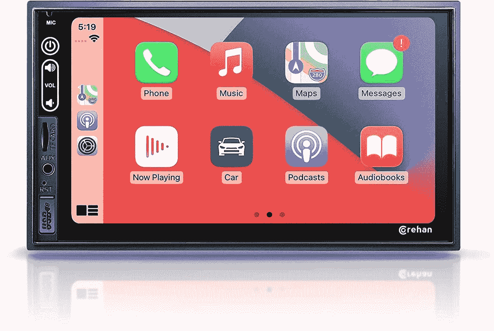
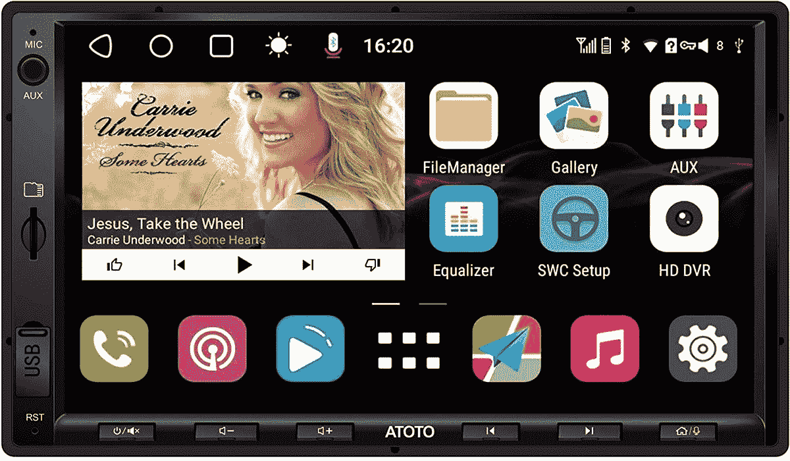

# 2023 年最佳售后安卓汽车主机

> 原文：<https://www.xda-developers.com/best-android-auto-head-units/>

# 2023 年最佳售后安卓汽车主机

这里有一些适用于不同尺寸、价位和使用场合的最好的安卓汽车车头部件。

Android Auto 是任何车辆的一个很好的补充，因为它允许你快速浏览谷歌地图，免提控制音乐，打电话，听有声读物，以及依靠你的 Android 智能手机进行更多的操作。大多数新车都预装了某种版本的 Android Auto，但也有很多老款车没有谷歌的信息娱乐系统。如果你想改变这一点，你很幸运。有一个完整的第三方主机市场，你可以安装(或让你信任的人摆弄汽车安装)给你 Android Auto access，所有这些都不会迫使你出去买一辆新车。有些比其他的更贵，但这取决于你想要多大的屏幕，你是想把它放在你的仪表板里面还是浮在外面，以及你是否更看重一个光滑的设计而不是更普通的东西。这里有一些你能买到的最好的安卓自动主机。

基于单 DIN 或双 DIN 配置有不同类型的机头单元。如果你不确定你的车支持哪一种，在购买 Android Auto 系统之前，参考它的手册或做一些研究。

*   ##### 先锋 AVH-W2500NEX 汽车立体声接收机

    编辑推荐

    这款先锋的双 DIN 头单元拥有高品质的 6.8 英寸显示屏和 SiriusXM 和 Alexa 等额外功能，是市场上最好的产品之一，也是大多数人的绝佳选择。

*   <picture></picture>

    科瑞汉 7 英寸触屏车载音响

    ##### 科瑞汉 7 英寸触屏车载音响

    最超值

    这款 7 英寸触屏双 DIN 接收器如果预算紧张，是个不错的选择。它的售价略高于 100 美元，配有 USB、microSD 插槽和用于插入设备的 AUX 端口。

*   ##### Alpine iLX-F411 1-DIN 11“Halo Mech-Less Digital Media Receiver

    Premium Pick

    这款主机相当昂贵，但这款来自 Alpine 的单一 DIN 接收器拥有一个巨大的 11 英寸显示屏，非常适合那些希望在控制台中获得更多屏幕空间的人。

*   ##### JVC KW-M56BT Android Auto in-dash unit

    JVC 的双 DIN in-dash Android 音响主机是那些没有大量空间的人的完美选择。6.8 英寸的显示屏让一切保持清晰，甚至还有一个额外的 USB 端口来给你的手机充电。

*   ##### Boss 8 英寸 BCPA8RC Android Auto 车载音响系统

    Boss 的这款 8 英寸音响系统采用单一 DIN 设计，底部有圆滑的触摸控制，当你的电话响起时可以按下通话，支持后视摄像头等等。

    T33
*   ##### 阿托托 F7 XE 10.1 英寸双 DIN 仪表板导航系统

    10.1 英寸 720p QLED 显示屏，时尚的双 Din 设计，以及对实时后视和 SiriusXM 等功能的支持，使阿托托托的这款选装配置成为您车辆的一大亮点。

*   <picture></picture>

    Atoto S8 Gen 2 7 英寸车载音响

    ##### Atoto S8 Gen 2 7 英寸车载音响

    Atoto 的双 DIN S8 Gen 2 上的 7 英寸显示屏是实心的，它支持备份摄像头、速度补偿音量控制、蓝牙上的双设备支持以及分屏等功能。

*   ##### 双电子 7 英寸媒体接收器

    如果您正在寻找一款经济实惠的 Android 汽车立体声系统，并且可以在显示分辨率上做出妥协，这款来自双电子的双 DIN 选项是您的不二之选。它的分辨率为 1024 x 600，屏幕为 7 英寸。

    T34

无论你有多大的仪表板，或者你在寻找什么样的功能，几乎每个司机都有一个 Android Auto head 单元。无论你是想要一个巨大的屏幕来显示你的仪表板，还是在你没有足够空间的时候想要一个小屏幕，或者想要所有你想要的功能，总有一个选项适合你。先锋 AVH-2500NEX 是一款出色的全能主机，而 JVC KW-M56BT 则非常适合小型车用户。请注意，Android Auto 单元可能会很贵——有些高达 1000 美元——但有更多更实惠的选择，接近 100 美元。