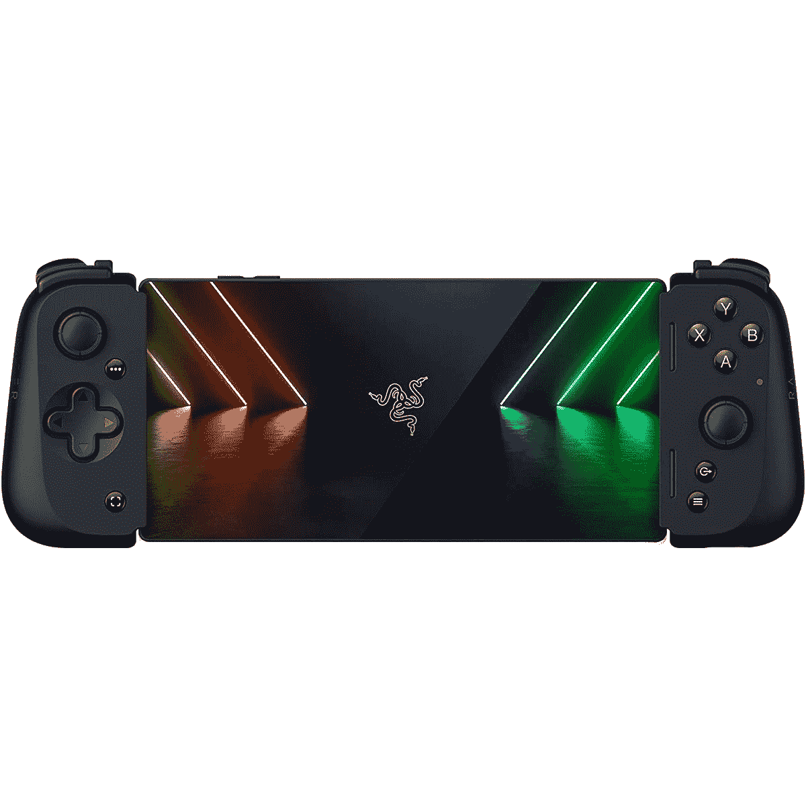
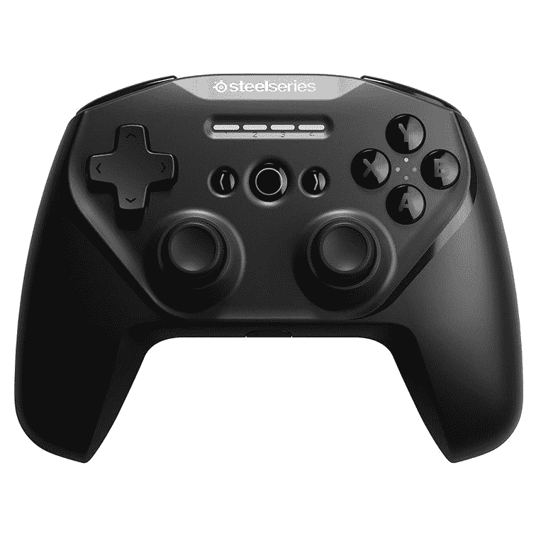
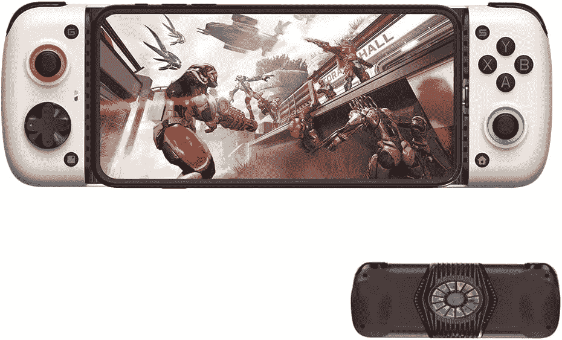
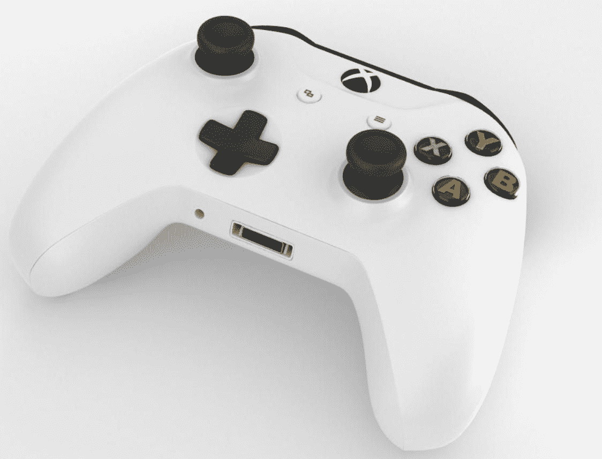
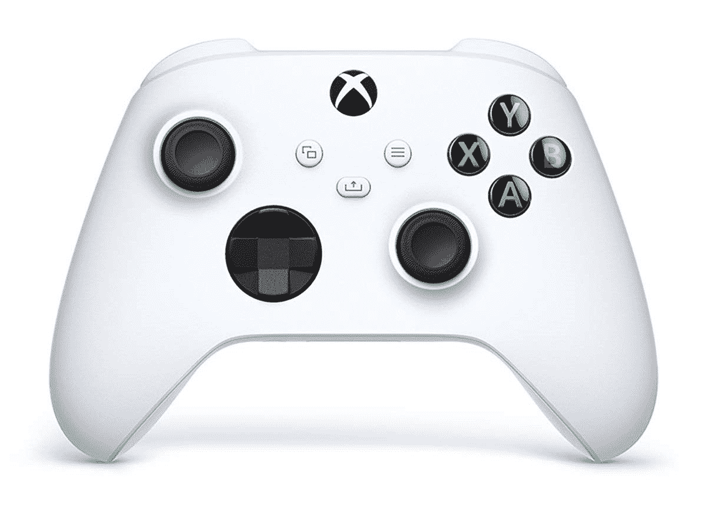
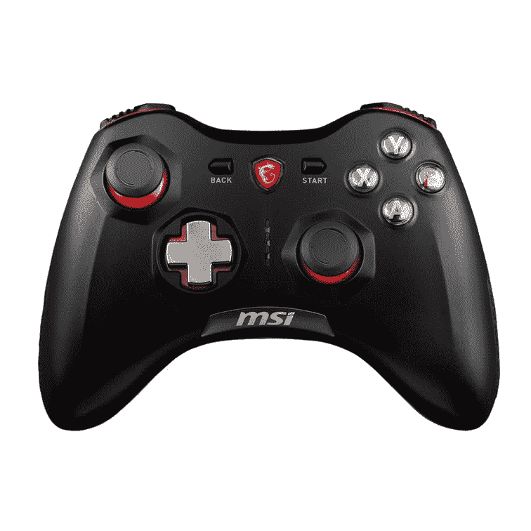

# 2023 年安卓最佳游戏手柄

> 原文：<https://www.xda-developers.com/best-android-game-controllers/>

Android 已经发展成为一个平台，在这里你可以玩游戏，而不仅仅是糖果粉碎游戏。我们说的是第一人称射击游戏(FPS)和快节奏游戏，如*使命召唤:移动版、 [PUBG 移动版](https://www.xda-developers.com/pubg-mobile-tips-tricks/)* 和 [*Apex 传奇移动版*](https://www.xda-developers.com/apex-legends-mobile-live-ios-android/) ，这些游戏现在都可以在你的智能手机上玩。还有整个仿真世界，允许用户从旧的游戏机上玩游戏。你总是可以使用触摸控制和手势来玩这些游戏，但我们强烈建议为你的手机购买一个好的游戏控制器。如果你用的是安卓手机，并且不知道该买哪个控制器，那么你来对地方了。我们已经设法为你的 Android 智能手机收集了一份最佳游戏控制器的清单。让我们开始吧！

## 最佳综合:雷蛇岸信介 v2

Razer Kishi v2 是安卓手机的最佳控制器。它适用于各种智能手机，并且非常容易设置和开始游戏。就像最初的 Razer Kishi 一样，v2 型号配备了两个独立的左右控制器，挂在你的手机两侧，让你像使用任天堂 Switch 一样使用智能手机。它还通过 USB-C 连接到你的智能手机，这意味着与常规蓝牙控制器相比，延迟应该会大大减少。这个控制器上的按钮布局与你在任天堂 Switch 游戏机上看到的相似，使用起来也非常舒适。

但购买这款控制器有一些注意事项，包括其相对较高的 99 美元价格和缺乏冷却解决方案。然而，这是最舒适的解决方案，几乎适用于每一部手机。现在甚至有一个适用于 iPhones 的版本。

 <picture></picture> 

Razer Kishi v2

##### 雷蛇岸信介 V2

Razer Kishi v2 是该公司已经非常棒的通用控制器的后续产品。有一些全面的改进，这使得一个优秀的云游戏或仿真控制器。

## 亚军:SteelSeries Stratus Duo

谈到游戏外设，SteelSeries 是最受欢迎的名字之一，我们肯定能看出为什么。无与伦比的兼容性和卓越的制造质量只是 SteelSeries 外设如此出色的部分原因，尤其是对智能手机而言。尽管 SteelSeries Stratus Duo 不再是这里的顶级产品，但它仍然是一个顶级竞争对手。这有几个原因，包括出色的电池寿命，支持蓝牙和 2.4 GHz 无线(尽管我们在这里对蓝牙更感兴趣)，等等。这是一个很好的控制器，它的本质是正确的，这就是为什么它是我们的 Android 最佳控制器名单中的首选之一。

 <picture></picture> 

SteelSeries Stratus Duo

##### SteelSeries Stratus Duo

SteelSeries Stratus Duo 是一款出色的控制器，具有坚实的构建质量、点击式按钮、对蓝牙和 2.4 GHz 无线技术的支持等等。

## 内置冷却风扇的最佳控制器:Gamesir X3

这篇文章的原始版本有 Gamesir X2 控制器作为我们的首选之一，但我们现在用更新的 Gamesir X3 控制器来代替它。这款新的控制器带来了许多新功能，同时保留了许多我们在 Gamesir X2 上喜欢的旧功能。这里的一个亮点是它内置了一个配备 RGB 的风扇和散热器组件。对于严肃的智能手机游戏玩家来说，这是一个强大的控制器，因为它可以将 CPU 温度降低 10 摄氏度以上。它有点笨重，但它符合人体工程学，并提供了许多定制选项。你有两种风格的 D-Pad，你也可以自定义操纵杆的高度。

 <picture></picture> 

GameSir X3

##### 加美希尔·X3

GameSir X3 是一款混合手机游戏控制器，内置一个冷却器，适用于您的 Android 手机。它比其他一些选项更大，但它为定制留下了很大的空间。

## 最适合日常用户:Xbox 核心控制器

 <picture></picture> 

Xbox One Controller

有时候，最好的选择以你最意想不到的方式出现，或者如果你是一个游戏机玩家，它甚至可能来自你已经拥有的东西。Xbox Core 控制器是与 Xbox Series S 和 Xbox Series X 捆绑在一起的标准 Xbox 控制器，但它也是一个令人惊讶的坚固控制器，适用于 PC 游戏和任何接受蓝牙控制器的设备，包括 Android。Xbox 核心控制器是 Xbox 控制器所能得到的最基本的东西，但它包括了一个从 Xbox One 得到的略微调整的设计。最重要的是，它完全兼容任何支持它的游戏，你甚至可以得到[安装夹来将你的手机](https://www.xda-developers.com/best-xbox-controller-phone-mount/)安装到控制器上。

 <picture></picture> 

Xbox Core Controller

##### 微软 Xbox 核心控制器

Xbox Core 控制器是 Xbox Series S 和 Xbox Series X 附带的控制器，它具有 Xbox 控制器的所有熟悉功能。

## 最佳人体工程学:索尼 DualSense

如果你不知道的话，PlayStation 的控制器也可以很好地与各种其他设备配合使用。是的，有些功能是游戏机独有的，但您仍然可以在其他兼容设备上使用它们。例如，索尼的 DualSense 控制器在安卓手机上运行良好。它通过蓝牙连接到手机，就像我们在这个特定列表中提到的任何其他控制器一样工作。不言而喻，你不会体验到一些丰富的功能，如自适应触发器或触觉，但其他一切都将按预期工作。与旧的 DualShock 4 相比， [PS5](https://www.xda-developers.com/sony-playstation-5-first-impressions/) DualSense 控制器拥有令人惊叹的人体工程学设计和焕然一新的外观。这是最好的控制器之一，如果你是一个系列智能手机游戏玩家，它值得考虑。

 <picture></picture> 

Sony DualSense Controller

##### 索尼 PlayStation 双感控制器

索尼的新 DualSesne 为游戏控制器树立了新的标杆。它具有自适应触发器和改进的触觉，可提供身临其境的游戏体验。

## 最佳紧凑型控制器:8Bitdo Zero 2

如果你想买一个小巧的蓝牙控制器来搭配你的安卓手机，你必须看看 8Bitdo Zero 2。毫无疑问，它是最便携的控制器之一。你可以在走出家门之前把它放在口袋里，它只有 20 克重，是目前最轻的控制器。这款控制器最棒的一点是，它还兼容许多其他平台，包括任天堂 Switch、Windows、macOS 等等。一次充电可以持续 8 小时左右，并且有多种颜色可供购买。

##### 8 位零 2

8Bitdo Zero 2 是市场上最紧凑的蓝牙控制器之一。它有许多不同的颜色，也可以与各种其他平台兼容，包括 Windows、macOS 等等。

## 最佳预算:MSI FORCE GC30

微星部队 GC30 的最好的特点是它的价格标签。它可能不是市场上最好的游戏控制器，但它肯定比我们列表中提到的其他选项便宜。它在 Android 手机上也能很好地工作，所以如果你只是想在手机上玩一些休闲游戏，它就能完成任务。FORCE GC30 控制器采用了 Xbox 布局(形状也与 Xbox 360 的控制器惊人地相似)，带有该公司的标志，黑色和红色的口音，以及连接智能手机的蓝牙支持。如果你正在寻找的是比触摸按钮更高级的东西，并且你不想在控制器上花那么多钱，那么这是最好的游戏控制器。

 <picture></picture> 

MSI FORCE GC30

##### MSI FORCE GC30

MSI FORCE GC30 是这个列表中最实惠的游戏控制器之一，它可以与 Android 手机配合使用。

## 复古游戏的最佳选择:8Bitdo Pro 2

如果你是那种在模拟器上玩复古游戏的人，你会知道触摸控制会很快变得令人讨厌。现代控制器有时不会像你想象的那样转化为一个更古老的标题，这就是 8BitDo Pro 2 发挥作用的地方。把它想象成一个超级任天堂控制器——它是无线的，有两个操纵杆，更符合人体工程学。它实际上在很多方面与任天堂 Switch 的 Pro 控制器非常相似，包括按钮布局和操纵杆。如果你打算在智能手机上玩很多复古游戏，8BitDo Pro 2 可能是最好的游戏控制器。

##### 8Bitdo Pro 2

对于那些想玩复古游戏的人来说，8Bitdo Pro 2 是最好的控制器之一。它有三种外观，并且都兼容许多平台，包括 Android、macOS、Windows 等等。

## 最适合世嘉复古游戏:8BitDo M30

如果你打算玩一些在世嘉游戏机上推出的复古游戏，特别是像世嘉创世纪这样的游戏，那么 8BitDo M30 是一个不错的选择。这款控制器配备了独特的 6 按钮和 D-pad 布局，非常适合玩旧的世嘉主机游戏。在现代控制器上玩这些游戏，你不会有同样的体验。8BitDo M30 保持了相同的布局，看起来像一个超级强大的世嘉 Genesis 控制器，支持无线蓝牙。这将给你带来更好的游戏兼容性，让你可以按照自己的方式玩游戏。它很可能是世嘉粉丝的最佳游戏控制器。

 <picture></picture> 

8BitDo M30

##### 8 位 M30

8BitDo M30 与 Pro 2 一样是一个不错的选择，但它采用了 SEGA Genesis 按钮布局，非常适合在智能手机上玩那个时代 SEGA 游戏机上的游戏。

好了，这就把我们带到了名单的末尾。我们已经强调了许多不同的控制器，可以很好地与 Android 手机配合使用，所以一定要探索并选择正确的控制器。我们认为 Razer Kishi v2 和 SteelSeries Stratus Duo 是目前你可以为你的 Android 手机抓住的最好的游戏控制器。我们还增加了一些可靠的替代产品，包括带冷却风扇的新 Gamesir X3，甚至是 Bitdo Pro 2，它可以与许多其他平台配合使用，具有更好的通用性。请注意，一些控制器也需要一个夹子安装，所以这里列出了控制器的最佳智能手机安装列表。