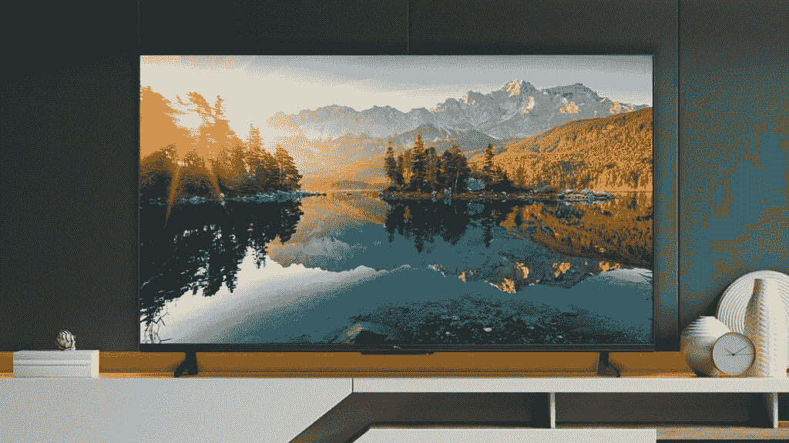

# 2023 年最佳安卓电视

> 原文：<https://www.xda-developers.com/best-android-tv/>

安卓电视是普通智能电视的绝佳替代品。它们更可靠，通常有更好的功能和应用支持。它们几乎包含了你能想到的所有视频和音乐流媒体应用，你也可以从 Play Store 安装更多应用。值得注意的是，Android 电视还内置了 Chromecast 支持，可以帮助你轻松地从手机或 PC 上播放视频。许多制造商也开始生产 Android 电视，所以你在购买[最佳电视](https://www.xda-developers.com/best-tv/)时，一定会从索尼、TCL、海信等公司找到一些可靠的选择。这些制造商还将他们的电视与更新的谷歌电视界面一起发运，该界面使用谷歌的人工智能来提供更个性化的电视观看体验。

Android 电视有很多令人喜欢的地方，而且市场上的任何现代电视都很难出错。如果你想升级到最好的安卓电视，并且不知道该买哪一款，那么你来对地方了。

## 整体最佳安卓电视:索尼 BRAVIA XR A80K 有机发光二极管(2022)

索尼 A80K 无疑是你现在能买到的最好的有机发光二极管电视之一。它是索尼 2022 年阵容的一部分，它由谷歌电视驱动，所以它完全符合这里的要求。这种特殊的型号低于索尼更贵的 A95K QD-有机发光二极管系列，但它为您的钱提供了更好的价值。与 X95K 系列仅提供 55 或 65 英寸尺寸不同，A80K 系列还提供额外的 77 英寸尺寸，非常适合那些想要在客厅放一台大电视的人。

索尼 A80K OLED 电视以其画质和同样适用于媒体消费的良好音质而闻名。它也是最好看的电视之一，具有现代的设计和令人印象深刻的制造质量。索尼 A80K 的一大亮点是它也是游戏玩家的绝佳选择。它不仅配备了索尼自己专有的 Dolby Vision 游戏设置，还具有自动低延迟 HDMI 2.1 功能，使其能够切换到索尼的低延迟游戏画面。更不用说，它对 [PlayStation 5](https://www.xda-developers.com/sony-playstation-5-first-impressions/) 用户来说也是一款很棒的电视，因为它配有两个 HDMI 2.1 端口，支持 4K 120Hz 输出和 VRR。这款电视的 55 英寸版本起价为 1300 美元，价格会根据你选择的屏幕尺寸而上涨。

##### 索尼 BRAVIA XR A80K

索尼 BRAVIA XR A80K 是你能买到的最好的谷歌有机发光二极管电视之一。它提供了出色的图像和音频质量，同时也为游戏玩家提供了一些值得注意的功能。

**Pros**

*   良好的对比度
*   视角极佳
*   HDMI 2.1 支持可变刷新率(VRR)

**Cons**

*   不如其他选项明亮

## 亚军:索尼 BRAVIA XR A90J 有机发光二极管(2021)

索尼 A90J 与我们评选的最佳安卓电视非常相似，但它的功能更加丰富。我们推荐 2021 年的型号，因为升级的 A90K 2022 型号只有 42 英寸和 48 英寸两种尺寸，如果你需要更大的尺寸，你必须转向更贵的 A95K QD-有机发光二极管型号。不过，A90J 2021 型号在 2023 年仍然表现不错，所以你不必担心寿命。

此外，A90J 自带全新的 Google TV 体验。除了支持杜比全景声、杜比视界 HDR 和网飞校准模式等功能，您还可以获得 HDMI 2.1 端口，用于 VRR 和 ALLM 的下一代 PlayStation 5 游戏。索尼 A90J BRAVIA XR Master 有 55 英寸、65 英寸和 83 英寸屏幕尺寸，在美国的起价约为 1，800 美元。

##### 索尼 A90J Bravia XR Master 4K OLED 电视

索尼的 A90J 是一款很棒的 4K OLED 电视。如果你能接受它相对较高的价格，它会给你比 A80K 更好的体验。

**Pros**

*   深黑色的对比度很高
*   立体视角
*   也非常适合游戏

**Cons**

*   可能会遇到老化问题
*   有限的峰值亮度

## 最佳预算 4K 安卓电视:海信 U8H

这篇文章的最初版本是以海信 U8G 作为我们最佳预算的 Android 电视选择发布的，但我们现在更新它，列出它的继任者，海信 U8H 2022 型号。这款特殊的电视也有 55 英寸、65 英寸和 75 英寸尺寸可供购买，所有这些尺寸都有一个迷你 LED 背光 QLED 面板。这款海信电视也非常适合玩视频游戏，因为它支持 HDMI 2.1，并提供低输入延迟、出色的响应时间和可变刷新率。

海信 U8H 支持杜比全景声、杜比视界 HDR、HDR10 和 HDR10+。与前代产品不同，它开箱即可运行新的谷歌电视体验，这意味着它与市场上所有其他高端电视不相上下。它还内置了谷歌助手，这意味着你也可以给它语音命令。这款 55 英寸的电视目前售价仅为 700 美元，就其带来的功能而言，这是相当令人印象深刻的。

##### 海信 U8H 4K 量子 ULED 电视

海信 U8H 是你现在能买到的最好的 QLED 电视之一。它提供了一系列功能，并自带更新的谷歌电视界面。

**Pros**

*   良好的亮度水平
*   深黑色的对比度很高
*   对游戏也有好处

**Cons**

*   视角可以更好

## 备选最佳预算 4K 安卓电视:TCL 6 系列谷歌电视

### 

TCL 凭借其新的 5 系列和 6 系列谷歌电视型号在安卓电视领域取得了巨大的进步。虽然该公司已经销售 Android 电视有一段时间了，但它们仅限于预算部分。但随着 6 系列的推出，TCL 将 Android TV 带到了其高端电视中。

TCL R646 是一款 4K QLED 电视，采用迷你 LED 背光，为您带来鲜艳的色彩和高亮度。该电视还采用了多达 240 个区域的全阵列局部调光，以提供出色的对比度。此外，还支持杜比视界、HDR10+和 HDR10，让您可以欣赏 HDR 内容。

R646 也是一款出色的游戏电视，因为它支持下一代游戏功能。您可以获得 120Hz 面板、两个支持 4K 的 HDMI 2.1 端口、120 FPS 游戏和可变刷新率(VRR)支持。你可以购买 55 英寸、65 英寸和 75 英寸尺寸的 TCL R646，在美国的起价为 600 美元。

##### TCL 6 系列 QLED 4K 谷歌电视

TCL R646 是一款优秀的多功能谷歌电视机型。它有一个出色的画面宽色域和深黑色水平。它也非常适合游戏，有多种尺寸。

**Pros**

*   明亮生动的画质
*   非常适合使用 4K 120Hz 输入进行游戏
*   有多种尺寸

## 最佳小型安卓电视:TCL 3 系列 FHD 电视

不是每个人都想购买屏幕大于 50 英寸的大尺寸 4K 电视，所以我们将 TCL 3 系列加入了这一行列。这是你现在能买到的最好的 32 英寸电视之一，而且只需 180 美元。它只支持全高清(1080p)分辨率，但这不一定是一个障碍，因为这是 32 英寸显示器所需要的。但是不要让它较小的屏幕尺寸和实惠的价格让你觉得它有什么不好，因为它有很多很棒的功能。

TCL 3 系列 FHD 电视也是最实惠的智能电视之一，支持更新的谷歌电视界面。它还内置了谷歌助手，所以你也可以用语音搜索你喜欢的电影和电视节目来观看。总的来说，这款电视的软件体验与您在列表中提到的许多其他昂贵电视上获得的体验相当。

##### TCL 3 系列 FHD 谷歌电视

这款 TCL 3 系列电视可能不是功能最齐全的电视，但它拥有高端电视的所有必备功能，包括支持新升级的谷歌电视界面。

**Pros**

*   良好的响应时间
*   巨大的自然反差
*   超级实惠

**Cons**

*   狭窄的视角
*   不够亮

## 最佳 8K 安卓电视:索尼 BRAVIA XR Z9K 8K 迷你 LED

你可以从本系列中提到的其他电视中挑选一款，买到最大尺寸的。但如果你不介意支付溢价购买最好的智能电视，那么我们推荐索尼 BRAVIA XR Z9K 8K 电视。这是该系列中最贵的电视，但它拥有你期望在 2023 年看到的高级电视的一切。

索尼 BRAVIA XR Z9K 可以购买 75 英寸或 85 英寸的屏幕，它们都是支持 8K 分辨率的迷你 LED HDR 面板。它还配有 BRAVIA CAM，可以让你直接从电视上进行视频通话。和大多数现代安卓电视一样，这款电视也配备了更新的谷歌电视界面，你可以从盒子里获得所有的必需品，如谷歌助手、谷歌 Duo 等。索尼 BRAVIA XR Z9K 8K 电视起价 6000 美元，但 85 英寸的电视价格高达 9000 美元。大多数人现在不需要 8K，因为许多内容不支持它，但如果你想走在曲线的前面，这个价格是值得的。

##### 索尼 BRAVIA XR Z9K 8K 迷你 LED 电视

索尼 BRAVIA XR Z9K 8K 电视是这份名单上最贵的电视，但它几乎具备了你对 2023 年高端电视的所有预期，包括 8K 显示屏、通过 PS5 进行高刷新率游戏的 HDMI 2.1 端口等等。

**Pros**

*   出色的图像质量
*   支持高达 8K 的分辨率
*   也非常适合游戏

**Cons**

*   昂贵的价格标签
*   8K 还没有得到广泛支持

这就把我们带到了这个系列的结尾，强调了 2023 年你可以买到的最好的安卓电视。如果我们要选择一台，我们会选择索尼 Bravia XR A80K 有机发光二极管或 Bravia XR A90J 有机发光二极管电视。如果您预算紧张，也可以看看海信 U8H 或 TCL Class 6 系列电视。

\

虽然购买内置 Android TV 的智能电视是体验该平台的一种很好的方式，但你也可以购买 Android TV 盒子或流媒体棒，以便在装有另一种操作系统的“哑”或智能电视中获得体验。如果你想使用 Android 电视平台，但还在寻找更多的选择，那就买一台适合任何平台的电视，并从我们的[最佳 Android 电视盒子](https://www.xda-developers.com/best-android-tv-box/)列表中挑选一个媒体播放器。