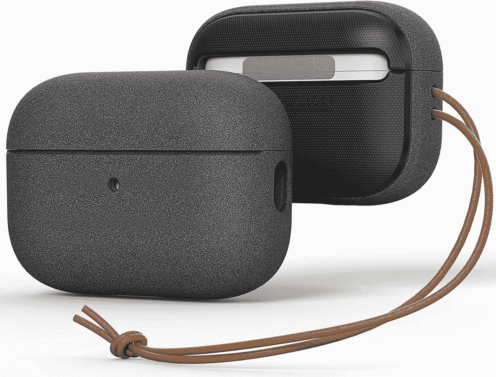
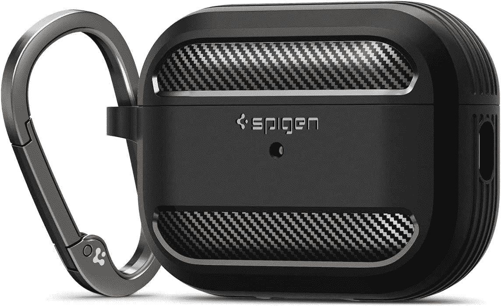
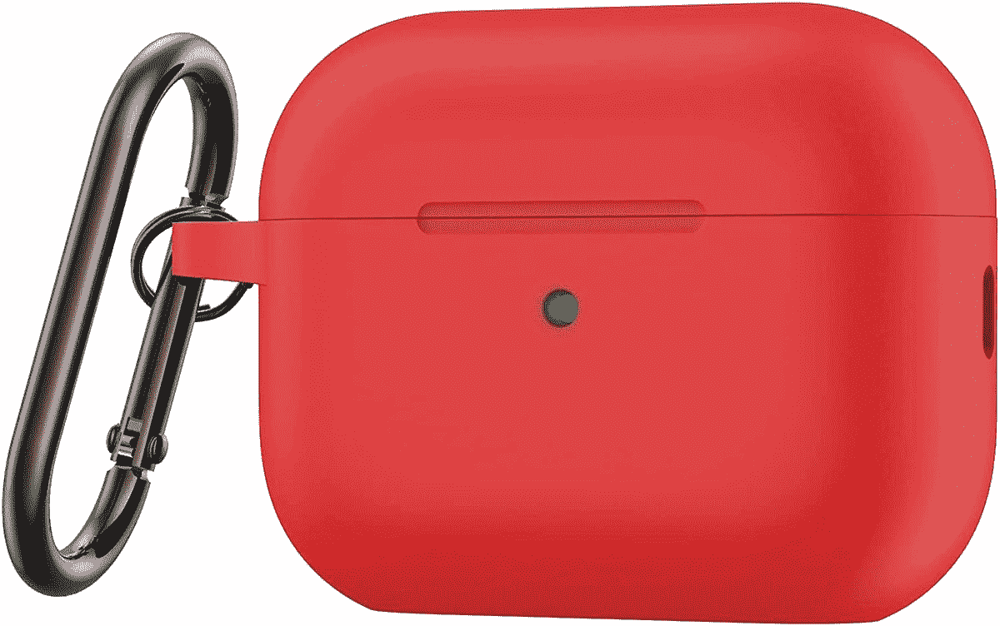
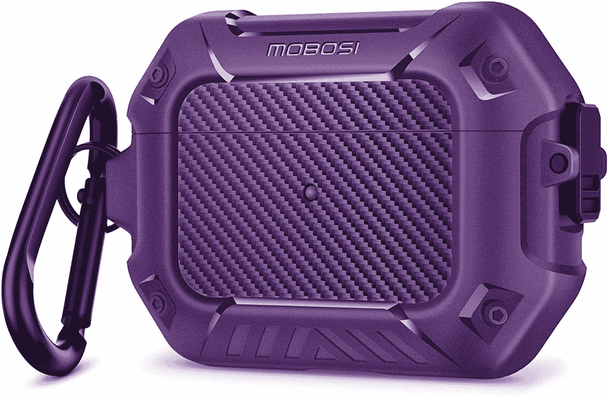
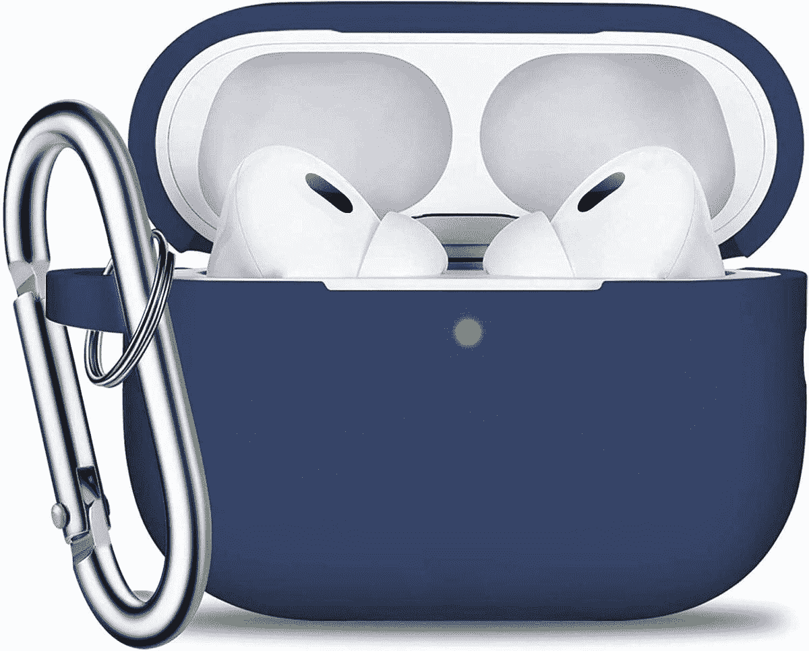

# 2023 年最佳苹果 AirPods Pro 2 保护套

> 原文：<https://www.xda-developers.com/best-apple-airpods-pro-2-cases/>

# 2023 年最佳苹果 AirPods Pro 2 保护套

苹果早在 2022 年 9 月就发布了 AirPods Pro 2。以下是你能找到的这些耳塞的最佳案例列表。

苹果在 2022 年末发布了 AirPods Pro 2 和 T2 的 iPhone 14 系列。与他们的前辈相比，这些升级的芽并没有引入很多新的变化。尽管如此，他们还是带来了一些受欢迎的产品，如内置在外壳中的 Find My speaker、H2 芯片、更强的主动噪声消除(ANC)等等。

如果你[买了 AirPods Pro 2](http://www.xda-developers.com/best-apple-airpods-2-deals/) ，用外壳保护它们很重要。毕竟，这些微型耳塞很脆弱，将充电盒掉在坚硬的地面上可能会损坏它们。这还不算，充电外壳本身就非常容易刮花。因此，为了帮助你找到正确的选择，我们整理了一份目前最好的 AirPods Pro 2 外壳列表。

## 最佳 AirPods Pro 2 保护套

*   ##### Spigen Lock Fit AirPods Pro 2 外壳

    如果你倾向于在恶劣的环境中使用你的 ai rpods，那么这款外壳就适合你。除了其显而易见的坚固构造，它还提供了一个安全锁，使其保持关闭。这样就算你把保护套摔在地上也打不开，AirPods 也不会弹出来。它还支持无线充电，包括一个登山扣环。

    T13
*   ##### val kit Soft TPU ai rpods Pro 2 外壳

    如果你正在寻找一种既有保护性又色彩鲜艳的选择，这就是你要找的。这款防震包有九种不同的半透明颜色可供选择，配有硅胶挂绳和储物盒。

*   ##### Tronwin 硅胶 AirPods Pro 2 外壳

    如果你很怀旧，这款受 Gameboy 启发的外壳可以保护你的 AirPods Pro 2。它抗震，支持 MagSafe 无线充电，并包括一个高质量的登山扣。

*   ##### sp igen Ultra Hybrid

    如果你正在寻找保护你的 AirPods Pro 2 而不隐藏外壳的标志性设计，这款透明外壳就能做到这一点！

    T17
*   <picture></picture>

    VRS Design Modern

    ##### VRS Design Modern

    这款封面融合了软硬材质因此，它提供了一个坚固的外壳，同时在内部巧妙地处理你的 AirPods Pro 2 外壳。

*   <picture></picture>

    斯皮根坚固的盔甲

    ##### 斯皮根坚固的盔甲

    斯皮根以其耐用和优秀的产品而闻名。该公司正在销售一种坚固耐用的外壳，以提高抗冲击能力。不过，它只有黑色的。

*   <picture></picture>

    BRG 硅胶保护套

    ##### BRG 硅胶保护套

    有 15 种不同颜色可供挑选，这种柔软的硅胶保护套为相当沉闷的 AirPods 充电保护套增加了保护和寿命。

*   <picture></picture>

    MOBOSI 硬壳套

    ##### MOBOSI 硬壳套

    坚固耐用的外壳提供了更好的抗冲击能力，但它们往往只有黑色这个有三种其他颜色。

*   <picture></picture>

    swin CHO 硅胶套

    ##### swin CHO 硅胶套

    有午夜蓝、酒红色和黑色三种颜色可选，这款柔软的硅胶套可以保护您的 AirPods 外壳免受刮擦和冲击。

* * *

AirPods 往往可以使用数年，这也是你应该依赖保护壳的原因之一。在自然的、未覆盖的状态下使用它们可能会在几周甚至几天内刮伤它们。那些把 AirPods 和钥匙放在同一个口袋里的人会很清楚我指的是什么。因此，为了尽可能长时间保持这些 AirPods 的新鲜，可以考虑投资一个外壳来保留它们的高级外观。

 <picture></picture> 

Apple AirPods Pro 2

##### 苹果 AirPods Pro 2

AirPods Pro 2 支持主动噪音消除、自适应透明、杜比 Atmos 内容、MagSafe 充电等等。尽管体型小巧，但他们提供了大量产品。

*你会购买这些 AirPods Pro 2 保护套中的哪一个，为什么？请在下面的评论区告诉我们。*