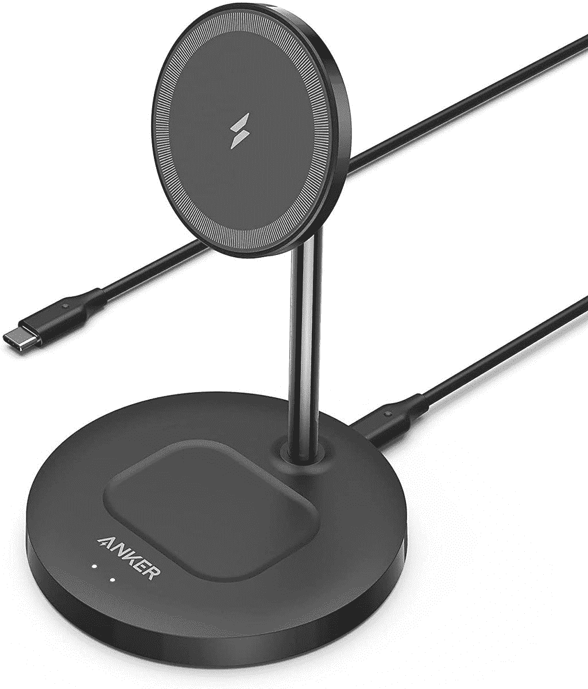
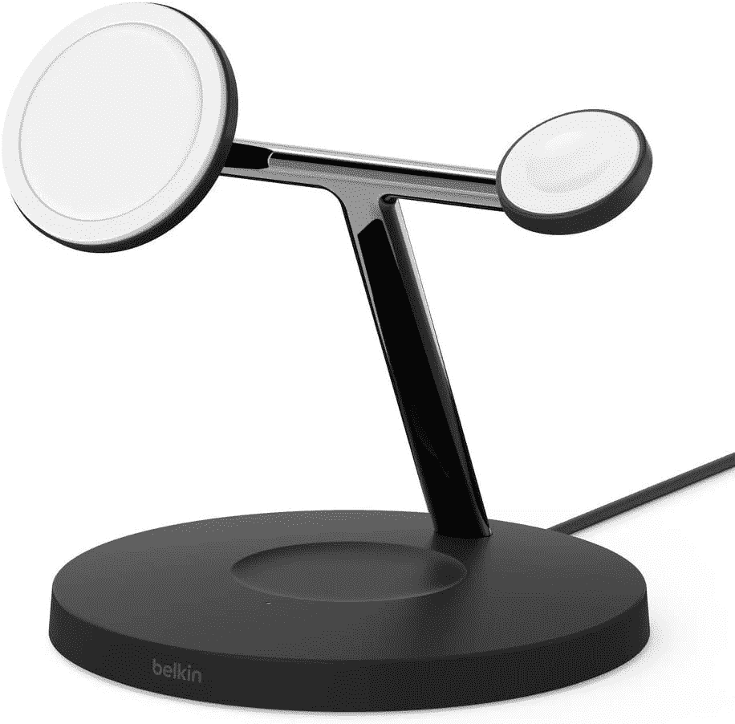
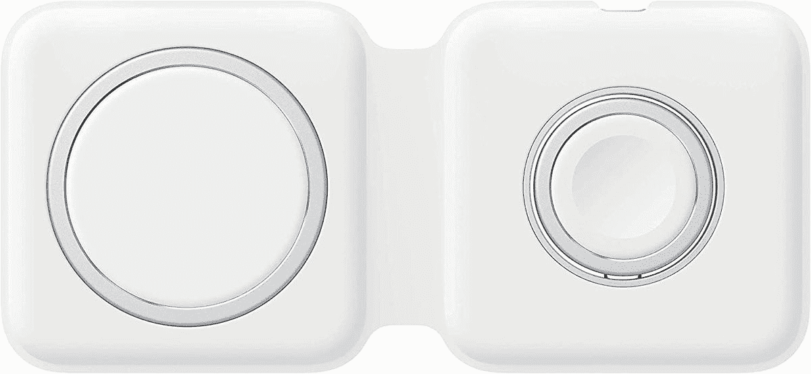
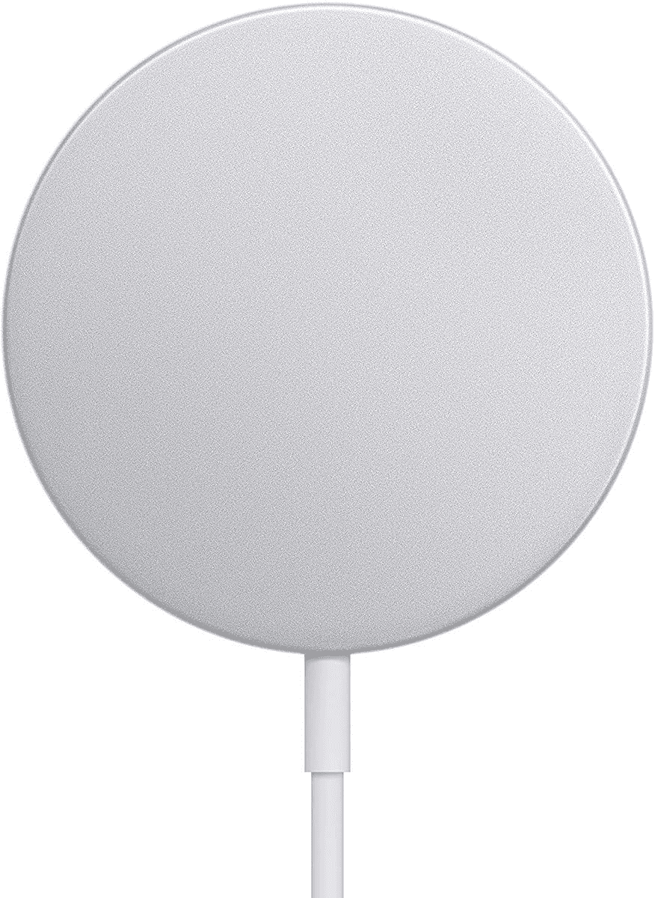
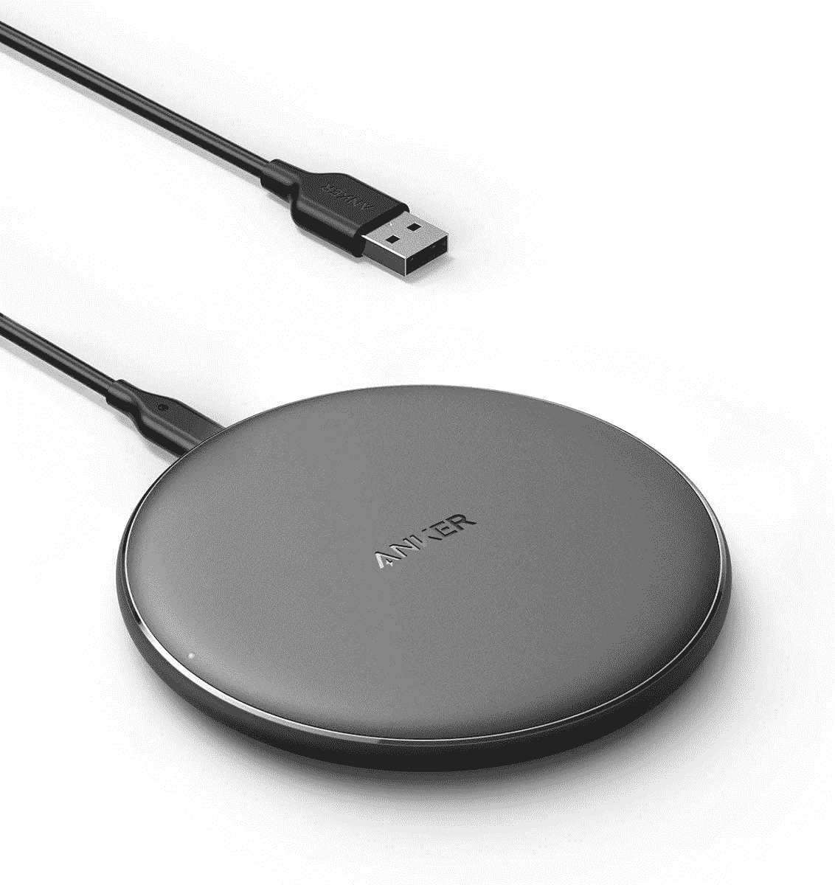
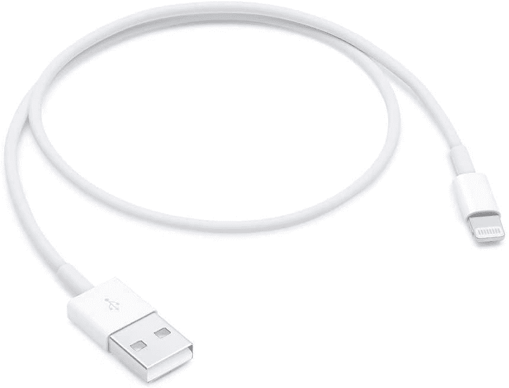
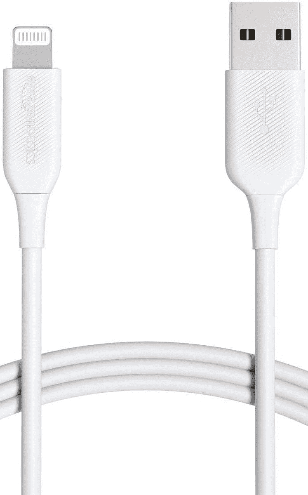

# 2023 年最佳苹果 AirPods Pro 2 充电器和线缆

> 原文：<https://www.xda-developers.com/best-apple-airpods-pro-2-chargers/>

# 2023 年最佳苹果 AirPods Pro 2 充电器和线缆

你可以通过有线和无线连接为 AirPods Pro 2 充电。这里是你能为这些耳塞买到的最好的充电器和电缆。

AirPods Pro 2 可以说是你现在能在 T2 买到的最好的 AirPods。考虑到它们的价格、质量和功能，它们比最高端的 AirPods Max 更划算。与第一代机型相比，第二代机型引入了一些方便的附加功能，如 Apple Watch puck 充电支持。这意味着你可以通过 Lightning 线缆、Qi 无线充电板、MagSafe 或 Apple Watch 充电器为这些 buds 的外壳充电。选择权在你！为了帮助你找到正确的选择，我们整理了一份 AirPods Pro 2 的最佳充电器和电缆列表。无论你是有线还是无线充电的粉丝，你都应该能够找到适合自己需求的选项。

## 最佳 AirPods Pro 2 充电器

你可以通过普通的 Qi pad、MagSafe 充电器或 Apple Watch 充电圆盘为 AirPods Pro 2 无线充电。这给了你选择最适合你的方式的自由。

*   <picture></picture>

    Anker 无线充电座

    ##### Anker 无线充电座

    就像贝尔金站一样，这款也为你的 iPhone 和 AirPods Pro 2 提供 MagSafe 和 Qi 选项。你可以通过其中任何一个

    给你的 AirPods 充电
*   <picture></picture>

    Belkin mag safe 三合一无线充电器

    ##### Belkin mag safe 三合一无线充电器

    本站包含第三个专用于您的 Apple Watch 的充电器。你可以通过 MagSafe、Qi 或该站包含的 Apple Watch puck 为 AirPods Pro 2 充电。

*   <picture></picture>

    苹果 MagSafe Duo 充电器

    ##### 苹果 MagSafe Duo 充电器

    与前几站类似，这款充电器提供了 MagSafe 和一个 Apple Watch puck。你可以通过这两个中的任何一个给你的 AirPods Pro 2 充电。

*   <picture></picture>

    苹果 MagSafe 充电器

    ##### 苹果 MagSafe 充电器

    如果你没有 Apple Watch 或者正在寻找基本的解决方案，这款 MagSafe 充电器可以单独为你的 iPhone 或者 AirPods Pro 2 供电。

*   <picture></picture>

    Anker 无线充电器

    ##### Anker 无线充电器

    如果你有大量的 Qi 配件并且不想要 MagSafe 充电器，这个简单的 Qi pad 可以与你的 AirPods Pro 2 配合使用。

*   ##### Apple Watch 磁性充电底座

    这款来自苹果的底座非常适合那些拥有 Apple Watch 的人。你可以用它给你的 AirPods Pro 2 或者 watchOS 设备充电。

    T34

## 最佳 AirPods Pro 2 线缆

如果你更喜欢有线充电，我们也为你的 AirPods Pro 2 选择了一些最好的 Lightning 电缆。

*   <picture></picture>

    苹果 USB-C 转 Lightning 线

    ##### 苹果 USB-C 转 Lightning 线(2 米)

    如果你的电源插座离办公桌很远，这种 2 米长的线是避免移动家具的绝佳选择。

*   ##### Anker USB-C 转 Lightning 线缆

    有黑色、蓝色、绿色、白色和紫色可选，这款 Anker 的 6 英尺长的 Lightning 转 USB Type-C 线缆由耐用的生物材料制成，以减少其碳足迹。

    T34
*   ##### Ugreen USB-C 转 Lightning 线

    u green USB-C 转 Lightning 线是一种耐用的充电线。它有 3 英尺、6 英尺和 10 英尺三种尺寸，配有双尼龙编织带。

*   ##### Belkin Lightning 电缆

    这款 Belkin Lightning 电缆有编织和普通 PVC 护套两种。此外，你可以得到两种颜色以及两种尺寸。这种电缆可以承受 10，000 多次弯曲。

    T17
*   <picture></picture>

    苹果 Lightning 转 USB-A 线(1 米)

    ##### 苹果 Lightning 转 USB-A 线(1 米)

    如果你的充电砖因为某种原因还有 USB A 口，这款 1 米的官方线会是一个理想的连接器。

*   <picture></picture>

    亚马逊基础知识 Lightning 转 USB-A 线

    ##### 亚马逊基础知识 Lightning 转 USB-A 线

    想找一条 USB A 线但是苹果的定价过高？亚马逊基础系列的这款可以满足你的需求。

* * *

虽然无线充电器看起来比电缆干净，但我们必须指出一个问题。线缆往往会让你的 AirPods Pro 2 充电更快。更不用说无线充电器会以更快的速度耗尽电池的电量。因此，如果你在寻找耐用性和更快的充电速度，那么 Lightning 电缆是一个不错的选择。否则，无线充电器最好放在办公桌上。哪个选项对你来说是正确的取决于你的优先级和标准。

 <picture></picture> 

Apple AirPods Pro 2

##### 苹果 AirPods Pro 2

AirPods Pro 2 支持主动噪音消除、杜比 Atmos 内容和无线充电。尽管体型小巧，但他们提供了大量产品。