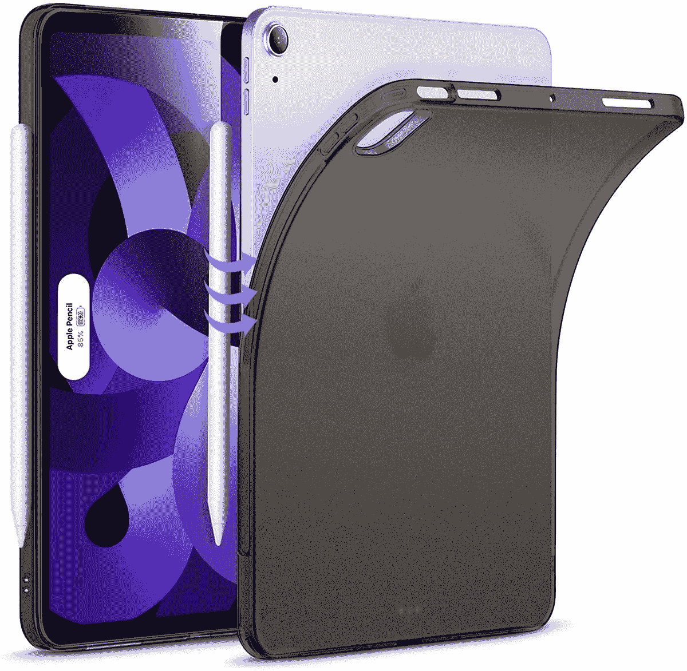
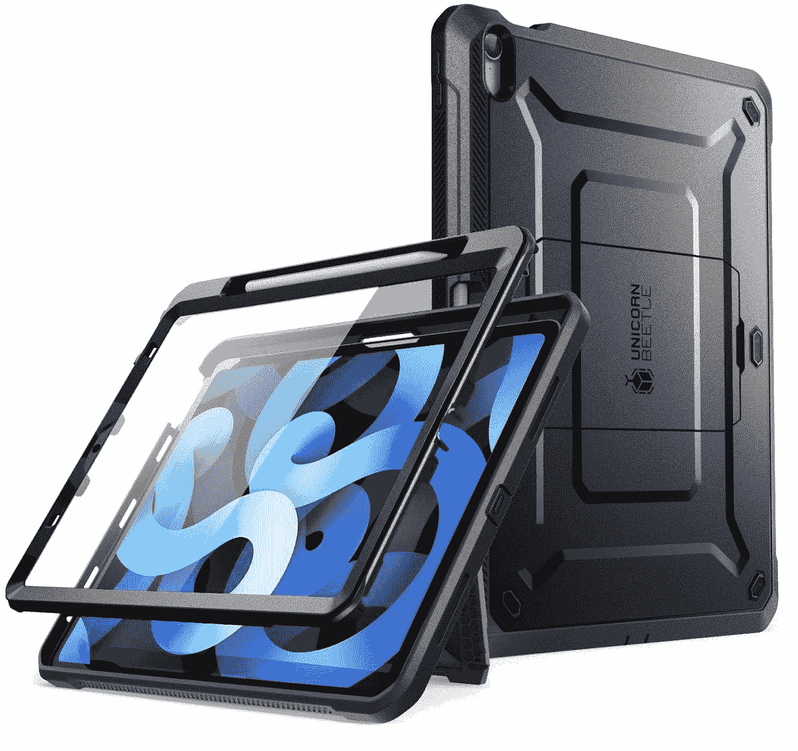
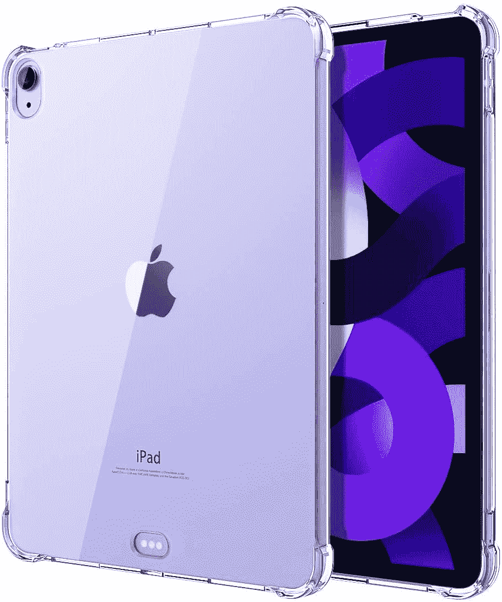
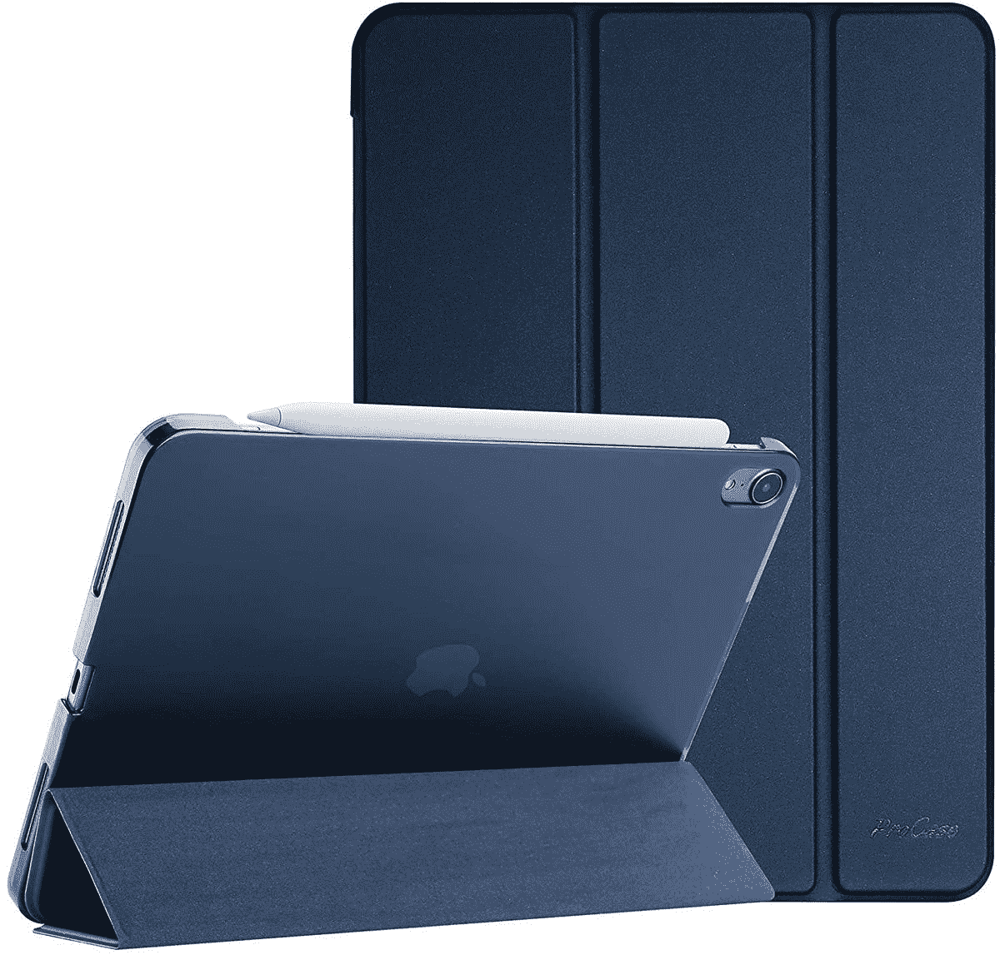
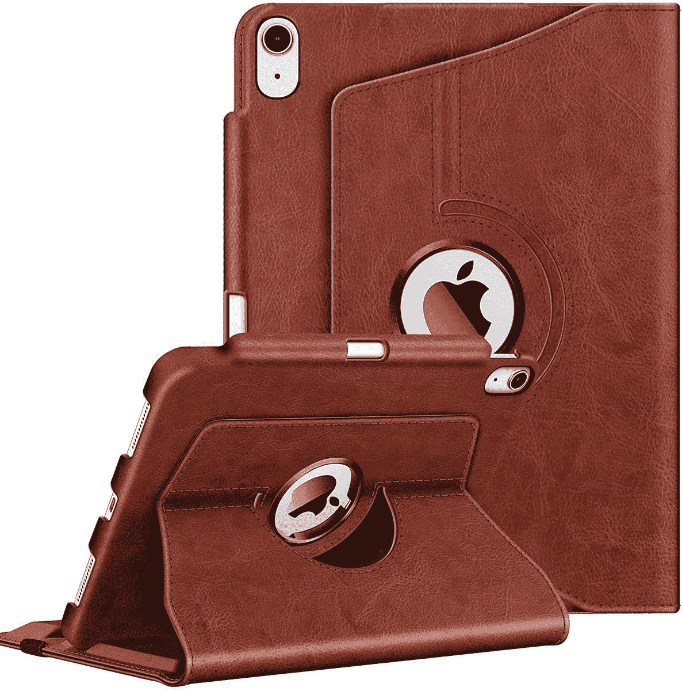
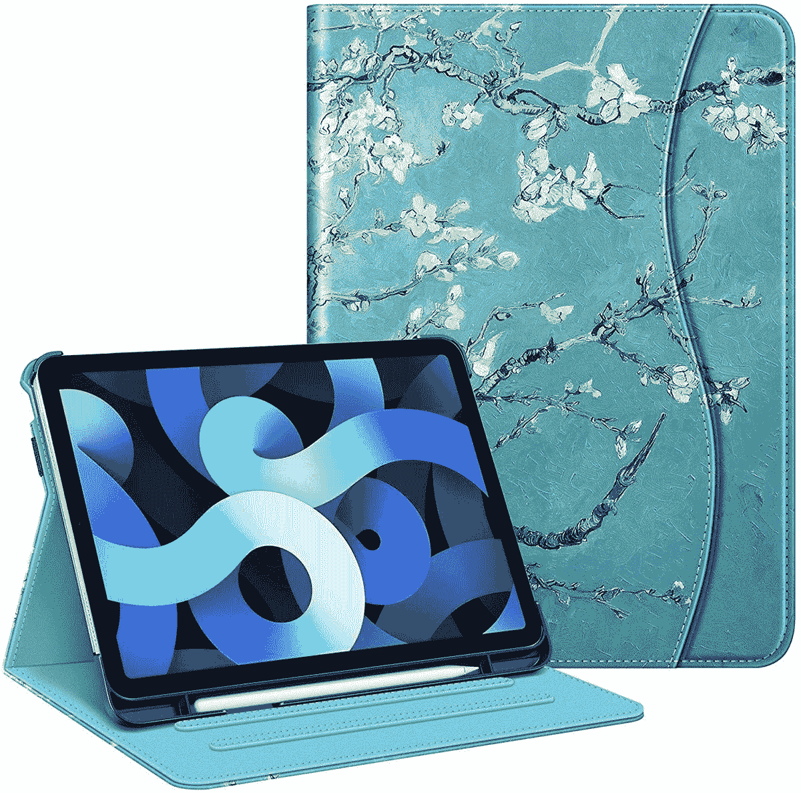

# 2023 年最佳苹果 iPad Air 5 套

> 原文：<https://www.xda-developers.com/best-apple-ipad-air-5-cases/>

# 2023 年最佳苹果 iPad Air 5 套

苹果终于发布了 iPad Air 5 (2022)。这些是为这款新的 M1 平板电脑购买的最佳保护壳。

苹果在 2022 年春天发布了 iPad Air 5。这款 M1 驱动的平板电脑是在其 Peek 性能活动期间发布的，同时发布的还有 [iPhone SE 3](https://www.xda-developers.com/apple-iphone-se-3-review/) 和 Mac Studio。这款 iPad 预计会保留前代机型的设计。然而，它具有显著的性能提升，使其成为一款可靠的设备。这些改进包括可选的 5G 支持和在 iPad Air 系列中引入苹果 M1 芯片。如果你[买了 iPad Air 5 (2022)](https://www.xda-developers.com/best-apple-ipad-air-5-deals/) ，同样重要的是要有一个[屏幕保护器](https://www.xda-developers.com/best-apple-ipad-air-5-screen-protectors/)来避免深深的划痕。另一个明智的想法是用箱子保护它。这有助于在您意外跌落时将潜在的损坏降至最低。以下是你现在能买到的最好的苹果 iPad Air 5 (2022)保护套。

*   <picture></picture>

    ESR 磨砂保护套

    ##### ESR 磨砂 iPad Air (2022)保护套

    这款磨砂保护套可以让你通过 iPad Air 5 正常使用 Apple Pencil 2 并为其充电。它轻薄、灵活、简洁，是极简主义者的理想选择。

*   <picture></picture>

    sup case 独角兽甲壳虫 Pro

    ##### sup case UB Pro iPad Air(2022)外壳

    这款坚固耐用的外壳包括一个 Apple Pencil 2 支架，因此您不会掉落或丢失触控笔。它有七种颜色。

*   <picture></picture>

    TiMOVO Clear Case

    ##### TiMOVO Clear iPad Air(2022)Case

    这款灵活的 Clear Case 拥有电源键专用切口，露出触控 ID 传感器，方便取用。

*   <picture></picture>

    ProCase Slim Stand 保护套

    ##### ProCase Slim Stand iPad Air(2022)保护套

    这款保护套有硬背，支持 smart display 自动唤醒/睡眠功能。它有 11 种鲜艳的颜色可供选择。

*   <picture></picture>

    fin tie 旋转皮套

    ##### fin tie 旋转皮套 iPad Air (2022)皮套

    这款皮套有一个旋转机构，可以让你在横向和纵向两个方向竖立。

*   <picture></picture>

    fin tie 多角度保护套

    ##### fin tie 多角度 iPad Air (2022)保护套

    这款多角度保护套有 24 种艺术风格可选，包括一个储物口袋，还有一个苹果笔筒。

保护套不仅能保护你的 iPad，还能让它焕然一新。你可以为不同的场合或服装风格选择不同的案例。更不用说他们有时还会引入额外的功能，比如支架。最终，使用任何外壳都比原样使用 iPad 好。因此，如果你不喜欢增加的体积，可以考虑选择更苗条的。

你会购买这些 iPad 保护套中的哪一个，为什么？请在下面的评论区告诉我们。