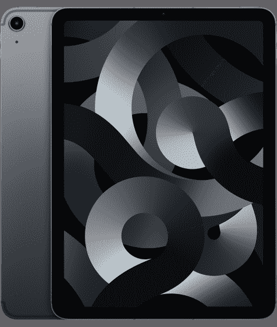

# 2022 年最佳苹果 iPad Air 5 (2022)交易

> 原文：<https://www.xda-developers.com/best-apple-ipad-air-5-deals/>

在 2022 年的 Peek 表演活动上，苹果发布了 M1 iPad Air 5 以及价格实惠的 iPhone SE 3。 [iPad Air 5 (2022)](https://www.xda-developers.com/apple-ipad-air-5-review/) 的设计与 2020 年的 iPad Air 4 相同。然而，它包含了重大的硬件改进，包括新的芯片组和 5G 支持。如果你在市场上寻找一款介于 iPad Mini 和 iPad Pro 之间的新平板电脑，2022 年的 iPad Air 5 可能是你的选择。以下是 iPad Air 5 (2022)最划算的价格。

## 最佳 iPad Air 5 (2022)交易:零售商

### 亚马孙

如果亚马逊是你的首选零售商，你可以在那里购买 iPad Air 5 (2022)。它在那里的价格与苹果商店的价格相当，有时还会有限时折扣。

 <picture></picture> 

Apple iPad Air 5 (2022)

##### 苹果 iPad Air (2022)

iPad Air 5 (2022)已经可以购买，它采用了苹果的 M1 芯片组，5G 支持，以及与上一款 iPad Air 相同的设计。你可以在亚马逊上以 599 美元的价格购买。

### Adorama

iPad Air 5 (2022)在 Adorama 上市，有各种表面和无线网络两种选择。你可以从这个零售商那里买到，价格和苹果商店里的一样。

 <picture></picture> 

Apple iPad Air 5 (2022)

##### 苹果 iPad Air (2022)

如果这是你选择的零售商，你也可以在 Adorama 上以 599 美元的价格购买 iPad Air 5。你可以利用 M1 芯片、可选的 5G 等等。

### 百思买集团

百思买也在销售各种颜色的 iPad Air 5，包括 Wi-Fi 型号和无锁蜂窝型号。你可以直接从零售商的网站上订购。

 <picture></picture> 

Apple iPad Air 5 (2022)

##### 苹果 iPad Air (2022)

如果你喜欢在百思买购物，那么你可以花 599 美元买一套。你可以在苹果提供的相同价格的所有可用颜色和存储选项中进行选择。

### 苹果在线商店

iPad Air 5 (2022)于 2022 年 3 月在苹果在线商店上市销售。它有两种存储配置:64GB 的存储空间起价 599 美元，256GB 的存储空间起价 749 美元。如果你还想在任一存储配置上获得 5G 蜂窝支持，你将为这一特权支付额外的 149 美元，总计分别为 749 美元和 899 美元。所有型号都有多种鲜艳的[颜色](https://www.xda-developers.com/apple-ipad-air-5-colors/)。

如果你选择的是手机型号，记住它可以支持 eSIM 或物理 SIM 卡。所有型号都支持 Wi-Fi 6 技术以实现快速 Wi-Fi 数据传输，这意味着根据您的使用情况，蜂窝可能不是必需的。

如果价格有点高，苹果还提供高达 680 美元的以旧换新信贷。其他制造商的平板电脑不符合条件，因为苹果将免费为你回收它们。遗憾的是，在你提交序列号之前，该公司不会提供你的 iPad 到底能卖多少钱的明细。

 <picture></picture> 

Apple iPad Air 5 (2022)

##### 苹果 iPad Air (2022)

你可以在苹果在线商店以 599 美元的价格购买 2022 年的 iPad Air 5，并免费获得一个可选的雕刻。雕刻服务是苹果商店的官方专属。

## 最佳交易:运营商

### 威瑞森

威瑞森正在通过其在线商店销售 iPad Air 5 (2022)。如果您想从该承运商处订购，您可以选择。

 <picture></picture> 

Apple iPad Air 5 (2022)

##### 苹果 iPad Air (2022)

如果你选择 iPad Air 5 作为承运商，你可以在威瑞森的在线商店购买。不过，这也意味着它将被威瑞森网络公司锁定。

### T-Mobile

T-Mobile 还在网上商店销售最新的 iPad Air。如果这是您选择的运营商，您可以通过其网站直接订购。

 <picture></picture> 

Apple iPad Air 5 (2022)

##### 苹果 iPad Air (2022)

如果你更喜欢 T-Mobile 的蜂窝服务，你也可以通过这家运营商获得 iPad Air 5。同样，您将被限制使用该运营商的移动数据服务。

### 美国电话电报公司(American Telephone and Telegraph Company)

如果你更愿意从美国电话电报公司购买新款 iPad Air 5 (2022)，这也是一个选择——通过其在线商店。

 <picture></picture> 

Apple iPad Air 5 (2022)

##### 苹果 iPad Air (2022)

如果这是你的首选航空公司，你可以从美国电话电报公司的在线商店购买 iPad Air M1。不过，你只能依靠美国电话电报公司的运营商服务，因为它被锁定在自己的网络上。

你打算买新款苹果 iPad Air 5 (2022)吗？您打算搭配什么样的储物配置和颜色？请在下面的评论区告诉我们。而且买了之后别忘了抢一个[套](https://www.xda-developers.com/best-apple-ipad-air-5-cases/)！划痕只会破坏它的高级外观和感觉。安全总比后悔好。