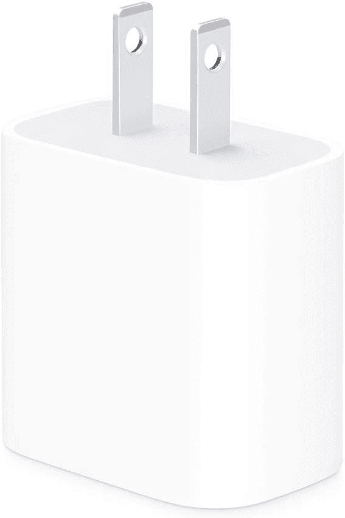
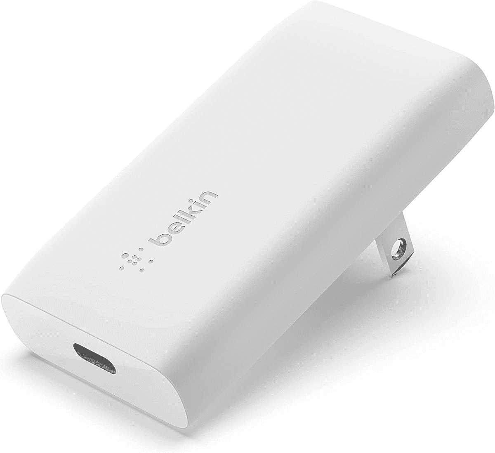
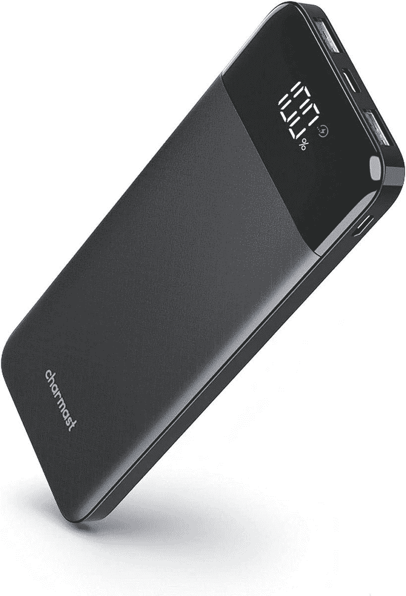
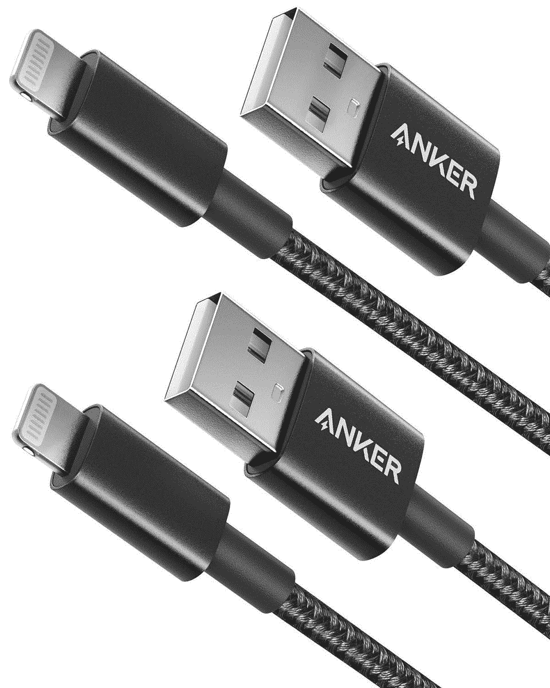
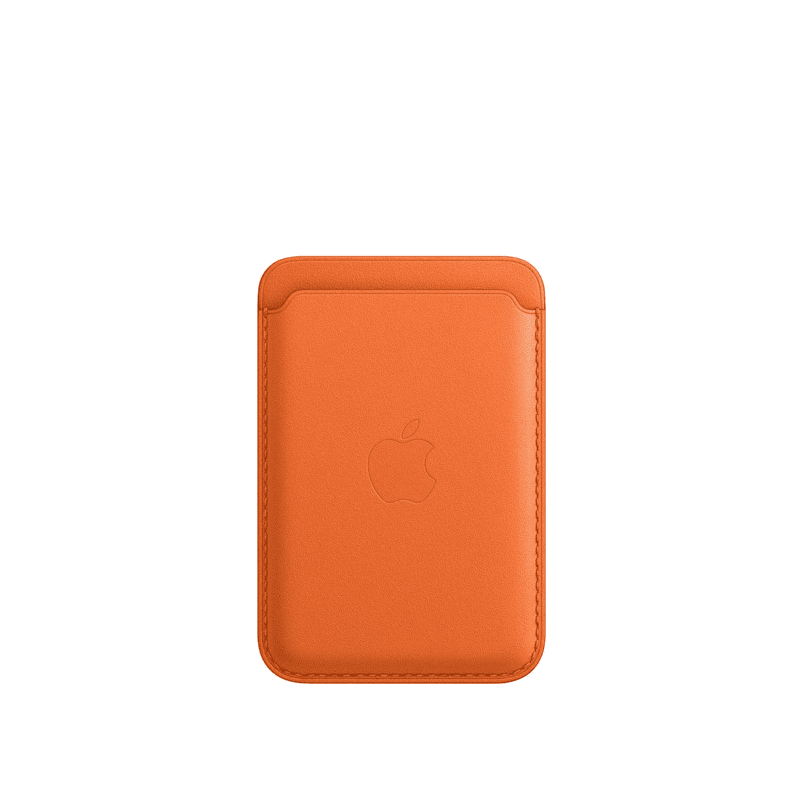
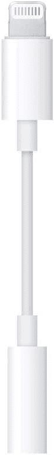

# 2023 年最佳 iPhone 14 系列充电器、电缆和其他配件

> 原文：<https://www.xda-developers.com/best-apple-iphone-14-chargers/>

无论你是购买更实惠的 [iPhone 14](https://www.xda-developers.com/apple-iphone-14-review/) ，iPhone 14 Plus，还是顶级的 [iPhone 14 Pro](https://www.xda-developers.com/apple-iphone-14-pro-review/) 或 iPhone 14 Pro Max，你都不会在盒子里找到任何额外的配件或附件。你甚至没有电源适配器！苹果在 2020 年停止在 iphone 中包含充电器和耳机，新 iphone 在这方面没有任何不同。他们只在包装盒中提供了 USB-C 到 Lightning 的电缆。

尽管新款 iPhone 14 本身就很棒，但配件或附件可以让它们变得更好。在这篇文章中，我们总结了 iPhone 14 系列中最好的快速充电器、无线充电板、磁性充电器和其他配件。

## iPhone 14 系列的最佳快速充电器

iPhone 14 系列并没有给充电速度带来任何提升。iPhone 14 和 iPhone 14 Plus 支持 20W 的最大充电速度，而 Pro 型号最高为 27W。为了利用更快的速度，你需要一个能提供 20W 或更多功率的充电器。

为你的 iPhone 14 购买充电器时，有几件事你需要记住。

*   确保充电器有 USB-C 连接，而不是 USB-A 连接，因为——否则，你还必须购买一根电缆。
*   你想买一个支持 [USB PD](https://www.xda-developers.com/best-qi-wireless-charger/) (送电)的充电器。
*   GaN 充电器比标准硅基充电器更快、更紧凑、更节能。
*   选择多端口充电器可以让你在笔记本电脑和其他设备旁边给 iPhone 充电。

*   <picture></picture>

    Anker Nano 3

    ##### Anker Nano 3 30W GaN 充电器

    Anker Nano 3 是市面上最小的 GaN 基充电器之一。它可以为兼容设备提供高达 30W 的功率，并有五种颜色可供选择。该公司还提供 24 个月的保修期。

*   <picture></picture>

    Ultranet 30W

    ##### Ultranet 30W GaN USB-C 充电器

    这是市面上最便宜的 GaN 充电器之一。紧凑型充电器占用更少的空间，提供 30W 的功率输出，允许您以最高速度为 iPhone 充电。它支持 USB PD 3.0 和 PPS 充电，并具有一个传感器，可持续监控温度和电流，以防止过热。

*   <picture></picture>

    Spigen 40W 双 USB-C 充电器

    ##### Spigen 40W arc station Pro 双 USB-C 充电器

    Spigen 的这款 GaN 供电充电器有两个 USB-C 端口，让您可以同时为两台设备充电。每个端口最多可输出 30W，如果两个端口都使用，则总共可输出 40W(每个端口 20W)。充电器智能控制热量和功率输出，从而减少过热和过度充电。

*   <picture></picture>

    苹果 30W USB-C 电源适配器

    ##### 苹果 30W USB-C 电源适配器

    这是苹果官方充电器，可以以高达 30W 的速度为你的 iPhone 14 快速充电。不过，这没什么特别的。它有一个 USB-C 端口，不仅可以用来给 iPhone 充电，还可以给 iPad Pro、Apple Watch 和 AirPods 充电。

*   <picture></picture>

    Belkin USB-PD GaN 充电器

    ##### Belkin 30W GaN USB-C 充电器

    这款来自 Belkin 的 GaN 充电器采用平壁设计，可折叠插脚，方便携带。它采用 GaN 技术，可为您的 iPhone、MacBook 和其他 USB-C 兼容设备提供高达 30W 的功率。

## iPhone 14 系列最佳 MagSafe 和 Qi 无线充电器

为了更方便的充电体验，iPhone 14 支持 MagSafe 和 Qi 无线充电。MagSafe 是苹果专有的磁性充电技术，兼容 MagSafe 的充电器可以提供比 [Qi 无线充电器](https://www.xda-developers.com/best-qi-wireless-charger/)快一倍的充电速度。

*   MagSafe 官方充电器提供最快的无线充电速度:高达 15W。
*   来自其他零售商的带有 Made for MagSafe 徽章的磁性充电器使用苹果官方的 MagSafe 技术，并提供相同的 15W 快速充电。
*   提到“MagSafe 兼容”的充电器不是官方许可的 MagSafe 产品。它们只是标准的 Qi 无线充电板，最高功率为 7.5W。

*   <picture></picture>

    Belkin MagSafe 三合一无线充电器

    ##### Belkin mag safe 三合一无线充电器

    Belkin 的 mag safe 无线充电座最多可以同时为三个设备充电，包括你的 iPhone、Apple Watch 和 AirPods 保护套。该充电器采用官方 MagSafe 技术，支持高达 15W 的快速充电。以纵向或横向模式安装手机，并在充电时进行视频通话。

*   <picture></picture>

    Belkin MagSafe 无线充电器

    ##### Belkin mag safe 无线充电器

    这是 Belkin 的另一款磁性充电器，采用 mag safe 官方技术，提供 15W 快速充电速度。有趣的是，充电器有一个弹出式支架，让你在充电时支撑 iPhone 观看视频。充电器附带的编织电缆长 6.6 英尺，有一个附加的带子。

*   <picture></picture>

    苹果 MagSafe Duo

    ##### 苹果 MagSafe Duo

    有了苹果 mag safe Duo，你可以同时为你的 iPhone 和 Apple Watch 无线充电。它输出 14W 的最大功率，也可以与 Qi 兼容的设备一起工作。它采用可折叠设计，可以轻松放入背包中随身携带，不会占用太多空间。

*   <picture></picture>

    Anker 7.5W 磁力无线充电器

    ##### Anker 7.5W 磁力无线充电器

    这款 Anker 的磁力充电器可以以相当适中的 7.5W 速度为你的 iPhone 充电。它有几项安全措施，包括辐射屏蔽、温度控制和异物检测。充电器配有一根 5 英尺长的电缆和一个 20W 的 USB-C 电源适配器。

## iPhone 14 系列的最佳电池组和电源组

如果你经常旅行并且长时间远离电源插座，那么一个口袋大小的电源组/电池组是必备的。这是延长 iPhone 14 电池寿命最简单的方法。以下是最佳选择。

*   <picture></picture>

    Benks 磁性无线电源板

    ##### Benks 磁性无线电源板

    这款轻薄的电源板可以磁性附着在你的 iPhone 上。为了方便起见，您可以使用无线充电，或者插入电源组的 USB-C 端口进行快速充电。拥有 5,000mAh 的容量，你可以轻松地将你的 iPhone 充满至少一次。

*   <picture></picture>

    Anker 622 磁性无线电源银行

    ##### Anker 622 磁性无线电源银行

    Anker 的 622 MagGo 无线电源银行拥有超强磁铁，可以无线和有线方式为你的 iPhone 14 充电。它只有 0.5 英寸厚，有充电 led 和一个 USB-C 端口。它配有内置支架，可以让你支撑手机进行视频通话或观看视频。

*   <picture></picture>

    Charmast

    ##### Charmast 10400mAh 电源组

    这款来自 Charmast 的 10400 mah 电池组可以为你的 iPhone 充电 14 次以上。它提供 15W 的最大输出，有两个 USB-A 端口和一个 USB-C 端口，允许同时为最多三个设备充电。

## iPhone 14 系列的最佳电缆

虽然苹果不再为 iPhones 配备充电器，但它仍然包括一根充电线。然而，你的 iPhone 附带的 USB-C 到 Lightning 电缆并不以其耐用性而闻名，而且它非常短。这里是最好的替代闪电电缆，比普通电缆更坚固、更长、用途更广。

*   <picture></picture>

    Anker USB-A to Lightning

    ##### Anker USB-A to Lightning

    采用双面编织尼龙材料制成，据 Anker 介绍，这款 USB-A to Lightning 线缆可以承受 90 度弯曲 12000 次以上。它通过了 MFi 认证，并配有 C48 闪电插头，可进行高速充电。

*   ##### Spigen DuraSync USB-C 转 Lightning 线缆

    Spigen DuraSync 是另一款出色的 USB-C 转 Lightning 线缆。它经久耐用，无缠绕，支持高达 30W 的快速充电。此外，该电缆有一种 3 英尺的尺寸，但您可以购买两种颜色。

*   ##### Belkin DuraTek Plus Lightning 线缆

    Belkin DuraTek Plus 是一款不错的 Lightning 线缆，配有内置皮带，便于存放。您可以购买三种尺寸，最长 10 英尺，以及白色和黑色。

    T17

## 其他 iPhone 14 配件

你可以为你的 iPhone 14 获得很多其他配件。这里只是几个选项。

*   ##### 苹果 ai rpods Pro 2

    ai rpods Pro 2 是 iPhone 14 系列最好的真无线耳塞。它们提供了 2 倍于前代机型的噪音消除和更好的声音，以及空间音频和长达 6 小时的收听时间。

*   Apple Watch Series 8 是苹果最新推出的智能手表。与 Series 7 相比，这不是一个巨大的变化，但它提供了一些新功能，如碰撞检测、新的温度传感器等。

    T35
*   <picture></picture>

    苹果 MagSafe 皮革钱包

    ##### 苹果皮革钱包 iPhone 14 外壳

    苹果皮革钱包由经过特殊鞣制的成品欧洲皮革制成，并采用 MagSafe 技术磁性附着在您的 iPhone 上。它让你不用带钱包就能存放你的身份证、信用卡和现金。

*   <picture></picture>

    Apple AirTag

    ##### Apple AirTag

    Apple 的 AirTag 是专为你想要追踪的东西而设计的。你可以将它贴在你的钥匙、自行车、宠物或背包上，并使用“查找我的”应用程序实时查看它的位置。

*   <picture></picture>

    苹果 Lightning 转 3.5 毫米耳机插孔适配器

    ##### 苹果 Lightning 转 3.5 毫米耳机适配器

    如果你想将你信赖的有线耳机与 iPhone 14 配合使用，你将需要这款 Lightning 转 3.5 毫米适配器。

这就是我们最好的 iPhone 14 配件综述。别忘了从我们的[最佳 iPhone 14 保护套](https://www.xda-developers.com/best-apple-iphone-14-cases/)中为你的全新手机挑选一个保护套，还有一个 iPhone 14 屏幕保护套。