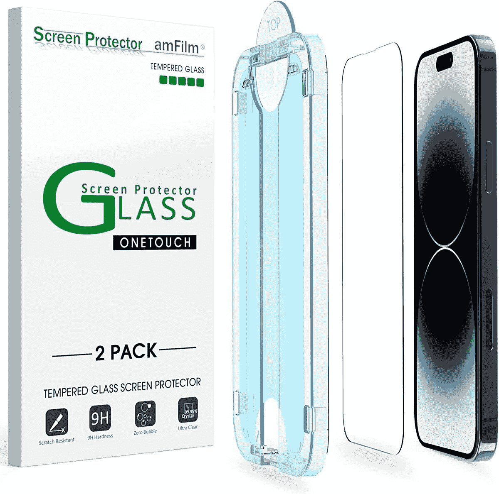
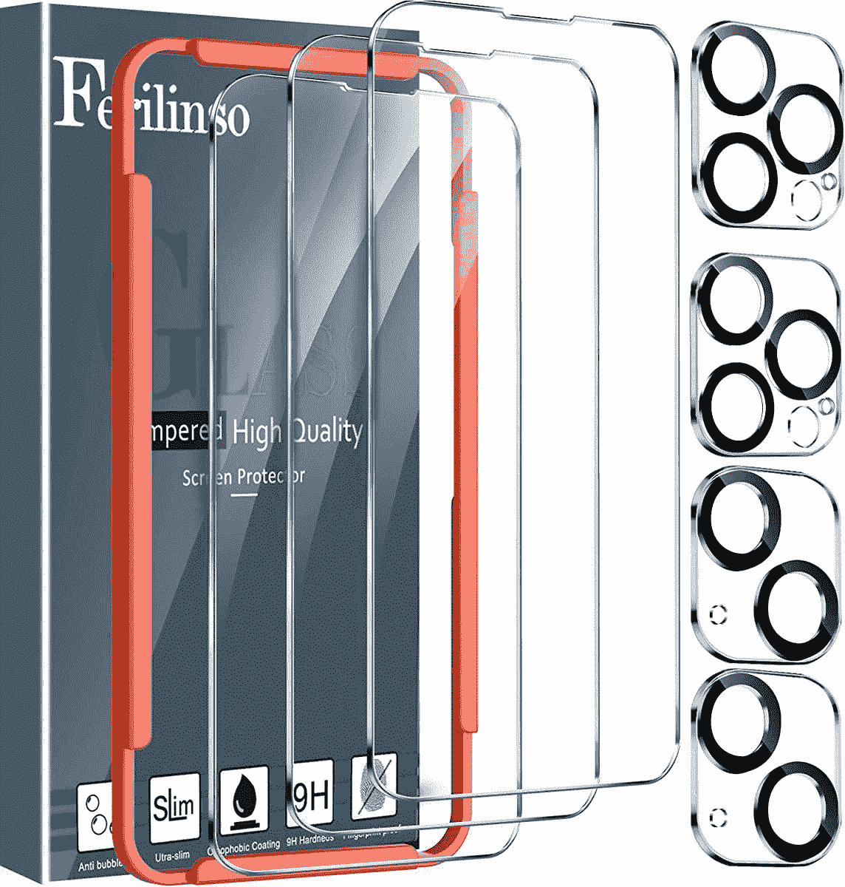

# 2023 年最佳苹果 iPhone 14 Pro Max 屏幕保护器

> 原文：<https://www.xda-developers.com/best-apple-iphone-14-pro-max-screen-protectors/>

# 2023 年最佳苹果 iPhone 14 Pro Max 屏幕保护器

为你的 iPhone 14 Pro Max 买一个便宜的屏幕保护器，让华丽的显示屏不会有划痕和裂缝！

iPhone 14 Pro Max 是苹果 2022 年智能手机系列中最昂贵的手机。这款手机的大 6.7 英寸 Super Retina XDR 有机发光二极管显示屏提供了全高清+分辨率和平滑的 120Hz 自适应刷新率，非常适合那些觉得较小的 Pro 机型上的 6.1 英寸显示屏有点太小的人。显示屏由苹果的陶瓷屏蔽层保护，据说这种陶瓷屏蔽层提供的跌落保护比旧款 iPhones 好四倍，比其他智能手机玻璃更耐用。但是，即使是最好的玻璃和材料也不能保证当你的手机撞到混凝土时，显示屏不会破裂或粉碎。为什么要为一部价格超过 1000 美元的手机冒险呢？只要为你的 iPhone 14 Pro Max 买一个相对便宜的屏幕保护器，让那个华丽的显示屏没有划痕、裂缝和油腻的指纹。

在筛选了这么多选项后，我们将推荐范围缩小到了下面列出的屏幕保护器。

*   ##### 用于 iPhone 14 Pro Max 的 Spigen 钢化玻璃

    sp igen 钢化玻璃在设计时考虑到了 iPhone 14 Pro Max 的动态岛，在不牺牲清晰度或亮度的情况下提供了出色的保护。自动校准安装套件也确保无缝、无气泡的应用。

*   <picture></picture>

    TORRAS

    ##### TORRAS Diamond Shield 钢化玻璃 iPhone 14 Pro Max 屏幕保护器

    采用与 iPhone 14 Pro Max 的 Ceramix Shield 相同的双离子交换技术打造，这款钢化玻璃保护器提供了卓越的防摔、防摔和防刮擦保护。它采用窄边框设计，不会以任何方式损害前置摄像头或 Face ID 的功能。

*   <picture></picture>

    amFilm

    ##### amFilm 钢化玻璃 iPhone 14 Pro Max 屏幕保护器

    这款来自 amFlim 的屏幕保护器由钢化玻璃制成，能够提供出色的防摔防刮擦保护。它只有 0.33 毫米厚，易于使用附带的自动校准安装套件。

*   <picture></picture>

    super shieldz

    ##### super shieldz 宠物 iPhone 14 Pro Max 屏幕保护器

    这是一款基于宠物的屏幕保护器，具有前置摄像头和 Face ID 槽口的精确剪裁。虽然不如钢化玻璃耐用，但这种屏幕保护罩可以保护您的显示器免受指纹、刮擦和划痕的影响，同时还提供最大的透明度和触摸灵敏度。

*   <picture></picture>

    Ferilinso

    ##### Ferilinso iPhone 14 Pro Max 屏幕保护器

    本套装提供三款钢化玻璃屏幕保护器。这种玻璃经过了 10 英尺跌落的认证，你还可以在盒子里得到两个相机镜头保护装置。

*   ##### iPhone 14 Pro Max 的艾伦玻璃屏幕保护套

    这个包里就有三个艾伦的钢化玻璃屏幕保护套。它们的厚度为 0.33 毫米，具有疏水和疏油的屏幕涂层，可以防止汗水和油渣粘在屏幕上。玻璃兼容动态岛，拥有 9H 级硬度。

*   ##### Tech Armor 透明贴膜屏幕保护器

    这是另一种基于宠物的贴膜保护器，可以保护你的 iPhone 14 Pro Max 免受划痕、擦伤和污迹，而不会影响视觉质量或触摸响应。它与动态岛兼容，顶部有一个宽扬声器切口。该包包括四个基于宠物的屏幕保护器。

    T17

这些是目前市场上最好的 iPhone 14 Pro Max 屏幕保护器。添加一个屏幕保护装置和[保护套](https://www.xda-developers.com/best-apple-iphone-14-pro-max-cases/)将大大有助于在未来几年内保持您昂贵的投资清洁和不受损坏。为了获得最大程度的保护，我们建议选择钢化玻璃，而不是其他类型的屏幕保护器。它比基于宠物的保护膜和 TPU 保护器贵一点，但你会得到更好的跌落保护。来自 Spigen 的是我们个人使用过的产品，我们可以全心全意地推荐它，因为它易于应用，并且整体上可以保持你的 iPhone 显示屏的原始状态。

 <picture></picture> 

Apple iPhone 14 Pro

iPhone 14 Pro Max 是 iPhone 14 系列中最贵的手机，提供 6.7 英寸的 Super Retina XDR 显示屏和大电池。

我们还为 iPhone 14 收集了[最佳快速充电器、无线充电器和其他配件，所以请务必也来看看。](https://www.xda-developers.com/best-apple-iphone-14-chargers/)