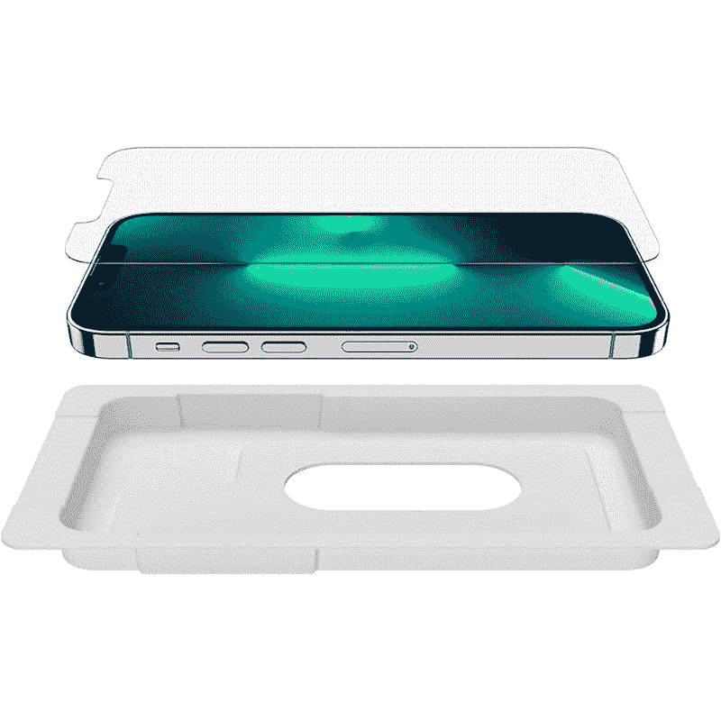
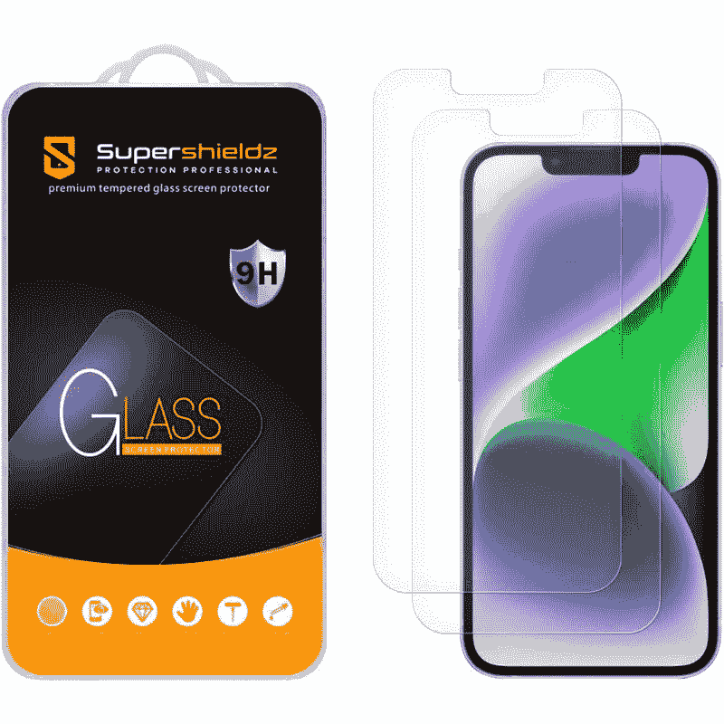
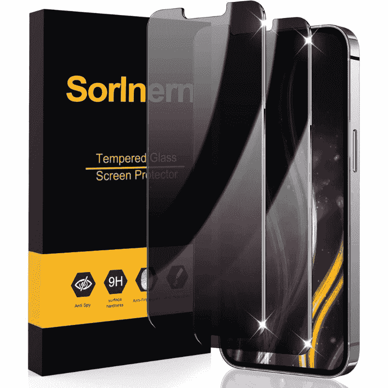
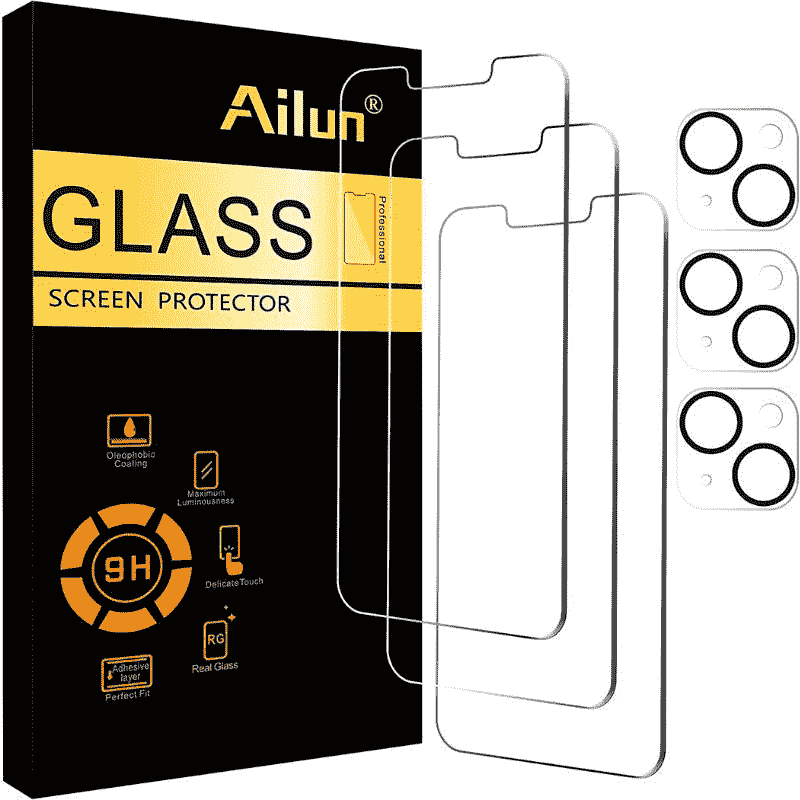

# 2023 年最佳苹果 iPhone 14 屏幕保护器

> 原文：<https://www.xda-developers.com/best-apple-iphone-14-screen-protectors/>

# 2023 年最佳苹果 iPhone 14 屏幕保护器

用这些屏幕保护器保护 iPhone 14 的 Super Retina XDR 显示屏。

苹果 [iPhone 14](https://www.xda-developers.com/apple-iphone-14/) 的显示屏上有一块陶瓷防护玻璃，据说“比任何智能手机玻璃都要坚硬”我们已经在一些老款 iPhones 上看到了相同的陶瓷屏蔽面板，可以肯定地说，它可以很好地防止裂缝，但不太能防止划痕。这就是为什么你应该购买这些推荐的屏幕保护器之一，以保持你的 iPhone 14 的显示屏完好无损，没有任何划痕。市面上有很多 iPhone 14 屏幕保护套，但我们还是在下面为你挑选了一些最好的:

*   ##### iPhone 14 sp igen 钢化玻璃屏幕保护套

    sp igen 钢化玻璃屏幕保护套附带自动对准套件，可帮助您进行安装。钢化玻璃具有 9H 硬度，还带有疏油涂层。

*   <picture></picture>

    Belkin 钢化玻璃

    ##### Belkin 钢化玻璃屏幕保护器

    苹果 iPhone 14 的 Belkin 钢化玻璃屏幕保护器带有抗菌涂层，防止微生物滋生。它还带有引导贴纸，可以帮助你安装在手机上。

*   <picture></picture>

    Supershieldz 防眩光钢化玻璃

    ##### super shieldz 哑光钢化玻璃 iPhone 14 屏幕保护器

    iPhone 14 的 super shieldz 钢化玻璃带有防眩光涂层，可以减少眩光和上面的指纹。它还有 2.5D 圆边，安装后看起来很干净。

*   <picture></picture>

    白石圆顶玻璃屏幕保护器

    ##### 白石圆顶玻璃 iPhone 14 屏幕保护器

    白石为苹果 iPhone 14 提供的圆顶玻璃屏幕保护器附带了一个安装套件，可以轻松进行设置。圆顶玻璃还会填充屏幕上的小裂缝和划痕，使其看起来更好。

*   <picture></picture>

    全私人屏幕保护器

    ##### Sorlnern 隐私钢化玻璃 iPhone 14 屏幕保护器

    隐私屏幕保护器，在你不知道的情况下，使得屏幕只对直接在它面前的人可见。它非常适合在火车或飞机等公共场所使用手机，因为你不想让任何人偷看你的显示器。

*   <picture></picture>

    艾伦钢化玻璃保护套

    ##### 艾伦 iPhone 14 屏幕保护套

    这款特殊的屏幕保护套附带了几款相机镜头保护套。它们非常适合那些不一定想要使用外壳，但希望保持背面相机镜头安全免受刮擦的人。

* * *

在梳理了亚马逊和其他零售商的数百个清单后，这些是我们设法入围的最好的苹果 iPhone 14 屏幕保护器。本系列中提到的所有屏幕保护器都很棒，但我们认为 Spigen 钢化玻璃屏幕保护器是最可靠的选择之一。它不像其他一些屏幕保护器那样便宜，但它是一种经过反复测试的产品，可以保护你的手机显示屏免受意外跌落和磨损。

iPhone 14 现在已经上市，128GB 存储的标准版本起价 799 美元。它与去年的 iPhone 13 有很多相似之处，但也有一些值得注意的改进，可能会引起你的兴趣。在今年的标准 iPhone 中，更大的 iPhone 14 Plus 受到了很多关注，所以在做出购买决定之前一定要检查一下。即使有[最好的交易](https://www.xda-developers.com/best-apple-iphone-14-deals/)，你仍然要为 iPhone 14 支付很多钱。有时，仅仅购买高质量的屏幕保护装置可能不足以保护你的 iPhone，所以不妨看看我们收集的[最佳案例](https://www.xda-developers.com/best-apple-iphone-14-cases/)，看看你是否想为你的 iPhone 增加一些额外的保护。