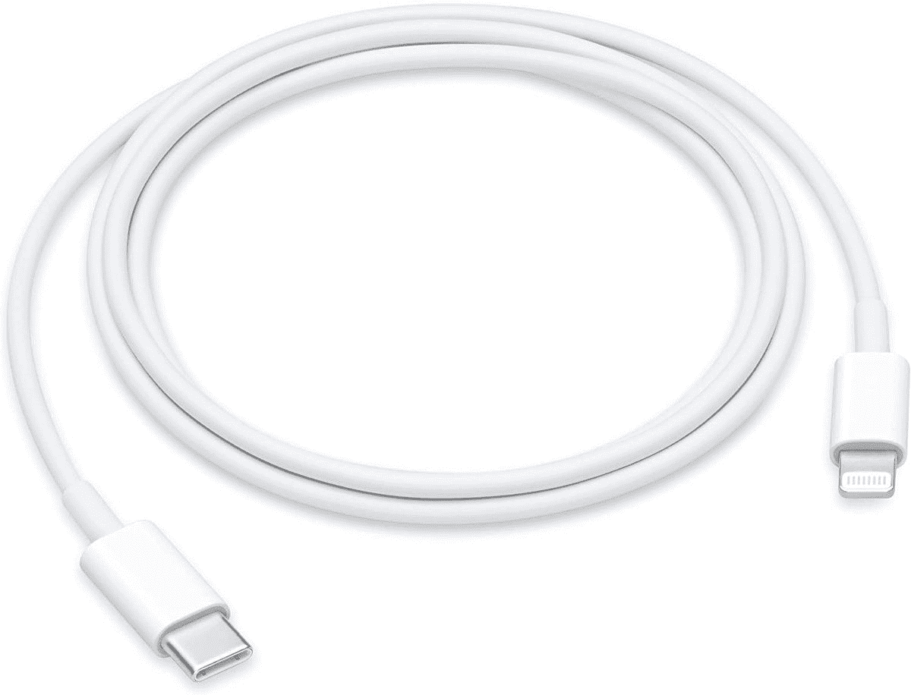

# 2023 年最佳苹果 iPhone SE 3 充电器和线缆

> 原文：<https://www.xda-developers.com/best-apple-iphone-se-3-chargers/>

# 2023 年最佳苹果 iPhone SE 3 充电器和线缆

iPhone SE 3 很棒，也很实惠，但盒子里没有充电器。这里有一些给你的手机充电的最佳选择。

苹果继续保持其平价手机系列，推出了 iPhone SE 3 T1，这款手机在经典的机箱中增加了内部部件。很多人不知道的是，它的盒子里不含充电器。你有一根充电线，但没有可以插的东西。因此，如果你[购买一部 iPhone SE 3](http://www.xda-developers.com/best-apple-iphone-se-3-deals/) ，你将不得不单独购买配件，如[外壳](http://www.xda-developers.com/best-apple-iphone-se-3-cases/)、[屏幕保护器](http://www.xda-developers.com/best-apple-iphone-se-3-screen-protectors/)和充电器。为了帮助你，我们整理了一份目前适用于 iPhone SE 3 的最佳充电器和充电电缆列表。

## 最佳 iPhone SE 3 充电器

*   ##### 苹果 20W USB-C 电源适配器

    这款来自苹果的快速充电器可以在短短 30 分钟内充满你的 iPhone SE 3 一半的电池。它有一个 USB-C 端口，可以与 iPhones、iPads、苹果手表和 AirPods 兼容。

*   ##### Anker 511 Nano 3

    Anker 511 Nano 3 是目前市场上最小的 30W 充电器之一，支持 USB 供电(PD)和可编程电源(PPS)。它有许多不同的颜色可供选择，而且它还可以与各种设备配合使用，包括 iPhone SE 3。

*   <picture></picture>

    Belkin 68W 充电器

    ##### Belkin 65W GaN 双端口 USB 充电器

    这款 Belkin 双充电器是我们最喜欢的充电器之一。它提供两个端口，最大输出功率为 68W(合计)。对于那些想要同时为 MacBooks 和 iPhones 充电的人来说，这是非常理想的。

## 最佳 iPhone SE 3 线缆

*   ##### Anker USB-C 转 Lightning 线缆

    有五种颜色可选，这款 6 英尺长的 Lightning 转 USB Type-C 线缆由生物基材料制成，以减少其碳足迹。它很耐用，至少能承受 20，000 次弯曲。凭借高达 30W 的支持，您可以在使用兼容砖块时为 iPhone 快速充电。

    T34
*   <picture></picture>

    苹果 USB-C 转 Lightning 线

    ##### 苹果 USB-C 转 Lightning 线(2 米)

    这款来自苹果的官方线与 iPhone SE 3 的包装盒中包含的线类似，但长得多，为 2 米。

*   ##### Spigen DuraSync USB-C 转 Lightning 线缆

    Spigen DuraSync 是另一款出色的 USB-C 转 Lightning 线缆。它经久耐用，无缠绕，支持高达 30W 的快速充电。此外，该电缆有一种 3 英尺的尺寸，但您可以购买两种颜色。

* * *

iPhone SE 3 没有很好的电池续航能力。苹果表示，一次充电可以播放长达 50 小时的音频，尽管这一测量取决于几个因素，而这些因素在现实生活中通常是不存在的。正如我们在 [iPhone SE 3 评测](http://www.xda-developers.com/apple-iphone-se-3-review/)中发现的，小电池无法持续一整天，这取决于你的使用情况，尽管只使用手机完成基本任务的人可能能够度过一天。但是，无论你的使用情况如何，你都可以快速为手机充电。使用 20W(或更高)的充电器只需半小时就能充满其电池的 50%。

如果我必须为我的 iPhone SE 3 选择这些充电器中的一个，我会选择苹果 20W USB-C 电源适配器，这是专门为苹果产品设计的，可以按预期工作。我不必担心潜在的质量问题或故障。然而，有很多其他充电器可供选择，无论你只是需要一个额外的充电器，还是想在 iPhone 旁边给其他苹果产品充电。

 <picture></picture> 

Apple iPhone SE 3

##### 苹果 iPhone SE (2022)

中端 iPhone SE 3 (2022)包装了苹果的 A15 仿生芯片，5G 支持，以及经典的设计。它有三种表面可供选择。