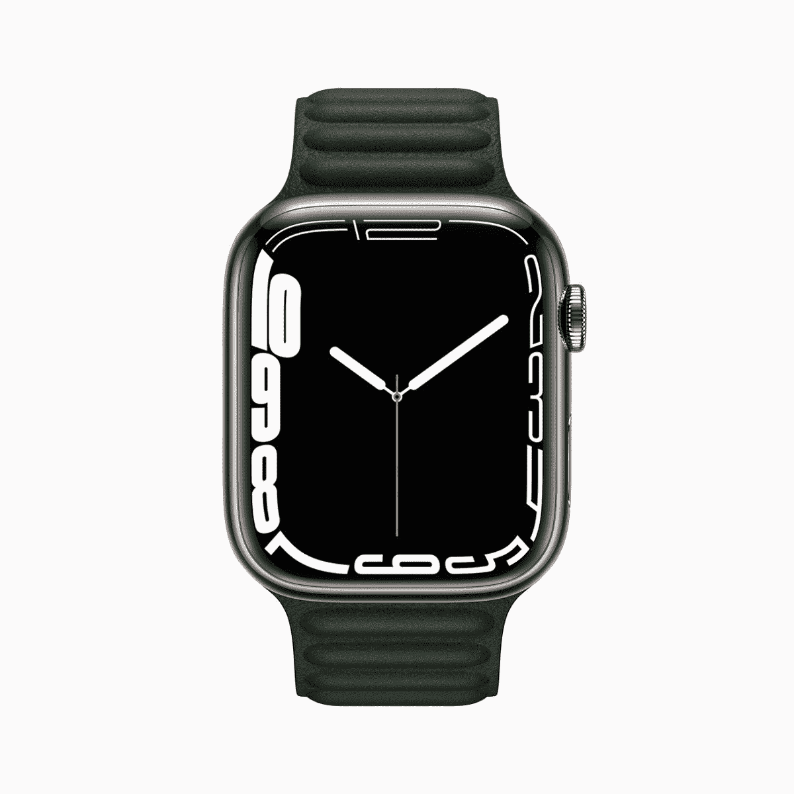

# 2023 年最佳 Apple Watch Series 7 交易

> 原文：<https://www.xda-developers.com/best-apple-watch-7-deals/>

# 2023 年最佳 Apple Watch Series 7 交易

Apple Watch Series 7 已经被苹果公司正式停产，但是如果你行动迅速的话，你可能还是能在一些零售商的网站上找到它。

随着苹果手表系列 8 的发布，伟大的 iPhone 制造商停止了前代产品——T2 苹果手表系列 7。毕竟，2022 年的迭代几乎没有在传感器、技术和功能方面引入任何显著的变化。因此，系列 8 正式取代了系列 7，并以同样的 399 美元的价格出售。尽管如此，当存货售完时，你仍然可以在一些零售商的网站上找到它。不过，不要买苹果手表系列 7，除非它打折很厉害。对于 399 美元的全价，你可能会在更新的系列 8 型号上找到一个[的好交易。](https://www.xda-developers.com/best-apple-watch-series-8-deals/)

## Apple Watch Series 7 在美国的售价是多少？

Apple Watch Series 7 (2021)已于 2022 年 9 月由该公司停产。美国的原始价格可以在下表中找到。

| **Apple Watch Series 7 型号** | **原价** |
| 41 毫米铝合金(全球定位系统) | $399 |
| 45 毫米铝合金(GPS) | $429 |
| 41 毫米铝合金 41 毫米(GPS +手机) | $499 |
| 45 毫米铝合金(GPS +手机) | $529 |
| 41 毫米不锈钢，带运动表带(GPS +手机) | $699 |
| 45 毫米不锈钢，带运动表带(GPS +手机) | $749 |
| 41 毫米不锈钢，带米兰尼斯环路(GPS +蜂窝电话) | $749 |
| 45 毫米不锈钢，带米兰尼斯环路(GPS +手机) | $799 |
| 41 毫米钛(全球定位系统+手机) | $799 |
| 45 毫米钛合金(GPS +手机) | $849 |
| 41 毫米耐克(全球定位系统) | $399 |
| 45 毫米耐克(全球定位系统) | $429 |
| 41 毫米 Nike (GPS +手机) | $499 |
| 45 毫米 Nike (GPS +手机) | $529 |

## 最佳苹果手表系列 7 交易

### 美国电话电报公司(American Telephone and Telegraph Company)

如果美国电话电报公司是你的选择，你可以购买苹果手表系列 7 的手机功能模型。不过，你可能无法激活其他运营商的计划。

 <picture></picture> 

Apple Watch Series 7

##### 苹果手表系列 7

系列 7 的价格和系列 8 一样高。只有在明显打折的情况下才买。这是苹果手表系列 7 的 GPS +蜂窝 41 毫米版本，通过 AT&T 出售。

 <picture></picture> 

Apple Watch Series 7

##### 苹果手表系列 7

系列 7 的价格和系列 8 一样高。只有在明显打折的情况下才买。这是苹果手表系列 7 的 GPS +蜂窝 45 毫米版本，通过 AT&T 出售。

### T-Mobile

如果 T-Mobile 是你的选择，那么这就是你应该去的地方。它正在销售 41 毫米和 45 毫米两种型号的配备蜂窝功能的 Apple Watch Series 7。

 <picture></picture> 

Apple Watch Series 7

##### 苹果手表系列 7

在 T-Mobile 的网站上可以买到 41mm 的 Apple Watch Series 7 (GPS +蜂窝)。

 <picture></picture> 

Apple Watch Series 7

##### 苹果手表系列 7

在 T-Mobile 的网站上可以买到 45mm 的 Apple Watch Series 7 (GPS +蜂窝)。

* * *

正如你所知，大多数零售商已经停止销售 Apple Watch Series 7，因为 Series 8 已经取而代之。如果你正在寻找这款智能手表的 GPS 版本，那么你就不走运了。你要么满足于手机模式(售完即止)，要么买一个 Apple Watch Series 8。

Apple Watch Series 8 是苹果公司最新推出的智能手表。与 Series 7 相比，这不是一个巨大的变化，但它提供了一些新功能，如碰撞检测、新的温度传感器等。