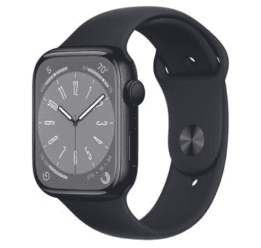
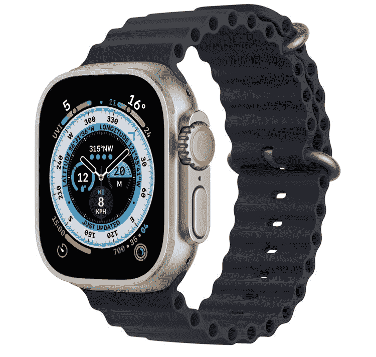

# 2023 年最佳 Apple Watch 机型

> 原文：<https://www.xda-developers.com/best-apple-watch/>

如果你已经买了一部很棒的 iPhones 手机，没有比苹果手表更好的智能手表了。其他制造商根本无法提供库比提诺公司提供的相同水平的深度集成。即使在 Apple Watch 之外，像样的智能手表选择也非常有限，苹果可以说占据了可穿戴设备的头把交椅。但是哪种型号最适合你呢？这需要一些解释。

## 最适合大多数用户:Apple Watch Series 8

目前，[苹果手表系列 8](https://www.xda-developers.com/apple-watch-series-8) 是大多数用户可以买到的最好的型号。它提供了所有最新的消费技术，同时错过了一些超级独家的东西——这些大多是极限运动员需要的。与[系列 7](https://www.xda-developers.com/apple-watch-series-7-review/) 相比，这款车并没有引入太多令人兴奋的新增功能。最值得注意的是，它现在有一个体温监测器，并支持汽车碰撞检测功能。这款手表保留了与其前身相同的屏幕尺寸——41 毫米和 45 毫米。

说到屏幕，它还支持一个永远在线的显示器，允许用户浏览相关信息，即使当他们的手腕放下时。显然，启用该功能会消耗更多的电池电量。然而，许多用户——包括我——可以证明这种妥协是合理的。这款苹果手表充一次电已经可以用一整天了。时刻显示时间、并发症和通知是有意义的。毕竟这是手表。我们不应该在每次需要检查的时候都需要几毫秒的时间让屏幕亮起来。最终，该产品是可选的和可定制的。因此，您可以在此模式下隐藏某些数据，或者完全禁用该功能。

智能手表的另一个亮点是它的耐用性。这款智能手表拥有厚而坚固的前水晶，防尘 IP6X 认证，防游泳 WR50 防水。你所期望的所有健康和健身功能——心率跟踪、血氧监测到运动中的活动跟踪——在这里都可以获得，更不用说新的回溯排卵估计了。

Series 8 可以做的许多事情都可以通过手表 SE 2 实现，这是我们下面预算有限的选择。然而，你没有一个永远在线的显示器、血氧监测支持和心电图硬件。速度方面，两款手表都包含 S8 SoC。不过，Series 8 支持更快的充电速度，这在 SE 2 上仍然没有。售价 399 美元的 Apple Watch Series 8 确实是大多数用户的最佳选择。

然而，如果你发现一个新的，大幅打折的系列 7，它可能是你更好的选择。如果新的排卵估计是不相关的，或者你倾向于使用公共交通工具，那么系列 8 不值得更高的成本。两款手表的体验几乎完全相同。2022 的机型支持蓝牙 5.3 是真的。然而，你可能也分辨不出其中的区别。

 <picture></picture> 

Apple Watch Series 8

这款机型支持大多数用户期望在 Apple Watch 上看到的所有功能以及更多功能。您将获得的一些功能包括始终显示、碰撞检测、心电图、活动跟踪等。

## 最适合极限运动员的:Apple Watch Ultra

Apple Watch Ultra 是第一代产品，但它仍然是极限运动员模型的绝佳尝试。这款手表采用坚固的钛金属结构，是迄今为止最耐用的型号。它还包括硬件和软件部门的大量独家功能，旨在迎合那些认为 Series 8 太缺乏和太脆弱的人。

从硬件开始， [Apple Watch Ultra](https://www.xda-developers.com/apple-watch-ultra-review/) 包括一个可定制的操作按钮。这允许用户访问他们选择的快捷方式，包括操作或应用程序。它还包括一个警报器，大约 600 英尺外都能听到。因此，如果你在某个地方迷路或被困，它将有助于吸引路过的人的注意。去潜水？这只手表可以读取水温，它可以作为深度计。这些特点使它成为潜水员的绝佳伴侣，并帮助他们减少对其他独立设备的依赖。

Apple Watch Ultra 有一个 49 毫米的平板屏幕，而不是圆形屏幕。它支持高达 2，000 尼特的亮度，便于在阳光充足的户外环境中使用。同样，在晚上，用户可以使用专用模式使文本更加清晰。对于那些去野外旅行的人来说，这真的是最好的模型。如果你想知道为什么它有一个平板屏幕，那不仅仅是为了美观。有些人可能会发现 8 系列的圆形显示屏看起来更现代。然而，如果您不小心将手表撞到硬物上，平板屏幕可以帮助避免潜在的损坏。这无疑提高了它的耐用性。事实上，一些 YouTubers 用户在用锤子损坏 Apple Watch Ultra 之前砸穿了他们的桌子。

正如你所料，这款 799 美元的手表也支持 Series 8 中包含的功能。所以你得到心电图，血氧监测，碰撞检测，等等。作为独家服务的一部分，用户可以在三个新的乐队中进行选择，这三个乐队是为不同类型的活动设计的。因此，如果你练习一种特殊的极限运动，阅读每个乐队的介绍，挑选出最适合你锻炼环境的乐队。

 <picture></picture> 

Apple Watch Ultra

##### 苹果手表 Ultra

Ultra model 环形山专为极限运动员打造，他们正在寻找一款坚固耐用的 Apple Watch 和专为他们在海平面以上和以下的冒险提供的独家功能。

## 最佳预算手表:Apple Watch SE 2

如果你预算有限，但又想享受 watchOS，你有一个选择。对于那些不想在可穿戴设备上花大钱的人来说，249 美元的 Apple Watch SE 2 是最佳选择。该型号与 Series 8 和 Ultra 一起发布，包含了您所知道和喜爱的大多数 watchOS 功能。虽然它缺乏像 AOD 那样诱人的功能，但至少在大部分情况下，它提供了相同的 Apple Watch 体验。

首先，所有的基本传感器和产品都包括在内。所以你可以追踪你的活动，使用 Apple Pay，发短信/打电话给别人，等等。您甚至可以获得包含在 8 系列中的 S8 处理器。SE 2 和 Series 8 之间最大的区别包括屏幕尺寸选项、始终显示支持和其他健康相关的功能。

Apple Watch SE 2 有 40mm 和 44mm 两种尺寸。它有更厚的边框，没有永远显示支持，所以屏幕只有在你触发它时才会亮。触发器包括手腕倾斜、屏幕点击等等。此外，这款手表还缺少体温监测、心电图和血氧监测功能。虽然许多用户并不特别需要这些传感器，但某一类客户却需要。

因此，如果你对某个缺失的传感器有担忧或健康状况，你可能会想避免购买 Apple Watch SE。否则，您可以利用汽车碰撞和坠落检测功能。你还可以收到与心脏相关的健康警报，并跟踪你的睡眠情况。心脏相关通知包括高心率、低心率和潜在房颤。请注意，该公司迄今为止发布的 Apple Watch 型号都无法检测心脏病发作。因此，如果你有相关的怀疑，请联系紧急服务。

如果你不在乎更厚的边框，更小的屏幕，缺乏 AOD，以及前面提到的健康传感器的缺失，那么这款手表是最好的选择。即使你的预算有限，如果你对列出的优惠不感兴趣，你也可以安全地购买 SE 2，并享受这一可穿戴类别提供的大部分服务。

 <picture></picture> 

Apple Watch SE 2

SE 2 型号遗漏了一些不重要的功能，如 AOD、快速充电和心电图。对于预算有限的人来说，这是完美的模式。

* * *

如果你对这三个选项都不满意，你可以看看 [Apple Watch Series 7](https://www.xda-developers.com/apple-watch-series-7-review/) 是否更适合你的需求。它类似于系列 8，但它缺少一些最近增加的功能。所以你错过了体温监测，汽车碰撞检测，蓝牙 5.3，等等。它目前的价格为 399 美元，与 Series 8 的价格相符。所以，只有在明显打折的情况下，才选择 7 系列。否则，我们不会认为这是一个明智的购买。

 <picture></picture> 

Apple Watch Series 7

##### 苹果手表系列 7

系列 7 的价格和系列 8 一样高。只有在明显打折的情况下才购买它，而且你发现 SE 2 在包含的产品方面太缺乏。

希望这能帮助你找到最适合你的手表型号。与此同时，既然你正在购买这款智能手表，别忘了看看我们为你挑选的市面上最好的苹果手表表带。最后，我们最近更新了你现在可以买到的[最佳手机](https://www.xda-developers.com/best-phones)指南——值得一探究竟。