# 2023 年苹果硅苹果电脑的最佳应用

> 原文：<https://www.xda-developers.com/best-apps-apple-silicon/>

苹果 [Mac 系列](http://xda-developers.com/best-macs)的大部分现在都由公司自己的芯片驱动，其余的设备迟早也会跟上潮流。这种转变意味着应用程序开发者不得不迅速重写他们的应用程序，以便在苹果的 M 系列芯片上运行。幸运的是，在很短的时间内，数百个应用程序已经更新，以充分利用苹果的最新技术。在这里，我们汇编了可以在苹果电脑上运行的最好的应用程序。

## 最佳生产力应用

在这一类别中，我们列出了一些适用于苹果电脑的最佳应用，可以提高你的工作效率。这里有很多应用程序。虽然不是每个应用程序对每个人都有用，但有一些是每个 Mac 用户都应该安装的。生产力应用从写作应用到第三方日历再到密码管理器。

### 尤利塞斯探测器

尤利西斯可以说是 Mac 上最好的写作应用之一。它具有广泛的功能集，从一整套组织工具到多种导出选项，包括降价文件。此外,《尤利西斯》为有效写作提供了一个干净且不受干扰的界面。它也有适用于 [iPad](https://www.xda-developers.com/ipad-pro/) 和 [iPhone](https://www.xda-developers.com/apple-iphone-12-series/) 的应用，对于生活在苹果生态系统中的人来说，这甚至更好。

 <picture>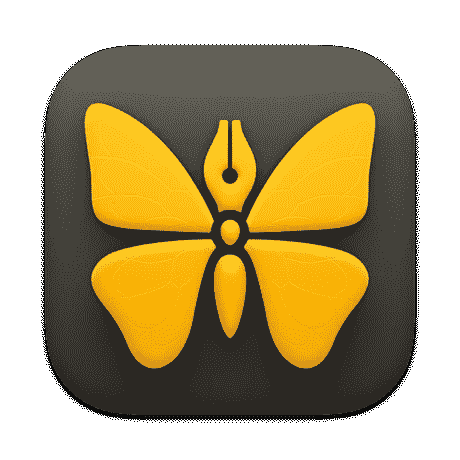</picture> 

Ulysses

##### 尤利塞斯探测器

Ulysses 提供 14 天的试用期，之后你必须选择每月(5.99 美元)或每年(49.99 美元)订阅。

### Todoist

正在寻找一种方法来有效地跟踪要做的事情？Todoist 不会错的。这项广受欢迎的服务不仅包含基本的任务管理功能，还支持大量的应用集成，允许你使用 Gmail、谷歌日历、Slack 和 Alexa 等其他服务来完成任务。

 <picture>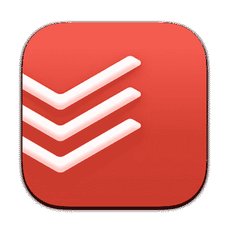</picture> 

Todoist

##### Todoist

Todoist 提供了一个相当不错的免费版本。但是如果你想要额外的功能，你可以选择专业版或商业版。

### 磁铁

Mac 上的窗口管理可能一塌糊涂。这就是磁铁发挥作用的地方。它有助于你保持工作空间的有序。使用 Magnet，您可以通过拖动、使用键盘快捷键或通过菜单栏来组织窗口。它通过将窗口排列成有组织的小块来整理桌面空间。您可以根据自己的喜好将应用程序捕捉到各种方式中。

 <picture>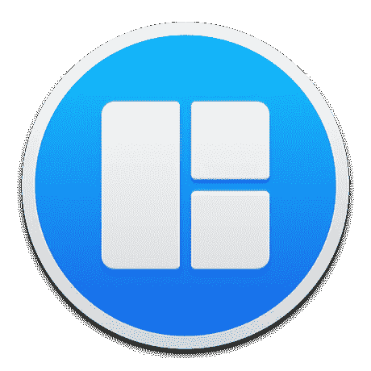</picture> 

Magnet

##### 磁铁

Magnet 是一款窗口管理工具，售价 7.99 美元。

### PDF 专家

如果您经常使用 PDF，那么 PDF Expert 这样的应用程序是您的必备工具。有了它，你可以查看，编辑，合并，甚至转换 pdf。该应用程序还允许您注释、签名和填写 pdf 文件。几乎所有你能想到的用 PDF 做的事情都可以用 PDF Expert 来完成。

 <picture>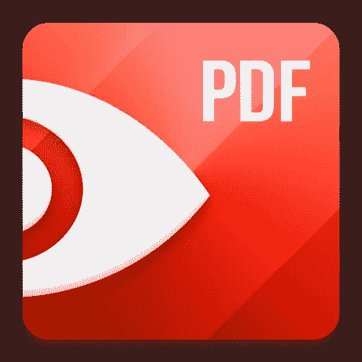</picture> 

PDF Expert

##### PDF 专家

PDF Expert 是免费下载的，但您需要专业版订阅才能使用签署文档、合并 PDF 和编辑 PDF 文本/图像等功能。

### 空想的

如果你想要比苹果 Mac 内置日历更强大的东西，Fantastical 可以帮助你。它可以使用自然语言处理将正常的句子转换成格式清晰的约会条目。您还可以连接所有日历，并将事件和任务同步到一个位置。此外，Fantastical 还提供了一些小工具，让你可以随时关注即将到来的约会。这个伟大的应用程序还有很多其他功能。

 <picture>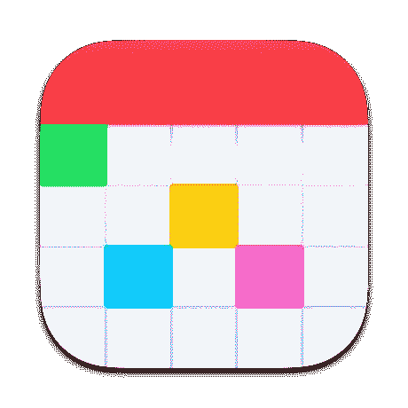</picture> 

Fantastical

##### 空想的

Fantastical 是免费使用的，但你需要付费订阅才能使用所有功能。

### 一款云视频会议软件

疫情冠状病毒使 Zoom 成为许多人的必备应用程序。无论您是在家工作还是与朋友和家人联系，Zoom 都是一款易于使用的视频会议应用程序。除了视频通话，您还可以使用 Zoom 与您的联系人聊天并分享资料。此外，Zoom 的内置搜索功能使查找联系人、信息和文件变得更加容易。

 <picture>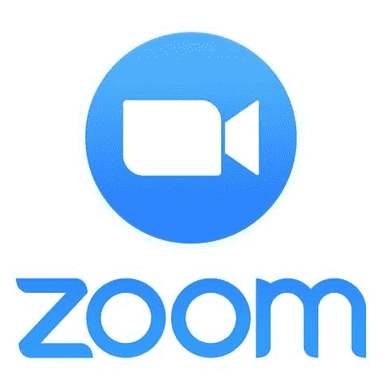</picture> 

Zoom

##### 一款云视频会议软件

Zoom 是免费下载的，它的基本计划允许您主持多达 100 名与会者参加长达 40 分钟的会议。对于较长的会议，你将不得不选择专业，商业或企业计划。

### 简单笔记

如果你正在寻找一款简洁的笔记应用，Simplenote 就是你的选择。它提供基本的笔记和同步支持。此外，板载有协作功能，因此您可以共享笔记和列表供他人查看或编辑。Simplenote 也可以在所有主要平台上使用。

 <picture>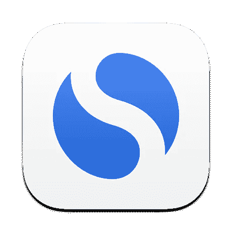</picture> 

Simplenote

##### 简单笔记

Simplenote 可以跨平台免费下载和使用。

### 1 密码

有如此多的密码需要跟踪，拥有一个密码管理应用程序是显而易见的，1Password 是周围最好的密码管理器之一。它不仅允许您保存无限的密码和项目，而且还有 1GB 的存储空间来存储重要的文档。1Password 还会向您通知受损网站和易受攻击的密码，以便您采取措施并保持安全。

 <picture></picture> 

1Password

##### 1 密码

1Password 应用程序可免费下载，并提供 14 天试用期。若要继续使用，您需要购买订阅。

### 微软 365

微软是首批更新其应用程序以支持 M1 的开发者之一。因此，您的 Word、Excel、PowerPoint、Outlook 和 OneNote 应用程序可以流畅运行，并充分利用 Apple Silicon 的强大功能。如果你不是苹果 Pages 和 Numbers 应用程序的粉丝，或者你已经在其他平台上使用微软的 365 应用程序，探索它们的 Mac 版本是完全有意义的。

 <picture>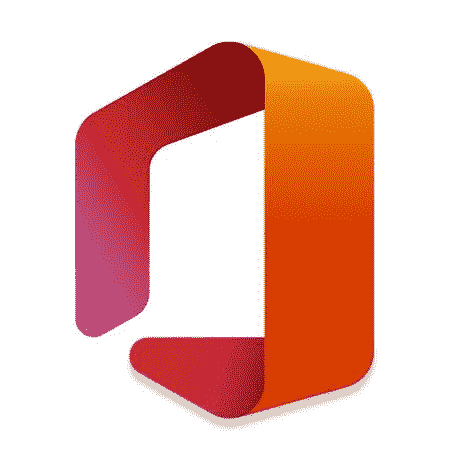</picture> 

Microsoft 365

##### 微软 365

微软 365 捆绑包或其单独的应用程序可以免费下载，但你需要订阅微软 365 才能使用 Word、Excel、Powerpoint 和 Outlook。还有一个月的试用期。

### 阿尔弗烈德

阿尔弗雷德经常被称为超级聚光灯。但这还不足以涵盖它的能力范围。当然，你可以用它来启动应用程序，搜索东西，计算东西，但它也让你使用关键字来触发系统命令。如果你购买了这款应用的 Powerpack，它的功能会大大增加。

例如，Powerpack 允许您自定义应用程序和文件的键盘快捷键，创建自动化的自定义工作流等等。此外，该应用程序包括您的剪贴板历史，因此您可以快速找到您之前复制的文本、图像或文件。

 <picture>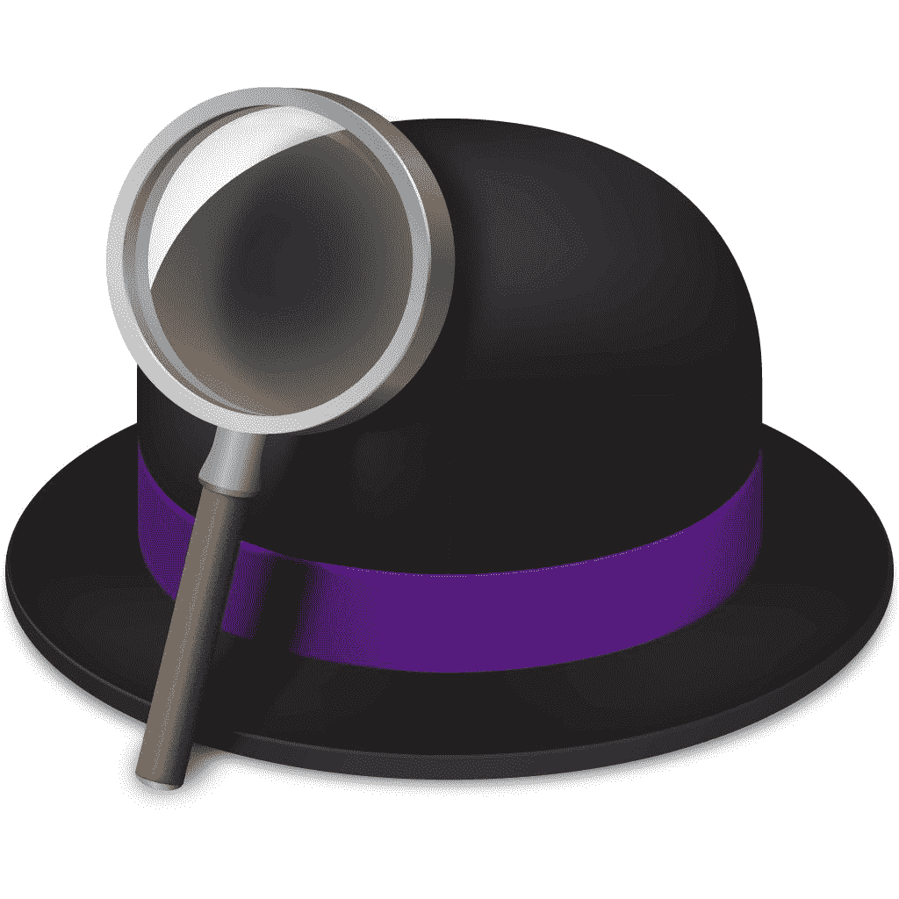</picture> 

Alfred

##### 阿尔弗烈德

阿尔弗雷德是免费下载和使用。但它的 powerpack 售价为 29 英镑(约合人民币 10 万元)。$40).

### 比特监狱长

虽然 1Password 是一个优秀的密码管理器，但您需要付费订阅才能使用它，这可能会让许多人感到沮丧。幸运的是，你不需要因为钱而妥协你的网络安全；Bitwarden 是一个神奇的密码管理器，附带一个免费计划。

即使在这个免费计划中，您也可以获得一切，包括保存无限密码的能力、在无限设备上访问、安全存储 id、信用卡和笔记、密码生成器等。此外，Bitwarden 是开源的，并带有适用于所有主要平台和浏览器的应用程序。

 <picture>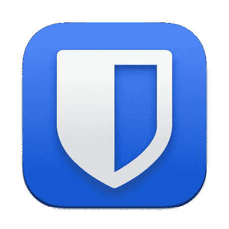</picture> 

Bitwarden

##### 比特监狱长

Bitwarden 可以免费下载使用。它的免费计划对大多数人来说绰绰有余。

### 里德

社交媒体可能已经成为许多人获取新闻的首选方式，但仍然有很多人喜欢 RSS 阅读器关注他们最喜欢的网站。如果你是这些人中的一员，Reeder 是一款优秀的 Mac 应用。它结合了 RSS 阅读器和稍后阅读服务的功能。该应用程序带有一个干净且易于导航的界面，并支持与 iCloud 同步订阅源和文章。

如果你是苹果生态系统的一员，你会很高兴知道 Reeder 有适用于 Mac 和 iPhone 的应用。

 <picture>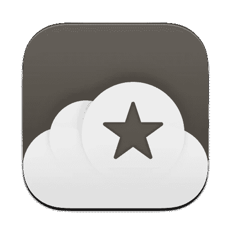</picture> 

Reeder

##### 里德

Reeder 售价 9.99 美元，可通过 Mac 应用商店购买。

* * *

## 最佳浏览器

这个类别是不言自明的。我们都需要一个好的网络浏览器，虽然苹果将自己的 Safari 与 macOS 捆绑在一起，但并不是每个人都喜欢使用它。

### 铬/边缘/火狐

谷歌、微软和 Mozilla 很快更新了浏览器以支持苹果芯片。因此，如果你想在 Safari 之外寻找，有很多选择。在功能方面，Chrome 和 Firefox 比 Edge 更有优势，因为其基于 Chrome 的版本仍然相对较新。选择你的选择！

* * *

## 最佳社交应用

许多流行的社交应用程序都驻留在我们的手机上，尽管苹果硅 Mac 现在支持 iOS 应用程序，但你不会在这里找到抖音和 Instagram 这样的应用程序，因为他们已经选择不在 Mac 上正式提供。因此，在苹果硅 MAC 电脑的最佳应用程序类别中，它的选择余地很小。

### Reddit 的阿波罗

随着基于 ARM 的 M 芯片的加入，苹果已经开始在部分 MAC 上支持 iOS 应用程序。虽然许多 iOS 应用程序不能在笔记本电脑和台式机上提供良好的体验，但 Apollo for Reddit 是一个例外。它在 Mac 上看起来和运行起来都很不错。有了 Apollo，你就有了在子编辑区之间跳转的跳转栏、便于导航的选项卡式界面和完整的内嵌图像上传等功能。还有很多其他的东西。

 <picture></picture> 

Apollo

##### 阿波罗

Apollo 可以免费下载和使用。您也可以购买专业版或超级版套餐以获得额外功能。

如果你还不是 Twitter 官方 Mac 应用的粉丝，是时候再试一次了。这款应用在最近几年变得更好，现在反应更快，功能更全。这款应用的设计看起来也很赏心悦目，你可以轻松地在账户之间切换。

 <picture>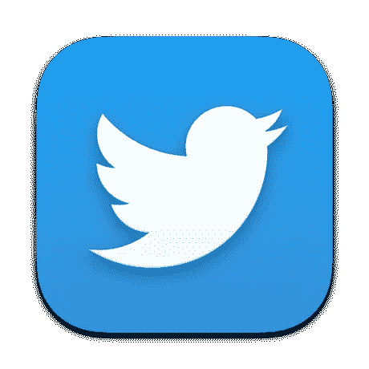</picture> 

Twitter

##### 推特

Twitter 可以免费下载和使用。

* * *

## 最佳音频/视频应用

与社交应用一样，几乎所有流媒体服务都选择不在苹果硅 MAC 上正式提供。幸运的是，苹果硅 MAC 上的 iOS 应用支持并不是完全失败，因为 iOS 的阴云应用出现在这一类别中。

### 遮蔽

就像 Reddit 上的 Apollo 一样，covery 是另一款在 Mac 上运行良好的 iOS 应用。如果你想要一个好的播客播放器，不用再找了。它拥有简单直观的界面，还有大量有用的功能，如语音增强、智能速度、智能播放列表和睡眠定时器。你还可以下载播客，搜索新的播客，甚至获得个性化的推荐。此外，该应用程序具有强大的回放定制选项。

 <picture>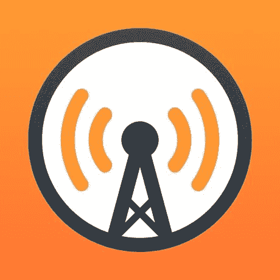</picture> 

Overcast

##### 遮蔽

阴是免费下载和使用，但你可以购买阴溢价摆脱广告。

### VLC

VLC 不需要介绍。这是最受欢迎的跨平台多媒体播放器之一。如果你想要一个稳定的视频播放器，这就是它。它可以播放多种文件格式，并支持多种编解码器。

 <picture></picture> 

VLC

##### VLC

VLC 是免费下载和使用的。

### 手闸

手刹对于 Mac 来说是一个优秀的视频转换器。您可以转换几乎所有内容，从 DVD 或蓝光源到最常见的视频文件，再到 MP4、MKV 或 WebM 格式。该应用程序带有几个特定于设备的预设和通用配置文件，使您更容易获得您所需要的东西。你还可以添加字幕，添加章节标记，用手刹进行队列编码。有很多功能，该应用程序是开源的。

 <picture></picture> 

Handbrake

##### 手闸

手刹免费下载使用。

* * *

## 最佳照片应用

照片是我们生活中很重要的一部分，多亏了智能手机，人类比以往拍了更多的照片。因此，无论你是否是专业摄影师，你都有可能想要一个照片编辑应用程序，让你的照片更上一层楼。

### Pixelmator Pro

Pixelmator Pro 是 Mac 上最好的图像编辑软件之一。它与其他照片编辑器的区别在于内置的自动修图工具，这些工具由机器学习算法驱动。您还可以获得高级照片处理功能，包括常见的 RAW 编辑选项、预设、滤镜和图层编辑。此外，Pixelmator Pro 为创意专业人士提供了一整套用于创建设计的矢量工具和许多其他功能。

 <picture>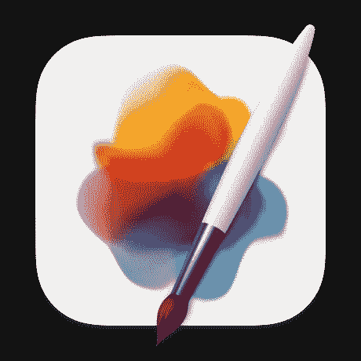</picture> 

Pixelmator Pro

##### Pixelmator Pro

Pixelmator Pro 提供 15 天的试用期，之后你必须以 19.99 美元的价格购买。

### 暗房

暗室是另一个强大的照片编辑应用程序，你应该探索。虽然它在 Mac 领域相对较新，但它已经成为 iPhone 和 iPad 上非常受欢迎的照片应用程序。Darkroom 不仅包含强大的管理和编辑工作流程，还具有深度 iCloud 照片库集成。这个应用程序看起来很棒，拥有你需要的几乎所有东西来增强你的照片，包括原始编辑。

 <picture>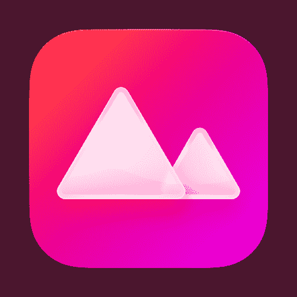</picture> 

Darkroom

##### 暗房

Darkroom 是免费下载的，包括几个应用内购买来解锁高级功能，包括一次性购买 49.99 美元，可以永远解锁一切。

* * *

## 最佳实用应用

最后，我们为 Apple Silicon Mac 用户提供了最好的实用程序。如果你希望你的 Mac 长期保持出色的性能，这些应用程序可以帮助你。

### MacCleaner Pro

MacCleaner Pro 是一款有效的 Mac 垃圾文件清理器和速度优化器。使用该应用程序，您可以清理内存，禁用启动程序，清除缓存，删除安装文件和删除不需要的本地化文件。MacCleaner Pro 还可以帮助您识别占用磁盘空间的应用程序或文件。此外，该应用程序带有工具，可以找到重复的文件，并完全删除程序。

 <picture>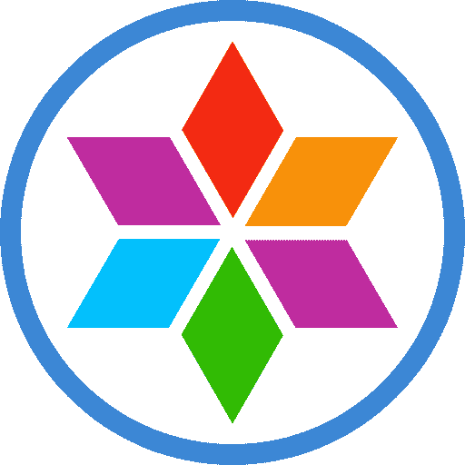</picture> 

MacCleaner Pro

##### MacCleaner Pro

MacCleaner Pro 提供 7 天的试用期，之后你必须以 44.95 美元的价格购买。

### AppCleaner

虽然在 Mac 上卸载程序非常容易，但卸载过程会留下许多临时文件和垃圾文件。AppCleaner 会帮助您清理这些垃圾，这样您就不会有不必要的东西堵塞您的 Mac。它非常简单易用。

 <picture></picture> 

AppCleaner

##### AppCleaner

AppCleaner 免费下载使用。

### 酒保

如果你不喜欢杂乱的菜单栏，调酒师是一个应用程序。它可以帮助你控制你的 Mac 的菜单栏，让你隐藏在一个图标后面的一切。该应用程序还允许您设置触发器，以便仅在您需要时显示选择菜单栏项目。

 <picture></picture> 

Bartender

##### 酒保

酒保提供为期四周的试用，之后你必须花 15 美元购买。

### 解压器

尽管 macOS 自带了一个内置的归档工具，但它相对来说还是比较简单的。因此，如果你经常处理归档文件，你需要一个像 Unarchiver 这样强大的应用程序来提取你得到的几乎所有压缩文件。它支持许多存档格式，包括最流行的格式，如 Zip、RAR、7z、Tar 和 Gzip。

 <picture>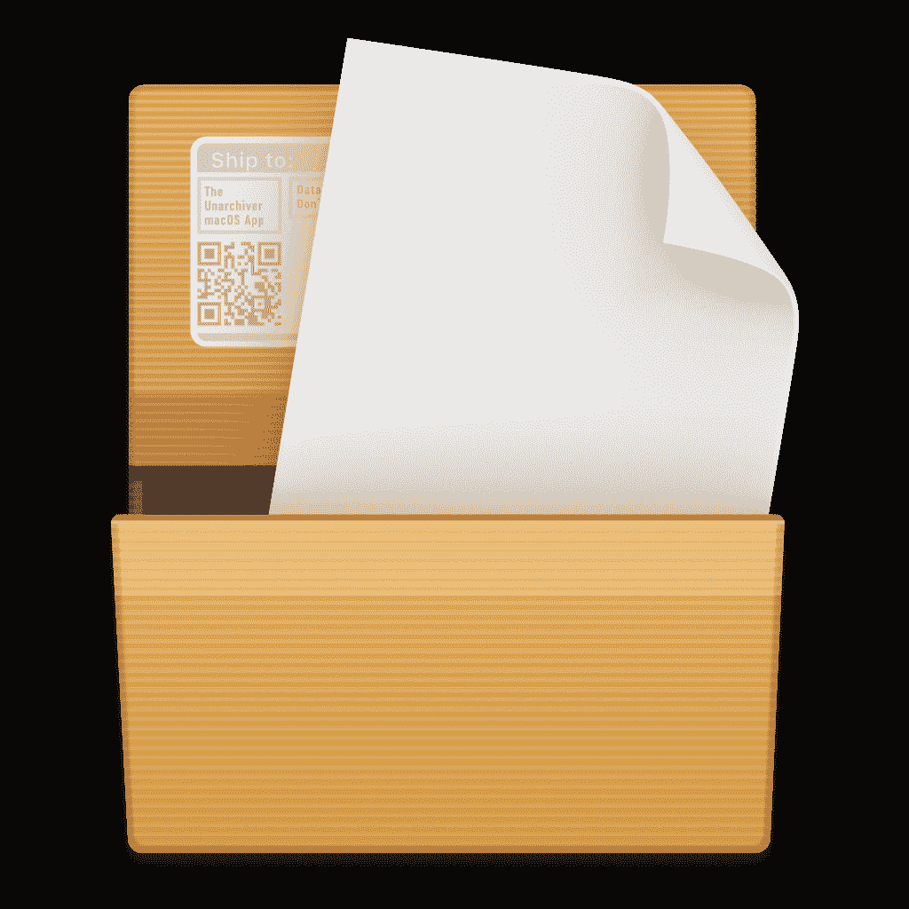</picture> 

The Unarchiver

##### 解压器

解压器可以免费下载和使用。你可以从 Mac App Store 或该应用的网站上下载。

### 安非他明

如果你想防止你的 Mac 进入睡眠，显示屏幕保护程序，或调暗屏幕，安非他明是一个很好的应用程序。当您想要让任务保持运行，并且不想让 Mac 自动进入睡眠状态时，这非常有用。您可以使用该应用程序让系统无限期保持唤醒状态，直到特定时间、特定应用程序正在运行或文件正在下载。您也可以创建触发器来保持 Mac 处于唤醒状态。有很多可以玩的。

 <picture>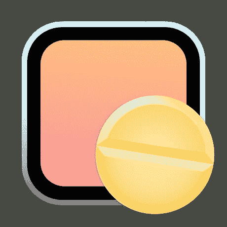</picture> 

Amphetamine

##### 安非他明

安非他明可以免费下载和使用。

### 缟玛瑙

如果你需要一些东西来保持你的苹果硅 Mac 电脑处于最佳状态，Onyx 是一个很好的选择。这款应用自 2003 年就已经出现，深受 macOS 技术人员的喜爱。它可以执行系统维护和清理任务，删除有问题的文件夹，重建数据库，等等。此外，Onyx 可以在启动时验证文件系统的结构，并修复任何磁盘权限。

 <picture>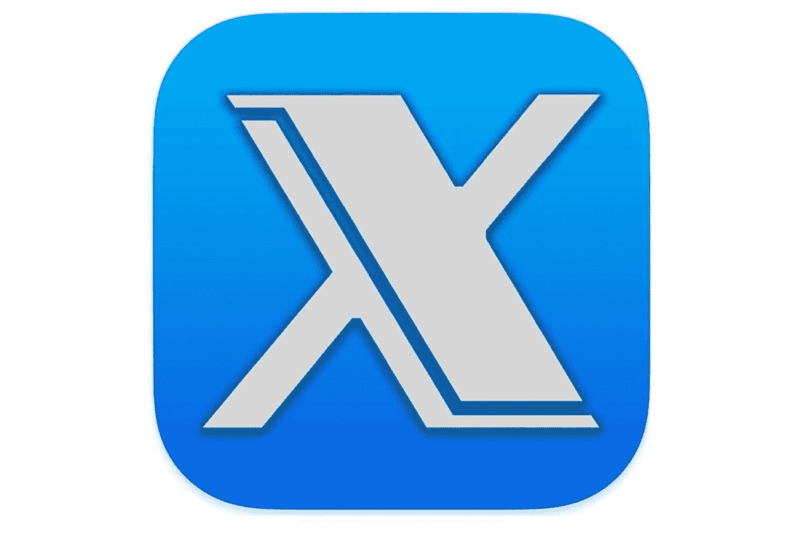</picture> 

Onyx

##### 缟玛瑙

Onyx 可以免费下载和使用。

* * *

以下是我们为苹果硅 MAC 电脑挑选的最佳应用。鉴于许多优秀的 Mac 应用程序仍在等待 M 芯片的更新，这个列表在未来几个月只会越来越长。如果你喜欢冒险，你甚至可以在装有 Windows 10 的苹果电脑上使用 Windows 应用程序，尽管我们不建议普通用户这么做。

*你打算在你的 Apple Silicon Mac 上安装哪些应用？你认为我们错过了一个应用程序吗？请在评论区告诉我们！*