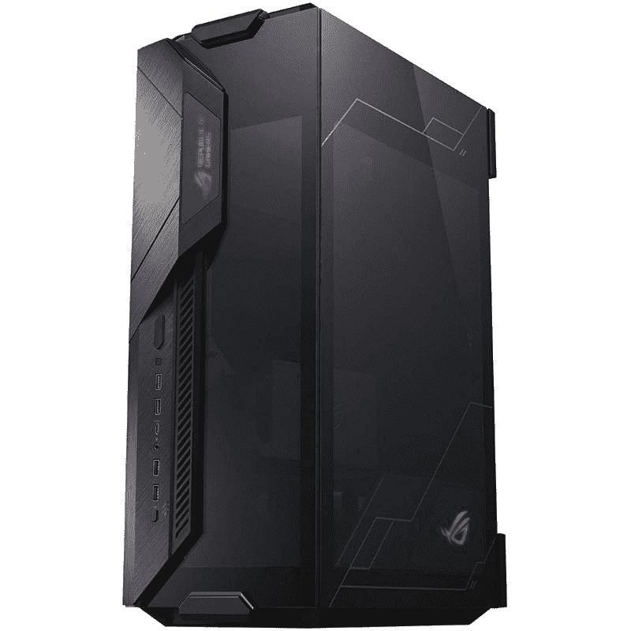

# 2023 年最佳华硕电脑机箱

> 原文：<https://www.xda-developers.com/best-asus-cases/>

仅仅因为竞争的规模，为你的下一款电脑选择[最佳电脑机箱](http://www.xda-developers.com/best-pc-cases/)可能会有点困难。每种外形规格都有数百种不同的机箱，无论是全塔式、中塔式还是小型机(SFF)机箱。没有两种情况是相同的，考虑各种因素和指标以确保您选择最适合您的电脑非常重要。

您可能对案例领域的顶级品牌很熟悉，如联立、NZXT，请安静！，Corsair 和 Thermaltake，但您知道华硕有几个案例可供选择吗？你不仅可以买到该品牌的几乎所有电脑组件，还可以买到安装这些组件的机箱。我们在这里收集了最好的华硕电脑机箱供您选择。

## 最佳综合:华硕 TUF 游戏 GT501

我们最喜欢的华硕电脑外壳是 TUF 游戏 GT501。这是一款大型中塔式机箱，与知名品牌的其他选项相比，它的价值非常高。机箱本身将支持高达 E-ATX 的主板，这提供了充分的定制和构建配置。它也是一个尤物，尤其是在这种灰色和全金属底盘感觉溢价工作。

华硕对冷却电脑略知一二，GT501 背后的团队确保设计中有充足的通风。华硕 TUF 游戏 GT501 不应该只为气流而购买，因为其他全正面网状面板外壳会提供更好的性能，但有足够的空间用于多个散热器，你不会有任何问题给机箱风扇提供冷空气。

前面板有穿孔的侧面，提供了大部分的入口，360 毫米的散热器可以安装在这里，以利用即时访问。一个额外的 360 毫米散热器可以安装在顶部，到处都有灰尘过滤器。4 毫米厚的钢化玻璃侧板经过烟熏处理，搭配一些内部 RGB 照明，营造出一种视觉盛宴。

华硕没有廉价出售附带的机箱风扇，因为三个 120 毫米 Aura Sync RGB 风扇预装在前面板上。后部还有一个 140 毫米的风扇。另外三个可以安装在前面提到的散热器支架的顶部，以帮助保持内部的一切工作在最佳温度范围内。

就内部组件空间而言，华硕 TUF 游戏 GT501 允许长度高达 420 毫米的 GPU 和高度为 180 毫米的 CPU 冷却器。标准的 ATX 电源可以安装在可拆卸的护罩下面。像一些安静的人！更优质的机箱，这华硕的情况下，让您基本上拉除它时，建设或执行维护。

对于扩展，我们谈论的是通常的七个 PCI 插槽阵列，尽管华硕包括另外两个垂直插槽，用于安装带有可选 PCIe 竖板电缆(不包括)的 GPU。最多可以安装七个 2.5 英寸驱动器或三个 2.5 英寸和四个 3.5 英寸驱动器。最后，前面板 I/O 没有 USB-C，但我们有两个 USB 3.1 Gen 1 端口和音频插孔可供使用。

##### 华硕 TUF 游戏 GT501

如果您有强大的 PC 组件，需要一个大机箱来充分冷却，请查看华硕 TUF 游戏 GT501。如果安装了所有风扇，它会有良好的气流，提供良好的电缆管理，看起来也是如此。

## 最佳电脑机箱设计:华硕 ROG Strix Helios

我们无法编辑一份最好的华硕电脑机箱清单，而不包括华硕 ROG Strix Helios。看看这个东西。当你打开盒子，凝视全铝结构时，它给人留下了深刻的印象。前面有一个全尺寸的 RGB 面板，可以与华硕光环生态系统同步，它并不像人们想象的那样令人讨厌。

不是一个，不是两个，不是三个，而是四个钢化玻璃面板附在铝框架上，形成了一个坚固而华丽的 PC 机箱。如果你认为 NZXT 与 H5 精英走得太远，华硕全力以赴为 ROG Strix Helios 配备玻璃。华硕 ROG Strix Helios 的内部空间非常大，最多可以容纳一个 E-ATX 主板和一个定制的水冷回路。

内部可以找到 RGB 条，也支持 AURA 软件，这意味着只要您的其他组件也兼容，您应该能够处理和同步机箱内的所有照明效果。在 GPU 和 CPU 冷却器的尺寸方面，华硕允许卡的长度高达 450 毫米，CPU 冷却器的最大高度可达 190 毫米。然而，我们建议在这种情况下使用水冷。

您可能已经注意到，只有三个钢化玻璃面板可以从外面看到，这是因为第四个面板实际上覆盖了主板后面的电缆管理区域。通过连接侧面板，这有效地隐藏了两块玻璃后面的布线，同时后侧的区域稍微更加半透明。像我们的顶级 TUF 游戏案例一样，华硕包括四个华硕 ROG Strix Helios 风扇。

四个风扇是预先安装的(没有 RGB 照明),并且都连接到一个附带的风扇集线器。可以安装另外三个风扇。对于散热器支撑，您将看到高达 420 毫米的散热器，以及顶部面板上的 360 毫米散热器。虽然它不像市场上的其他箱子那样碍事，但你可能会发现前面板很难通过两个可用的切口吸入冷空气。

除了两个垂直插槽外，还有七个扩展槽。有四个 2.5 英寸驱动器托架，可以相应地再部署两个 2.5/3.5 英寸托架。前面的 I/O 功能齐全，包括一个 USB-C 3.1 Gen 2 端口、四个 USB-A 3.0 端口、一个 RGB 照明控制按钮和一个风扇速度控制按钮。

##### 华硕 ROG Strix 太阳神电脑盒

华硕 ROG Strix Helios PC 机箱是一款出色的中塔式游戏机箱，预装了一堆风扇和 RGB 灯。

## 最佳预算电脑案例:华硕 TUF 游戏 GT301

华硕 TUF 游戏 GT301 PC 案件可以被认为是更小，更便宜的兄弟强大的 GT501 案件，我们建议作为我们最好的华硕 PC 案件。它更紧凑，这意味着您将无法安装更大的 E-ATX 主板，但这确实会导致 PC 占用更少的桌面空间。这种设计也有助于更好地区分两者。

对于华硕 TUF 游戏 GT301，我们看到的是一个带有穿孔蜂窝图案的前金属板，以促进气流。事实上，你甚至可以说，与 GT501 相比，这款机箱的前面板设计更好，可以优先考虑气流。顶部面板还利用网眼将空气从通风口中抽出(或推出)。与其他情况一样，侧板是烟熏钢化玻璃。

像其他品牌的外壳一样，华硕在前面包括三个 Aura Sync 120mm 毫米风扇，在后面有一个 140 毫米风扇用于排气。另外两个 120 毫米的风扇可以安装在顶部。一个 360 毫米的散热器可以安装在前面板上，这就是我们所有的水冷支持。正如所料，灰尘过滤覆盖了所有的进气口。

虽然它可能比 GT501 略紧凑，但仍有足够的空间在机箱内构建更强大的游戏 PC。ATX 主板可以安装在 CPU 冷却器旁边，最大高度可达 160 毫米。还有足够的空间来安装最大长度达 320 毫米的 GPU。TUF 游戏 GT301 有 7 个扩展槽，最多可容纳 4 个 2.5 英寸和 2 个 3.5 英寸驱动器托架，用于外部存储驱动器。机箱的前面板 IO 带有两个 USB 3.1 Gen 1 端口、几个音频端口、一个 LED 控制和一个 PC 重置按钮。

##### 华硕 TUF 游戏 GT301

华硕 TUF 游戏 GT301 是这个系列中最实惠的电脑机箱之一，价格不到 100 美元。

## 最佳迷你 ITX 电脑机箱:华硕 ROG Z11

事实证明，要找到一个坚固的小尺寸(SFF)机箱来内置电脑是一项挑战。其中大多数要么是预建的电脑，要么是过度设计，要么是定价超出预算。在个人电脑机箱领域，这是一个相对较小的利基市场，但这并没有阻止华硕推出自己的迷你 ITX 机箱，即华硕 ROG Z11。

华硕 ROG Z11 可能是一个紧凑的机箱，但它的设计有很多值得欣赏的地方，包括获得专利的主板托盘 11 度倾斜和烟熏钢化玻璃侧面板。上述专利设计功能有助于为可安装在机箱内的高端组件提供额外的气流。这种布局创造的额外空间还允许 CPU 和显卡周围有更多的散热空间。

顶部面板最多可安装两个 120 毫米或 140 毫米风扇，侧面可安装两个 120 毫米风扇。最后，底部可以安装一个 120 毫米或 140 毫米的风扇。如果这还不够，ROG Z11 支持为 AIO 冷却回路安装 240 毫米散热器。在这方面，这无疑是一个独特的迷你 ITX 案例。

华硕 ROG Z11 相对于其他迷你 ITX 机箱的另一个优势是能够有效地管理电缆。一旦所有东西都放在一起，机箱就可以根据喜好和位置水平或垂直放置。与游戏控制台不同，现有的灰尘过滤器将有助于减少内部积累的灰尘量。

前面板 I/O 包括许多用于连接的端口。您可以获得两个 USB-A 3.2 Gen 1 端口、两个 USB-A 2.0 端口和一个 USB-C 3.2 Gen 2 端口。还有一个 ARGB 控制和 I/O 面板上的复位按钮，使控制照明和系统本身变得更容易。在尺寸方面，最大的 CPU 冷却器可以高达 130 毫米，GPU 不能长于 320 毫米。有趣的是，华硕 ROG Z11 允许安装一个 ATX PSU。

 <picture></picture> 

ASUS ROG Z11 mini-ITX PC case

##### 华硕 ROG Z11 迷你 ITX 电脑盒

华硕 ROG Z11 迷你 ITX 是目前市场上最好的电脑机箱之一。尽管外形小巧，但这款机箱提供了大量有用的功能。

## 最佳华硕电脑案例:最终想法

这就是我们对最好的华硕电脑机箱的所有建议。华硕没有太多的机箱可用，我们相信这些是唯一值得考虑的机箱，这取决于您心目中的构建类型。华硕 TUF 游戏 GT501 是值得一试，如果你正在寻找建立一个中端至高端电脑。那些倾向于 SFF 构建的人可以查看 ROG Strix Z11 miniITX PC 机箱，而 ROG Strix Helios 更适合发烧友构建。

我们鼓励您查看我们的其他收藏，如[最佳主板](https://www.xda-developers.com/best-motherboard/)或甚至[最佳 CPU](https://www.xda-developers.com/best-cpus/)，如果您正在计划新的 PC 构建。或者，您也可以加入我们的 [XDA 计算论坛](https://forum.xda-developers.com/c/xda-computing.12289/)，讨论您的构建，并从我们社区的专家那里获得更多建议。