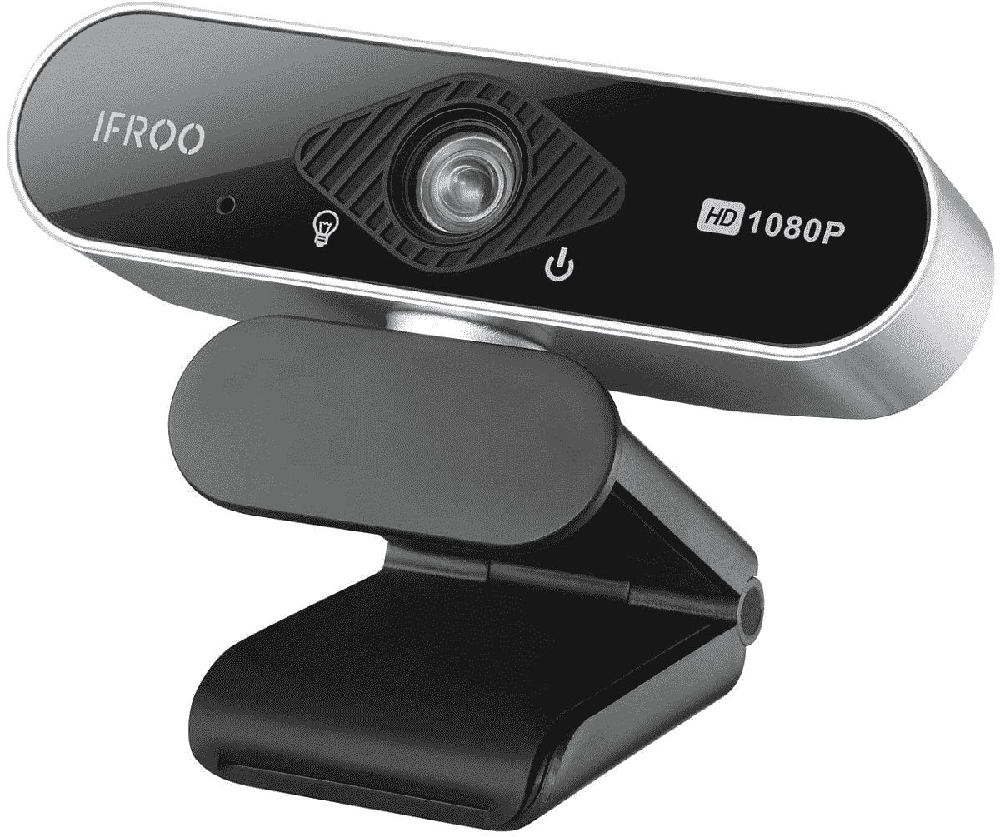
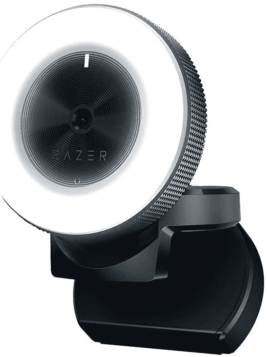
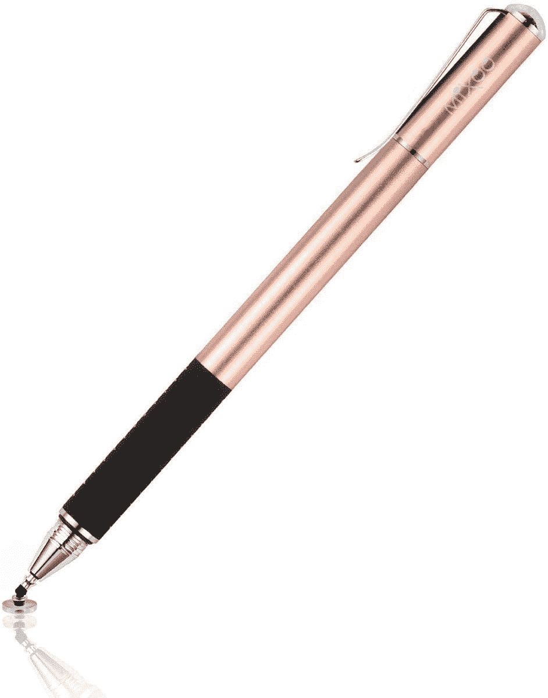

# 2023 年华硕 Chromebook CX9 最佳配件

> 原文：<https://www.xda-developers.com/best-asus-chromebook-cx9-accessories/>

华硕 Chromebook CX9 是绝对的猛兽。凭借英特尔第 11 代 Tiger Lake 处理器和高达 16GB 的内存，这是你今天可以买到的整体性能最好的 Chromebook。要驾驭所有的力量，你肯定需要一些配件。这台机器很轻，便于携带，所以一个箱子或袖子是日常携带的必需品。当您到达办公室或回到家中时，您可以通过外接显示器、鼠标和键盘将 CX9 转变为一个完整的工作站。这还不是全部，你还可以添加一个 USI 笔来记笔记，一个基座来改善连接等等。

让我们来看看目前华硕最好的触摸屏 chrome book 的最佳配件。

**浏览这篇文章:**

## 华硕 Chromebook CX9 的最佳坞站

如果你想将 Chromebook 与外部显示器配合使用，你可能需要添加一个扩展坞来增加可用端口的数量。有了一个好的坞站解决方案，你可以大大扩展你的 Chromebook 的多功能性。您可以使用它来连接鼠标、机械键盘、外部存储设备、多台显示器或同时连接所有设备。

最重要的是，有了一些扩展坞，只要有兼容的 USB Type-C 端口或 [Thunderbolt 端口](https://www.xda-developers.com/best-thunderbolt-docks/)，你甚至可以为 Chromebook 充电。坞站非常适合学生以及在办公室对接机器的商业用户。

 <picture></picture> 

Targus USB-C Dual Video Docking Station

##### Tiergrade USB-C 扩展坞

Tiergrade USB C Chromebook 扩展坞非常适合高级用户。它提供了最广泛的端口选择，包括两个 USB 3.0 Type-A 端口、两个 USB 2.0 Type-A 端口、两个 USB 3.0 Type-C 端口、两个 HDMI 端口、一个 DisplayPort 端口、一个 RJ45 千兆以太网端口、3.5 毫米耳机和麦克风插孔、一个 S/PDIF 音频端口和一个 60W 功率输出的 USB 3.0 Type-C 端口。除此之外，该坞站还包括一个全尺寸的 SD 读卡器和一个 microSD 读卡器。

 <picture></picture> 

Baseus 17-in-1 USB-C Docking Station

##### Baseus 16 合 1 扩展坞

Baseus 16 合 1 Chromebook 坞站是 Tiergrade 坞站的廉价替代产品，端口选择略有不同。它包括三个 USB 3.0 Type-A 端口、两个 USB 2.0 Type-A 端口、两个 USB 3.0 Type-C 端口、一个支持直通充电的 USB type-C 端口、一个 RJ45 千兆以太网端口、一个 3.5 毫米耳机/麦克风组合插孔、一个 microSD 卡插槽和一个 SD 卡插槽。对于显示器连接，它具有一个 VGA 端口和一个 HDMI 端口。但是，它只支持双外部显示器的屏幕镜像。

 <picture></picture> 

NOVOO 8-in-1 USB-C Dock

##### NOVOO 8 合 1 USB-C 坞站

NOVOO 8 合 1 USB C dock 是该列表中最小的 Chromebook 坞站，为其赢得了最便携的称号。尽管它很小，但它包含 3 个 USB 3.0 Type-A 端口，一个以太网端口，一个 USB Type-C 端口，最高可提供 100W 直通充电，一个 HDMI 端口和一个 SD 读卡器。这么小的东西有这么多端口。让我想知道为什么一些水果原始设备制造商不能在他们的笔记本电脑上提供两个以上的 USB Type- C 端口。

 <picture></picture> 

Anker PowerExpand+

##### Anker PowerExpand+ 7 合 1 USB-C 集线器

如果你不愿意花 40 美元买一个小小的 USB C hub，那么 Anker PowerExpand+应该是一个更好的选择。它比 NOVOO USB C dock 稍大，但端口数量相同。这包括两个 USB 3.0 Type-A 端口、一个用于数据的 USB Type-C 端口、一个支持高达 100W 的直通充电的 USB Type-C 端口、一个 HDMI 端口和一个 SD 读卡器。如果你有基本的需求，它应该能完成工作。

 <picture></picture> 

SABRENT Universal Laptop Docking Station with Stand for Tablets and Notebooks

##### Sabrent 通用笔记本电脑扩展坞

Sabrent Chromebook 扩展坞是配有可拆卸键盘的 Chromebook 的不错选择，因为它配有一个支架，当您不使用附带的键盘时，可以用来支撑 Chromebook。在端口方面，它提供了两个 USB 3.0 Type-A 端口，两个 USB 2.0 Type-A 端口，两个 USB Type-A 2.4A 快速充电端口，一个 HDMI 端口，一个 DVI 端口，一个 USB 3.0 输入，3.5mm 耳机和麦克风插孔，以及一个 RJ45 千兆以太网端口。

 <picture></picture> 

Targus USB-C Dual Video Docking Station

##### Targus USB-C 通用扩展坞

Targus Chromebook 坞站是一个不错的二合一选择，不仅提供了一个体面的端口选择，还可以兼作符合人体工程学的支架。它包括 4 个 USB 3.0 Type-A 端口、2 个 DisplayPort 端口、2 个 HDMI 2.0 端口、1 个支持 60W 直通充电的 USB Type-C 端口、1 个耳机/麦克风组合插孔和 1 个 RJ45 千兆以太网端口。

## 华硕 Chromebook CX9 的最佳外接显示器

显示器有各种尺寸，价格范围从相当便宜到极其昂贵。在为 Chromebook 选择外部显示器时，你应该仔细考虑你的使用情况和预算。在这里，我们收集了 4K 性能的最佳显示器，创意专业人士，以及那些希望获得最佳整体效果的人。

 <picture></picture> 

HP 24mh

##### 惠普 24MH FHD 显示器

惠普 24mh 是一款 24 英寸的预算显示器，以要价提供了一系列良好的功能。它使用 IPS 面板，这意味着更好的色彩和视角，并且它还提供了很大的 sRGB 覆盖范围。该显示器还具有三个输入端口(HDMI、DisplayPort、VGA)，一个具有高度、枢轴和倾斜调节功能的功能支架，以及内置扬声器。

 <picture></picture> 

Lenovo ThinkVision M14

##### 联想 ThinkVision M14

寻找一台可以随身携带的外接显示器？联想向其客户提供 ThinkVision M14，该产品具有 14 英寸全高清面板和双 USB-C 端口，可提供无缝连接体验。

 <picture></picture> 

Dell Ultrasharp U2719DX

##### 戴尔 Ultrasharp U2719DX

这款显示器具有 1，440 像素的分辨率，可提供出色的色彩准确度和清晰的视觉效果。它还采用了出色的工业设计，具有超薄的挡板和良好的 I/O 连接。

 <picture></picture> 

HP U28 4K

##### 惠普 U28 4K HDR 显示器

惠普的 U28 配备了工厂校准的 4K HDR IPS 面板，非常适合工作室工作，它还配备了一系列 I/O 端口。

 <picture></picture> 

LG 29WP60G-B

##### LG 29WP60G-B

LG 29 英寸超宽显示器对于寻求大量屏幕空间的用户来说应该很棒。它配备了 29 英寸宽的 IPS 面板，提供全高清(2560 x 1080)分辨率、21:9 宽高比、99%的 sRGB 色域覆盖率、HDR10 和 AMD FreeSync。

##### 华硕 ProArt PA279CV 27 英寸 4K UHD 显示器

华硕 ProArt PA279CV 适合寻求外部显示器以进行照片或视频编辑的客户。它采用 27 英寸 4K 分辨率 IPS 面板，提供 100%的 sRGB 覆盖率，工厂校准用于 Delta E **附属链接**

Amazon

[View at Amazon](https://www.amazon.com/ASUS-ProArt-Display-Monitor-PA279CV/dp/B08K2GFDKM/?tag=xda-pftgghb-20&ascsubtag=UUxdaUeUpU3922&asc_refurl=https%3A%2F%2Fwww.xda-developers.com%2Fbest-asus-chromebook-cx9-accessories%2F&asc_campaign=Short-Term)

## 华硕 Chromebook CX9 的最佳鼠标

当购买新鼠标来搭配你的[最爱的 Chromebook](https://www.xda-developers.com/best-chromebooks/) 时，舒适才是王道。在此列表中，我们将把每个鼠标的舒适操作置于其他高级功能之上。在考虑日常使用后，我们将关注电池寿命、价格点，当然还有与 Chrome OS 的集成。鼠标有各种形状和大小，所以在做出最终决定之前，查看大量选项是值得的。

 <picture></picture> 

Seenda 2.4G wireless mouse

##### Seenda 2.4G 无线鼠标

如果你需要一个预算有限的无线鼠标，Seenda 可以满足你的需求。这款鼠标没有一些花哨的功能，但价格不到 6 美元，设计舒适。这款设备的电池续航时间非常出色。对于那些只是偶尔使用鼠标的人来说，这是一个不错的选择。

##### 罗技 M355

有些鼠标要求你选择你是左撇子还是右撇子，但罗技 M355 不是。这款鼠标采用超薄扁平设计，非常适合双手灵巧的用户。此外，超薄的外形和超静音的点击使这款鼠标非常适合在工作中使用。

##### 果冻梳双模鼠标

Jelly Comb 双模鼠标具有蓝牙和 2.4GHz 无线连接功能。这样，您可以同时连接到两台设备。果冻梳有许多很棒的颜色可供选择，价格在 15 美元以下。

 <picture></picture> 

Logitech M570

##### 罗技 M570

罗技的 M570 有一个独特的，一眼就能认出的外形。使用鼠标时，很容易发现巨大的蓝绿色轨迹球。如果你在工作中经常滚动屏幕，并且觉得轨迹球很舒服，这是目前最好的选择。这是长时间使用最舒适的鼠标之一。

 <picture></picture> 

Jelly Comb mouse and keyboard combo

##### 果冻梳鼠标和键盘组合

就价值而言，捆绑包从来都不是坏事。Jelly Comb 打包了一个出色的无线键盘和鼠标组合，价格不到 25 美元。两款设备都具有出色的电池续航时间，以及不使用时的自动睡眠模式。

 <picture></picture> 

Geyes Silent Wireless Mouse

##### Geyes 静音无线鼠标

工作时保持安静有时很重要。如果你正在寻找一种几乎无声的鼠标，Geyes 可以满足你。这款轻巧的鼠标还可充电，采用舒适的蜂窝设计。朋友和家人一定会注意到您新鼠标上引人注目的设计。

 <picture></picture> 

Logitech MX Master 3S

##### 罗技 MX Master 3

罗技 MX Master 系列是鼠标的行业标准。超快 mag 速度滚动，人体工程学设计和应用程序特定的定制使这一超优质的选择。凭借 USB-C 快速充电和在玻璃表面工作的能力，这是一款可以在任何地方使用的鼠标。

 <picture></picture> 

BENGOO Gaming Mouse

##### BENGOO 游戏鼠标

BENGOO 游戏鼠标提供 RGB 灯光显示，突出您的游戏氛围。速度 DPI 开关允许四种可调设置。这款鼠标也很超值，符合人体工程学设计，按键灵活，价格低于 10 美元。

 <picture></picture> 

Logitech M510

##### 罗技 M510

谈到鼠标，罗技显然有几种选择。M510 之所以脱颖而出，是因为它一直被评为电池续航时间冠军。用户报告一次充电平均使用一年或更长时间。凭借舒适的设计和低于 25 美元的价格，这是一个很好的选择。

 <picture></picture> 

NORMIA RITA Arc Mouse

##### NORMIA RITA Arc 小鼠

微软的弧形鼠标设计有很多粉丝。不幸的是，官方的微软 Arc 鼠标与 Chromebooks 不兼容。如果你喜欢微软鼠标的设计，NORMIA RITA Arc 鼠标是一个很好的替代品，价格不到一半。

 <picture></picture> 

Anker Vertical Ergonomic Mouse

##### Anker 垂直人体工程学鼠标

另一个流行的外形是垂直鼠标设计。这种布局允许您在类似手柄的方向上使用鼠标。许多用户发现这是长时间使用鼠标最舒适的方式。Anker 还将出色的功能集和电池寿命融入了这一独特的设计中。

 <picture></picture> 

ICLEVER ERGONOMIC MOUSE

##### iClever 人体工程学鼠标

如果你觉得 Anker 垂直鼠标有点太高或太死板，iClever 还有另一个令人兴奋的选择。这款垂直鼠标具有更引人注目的曲线，以更浅的角度贴合手部轮廓。这款鼠标售价不到 25 美元，带有静音键，非常适合家庭或工作使用。

## 华硕 Chromebook CX9 的最佳键盘

使用外接显示器可以提供更多的屏幕空间，坞站可以提供额外的端口用于多任务处理。准备好新鼠标后，你需要一个[质量的键盘](https://www.xda-developers.com/best-mechanical-keyboards)来完成你的工作站。选择日常使用的键盘时，你会希望既舒适又可靠。选购键盘时，需要考虑一系列人体工程学设计、按键布局和高级功能。在这个列表中，我们将看看各种价位的 Chromebook 的最佳键盘。

首先，没有多少键盘是专门为 Chrome 操作系统设计的。为了提供多种选择，我们还在列表中包括了为 PC 和 Mac 设计的键盘。请记住，这些键盘仍然可以与 Chromebook 配合使用，使用 F1-12 作为功能键的替代品。此外，请记住 Chrome OS 可以在各种硬件上运行，所以这些键盘也适用于你的平板电脑或 Chromebox。

 <picture></picture> 

Logitech K580 ChromeOS Edition

##### 罗技 K580 Chrome 操作系统版

如果你正在寻找一个为谷歌打造的键盘，这就是你要找的。Chrome OS 功能键排列在键盘顶部，侧面有一个宽敞的数字键盘。你还可以获得一个内置的谷歌助手键和方便的切换功能，用于多种设备。

 <picture></picture> 

Brydge C-Type

##### 桥 C 型无线键盘

Brydge C 型无线键盘是一个非常时尚的选择，集成了 Chrome OS。与罗技 K580 一样，顶部有一排 Chrome 功能键。这款键盘的按键行程非常出色，提供了令人愉快的日常打字体验。除了所有这些功能之外，您还可以获得超长的电池续航时间和终身保修。

 <picture></picture> 

Jelly Comb mouse and keyboard combo

##### 桥 C 型无线键盘

也许你想要一个捆绑了无线鼠标的键盘？Jelly Comb 的这款超薄无线键盘还捆绑了一个旅行鼠标。这两款设备都采用了人体工程学设计和自动睡眠模式，以延长电池寿命。仅售 25 美元，这是一个值得考虑的大礼包。

 <picture></picture> 

Havit backlit mechanical keyboard

##### Havit 背光机械键盘

对于那些喜欢机械键盘打字体验的人来说，Havit 有一个 50 美元以下的好选择。Kalith 蓝色开关提供了良好的按键行程和令人满意的点击。独特的冰蓝色 LED 使这一漂亮时尚的设计更加完美。

 <picture></picture> 

Logitech K380

##### 罗技 K380 键盘

如果你想让你的键盘在桌面上占据更少的空间，可以考虑罗技 K380。这款小巧的无线键盘还提供了同时支持多达三个设备的轻松切换功能。这款键盘几乎可以在任何操作系统上使用，包括 Chrome 操作系统。

 <picture></picture> 

Jelly Comb folding keyboard

##### 果冻梳折叠键盘

折叠键盘是一种东西，它们非常棒。如果你经常出差，你可以试试 Jelly Comb 的折叠键盘。除了有线和无线连接模式，您还可以获得一个内置的触摸板鼠标作为额外的奖励。

## 华硕 Chromebook CX9 的最佳网络摄像头

随着 Zoom 和微软团队的崛起，一个好的网络摄像头是必不可少的。虽然大多数笔记本电脑都有内置网络摄像头，但质量往往不尽人意。它可能偶尔会完成工作，但建议您为 Chromebook 配备一个外部网络摄像头，以实现视频会议中更专业的外观。如果你有一个 Chromebox 或者你的 Chromebook 连接了一个外部显示器，你可能会寻找能够与你的 Chrome OS 设备完美匹配的网络摄像头。

这里列出了一些适用于 Chromebook 或 Chromebox 的最佳网络摄像头，你可以在各种价位和使用情况下购买。

 <picture></picture> 

Logitech C270

##### 罗技 C270 网络摄像头

如果这将是你的第一个网络摄像头，这是 Chromebook 的最佳网络摄像头之一。虽然它只能以 720p 的速度输出，但这对于偶尔与朋友和家人进行视频通话来说应该足够了。

 <picture></picture> 

IFROO FHD 1080p Webcam

##### IFROO FHD 1080P 网络摄像头

如果你不想在 Chromebook 的网络摄像头上花太多钱，但仍然想要像样的视频质量，这是一个选择。它有一个广角镜头，甚至可以用于录制和播放。

 <picture></picture> 

Neigo Webcam with Ring Light

##### NexiGo 网络摄像头，带环形灯

如果您周围的环境照明不足，网络摄像头周围的环形灯可调节亮度，有助于提高视频质量。它还有一个隐私保护盖，自动对焦和双麦克风。

 <picture></picture> 

Razer Kiyo 1080P Webcam

##### 雷蛇 Kiyo

如果你是一个流媒体用户，或者计划在 YouTube 或 Twitch 上流媒体，这是一个很好的开始方式。它有一个内置的环形灯，先进的自动对焦，支持 720p 的 60fps 或 1080p 的 30fps。

 <picture></picture> 

NexiGo 2K Webcam with 3X Zoom

##### NexiGo 2K 网络摄像头

这款网络摄像头是列表中分辨率最高的摄像头。有一个 400 万像素的传感器，你可以数字放大到 3 倍。它有一个 95 度的视野，双麦克风，以及一个隐私快门。

 <picture></picture> 

Logitech C920x HD Pro Webcam

##### 罗技 C920x 高清专业网络摄像头

罗技 C920x 是最受欢迎的网络摄像头之一，尤其适用于办公室会议。它支持立体声音频，这意味着每个人都能清楚地听到你的声音。还支持高清光线校正。

## 华硕 Chromebook CX9 的最佳保护套

Chromebooks 被设计成便携式的。为了在外出时保护你的投资，你可以以相当低的价格买一个袖子或包。如果你有一台支持 LTE 的 Chromebook 并经常旅行，这一点就更加重要了。这些选项中的大多数经常打折，使得交易更加甜蜜。有如此多的选项可供选择，您可以找到符合您个人风格的产品，并为日常工作和娱乐提供功能。

##### 亚马逊基础管理笔记本电脑套

如果你只是想要一个简单的没有装饰的袖子，亚马逊可以满足你。这款保护套的尺寸从 11.6 英寸到 15.6 英寸不等，具体取决于你的 Chromebook 的尺寸。有三种颜色可供选择，价格低廉，如果您只是需要偶尔将 Chromebook 带到户外，请选择它。

 <picture></picture> 

Case Logic Carrying Case

##### 携带案例 13/14 的案例逻辑

如果您需要在随身携带 Spectre x360 时为其提供额外保护，这款保护套的硬壳可以满足您的需求。同时，内部柔软，可以吸收笔记本电脑移动时产生的任何冲击。

 <picture></picture> 

Nacuwa Hard Sleeve

##### 纳库瓦硬套

如果你想要顶级的保护，从 Nacuwa 买这个硬套吧。这款保护套有多种尺寸可供选择，适用于任何 Chromebook。您还可以获得防泼溅保护，以及几个整理线缆和笔记本充电器的内袋。

 <picture></picture> 

Unika Leather Sleeve

##### 尤尼卡真皮笔记本电脑套

对于那些想要优雅袖子的人来说，UNIKA 有很好的颜色选择。这款保护套采用超薄设计，可容纳 13-15 英寸的 Chromebooks。

 <picture></picture> 

Lymmax Shockproof Sleeve

##### Lymmax 防震笔记本电脑套

有时候我们都会有一两天不顺心。有了 Lymmax 防震套，即使您的笔记本电脑掉落，也能得到保护。这种套管有多种颜色可供选择，但仅限于 13-15 英寸的尺寸兼容性。

 <picture></picture> 

Nillikin Laptop Sleeve with Stand

##### Nillkin 笔记本电脑包，带支架

你想要一个兼作支架的笔记本电脑套吗？Nillkin 提供的价格不到 30 美元。有四种颜色可供选择，你应该能找到一种符合你个人风格的。

 <picture></picture> 

TIMBUK2 Stealth Folio

##### TIMBUK2 隐形对开

如果你需要一个盒子来存放华硕 Chromebook CX9 的大量设备，TIMBUK2 Stealth Folio 是完美的选择。您可以获得多个储物格来存放充电器、软件狗等物品。

 <picture></picture> 

Waterfield Designs PC Sleevecase

##### 沃特菲尔德设计电脑机箱

Chromebooks 很难找到奢侈品包，但 Waterfield Designs 提供了一个非常好的定制选项。你可以指定你的 Chromebook 的确切尺寸，他们会为你制作一个由蜡帆布或防弹尼龙制成的定制外壳。这是一个具有惊人建造质量的优质套管。

 <picture></picture> 

NIDOO 14 inch laptop sleeve

##### Nidoo 14 英寸笔记本电脑套

颜色选择在任何配件上都很有趣，但 Chromebook 外壳往往大多是黑色或灰色。NIDOO 14 英寸笔记本电脑保护套有多种颜色可供选择，因此您可以展示自己的个人风格，同时保护您的 CX9。

## 华硕 Chromebook CX9 的最佳手写笔

通用手写笔倡议(USI)定义了主动手写笔和[触控设备](https://www.xda-developers.com/best-chromebooks-touchscreens/)之间互操作通信的行业标准，例如电话、平板电脑以及计算和娱乐平台。到目前为止，市场上有相当多的实心 USI 笔，但它们比老派的电容式触控笔要贵一些。

如果在您的预算范围内，并且您的设备支持 USI，我们建议您选择下面的 USI 选项之一，否则我们会提供一个预算选项来解决这个问题。

 <picture></picture> 

Penoval USI Stylus

##### 佩诺瓦 USI 手写笔

这是在 Chromebook 上利用 USI 兼容性的最佳整体手写笔。坚实的整体构建质量和良好的手感使这款手写笔易于书写。遗憾的是，它需要 AAAA 电池来运行，但可用性仍然令人印象深刻。

 <picture></picture> 

iPlume USI Stylus

##### iPlume USI 手写笔

又一款优秀的 USI 手写笔，整体设计好看。它握起来很舒服，而且没有其他型号没有用的橡皮擦按钮。iPlume 还拥有令人印象深刻的低延迟，使其更容易精确地编写和绘制。

 <picture></picture> 

HP USI Stylus

##### 惠普可充电 USI 手写笔

许多 USI 触控笔的主要缺点是处理电池的烦恼。幸运的是，惠普有一支可以通过 USB-C 充电的 USI 笔。这支笔的电池寿命也很长，一般使用时间平均超过 2 周。

 <picture></picture> 

TiMOVO USI Stylus Pen

##### 蒂莫沃 USI 手写笔

这款来自 TiMOVO 的 USI 手写笔具有独特的手掌拒绝功能，可有效避免您的手掌干扰您的创作。自带替换笔尖和工具，可以用工具拔出笔尖，非常容易更换。这支笔也经常打折，对于预算有限的人来说是个不错的选择。

 <picture></picture> 

Lenovo USI Pen

##### 联想 USI 笔

联想的 USI 手写笔做工精良，手感很好。虽然它不像惠普那样容易供电，但在需要更换之前，它应该可以用一块电池维持几个月。它配有一个笔夹，可以帮助您将手写笔固定在背包中。

 <picture></picture> 

Mixoo Capacitive Stylus Pen

##### Mixoo 电容式手写笔

你有没有发现这些 USI 钢笔太贵了？那么你可能想用 Mixoo 的电容手写笔来复古一下。这支笔不到 10 美元，有多种颜色。你应该能够完成基本的笔记任务，并且做得很有风格。

## 华硕 Chromebook CX9 的最佳充电器

在包里放一个备用充电器总是好的，以防出现问题。有时候，你只是想在办公室为你的 Chromebook 准备一块额外的电源砖[。](https://www.xda-developers.com/best-chromebooks/)

不管怎样，如果你拥有华硕 Chromebook CX9，你可能会考虑选择一个备用充电器。谈到充电器，亚马逊上并不缺少选择。无论你想要的是具有快速充电功能的东西，还是尽可能最便宜的选择，像 Anker、Baseus 和 Nekteck 这样的品牌都可以满足你。让我们来看看最适合华硕最好的 chrome book 之一[的充电器。](https://www.xda-developers.com/best-asus-chromebooks/)

##### Anker PowerPort Atom III 60W 充电器

这款充电器可同时为您的笔记本电脑(45 瓦)和移动设备(15 瓦)充电，是您下次度假或出差时唯一需要的充电器。同时给你的 Chromebook 和手机充电！

 <picture></picture> 

Anker 45W slim charger

##### Anker 45W 超薄充电器

PowerPort Atom III 45W Slim 的厚度不到 0.8 英寸，采用折叠插头设计，为这款强大的壁式充电器提供了前所未有的便携性和便利性。

##### Baseus 100W GaN II USB-C 充电器

GaN II x 高通快充 5.0，比以往快 4 倍，体积小 40%，散热高达 50 华氏度，效率比以往高 70%。对于 Chromebook 来说，这可能有点过了，但它也适用于你所有的其他设备。

 <picture></picture> 

Nekteck 45W USB C Wall Charger

##### Nekteck 45W USB-C 壁式充电器

这是一个相当标准的 45W PD 充电器，但它带有内置的充电电缆。如果你像我一样容易丢失电缆，这是正确的方法。另外。它经常以低于 20 美元的价格出售。

 <picture></picture> 

Anker 543 Charger

##### Anker PowerPort Atom III 65W 超薄充电器

同时给 4 个设备充电。PowerIQ 3 0 支持的 USB-C 端口可提供最大 45W 的输出，几乎可以以最高速度为任何 USB-C 设备充电，而 3 个 USB 端口共用 20W 的总功率，为移动设备提供优化的充电。

 <picture></picture> 

Zendure X5 1500MAH Portable Charger

##### Zendure x5 15000mAh 便携式充电器

对于那些需要移动电源的人来说，Zendure 的 15000 mAh 便携式充电器可以完成这项工作。你可以连接多个设备，并在 30 分钟内将 Chromebook 充电至 40%。

这是我们对华硕 Chromebook CX9 最佳配件的总结。希望你现在已经拥有了在课堂上、在家里或在旅途中使用 Chromebook 所需的一切。我们对华硕 Chromebook CX9 的理想设置是[戴尔 Ultrasharp U27](https://www.amazon.com/Dell-Ultrasharp-U2719DX-2560x1440-Resolution/dp/B07KGR784M/?tag=xda-pftgghb-20&ascsubtag=UUxdaUeUpU3922&asc_refurl=https%3A%2F%2Fwww.xda-developers.com%2Fbest-asus-chromebook-cx9-accessories%2F&asc_campaign=Short-Term) 、 [Tiergrade USB-C 扩展坞](https://www.amazon.com/Tiergrade-Docking-Station-DisplayPort-Charging/dp/B08HT4672R?tag=xda-pftgghb-20&ascsubtag=UUxdaUeUpU3922&asc_refurl=https%3A%2F%2Fwww.xda-developers.com%2Fbest-asus-chromebook-cx9-accessories%2F&asc_campaign=Short-Term)、[罗技 MX Master 3 鼠标](https://www.amazon.com/Logitech-Master-Advanced-Wireless-Mouse/dp/B07S395RWD/?tag=xda-pftgghb-20&ascsubtag=UUxdaUeUpU3922&asc_refurl=https%3A%2F%2Fwww.xda-developers.com%2Fbest-asus-chromebook-cx9-accessories%2F&asc_campaign=Short-Term)和 [Penoval USI 笔](https://www.amazon.com/Penoval-Chromebook-Pressure-chromebook-14b/dp/B08L8XZNFN/?tag=xda-pftgghb-20&ascsubtag=UUxdaUeUpU3922&asc_refurl=https%3A%2F%2Fwww.xda-developers.com%2Fbest-asus-chromebook-cx9-accessories%2F&asc_campaign=Short-Term)。网络摄像头和袖套选项完全取决于个人喜好和风格。

如果你尝试了我们的一些选择，请在下面的评论区告诉我们它们是如何为你工作的。