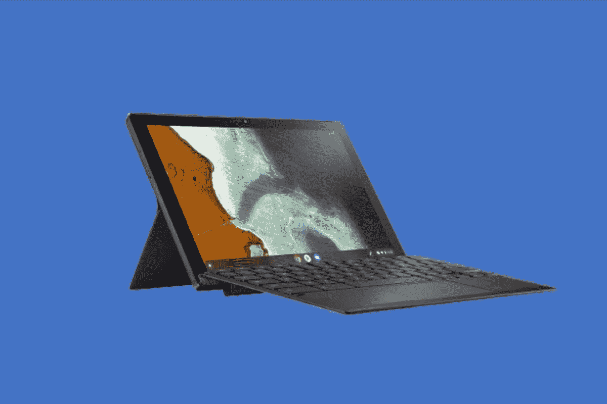
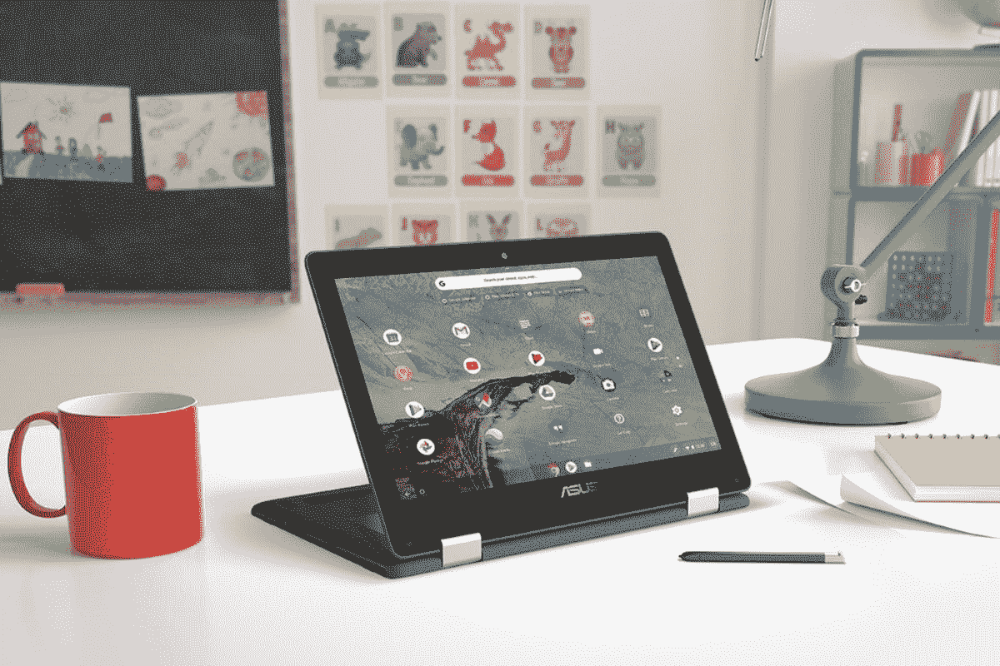
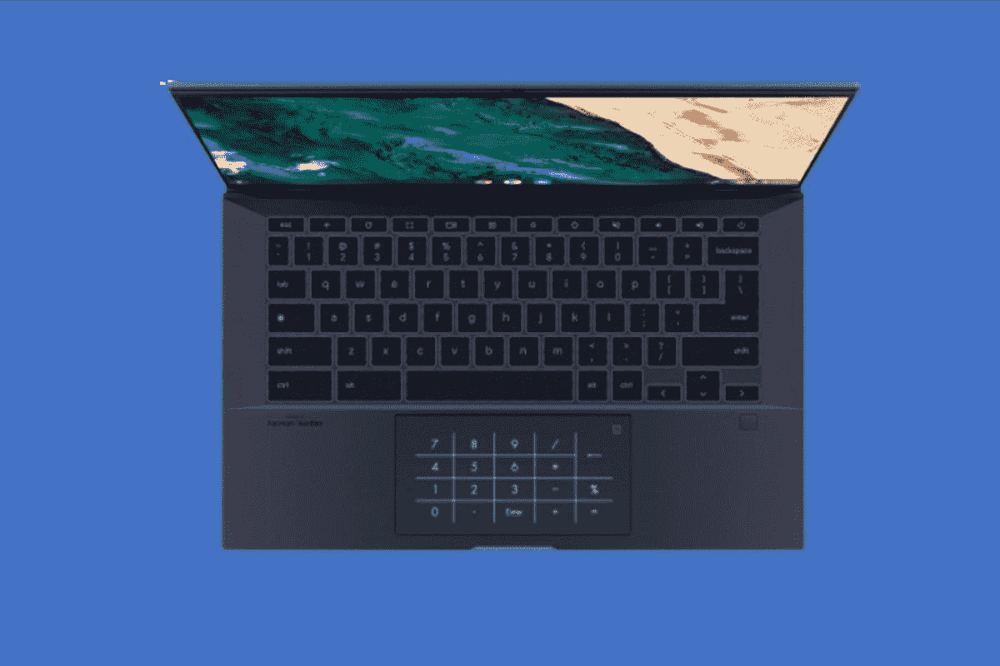
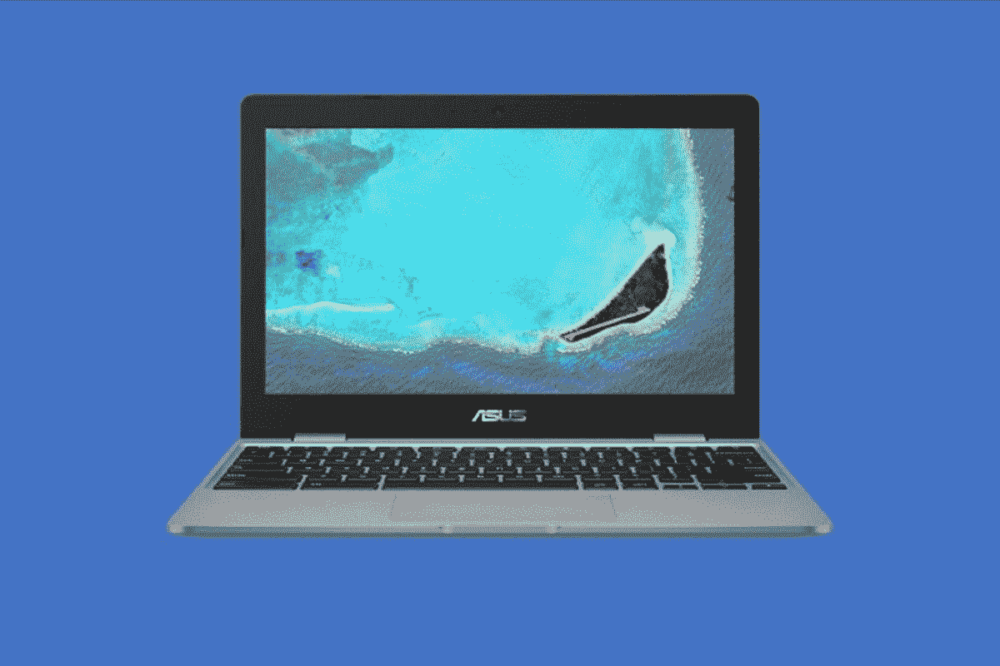
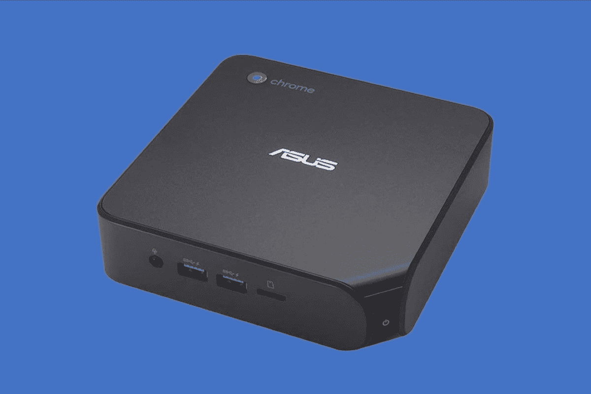

# 2023 年最佳华硕 Chromebooks

> 原文：<https://www.xda-developers.com/best-asus-chromebooks/>

如果你想在 2022 年买一台新的 Chromebook，请不要犹豫是否从华硕购买。与其他公司如[宏碁](https://www.xda-developers.com/best-acer-chromebooks/)和[惠普](https://www.xda-developers.com/best-hp-chromebooks/)一样，华硕是许多伟大的 Chromebook 型号的背后，其中许多都可能成为你的下一款设备。从更高端的产品到非常适合学校、工作和多媒体的设备，华硕有大量的选择。如果你也在寻找多媒体产品，也有很多选择。

华硕在制造 Chrome OS 设备方面有着悠久的历史，我们在这里为您提供了最佳选择。我们的清单涵盖了所有种类。我们将为您介绍最好的华硕平板电脑、教育用 Chromebooks、预算、廉价等。我们还将讨论为什么这些华硕 Chromebooks 物有所值。也就是说，让我们深入研究一下。

## 最佳:华硕 Chromebook Flip CX5601 (16 英寸)

在我们的列表中，名列榜首的是你能买到的最好的华硕 Chromebook CX5601。这是华硕的一款新的 16 英寸 2 合 1 Chromebook，它具有令人惊叹的显示屏，以及最新的第 12 代英特尔 CPU。除此之外，它的设计非常时尚、环保、坚固，而且价格不菲。

看看我们建议的型号上的特定 CPU，该系统可以成为您日常浏览网页和日常工作或学校任务的 Chromebook。它采用第 12 代英特尔酷睿 i3-1215U CPU，以及总共 8GB 的内存。除此之外，还有一个传统的 128GB 固态硬盘。这款 CPU 可能是英特尔第 12 代核心阵容的入门级产品，但考虑到 ChromeOS 与 Windows 相比优化得非常好，重量轻，效率高，它仍然非常棒。对于技术人员来说，酷睿 i3-1215U 总共有 6 个内核，其中 2 个是高性能内核，4 个是高效内核，总共有 8 个线程。同样，凭借所有这些内核和混合 CPU 架构，Android 应用程序、网站甚至 Linux 应用程序都应该可以在 Acer Chromebook CX5601 上正常打开和运行。电池寿命也很长，一次充电可达 10 小时。

至于显示器，这款华硕 Chromebook 上的 16 英寸屏幕使用起来会相当愉快。在 ChromeOS 2 合 1 中看到这一点是相当罕见的。通常，2 合 1 设备的最大尺寸为 13 英寸。因此，16 英寸屏幕的长宽比为 16:10，最大分辨率为 1920 x 1200，您将能够轻松地进行多任务处理，并排堆叠窗口，或许可以过上没有外部显示器的生活。显示器顶部甚至还有一个 FHD 网络摄像头，具有隐私滑块，所以当网络摄像头不使用时，你可以盖住镜头。

售价 650 美元，这款 Chromebook 的设计也不算太差。华硕使用的是矿物灰色铝合金金属盖子，这使得华硕 Chromebook CX5601 相当耐用，符合 MIL-STD-810H 军用耐用性标准。也使用了许多可回收材料，因此该设备从长远来看是可持续的，并有助于绿化地球。在其他地方，比如更贵的 Chromebook，你甚至可以获得四扬声器设置，这有助于让你的音频(和电影观看体验)更加身临其境。该系统的其他出色设计功能包括背光键盘、1.4 毫米的按键行程和 5.73 英寸的大触控板。请注意，该设备还配备了“ErgoLift 铰链”，有助于将键盘提升到更好的打字位置。

这个伟大的 Chromebook 的最大特点是端口选择。有 2 个 Thunderbolt USB-C 端口、1 个 USB 3.2 Gen 2 端口、1 个 microSD 读卡器、1 个 HDMI 2.1 端口和 1 个音频插孔。你不会抱怨这一点，因为有足够的东西可以永远避免使用加密狗。

##### 华硕 Chromebook Flip CX5601

华硕 Chromebook Flip CX5601 是一款基于 ChromeOS 的二合一设备，拥有令人惊叹的 16 英寸屏幕和最新的英特尔第 12 代 CPU。这是你能买到的最好的华硕 Chromebook。

## 总体第二好:华硕 Chromebook Flip CX5400

 <picture></picture> 

Asus Chromebook Flip CX5400

你现在可以买到的第二好的华硕 Chromebook 是华硕 Chromebook Flip CX5400，这是一款更老更小的 14 英寸 ChromeOS 二合一设备。我们这样说是因为这是一款非常受欢迎的设备，采用了上一代第 11 代英特尔 CPU、轻薄的设计、配有触控笔以及整体出色的设计。所有这些价格为 700 美元，如果你选择更快的 CPU，价格最高可达 1000 美元。

说到 CPU，这款 Chromebook 有两种选择。您可以选择英特尔酷睿 i3-1110G4 或英特尔酷睿 i7-1160G7。这两个 CPU 都是第 11 代，现在已经一岁了，但你不应该让这愚弄你。每个人都想要最新的 Chromebook，但第 11 代英特尔 CPU 非常快，尤其是在日常网络浏览方面。当你将它与 8GB 内存和 128GB 固态硬盘搭配使用时，你将拥有保存文档或在 Google Workspace 应用程序(如 Google Pages 或 Google Docs)中加快速度所需的一切。

现在，关于设计。由于采用了全金属机箱，华硕 Chromebook Flip CX5 CX5400 被评为军用级耐用性。这意味着你可以在旅途中安全地携带这款 Chromebook，而不用担心它会损坏。即便如此，它仍然非常轻薄。尺寸为 0.62 英寸厚，重量约为 3.09 磅。结合酷炫的“人工智能蓝”颜色选项，当你在旅途中炫耀这款 Chromebook 时，你会看起来非常时尚。

你甚至可以舒适地使用这款设备，因为这款 Chromebook 拥有华硕的专利“ErgoLift 铰链”，当你以更舒适的角度打字时，键盘会向上倾斜。背光键盘是另一个优势，因为这意味着您可以在晚上在黑暗中工作而不用担心。华硕认为这款键盘的按键行程可达 1.5 毫米。

这款 Chromebook 的另一个很酷的部分是笔。Chromebook Flip CX5 CX5400 上的 1920 x 1080 分辨率 14 英寸显示屏支持 garaged Asus 触控笔。由于这是一款 2 合 1 设备，这意味着您可以在帐篷、平板电脑或支架模式下使用它，并且可以在屏幕上画画、做笔记，还可以在不使用时将笔安全地收藏起来。华硕缩小了设备的底部下巴，以及侧挡板，使您的内容感觉更身临其境。该设备的屏幕与机身的比例为 85%。

以端口结束，这款 Chromebook 有很多。有 2 个 USB 3.2 Gen 1 Type-A 端口，2 个 Thunderbolt 4 端口，一个 MicroSD 读卡器和一个耳机插孔。我们非常感谢 MicroSD 的加入，因为这意味着您将有一个单独的空间来保存重要文件。

##### 华硕 Chromebook Flip CX5

华硕 Chromebook Flip CX5 采用研究设计、第 11 代英特尔 CPU 和一支带车库的笔，是 2022 年你可以买到的最好的华硕 Chromebook。

## 最佳预算:华硕 Chromebook Flip CM3

 <picture></picture> 

ASUS Chromebook Flip CM3

如果预算是你关心的问题，并且你只愿意花 500-700 美元购买 Chromebook，那么华硕 Chromebook Flip CM3 应该适合你。这款设备售价 400 美元，拥有你可能想要在工作、娱乐、学校等之间切换的一切。它保留了许多高级设计功能，但不会让你破费。

在谈论预算 Chromebook 时，我们首先会提到 CPU。不到 500 美元，你不能指望 Chromebook 上有英特尔或 AMD 的 CPU。这就是为什么这款设备内部有一个联发科 Kompanio 820 (8192) SoC。这实际上是一个基于 ARM 的 SoC，因此它会产生一些结果。首先，Android 应用程序的性能会非常好，因为它们是为使用类似 ARM 芯片的手机编写的。其次，电池寿命更长。到目前为止，我们提到的大多数华硕 Chromebooks 的电池寿命为 10-12 小时，但华硕将这款笔记本的电池寿命定为 16 小时。凭借 64GB 的 eMMC 存储和 4GB 的 RAM，这有助于降低 Flip CM3 的功耗。

还有什么让这款 Chromebook 成为一款不错的预算？嗯，是显示器。大多数 Chromebooks 的长宽比为 16:9。这对于并排堆叠窗口或多任务处理来说并不理想。这款手机配备了 12 英寸 1366 x 912 分辨率的面板，屏幕宽高比为 3:2。虽然这不是最高的分辨率，但在帐篷、支架、平板电脑或笔记本电脑模式下，它仍然给你更多的垂直空间。而且华硕也没有拿走你厚边框的屏幕。就像更多的优质 Chromebooks 一样，这款笔记本的屏幕与机身之比达到了 78%。不是最高的，但是这个价位很棒。

这个价格的另一个好处是什么？是笔支架。如果您购买了可选的华硕笔，您可以在屏幕上绘图、做笔记、给网页添加注释等等。这非常适合忙碌的人们或听课的学生。再加上柔软光滑的手掌，打字会超级舒服。

总的来说，这也是一款纤薄的设备。它的厚度为 0.66 英寸，重 2.51 磅。这要归功于更小的屏幕。其他可移植性方面包括端口。有很多像 2 个 USB-A，2 个 USB-C，一个 3.5 毫米音频插孔，和一个微型 SD 读卡器。您可能仍然需要一个加密狗来连接显示器。

##### 华硕 Chromebook Flip CM3

华硕 Chromebook Flip CM3 结合了 3:2 宽高比显示屏、可选手写笔和舒适键盘等高级功能，是一款非常划算的 Chromebook

## 最佳平板电脑:华硕 Chromebook 可拆卸

 <picture></picture> 

ASUS Chromebook Detachable CM3

ChromeOS 平板电脑现在越来越受欢迎，华硕的选择之一是可拆卸的 CM3。这款产品很像联想广受欢迎的 Duet Chromebook 平板电脑，也有类似的规格。它也是一款超便携设备，价格非常便宜，大约在 400 美元左右。请继续阅读，了解我们为什么如此喜欢它。

凭借华硕 Chromebook 的可拆卸设计，华硕承诺您将获得一款多功能、移动性和生产力兼备的设备。该公司之所以这么说，是因为这款平板电脑拥有独特的垂直和水平支架设计，使其在竞争中脱颖而出。其他 ChromeOS 平板电脑不会有这种情况。只需拆下键盘，翻转支架，垂直使用平板电脑来滚动网页和社交媒体，就像使用手机一样更加自然。或者，借助外壳的铰链，您可以安装全尺寸磁性键盘盖，记笔记和浏览网页，就像在笔记本电脑上一样。您甚至可以使用手写笔，手写笔直接放在机箱中，这意味着您不必担心丢失笔。

这款平板电脑的设计也非常高端。它有一个矿物灰颜色的铝制一体式底盘，并配有哑光黑色钻石切割边缘。此外，与较新的 Windows 笔记本电脑一样，这款 ChromeOS 平板电脑也有 16:10 的宽高比显示屏。这意味着您将在 10.5 英寸的屏幕上显示更多的垂直内容。这可能看起来很小，但它不像华硕是跳过屏幕质量。分辨率为 1920 x 1200，对于较小的屏幕来说非常清晰。你可以在网页上和看电影时看到所有的细节。

这些只是表面细节，与我们之前描述的华硕 Chromebook Flip CM3 类似，华硕 chrome book disable 由基于 ARM 的 SoC 供电。这次是联发科 8183。这是一个稍微快一点的处理器，应该非常适合使用 Android 应用程序，以及网页浏览。结合 4GB RAM，您将获得足够的日常任务性能。电池寿命也很长，一次充电可达 12 小时。

这款平板电脑唯一的缺点是它只有一个 USB 2.0 Type-C 端口和一个音频插孔。如果你打算在家或在学校工作时使用显示器，你可能需要购买一个适配器来连接显示器。

##### 华硕 Chromebook 可拆卸

华硕 chrome book disable 是一款出色的 ChromeOS 平板电脑，电池续航时间长，设计独特，CPU 处理能力也不错。

## 最佳教育:华硕 Chromebook Flip C214

 <picture></picture> 

ASUS Chromebook Flip C214

寻找一款用于教育的 Chromebook，无论是在家里还是在学校？这就是华硕 Chromebook Flip C214 的用途。它是专为教育市场设计的，为各种场景而打造。别忘了它还是完全可转换的，因此学生可以在各种模式下使用它。这就是我们选择它的原因。

首先要提到的是耐用性。一台教育版 Chromebook 会受到很大的压力，华硕 Chromebook Flip C214 就是为此而设计的。它配有橡胶缓冲器和防溅键盘。它还易于抓握，防篡改和防刮擦。这使得家长、教师或 IT 管理员管理设备变得更加容易。它还确保内部组件始终安全可靠。华硕通过 MIL-STD-810G 耐用性测试对 C214 进行了评级，这意味着它可以承受从标准桌面高度跌落。铰链和端口也是测试的一部分，这意味着当学生在各种帐篷、支架、平板电脑或笔记本电脑模式下使用 Flip C214 时，它可以经受住任何考验。

接下来是特定于教育的功能。Flip C214 配备了一个面向世界的特殊摄像头，因此学生可以用一种全新的方式探索和学习，允许他们在平板电脑模式下拍摄照片和视频。还计划让面向世界的摄像头支持多功能应用程序，为学生和教师提供令人兴奋的新学习辅助工具。这个网络摄像头在键盘底部。Flip C214 还包括 garaged 触控笔。这样学生可以手动记笔记和标记文档。放在车库里，它也不太可能丢失。

进入处理能力，它是这台 Chromebook 引擎盖下的英特尔 N4000 CPU。它配有 4GB 的 DDR4 内存和 32GB 的 eMMC 存储。这些规格确保快速访问谷歌 Play 商店的数千个应用程序，以及多任务处理网页浏览和 12 小时的电池续航时间。IT 管理员也可以配置 Flip Spin C214，因为他们认为它适合访问 Google apps，如 Docs 和 Pages。此外，由于模块化设计，当出现问题时，可以打开设备的背面并更换组件。

##### 华硕 Chromebook Flip C214

华硕 Chromebook Flip C214 拥有适合学习的一切，如耐用的设计、内置手写笔和面向世界的网络摄像头

## 最适合商务人士:华硕 Chromebook CX9

 <picture></picture> 

ASUS Chromebook CX9 (CX9400)

Chromebooks 不再仅仅用于教育和家庭用途。许多企业选择向员工推出 Chromebooks，因为它们更容易管理。此外，许多 Chromebook 制造商，如华硕，正在推出商业优先的 ChromeOS 设备。这方面最好的例子是华硕 Chromebook CX9，它拥有企业可能希望或需要的 Chromebook 的一切。

对于企业来说，Chromebook 最需要的是性能和管理选项。配备顶级第 11 代英特尔酷睿 i7 处理器，这是 Chromebook CX9 的最佳之处。当然，也有英特尔酷睿 i3 选项，但这两种 CPU 都与功率和性能有关。您可以为 CX9 配置高达 512GB 的存储或高达 16GB 的 RAM。这将使 CX9 成为一台多任务机，可以运行各种 Android 应用程序和查看各种网页。这些规格还使该机获得了英特尔 Evo 认证，这意味着它通过了英特尔严格的安全测试和电池测试，因此该设备一次充电可持续 14 小时。

除了电源，企业还寻求 Chromebook 的最佳显示，Chromebook CX9 在这方面不会令人失望。它的运动选项为 4K UHD 触摸显示屏。这种类型的显示器为打开 Chrome 标签提供了更多像素，并为您最喜爱的应用程序提供了更多空间。将它与附带的 Wi-Fi 6 结合起来，使用谷歌工作空间应用程序不仅看起来不错，而且加载速度也非常快。请注意，所有显示器选项都使 CX9 的屏幕与机身比例达到 92%，因此没有那么烦人的黑色挡板，实际屏幕空间更大。

企业也可能会在笔记本电脑上寻找特殊的设计功能，华硕 Chromebook CX9 上就有五个。首先是触控板上的 LED 照明数字键盘，适用于那些需要数字键盘但不想要更大笔记本电脑的人。第二个是背光键盘。第三是防溢等级。第四个是“ErgoLift 铰链”，它通过将笔记本电脑抬高一点来使打字变得更容易。最后是谷歌 Titan C 安全芯片，它有助于保持指纹信息和其他关键数据在芯片上的安全。

这款 Chromebook 的其他酷功能包括网络摄像头上的滑块、防止盗窃的 Kensington 锁、从 Thunderbolt USB-C 到 USB A 的各种端口、HDMI 和 microSD 卡支持。

##### 华硕 Chromebook CX9

由于漂亮的屏幕和博锐认证，华硕 Chromebook CX9 非常适合商用。

## 最便宜的:华硕 Chromebook C223

 <picture></picture> 

ASUS Chromebook C223

我们知道，并不是每个人都有 500-1000 美元来购买一台新的华硕 Chromebook。这就是为什么我们的名单上有华硕 Chromebook C223。这款 Chromebook 是一款非常基础的设备，价格非常低，只有 240 美元。就价格而言，这是第一款非常棒的 Chromebook。

华硕 Chromebook C223 有普通的黑色或更醒目的红色，由英特尔赛扬 N3350 处理器提供支持。这使得它非常适合基本的日常任务，如打开网站或使用谷歌 Play 商店的应用程序。它还配有 4GB 内存和 32GB eMMC 存储。这些都是非常简单的规格，并不是那么糟糕，因为 Chromebooks 的大部分工作都是在线完成的。它也有助于延长电池寿命，一次充电可达 10 小时，这是这个价格的典型水平。

这款 Chromebook 价格低廉的另一大优点是整体移动性和显示屏。它的占地面积比一张 A4 纸还小，重量不到 1 千克，是所有 11.6 英寸 Chromebook 中最薄的一款。华硕 Chromebook C223 上的 11.6 英寸 LED 背光防眩光显示屏具有非常漂亮的颜色。华硕甚至增加了超薄边框，以尽量减少视觉干扰。

您可能会在这款 Chromebook 上进行大量的网络通话，借助高清前置摄像头，您可以与朋友、同事或家人进行清晰、自然的视频通话。低于 1080p 的标准，但是对于这个价格，很难抱怨。

尽管这款设备价格便宜，但华硕仍希望它能在多媒体方面表现出色。这款 Chromebook 配备高品质立体声扬声器和超大共鸣箱，可产生高达 82dB 的高保真音频，可以提供与大得多的笔记本电脑一样好的环绕声效果，声音清脆有力。

最后是港口。该设备带有 USB-C 端口，以及 USB-A 和 microSD 卡扩展。你仍然需要购买一个 USB-C 转 HDMI 的加密狗，不过，就这个价格而言，这个端口将会丢失。

##### 华硕 Chromebook C223

华硕 Chromebook C223 价格实惠，但包含了您期望从高级 Chromebook 获得的功能

## 最佳 Chromebox:华硕 Chromebox 4

 <picture></picture> 

Asus Chromebox 4

并非所有 ChromeOS 设备都必须是笔记本电脑或平板电脑。这也是为什么还有 Chromebox 设备。通过这种类型的设备，你可以将其插入显示器或电视的背面，获得全屏 ChromeOS 体验。华硕最受欢迎的选择是 Chromebox 4，它拥有你在办公桌上拥有完美 Chromebox 所需的一切。

华硕 Chromebox 4 采用第十代英特尔酷睿或赛扬处理器和 DDR4-2666 内存，性能更快、更流畅、更节能。这些规格最高可配置酷睿 i7 和 16GB 内存。它还支持多达三个 4K 显示器，并配备了多功能的 USB-C 3.2 Gen 1 和 USB 3.2 Gen 2 Type-A 端口，用于快速数据传输，USB-C 还支持电源传输和显示端口连接。所有这些规格都使这款机器成为多媒体消费的绝佳选择，比如将 Android 应用程序流式传输到你的大屏幕上，甚至在商业中使用 Chromebox 来为信息亭供电。第十代英特尔芯片现在已经有两年了，但是 ChromeOS 很轻便并且经过优化，你应该不会有任何问题。

该设备通过 Google Play 轻松访问 Android 应用程序，让您享受自己喜爱的应用程序。作为 Chrome Enterprise 的附加优势，华硕 Chromebox Enterprise 4 选项为企业、it 管理员和远程员工提供了提高生产力和效率所需的工具。你还可以为这款 Chromebox 配置高达 256GB 的 SSD 存储，这对于 Chrome OS 设备来说是一个令人印象深刻的数量，因为文件通常会先保存到云中。

总的来说，如果你需要一台内部规格有一系列选择的顶级机器，这就是你的 Chromebox。连接三个显示器的能力使它成为办公室的主力，应该是需要大屏幕 ChromeOS 设备的商业用户或消费者的首选。

##### 华硕 Chromebox 4

华硕 Chromebox 4 是一款出色的 Chromebox，具有快速的 CPU、紧凑的设计和广泛的端口

## 最适合游戏:华硕 Chromebook Vibe CX55 Flip

你可能听说过谷歌[有专为云游戏设计的新 chrome book](https://www.xda-developers.com/google-cloud-gaming-chromebooks/)。其中之一就是新的华硕 Chromebook Vibe CX55 Flip。这是谷歌最初宣布的三款产品中独一无二的一款，因为它是一款二合一设备，而不是传统的翻盖 Chromebook。它还配备了最高刷新率的显示器，非常适合快节奏的游戏和经常出差的人。

这款华硕 Chromebook 采用 15.6 英寸 FHD 1920 x 1080 分辨率显示器。然而，它还具有 144Hz 的刷新率，是迄今为止任何 Chromebook 型号中最高的刷新率。有了它，您现在就可以毫无问题地在 Nvidia GeForce 上玩游戏了。你甚至可以体验前所未有的 ChromeOS，感受小动画的生命。当然，由于显示器也是可转换的，您可以用不同的方式玩游戏和观看电影和其他内容，无论是在帐篷模式，支架模式，还是在平板电脑模式下享受触摸屏游戏。

在设计方面，这款华硕 Chromebook 拥有非常棒的游戏外观。它由铝合金制成，全黑，还有橙色的 WASD 键，很好地突出了设备。别忘了键盘有一个数字键盘和反重影技术，尽管它没有 RGB 背光。为了增加舒适度，您还可以获得华硕的“ErgoLift”铰链，它可以帮助将键盘提升到更符合人体工程学的打字位置。

我们不喜欢这款 Chromebook 的一点是处理器。它无论如何都不坏，但许多其他云游戏 Chromebooks 都是由第 12 代英特尔处理器驱动的。这款来自华硕 sports 的上一代 CPU。选项包括第 11 代英特尔酷睿 i7-11g5G7、英特尔酷睿 i5-1135G7 或英特尔酷睿 i3-1115G4。不过，你可以将内存提升至 16GB，将存储提升至 128GB 或 512GB。这些都是很好的规格，甚至会使这款 Chromebook 与 ChromeOS 上的 Steam 兼容。请记住，与其他 Chromebooks 上的新英特尔 Iris XE 显卡相比，英特尔 UHD 显卡 630 可能不是最好的。

以端口选择结束，这款 Chromebook 在端口方面绝对胜出。有 USB-C，USB-A，耳机插孔，以及 HDMI 和 microSD 卡存储。有了这款游戏 Chromebook，加密狗将不再是一个问题，你可以在旅行时不用担心你最喜欢的配件不能正常工作。

 <picture></picture> 

Asus Chromebook VIbe CX55 FLip

##### 华硕 Chromebook Vibe CX55 Flip

华硕 Chromebook VIbe CX55 Flip 是三款云游戏 Chromebook 之一。它与其他产品不同，因为它是二合一设备，并且拥有超快的 144Hz 屏幕。

从像华硕 Chromebook Flip CX5 这样整体很棒的 Chromebook，到像华硕 Chromebook Flip CM3 这样更便携的设备，毫无疑问，华硕提供了各种各样的 Chromebook。甚至还有华硕的教育版 Chromebooks，比如 Flip C214。游戏——像华硕 Chromebook Vibe 这样以游戏为中心的二合一设备。我们希望您找到了适合您需求的华硕 ChromeOS 设备。