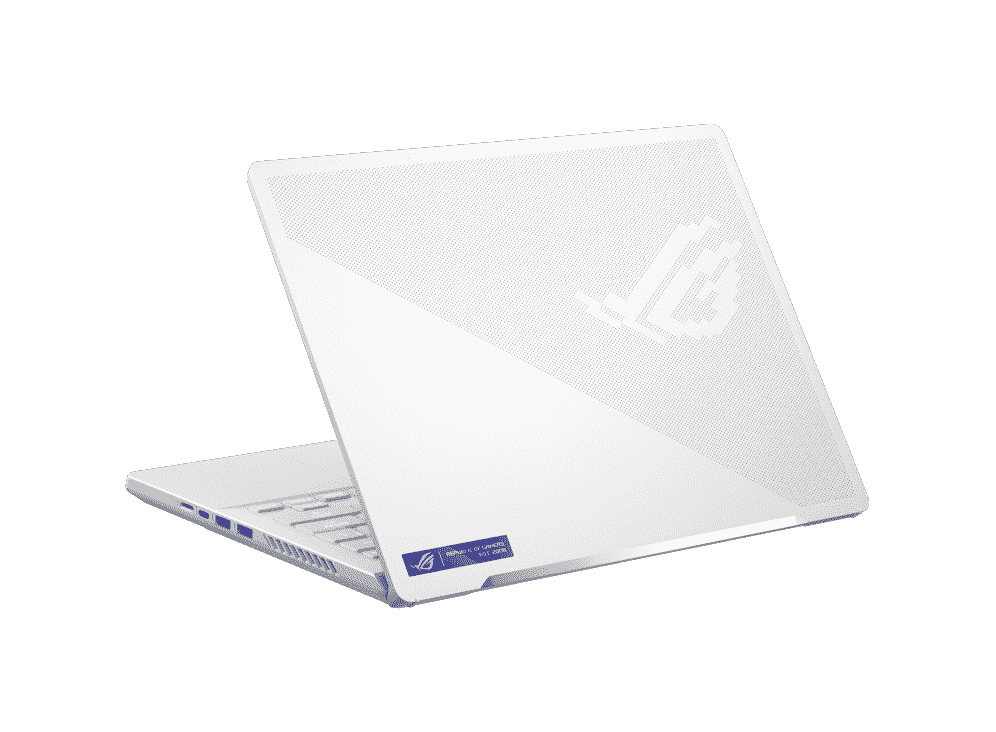
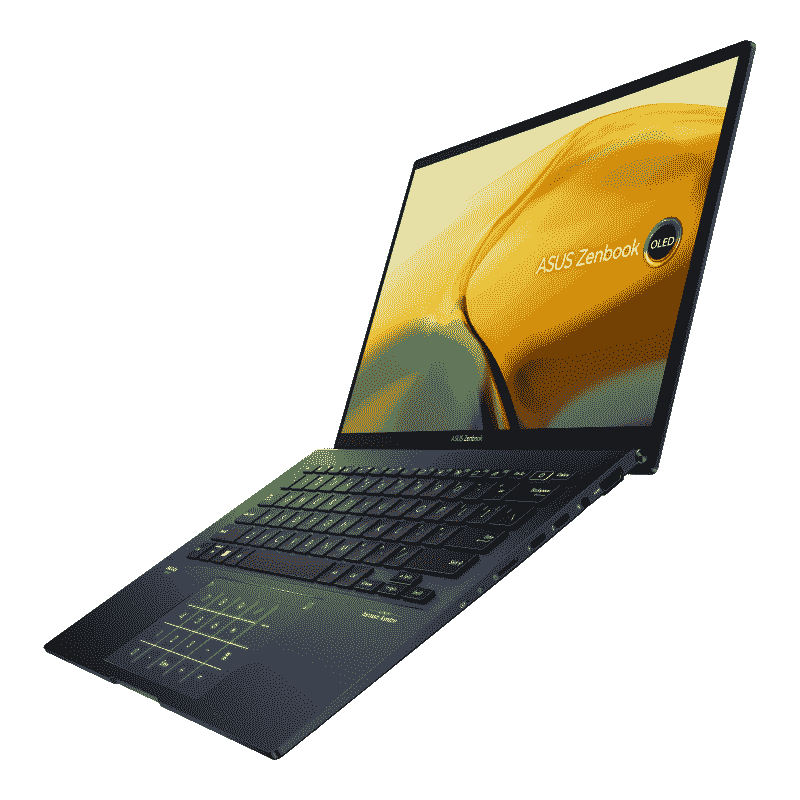
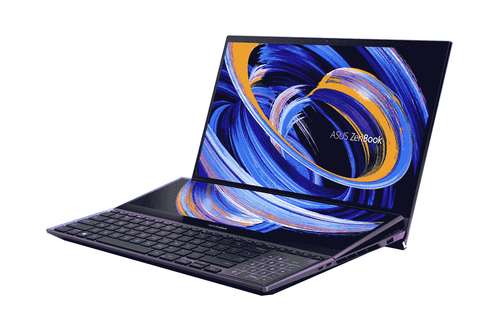
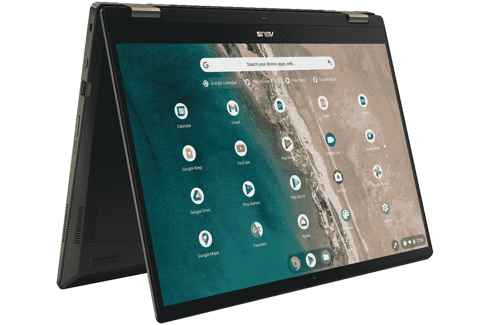

# 2023 年最佳华硕笔记本电脑

> 原文：<https://www.xda-developers.com/best-asus-laptops/>

购买新笔记本电脑时，品牌和广告上的规格一样重要。当然，你可以看看周围最好的笔记本电脑并从中选择，但是我们都有自己的偏好。许多最好和最受欢迎的笔记本电脑来自惠普或联想等公司，但也许你只是碰巧更喜欢华硕。如果你是这种情况，那么你来对地方了。

在这篇文章中，我们收集了一些你今天可以买到的最好的华硕笔记本电脑，涵盖了广泛的产品。华硕最出名的可能是其游戏笔记本电脑 ROG 系列，但该公司实际上也在其他领域制造一些非常酷的产品。从高端超极本到 creator 笔记本电脑，我们有大量出色的选项可供选择。事不宜迟，让我们进入我们的列表。

## 最佳综合:华硕 ROG 流 X13

我可能有一点点偏见，但在购买并使用了[华硕 ROG Flow X13](https://www.xda-developers.com/asus-rog-flow-x13-review/) 之后，坦白地说，我无法想象为自己购买这个列表中的任何其他笔记本电脑。ROG 流 X13 是一个非凡的组合，足够强大的规格偶尔游戏，轻量级的建设，和多功能的敞篷设计-几乎所有我想要的。

就性能而言，华硕 ROG Flow X13 配备了 AMD 最新的锐龙处理器，最高可达锐龙 9 6900HS，这是一款 8 核 16 线程处理器，加速速度高达 4.9GHz。这是一款 35W 处理器，也是当时最强大的处理器之一。最高可配 Nvidia GeForce RTX 3050 Ti 显卡，配有 4GB 内存和高达 40W 的功率(带动态增强)，为您提供入门级光线跟踪功能和稳定的性能，几乎可以运行任何现代游戏。除此之外，它还可以配备高达 32GB 的内存(焊接)和 1TB 的固态硬盘。

如果您想要顶级的游戏性能，可以添加 ROG Xg Mobile，这是一个内置 GeForce RTX 3080 的外部 GPU 外壳，外加几个用于笔记本电脑的额外端口。这是一个昂贵的附加组件，但很高兴看到，因为 AMD 笔记本电脑不支持 Thunderbolt -华硕实际上使用了一个专有的连接器来实现这一点，所以它是少数几个可以使用外部 GPU 的 AMD 笔记本电脑之一。

ROG 流 X13 上的显示也很棒。这是一个 13.4 英寸的面板，长宽比为 16:10，对于游戏笔记本电脑来说很不寻常。不过，增加的垂直空间有助于提高屏幕的工作效率，这使这款笔记本电脑成为一款多功能笔记本电脑。基本型号配备了全高清+ (1920 x 1200)显示屏和 120Hz 刷新率，但如果你想要更清晰的图像，你也可以获得一个超高清+ (3840 x 2400)显示屏和 60Hz 刷新率的变体。

它确实削减了一些成本的一个领域是网络摄像头。华硕使用的是典型的 720p 网络摄像头，这在笔记本电脑中仍然很常见，而且它也没有 Windows Hello 面部识别功能。不过，它在笔记本电脑的侧面有一个指纹传感器，所以你可以很容易地解锁你的电脑。

在设计部门，华硕用 ROG 流 X13 做了一些伟大的工作。尽管拥有专用的 RTX 显卡和 35W CPU，ROG Flow X13 的重量仅为 2.87 磅，厚度为 15.8 毫米。对于这种规格的笔记本电脑来说，这是令人印象深刻的轻薄，而且还是一款可转换的笔记本电脑。就外观而言，ROG Flow X13 也是柔和而时尚的，采用全黑底盘，刻有条纹。RGB 照明的唯一暗示在盖子上的 ROG 横幅中，但只在某些型号上。

考虑到它的大小，ROG 流 X13 有我们认为很好的端口供应。它有两个 USB Type-c (3.2 Gen 2)端口，一个 USB Type-A (3.2 Gen 2)端口，HDMI 2.0b 和一个 3.5 毫米耳机插孔。其中一个 USB Type-C 端口也用于 ROG Xg 移动连接器，如果你打算使用它。对于一台 13 英寸的笔记本电脑来说，这并不坏，这涵盖了你可能需要的大多数基本功能。

总而言之，这是一款功能强大、用途广泛的笔记本电脑，这是你不常看到的。它拥有处理器和 GPU 的正确组合，仍然允许轻薄的设计，因此它不仅仅是一款游戏笔记本电脑，几乎对任何人来说都很棒，我们很想说它是华硕制造的最好的笔记本电脑之一。

##### 华硕 ROG 流量 X13

具有强大的规格和轻巧的设计，华硕 ROG 流 X13 是当今最好的笔记本电脑之一。

## 同样伟大的还有:华硕 ROG 西风 G14

如果你想要更强的图形处理能力和最独特的笔记本电脑，ROG Zephyrus G14 是另一个绝佳的选择。它不太便携，但考虑到它有更高端的规格，这是可以预料的。与上一代相比，2022 款车型有一些非常明显的改进，因此比以往任何时候都更好。

这些规格包括类似的 35 瓦 AMD 锐龙处理器，这一次是 8 核 16 线程的锐龙 9 6900HS，速度提升至 4.9GHz。这与 ROG Flow X13 的顶级配置类似，但 GPU 不是这样。Zephyrus G14 配备了 AMD 镭龙 RX 6800S，这是一款强大而高效的 GPU，拥有 8GB 内存和高达 105W 的功率(采用 AMD SmartShift)，是 RTX 3050 Ti 的一个非常重要的进步。与之前的 Zephyrus G14 相比，这也是一个非常显著的改进。除此之外，这款笔记本电脑配备了高达 32GB 的内存(其中一半是焊接的)和 1TB 的固态硬盘用于存储。这是一台更好的游戏机器，尽管这是以牺牲便携性为代价的。

Zephyrus G14 上的显示器是 14 英寸的面板，长宽比为 16:10，分辨率为 Quad HD+ (2560 x 1600)，刷新率为 120Hz。这些已经是非常令人印象深刻的规格，这意味着你将获得一个伟大的工作和娱乐的经验与这台机器。但还有更多，因为这是使用华硕的 ROG 星云显示器，这意味着它是一个局部调光的迷你 LED 面板。它可以达到 500 尼特的亮度，覆盖 100%的 DCI-P3，此外还经过 Pantone 验证。这只是一个梦幻般的屏幕。

与去年的机型相比，这款机型的另一个主要升级是它实际上有一个网络摄像头。是的，在追求超级紧凑的过程中，华硕在之前的型号中没有包括网络摄像头，但现在你可以获得一个带有 Windows Hello 面部识别功能的 720p 摄像头。虽然网络摄像头的质量可能不是最好的，但至少它是一个东西，Windows Hello 确实使解锁 PC 变得更加方便。

就像它的前身一样，这款笔记本电脑的盖子上有一个覆盖半个表面的 led 网格，你可以定制这个面板来显示你想要的任何东西。从文本到图像和动画，您可以使这款笔记本电脑的背面看起来比任何其他笔记本电脑都更独特，它实际上是从以前的型号升级而来的，可以实现更流畅的动画。除此之外，这个设计实际上相当柔和，如果你关掉盖子上的 led 灯，你可以获得几乎专业的外观。它并不是一台很轻的笔记本电脑，但只有 3.79 磅(盖子上没有 led 灯时为 3.64 磅)，也不是很重。它的厚度也是 19.5 毫米(不含 led 的厚度为 18.5 毫米)，所以比它的前代产品大一点，但这对于功率和功能的增加是有意义的。

至于端口，你有两个带 DisplayPort 的 USB Type-C (3.2 Gen 2)(但只有一个带 power delivery)，两个 USB Type-A (3.2 Gen 2)端口，HDMI 2.0b，3.5mm 耳机插孔和 microSD 读卡器。总体来说，这是一个可靠而多样的设置，尽管我们不得不怀疑为什么两个 USB-C 端口都不支持充电。实际上，你可能会想在大多数时间里使用专有充电器，所以这可能就是原因。

无论如何，Zephyrus G14 是一款非常棒的游戏和日常使用的笔记本电脑，具有强大的 CPU 和 GPU，但不会太重，无法带到学校或旅行中。

 <picture></picture> 

Asus ROG Zephyrus G14

##### 华硕 ROG 西风 G14

凭借强大的规格和相对较轻的外形，ROG Zephyrus G14 非常适合日常使用和游戏。

## 最佳高级华硕笔记本电脑:华硕 Zenbook S 13 翻转有机发光二极管

如果你正在寻找一款设计和功能都很棒的笔记本电脑，华硕 Zenbook S 13 翻盖有机发光二极管是你的不二之选。它提供了性能、惊人的有机发光二极管显示和相对轻量级的设计的完美结合，这使得它非常容易推荐。

首先，华硕 Zenbook S 13 Flip 有机发光二极管配备了高达英特尔酷睿 i7-1260P 处理器，12 核 16 线程，为各种日常使用提供了出色的性能。在这种配置下，您还可以获得 16GB 的内存和 1TB 的固态硬盘，因此您可以获得足以使用多年的高端笔记本电脑的所有元素。

华硕几年来一直全力以赴有机发光二极管显示器，Zenbook S 13 Flip 有机发光二极管是迄今为止最好的例子之一。这是一款 13.3 英寸的显示器，配有超清晰的 2.8K (2880 x 1800)面板，这意味着一切看起来都非常清晰，您可以在屏幕上显示更多内容。此外，由于这是一台 OLED 面板，您可以获得真正的黑色和非常鲜艳的颜色，看起来绝对令人惊叹，DCI-P3 100%覆盖率，以及 DisplayHDR 500 真正的黑色认证，使这成为媒体消费的惊人机器。当然，既然是敞篷车，屏幕也支持触摸和笔输入。

虽然许多华硕笔记本电脑在过去几年中没有赶上更好的网络摄像头的趋势，但 Zenbook S 13 Flip 有机发光二极管确实配备了一个全高清 1080p 摄像头，它甚至支持 Windows Hello 面部识别，尽管也有指纹读取器。

在设计方面，Zenbook 的 S 13 翻盖有机发光二极管看起来柔和，但其独特的蓝色配色足够独特，而且它是一款非常便携的机器。它的起始重量仅为 2.43 磅，厚度为 14.9 毫米，因此您可以轻松地将它带到任何地方。像大多数 Zenbook 笔记本电脑一样，触摸板也相当独特，因为当你需要时，它可以变成一个数字键盘，进行一些快速计算。

端口情况和你预期的差不多，有两个 Thunderbolt 4 (USB Type-C)端口，一个耳机插孔和一个 microSD 读卡器。像这样一个小巧轻便的设备无法适应更大的端口，如 USB Type-A 和 HDMI，但谢天谢地，你可以使用 Thunderbolt dock 来解决这个问题。

华硕 Zenbook S 13 Flip 有机发光二极管售价 1500 美元，凭借高端规格、高端设计和令人惊叹的有机发光二极管显示屏，以及敞篷车的多功能性，提供了绝对精彩的体验。在其他许多地方，你不会以那个价格找到这种体验，至少不会没有一些重大折扣。

##### 华硕 Zenbook S 13 翻转有机发光二极管

华硕 Zenbook S 13 Flip 有机发光二极管是一款轻型敞篷车，具有顶级配置和令人惊叹的有机发光二极管显示屏。

## 最佳主流华硕笔记本电脑:华硕 Zenbook 14 有机发光二极管

华硕的 Zenbook 系列通常更专注于高端笔记本电脑，尽管 Zenbook 14 有机发光二极管仍然感觉非常像一款高端产品，但它的价格惊人地实惠，实际上很难推荐任何其他“预算”选项。

在性能方面，Zenbook 14 有机发光二极管非常符合 2022 年的高端笔记本电脑。它配备了英特尔第 12 代酷睿 P 系列处理器，特别是酷睿 i5-1240P。这是一款功能强大的处理器，具有 12 个内核、16 个线程，速度提升至 4.4GHz。它还具有英特尔 Iris Xe 显卡，因此可以处理一些轻型 GPU 工作负载。此外，您还可以获得高达 8GB 的 LPDDR5 内存和 256GB 的固态硬盘存储。

Zenbook 14 有机发光二极管的亮点是它的显示屏，特别是因为它是少有的有机发光二极管显示屏价格不贵的笔记本电脑之一。2022 年，有机发光二极管面板会变得更加普遍，但这仍然是一个很棒的面板。它是 14 英寸的面板，长宽比为 16:10，分辨率为 2.8K，即 2880 x 1800。对于这种尺寸的面板来说，这是超级清晰的，最重要的是，它具有平滑的 90Hz 刷新率，高达 600 尼特的峰值亮度，以及 100%的 DCI-P3 覆盖率，所以它看起来很棒。它还支持触摸和笔输入。

在显示屏上方，Zenbook 14 有机发光二极管有一个典型的 720p 网络摄像头，不幸的是，这在华硕笔记本电脑中仍然很常见。也没有 Windows Hello 面部识别，但电源按钮内置了指纹传感器，因此解锁 PC 更容易。

就外观而言，华硕 Zenbook 14 有机发光二极管采用了微妙但不无聊的蓝色，看起来非常漂亮。盖子上新的标志性华硕标志也给了笔记本电脑一点个性。按照华硕笔记本电脑的惯例，触摸板还可以在必要时用作数字键盘。这款笔记本电脑本身相当薄，只有 16.9 毫米，重 3.06 磅，因此应该很容易随身携带。

加上港口，这里有充足的货源。你有两个 Thunderbolt 4/USB Type-C 端口，一个 USB Type-A (3.2 Gen 1)，HDMI，一个耳机插孔和一个 microSD 读卡器。该设置涵盖了所有基础知识，因此您可以连接各种外围设备。

除了 720p 网络摄像头，Zenbook 14 有机发光二极管几乎一切正常，750 美元的价格标签，对于它所提供的东西来说，它是令人震惊的实惠。

 <picture></picture> 

ASUS ZenBook 14 OLED

##### 华硕 ZenBook 14 有机发光二极管

华硕 Zenbook 14 有机发光二极管是一款相对较薄的高端笔记本电脑，配有强大的英特尔处理器和令人惊叹的有机发光二极管显示屏。

## 最佳游戏华硕笔记本电脑:ROG Strix SCAR 15

对于全力以赴的游戏玩家来说，华硕 ROG Strix SCAR 15 是一台一流的机器，也是目前最好的游戏笔记本电脑之一。它功能强大，从设计上来说，它是以玩家为中心的。

首先，ROG Strix SCAR 15 配备了英特尔酷睿 i9-12900H 处理器，这是该列表中最强大的 CPU 之一。它的 TDP 为 45 瓦，拥有 14 个内核、20 个线程，速度提升至 5GHz，因此您不会错过任何性能。您可以搭配高达 16GB 内存和 150 瓦功率(带动态增强)的 Nvidia GeForce RTX 3080 Ti，成为一款功能极其强大的笔记本电脑，可以轻松处理任何现代游戏。此外，您可以获得高达 32GB 的内存(您可以在以后自行升级)和 1TB 的固态硬盘作为存储。

Strix SCAR 15 配备了典型的 16:9 纵横比的 15.6 英寸显示屏，并提供了两种选择。如果您需要绝对最快的响应时间，您可以获得 300HZ 刷新率的全高清(1920 x 1080)显示器，或者如果您喜欢更清晰的图像，您可以选择 240Hz 刷新率的四高清(2560 x 1440)面板。这取决于你的偏好，尽管我们会说后者提供了清晰和非常平滑的刷新率之间的最佳平衡。

Strix SCAR 15 的一个主要缺点是根本没有内置网络摄像头，因此不支持 Windows Hello 面部识别。这是当今现实中的一个主要缺点，因此很难忽视。事实上，根本没有 Windows Hello 支持，因为也没有指纹识别器。

无论好坏，ROG Strix SCAR 15 拥有许多让它看起来非常独特的东西。盖子上的 ROG 标志是 RGB 背光，显示面板下方还有一条 RGB 照明线，另一条穿过笔记本电脑底座的正面并延伸到两侧。键盘还配备了每个键的 RGB 背光，所以不缺乏天赋。除此之外，这款笔记本电脑的键盘底座部分是半透明的，所以你可以看到里面，它还包括一个铰链上的“装甲帽”，你可以与三种不同的风格互换(其中一种也是半透明的)。华硕甚至在网上有一个模板，所以你可以 3D 打印自己的。

关于定制的最后一点，华硕称之为笔记本电脑右侧的梯形槽。除了为笔记本电脑添加红色外，keystones 还可以存储笔记本电脑的 RGB 配置文件，用作显示笔记本电脑上隐藏驱动器的钥匙，等等。至于便携性，Strix SCAR 15 重 5.07 磅，最厚处为 27.2 毫米。它远不是目前最轻或最薄的笔记本电脑，但对于如此强大的东西来说，这并不奇怪。

谈到连接，华硕 ROG Strix SCAR 15 有一个 Thunderbolt 4/USB-C 端口，一个标准 USB Type-C (3.2 Gen 2)端口，两个 USB Type-A (3.2 Gen 1)端口，2.5Gb 以太网，HDMI 2.1 和 3.5 毫米耳机插孔。端口都在笔记本电脑的背面或左侧。这是一个坚实的整体设置，它涵盖了游戏笔记本电脑几乎所有最常见的需求。

ROG Strix SCAR 15 并不适合所有人，但如果你是一个狂热的游戏玩家，也喜欢 RGB 照明的可定制性，这是一款非常独特和强大的笔记本电脑，将非常适合你。

 <picture></picture> 

ASUS ROG Strix SCAR 15

##### 华硕 ROG Strix SCAR 15

华硕 ROG Strix SCAR 15 功能强大，它不怕炫耀大量可定制的 RGB 灯等。

## 创意专业人士的最佳华硕笔记本电脑:华硕 ZenBook Pro Duo 15 有机发光二极管

华硕有许多专注于创意专业人士的笔记本电脑，但没有一款像 ZenBook Pro Duo 15 有机发光二极管那样独特和有趣。这款笔记本电脑拥有两个出色的显示屏和强大的规格，虽然价格昂贵，但非常棒。

从性能开始，ZenBook Pro Duo 15 有机发光二极管拥有英特尔酷睿 i9-12900H 处理器，具有 14 个内核，20 个线程，速度提升至 5GHz。对于创造性工作负载来说，这已经是一个很好的开始，但它还配备了高达 6GB 视频内存的 Nvidia GeForce RTX 3060 GPU。这为照片和视频编辑等创造性工作负载提供了充足的性能，尽管奇怪的是 GPU 不如上一代机型强大。您还可以获得 32GB 的 LPDDR5 RAM 和 1TB 的 SSD 存储，因此性能肯定不会缺乏。

在显示器上——或者更确切地说，显示器——这就是 ZenBook Pro Duo 得名的原因。主显示屏是一个 15.6 英寸的面板，长宽比为 16:9，分辨率为超高清(3840 x 2160)。它也是一个 OLED 面板，所以它提供了 1，000，000:1 的对比度，DisplayHDR True Black 500 认证，以及快速的响应时间。不仅如此，它覆盖了 100%的 DCI-P3，并通过了 PANTONE 的验证，因此它是一个非常棒的屏幕。屏幕还支持触摸和笔输入。

但是键盘底座有第二个屏幕，它不仅仅是一个快速浏览信息的小显示屏。这个显示器大约是主显示器高度的一半，但它也一样宽，而且像素密度相同，因此分辨率为 3840 x 1100。因为它太大了，所以这种显示器可以用来显示正常的 Windows 应用程序，但它也可以通过精确的触摸控制来扩展某些应用程序，如 Photoshop。不过，这个屏幕是 IPS 面板，所以不如主屏幕好看。为了有助于可视性，当您打开笔记本电脑时，显示器的顶部会升高，这也提供了更多的气流，以保持内部凉爽。

尽管这台笔记本电脑上的其他一切都很疯狂，但它仍然配备了 720p 网络摄像头，但至少它包括 Windows Hello 面部识别，因此它在方便性方面得分。

键盘底座上有一个巨大的显示屏显然会影响事情的安排，所以 ZenBook Pro Duo 有一些有趣的选择。键盘被向下推到键盘板的底部和左侧，在右侧，您会看到一个垂直方向的触摸板。像许多其他华硕笔记本电脑一样，你也可以把触摸板变成一个虚拟的数字键盘来处理数字。拥有两个屏幕和强大的内部部件意味着这款笔记本电脑不是很轻，重 5.16 磅，但坦率地说，它可能会更糟。它的厚度也是 21.5 毫米——同样，没有想象中的那么糟糕，尽管显然不够薄。

除了端口，ZenBook Pro Duo 15 有机发光二极管还配有两个 Thunderbolt 4 端口、一个 USB Type-A (3.2 Gen 2)端口、HDMI 2.1 和一个耳机插孔，为您提供全面可靠的设置。可以理解的是，笔记本电脑已经没有足够的空间容纳所有的端口，但这几乎满足了每个人的基本需求。

显然，ZenBook Pro Duo 15 有机发光二极管并不适合所有人，价格让这一点变得更加明显。但是，如果你需要一台功能强大的笔记本电脑，并且第二块屏幕的便利听起来很诱人，华硕已经创造了最有趣的笔记本电脑之一。

 <picture></picture> 

ASUS ZenBook Pro Duo 15 OLED

##### 华硕 ZenBook Pro Duo 15 有机发光二极管

ZenBook Pro Duo 15 拥有两个超高清屏幕和强大的规格，非常适合想要最新最好的创意专业人士。

## 最佳商务笔记本电脑:华硕 ExpertBook B9

商用笔记本电脑并不是华硕产品线中最知名的部分，但该公司在过去几年中一直在推出 ExpertBook 系列的新笔记本电脑。最新的顶级产品是 2022 年底推出的华硕 ExpertBook B9，它是任何商业用户的绝佳选择。

从性能开始，华硕 ExpertBook B9 配备了第 12 代英特尔酷睿处理器，最高可配支持博锐的酷睿 i7-1265U，这对于大型企业简化远程管理非常重要。该处理器有 10 个内核，12 个线程，速度高达 4.8GHz，因此对于各种与办公相关的任务来说，性能也非常好。它还配备了高达 32GB 的 LPDDR5 内存和 2TB 的固态硬盘。

这台笔记本电脑的显示屏相当简单，但它能完成工作。这是一个 14 英寸的面板，纵横比为 16:9，分辨率为全高清，但亮度达到了 400 尼特，并且有防眩光涂层，所以你应该可以在户外使用它，而不会有太大的问题。网络摄像头也不起眼，是一个 720p 传感器，尽管它支持 Windows Hello 面部识别，并有一个隐私快门，这在商用笔记本电脑中很常见。

华硕吹嘘 ExpertBook B9 是一款非常轻的笔记本电脑，事实上，基本型号的起始重量仅为 1.94 磅，但这只是在你有 33 瓦时的小电池的情况下。66 瓦时的型号更广泛，那个重 2.23 磅，对于你在这里得到的来说还是很轻的。这款笔记本电脑的厚度仅为 14.9 毫米，看起来时尚而专业。像其他高级华硕笔记本电脑一样，如果你需要，触摸板也可以兼作数字键盘。

尽管设计轻薄，但 ExpertBook B9 并没有牺牲端口，所以你可以获得两个 Thunderbolt 4 连接，USB Type-A，HDMI，通过 Micro HDMI 的以太网，以及一个 3.5 毫米耳机插孔。是的，这款笔记本电脑有一个微型 HDMI 端口，如果您想要有线互联网连接，它实际上是用来连接附带的以太网转换器。以太网端口不适合这么薄的笔记本电脑，但华硕找到了一个变通办法，这非常有趣。

虽然显示屏没什么特别的，但这款笔记本电脑的所有其他特点都让它非常适合商业用户。这是相当昂贵的，但如果你能负担得起，这是一个伟大的选择。

##### 华硕专业手册 B9 (2022)

华硕 ExpertBook B9 是一款非常轻薄的商用笔记本电脑，不会牺牲性能或连接性。

## 最佳 Chromebook:华硕 Chromebook Flip CX5

最后，对于 ChromeOS 粉丝来说，我们有华硕 Chromebook Flip CX5。这种最新型号有一些很棒的现代规格，但它也很实惠，所以你不用花很多钱就可以获得可靠的体验。

华硕 Chromebook Flip CX5 的核心是英特尔酷睿 i3-1215U(尽管有型号可以升级到酷睿 i7)，它拥有 6 个内核和 8 个线程，这已经是性能的一个很好的起点。由于 Chrome OS 是一个轻量级的操作系统，这足以让你拥有出色的体验。最重要的是，它配有 8GB 内存和 128GB 固态硬盘。存储似乎有点小，但 ChromeOS 是为专注于云的用户准备的，所以这应该绰绰有余。

对于显示器，我们有一个 16 英寸的面板，长宽比为 16:10，分辨率为全高清+ (1920 x 1200)。在这种尺寸下，这不是令人难以置信的锐利，但这并不是说它看起来不好，除非你开始离屏幕太近。当然，这是一个可转换的，这意味着您还可以获得触摸和笔支持，以获得更自然的输入方法。由于四扬声器系统，您还应该获得可靠的音频体验。在屏幕上方，有一个 1080p 的网络摄像头，可以很好地看到你是否有兴趣进行视频通话和参加会议。

华硕 Chromebook Flip CX5 的设计其实并不突出，但看起来也不差。它有深矿物灰色配色，非常适合工作或上学时使用，不会引起太多注意。它很重，只有 4.77 磅，但对于像这样的大型敞篷车来说，这并不令人震惊，尤其是像这样一个负担得起的敞篷车。

至于端口，它配有两个 USB Type-C 端口，在某些型号上支持 Thunderbolt 4，一个 USB Type-A 端口，HDMI 和一个耳机插孔，所以总体来说你有一个非常坚实的选择。大多数人应该有足够的端口来满足他们的任何需要，尽管你可以通过 USB-C 集线器获得更多。

就其价格而言，华硕 Chromebook Flip CX5 是一个非常好的选择，您可以在下面查看一下。

 <picture></picture> 

ASUS Chromebook CX5

##### 华硕 Chromebook CX5

华硕 Chromebook Flip CX5 是一款非常棒的 Chromebook，不会倾家荡产。

* * *

这些是我们认为你现在能买到的最好的华硕笔记本电脑。如果我说我不喜欢 ROG Flow X13，那是在撒谎，但那是因为它是一款出色的笔记本电脑。它是规格、便携性和多功能性的完美结合，这也是它名列榜首的原因。但是这里为不同类型的用户提供了很好的选择。我个人也觉得 ZenBook Pro Duo 15 有机发光二极管是一款非常有趣的笔记本电脑，但你可能会对其他任何一款感兴趣。