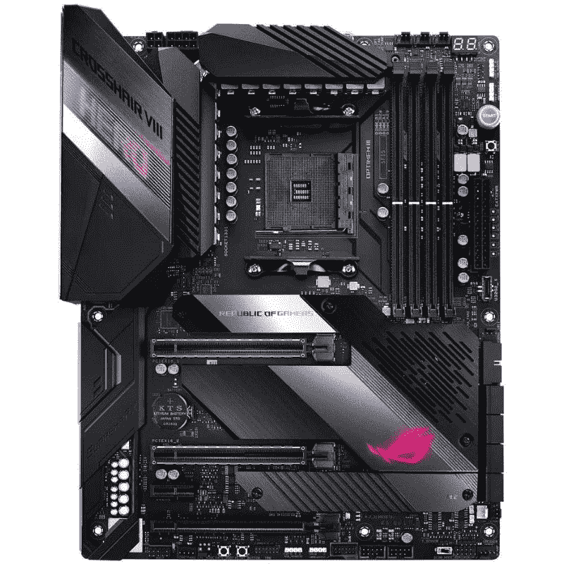
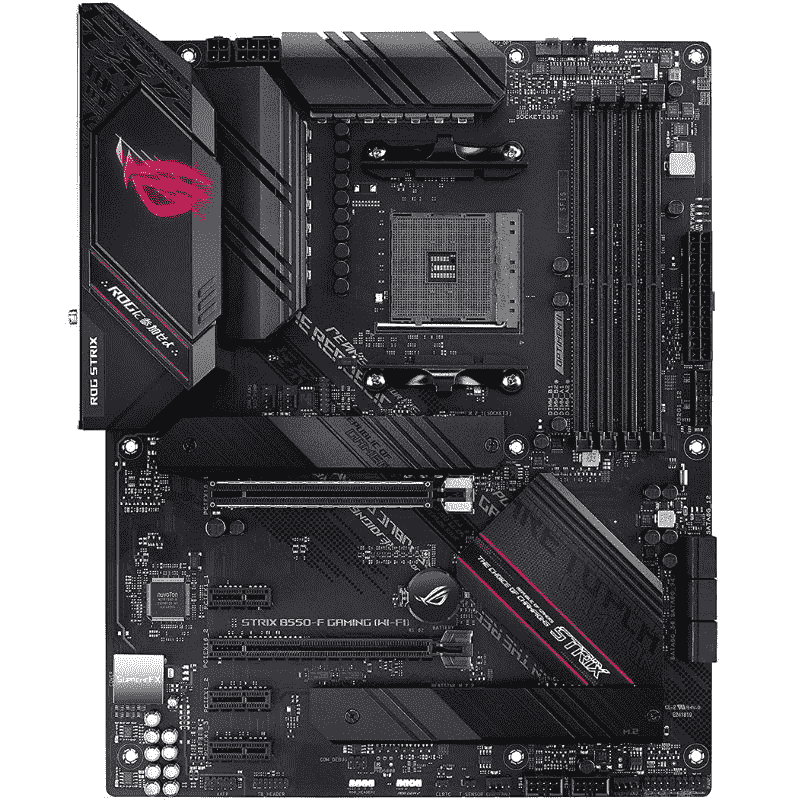

# 2023 年最佳华硕主板

> 原文：<https://www.xda-developers.com/best-asus-motherboards/>

挑选最好的主板可能不像购买 PC 的其他组件那样令人兴奋，但重要的是要选择正确的。拥有一块坚固的主板非常重要，因为它是整个构建的基础。华硕是主要的台式机主板制造商之一，甚至可能是最受欢迎的。

该公司通常负责一些你能买到的最好的游戏主板[。因此，如果您正在寻找建立一个游戏平台，华硕是一个伟大的选择，我们在这里帮助围捕该公司产品线中最好的主板。](http://www.xda-developers.com/best-motherboard-gaming/)

## 高端电脑最佳 Z790 主板:华硕 ROG Maximus Z790 Hero

除了英特尔的第 13 代 Raptor Lake CPUs，该公司还推出了新的 700 系列芯片组。理论上，这意味着英特尔用户可以选择一个全新的 [LGA 1700 主板](https://www.xda-developers.com/best-lga-1700-motherboard/)目录，它比上一代 600 系列主板更强大。然而，到目前为止，它还没有摆脱这种方式，相反，像华硕这样的公司只是用新的芯片组更新现有的模型。

ROG 马克西姆斯 Z790 英雄没有什么不同，在视觉上与 ROG 马克西姆斯 Z690 英雄几乎完全相同。Z790 Hero 有一个几乎纯黑色的主题，带有一些银色的口音和文字，加上 VRM 散热器顶部的 LED 显示屏。这种主板的风格是极简主义和游戏性之间的平衡，只要你喜欢纯黑色，就应该适合大多数版本。

Maximus Z790 Hero 的技术规格与其 Z690 的前身几乎相同。它有一个 20+1 级 VRM，五个用于固态硬盘的 M.2 插槽(其中一个支持 PCIe 5.0)，以及许多背板 I/O，包括两个 Thunderbolt 4 端口和 2.5 千兆位英特尔以太网。Z790 和 Z690 主板除了深色、游戏化但不令人讨厌的设计之外，还有一系列令人印象深刻的功能。Z790 板明显更好的一个关键领域是对 DDR5-7800 的支持；Z690 版本仅支持 DDR5-6400。

实际上，没有技术或性能相关的理由购买 Z790 主板。另外，目前 ROG Maximus Z690 的售价约为 500 美元，而 ROG Maximus Z790 的售价超过 600 美元。对于一台高端电脑的总预算来说，这不是一个巨大的差异，但如果你对省钱感兴趣，这是一个简单的方法。然而，600 系列主板最终会缺货，当这种情况发生时，ROG Maximus Z790 Hero 将比 Z690 更便宜，也更容易找到。

##### 华硕 ROG Maximus Z790 英雄

价格昂贵，但如果你是一个追求最好的发烧友，这是目前英特尔 CPU 最令人印象深刻的主板。如果你热衷于超频，这也是一个很好的选择。

## 高端电脑最佳 Z690 主板:华硕 ROG Strix Z690-E 游戏

如果你正在寻找 Z690 主板的价格和功能之间的平衡，华硕的 ROG Strix Z690-E 游戏应该会让你感兴趣。虽然 Z690 现在在技术上是最后一代，但它仍然是一个现代的高端芯片组，并没有真正被 Z790 取代，Z790 更多的是更新而不是取代。ROG Strix Z690-E 的价格约为 400 美元，拥有 ROG Maximus Z790 Hero 等新型主板 90%的功能，价格却低得多。

从视觉上看，Strix Z690-E 与其他高端华硕主板非常相似，因为它主要使用黑色，带有银色口音和文本加上一些 RGB，但主板的很大一部分也是深灰色，带有拉丝金属表面。这为主板创造了一个双色外观，看起来不错，但可能不会吸引所有人。没有什么特别妨碍 Strix Z690-E 在美学上与其他组件兼容。

Strix Z690-E 配备了 18+1 级 VRM(即使对于[旗舰 Core i9-13900K](https://www.xda-developers.com/intel-core-i9-13900k-review/) 也足够了)，并支持 DDR5-6400，对于一台顶级 PC 来说绰绰有余。它还支持 PCIe 5.0 图形和五个 NVMe 固态硬盘，其中一个可以运行在 PCIe 5.0 的速度。后部 I/O 包括 8 个 USB 端口，范围从 3.2 Gen 1 到 3.2 Gen2x2，2.5 千兆位以太网，以及用于清除 CMOS 和刷新新 BIOS 的按钮。基本上是你能要求的一切。

华硕有更便宜的 Z690 主板，但他们在 VRM 质量、DDR5 支持和 M.2 插槽等方面做出了妥协，以便提供 Z690 芯片组。除非你需要超频支持超过高端 Z690 主板所能提供的任何东西，否则我们真的建议你要么购买像 ROG Strix Z690-E 游戏这样的主板，要么购买中端 B660 主板。

##### 华硕 ROG Strix Z690-E

华硕 ROG Strix Z690-E 游戏 WiFi 不像 ROG Maximus Z690 那样昂贵，但它提供了高端构建的所有基本功能。

## 中档电脑最佳 B660 主板:华硕 ROG Strix B660-A 游戏

华硕的 ROG Strix B660-A 游戏是一种主板，它将支持你计划升级到更高端 CPU 的中端 PC，但没有 Z690 和 Z790 主板的高昂价格。它提供了你需要的所有功能，如果你认为 ROG Maximus Z790 英雄有很多琐碎的功能，那么你可能会发现 Strix B660-A 拥有你想要的一切。

Strix B660-A 混合使用黑色、白色和银色以及一些青色，使其具有强烈的金属外观。虽然这种配色方案看起来不错，但很难找到其他组件(主要是 GPU 和机箱)来匹配 B660-A 的风格，如果你是那种关心这种事情的人，它可能会成为一个障碍。也没有集成的 RGB 照明。

Strix B660-A 采用 12+1 级 VRM，CPU 马力有点有限，可能无法完全支持酷睿 i9-12900K 或 13900K，但使用酷睿 i7 级芯片应该没有问题。此外，该主板支持 DDR4(高达 5333MHz)，这是一个很好的价值，因为 DDR4 比 DDR5 便宜得多，但会稍微降低性能。

但令人惊讶的是，这是大多数妥协停止的地方。x16 插槽上仍然有 PCIe 5.0，NVME 固态硬盘有三个 M.2 插槽，所有这些都以 PCIe 4.0 的速度运行。后置 I/O 可与英特尔的 2.5 千兆以太网高端主板媲美，而不是像 Realtek，Wi-Fi 6 和五个 USB 3.2 端口这样的廉价品牌。你可能更喜欢 PCIe 5.0 的 SSD 而不是 GPU，因为 PCIe 5.0 的 SSD 已经在地平线上，而 PCIe 5.0 的 GPU 还没有出现，但除此之外，这是一个非常健康的功能集。

ROG Strix B660-A 游戏主板的价格约为 200 美元，比华硕的其他 B660 主板更贵，但这些主板更适合低端到中端的个人电脑。Strix B660-A 可以支持升级到更高端的 CPU，如果你打算这样做，你会想要这个主板，而不是更便宜的主板。

##### 华硕 ROG Strix B660-A 游戏

华硕 ROG Strix B660-A 游戏是一款适用于中端个人电脑的主板，以后可以升级为更高端的 CPU。它支持廉价的 DDR4 内存，并配有三个 PCIe 4.0 的 M.2 插槽。

## 高端电脑最佳 X670E 主板:华硕 ROG Strix X670E-E 游戏

凭借锐龙 7000，AMD 推出了新的 600 系列芯片组，其中较高端的是 X670 和 X670E。因为这些芯片组非常相似，所以我们只推荐一款 X670E 主板，华硕的 ROG Strix X670E-E Gaming。华硕确实有一些 X670 非 E 板，但似乎该公司已经将 X670 芯片组降级到中端，而 Strix X670E-E 则是真正的高端产品，拥有你想要的台式机功能，拥有一些最快的组件。

Strix X670E-E 符合大多数高端华硕主板的原型:几乎完全是纯黑色，带有一些银色和 RGB。主板的大部分，如 M.2 和 VRM 散热器以及 I/O 外壳，也有一个拉丝的金属表面。总的来说，Strix X670E-E 看起来很高级，其外观具有足够的延展性，可以与大多数其他组件相适应。

虽然它不是华硕提供的最高端的 X670E 主板，但 Strix X670E-E 基本上提供了你可能需要的一切:两个 PCIe 5.0 x16 插槽，支持快速 DDR5-6400 内存，三个 PCIe 5.0 M.2 插槽(加上一个额外的 PCIe 4.0 插槽)，以及一个 18+2 级 VRM。这对于配备旗舰产品锐龙 9 7950X、RTX 4090 或镭龙 RX 7900 XTX 等高端 GPU，甚至一些 PCIe 5.0 固态硬盘的 PC 来说，已经足够了。后部 I/O 包括大量 USB 3.2 端口、2.5 千兆以太网和一个方便的透明 CMOS 按钮。

ROG Strix X670E-E 游戏售价 500 美元，并不便宜，但比华硕的其他 X670E 主板便宜，同时在某些方面也略好。ROG 十字准星 X670E Hero 只有两个板载 PCIe 5.0 M.2 插槽，同时多花了 200 美元；只有使用附带的扩展卡，英雄才能真正匹配 Strix。总的来说，ROG Strix X670E-E 游戏是华硕最好的 X670/X670E 主板。

##### 华硕 ROG Strix X670E-E 游戏

华硕 ROG Strix X670E-E 游戏是一款高端华硕主板，由于其大型 18+2 级 VRM，它支持 PCIe 5.0 显卡、三个 PCIe 5.0 固态硬盘和高端锐龙 7000 CPUs。

## 中档电脑最佳 B650 主板:华硕 TUF 游戏 B650-Plus

B650 和 B650E 是与锐龙 7000 一起推出的新的中端芯片组，由于它们非常相似，我们只推荐一款 B650 主板，即 TUF 游戏 B650-Plus。与 B650E 相比，B650 只是缺少 PCIe 5.0 GPU 支持，其他方面几乎相同，所以选择华硕的 B650 主板而不是 B650E 主板并没有放弃任何东西。

虽然 TUF 游戏 B650-Plus 主要使用类似于华硕其他主板的黑色，但它也有其他特点，使其与众不同。它使用黄色而不是银色来唤起重型美学，VRM 散热器具有明显的块状形状，这是不寻常的。可能很难将这款主板与匹配的组件配对，但如果你喜欢黑色和黄色，并且不介意缺乏 RGB 照明，B650-Plus 是一个不错的选择。

B650-Plus 几乎拥有你想要的中端 PC 的所有功能，可以变成高端机，而没有任何使高端主板更加昂贵的装饰。它有一个 12+2 级 VRM 和对 DDR5-6400 的支持，这对旗舰锐龙 9 7950X 来说可能有点不够，但对第二名锐龙 9 7900X 来说应该足够了。B650-Plus 还有三个 M.2 插槽，其中一个支持 PCIe 5.0 固态硬盘和 2.5 千兆以太网。

唯一阻碍这款主板的是它 240 美元的价格标签。华硕确实有更便宜的 B650 主板，Prime B650-Plus，但它并没有明显便宜，同时在 VRM 和 M.2 插槽等重要功能上做出了妥协；特别是，TUF 的高级 VRM 非常重要，因为更弱更小的 VRM 会限制原始 CPU 性能。最好是多付一点钱买 TUF 型号，尤其是如果你打算升级的话。

##### 华硕 TUF 游戏 B650-Plus

华硕 TUF 游戏 B650-Plus 是一款中端主板，支持 PCIe 5.0 固态硬盘和中高端锐龙 7000 CPUs。

## 第 10 代和第 11 代英特尔最佳 Z590 主板:华硕 ROG Strix Z590-A 游戏

随着第 13 代英特尔 CPU 的到来，英特尔的旧 500 系列不仅是上一代产品，现在也是上一代产品。尽管如此，建立一个基于 Z590 主板的个人电脑并不是一个可怕的想法，因为它们都在销售；过去售价数百美元的高端主板现在不到 200 美元。华硕的 ROG Strix Z590-A 游戏是一种坚固的主板，可以使用旧的但仍然有效的硬件来驱动以价值为导向的 PC。

Strix Z590-A 使用黑色和银色加白色的组合来实现双色调外观，并在 I/O 外壳上加入一些 RGB。总的来说，Strix Z590-A 看起来既现代又典型，尽管双色设计可能有点两极分化，可能很难与没有类似配色方案的其他组件相适应。

在技术层面上，Strix Z590-A 总体上已经过时。它只支持 DDR4 内存和 PCIe 4.0 固态硬盘，而且只有一个(外加两个 PCIe 3.0 M.2 固态硬盘)。这对性能来说不是很好，但 DDR4 RAM 和 PCIe 3.0 固态硬盘很便宜，随着 PCIe 5.0 固态硬盘进入市场，PCIe 4.0 存储也变得相当便宜。14+2 级 VRM 对于酷睿 i9-10900K 和酷睿 i9-11900K 这样的高端 CPU 来说绰绰有余。此外，后部 I/O 包括一个 2.5 千兆位英特尔以太网端口和七个 USB 3.2 端口，即使对于拥有大量外围设备的用户来说也应该足够了。

ROG Strix Z590-A 售价 150 美元，为据称已经过时的第 10 代和第 11 代英特尔芯片提供了一个不错的案例，这些芯片使用比当前一代 CPU 更便宜的内存和存储设备。重要的是要记住，您在英特尔 500 系列上的升级途径是有限的，因为它没有获得任何新的 CPU(自 2021 年初以来一直没有)，这意味着限制是 10900K 或 11900K。如果你想要或需要比这更快的东西，你必须尝试华硕最近的主板之一。

##### 华硕 ROG Strix Z590-A 游戏

华硕 ROG Strix Z590-A 游戏是用于第 10 代和第 11 代 CPU 的英特尔 500 系列主板。它支持 PCIe 4.0 和用于高端 CPU 的 14+2 阶段 VRM。

## 最佳 X570 主板的最后一代锐龙:华硕 ROG X570 十字准线八英雄

如果你曾经想制造一台高端的锐龙 5000 电脑，但在价格上犹豫不决，这可能是你的机会。锐龙 5000 正在淘汰，锐龙 9 5900X 和锐龙 9 5950X 等 CPU 正在销售，您可以与这些 CPU 配对的最佳 X570 主板之一是华硕的 ROG X570 crosshire VIII Hero。虽然到现在已经三年多了，但十字准线 VIII 仍然提供了高端的体验，几乎没有妥协。

尽管年代久远，十字准星 VIII 英雄仍然看起来很现代，这要归功于它对黑色、银色和 RGB 的自由使用。唯一真正突出的是旧的银口音，这比你会发现在当代华硕主板大得多。这种配色方案在这一点上可能是经典的，并且适合大多数组件。

在购买 X570 主板时，您必须接受只能支持 PCIe 4.0 显卡和固态硬盘的事实。然而，由于 PCIe 5.0 GPU 可能还有很长的路要走，而 PCIe 5.0 固态硬盘刚刚问世，因此错过 PCIe 5.0 并不是一件大事。同样，虽然 DDR5 优于 DDR4(十字准线 VIII 支持的唯一内存)，但该主板支持快速 DDR4-4800 套件。

至于好东西，十字准线 VIII 有三个 M.2 插槽(一个 PCIe 3.0 和两个 PCIe 4.0)，一个 14+2 阶段 VRM，和英特尔的 2.5 千兆以太网。你可能会认为 VRM 有点小，但锐龙 5000 比新的锐龙 7000 CPUs 耗电少得多，所以 14+2 级甚至对 5950X 来说也绰绰有余。

现在，ROG X570 十字准星 VIII Hero 的售价不到 400 美元，比其最初的上市价格便宜得多。虽然它缺乏像 PCIe 5.0 和 DDR5 这样的现代功能，但你仍然可以用这种主板和锐龙 9 5950X 构建一台非常高端的 PC。但是，没有升级路径，这意味着未来任何 CPU 升级都需要新的主板。

 <picture></picture> 

ASUS ROG Crosshair VIII Hero X570 motherboard

##### 华硕 ROG 十字准星 VIII 英雄 X570

华硕 ROG 十字准线八英雄是最好的 ATX 主板之一，基于 AMD 的建设。它以一长串的功能和可靠的性能为后盾，击败了市场上的竞争主板。

## 最佳性价比 B550 主板:华硕 ROG Strix B550-F 游戏 Wi-Fi

AMD 500 系列正处于暮年，这对 B550 主板尤其不利。这些主板需要便宜，才能配得上低端和中端部件，但随着生产的减少，供应将减少，价格将上涨。在华硕的案例中，我们看到预算建设者的选择非常少，但该公司的 ROG Strix B550-F 对于任何组装中端电脑、可能希望安装高端组件的人来说都是一个不错的选择。

Strix B550-F 主要是黑色，带有一些粉红色，但其他方面看起来很普通，因为大部分 PCB 都暴露在外。一些金色和银色的电容也会影响电路板的外观。Strix B550-F 看起来不坏，它可以与大多数组件很好地匹配，只是视觉效果不佳。

作为上一代主板，Strix B550-F 不支持 PCIe 5.0 和 DDR5，而是支持旧的 PCIe 4.0 和 DDR4。然而，在一段时间内不会有 PCIe 5.0 GPU，PCIe 5.0 固态硬盘才刚刚开始出现。DDR5 比 DDR4 更好，但也明显更贵，因此对于注重价值的用户来说，DDR4 实际上更好。

至于 Strix B550-F 在其他 B550 主板中的出色之处，它支持 DDR4-4600，具有 14+2 阶段 VRM，并支持一个 PCIe 4.0 SSD 和一个 PCIe 3.0 SSD。除了支持 PCIe 5.0 固态硬盘之外，Strix B550-F 与华硕新一代的其他主板不相上下。此外，该主板在后部 I/O 上有六个 SATA 端口、英特尔 2.5 千兆位以太网和八个 USB 端口，尽管其中两个以 USB 2.0 速度运行。

ROG Strix B550-F 的价格在 180 至 200 美元之间，有点贵，特别是对于使用中端芯片组的上一代主板来说，但它凭借其良好的 VRM 和对旧 CPU 和 RAM 的支持弥补了这一点，这将大大抵消主板的成本。选择这种主板(或任何 B550 板)的唯一显著缺点是它不会接收新的 CPU。锐龙 9 5950X 是这款主板的极限，推出两年后，它看起来几乎是中端产品。

 <picture></picture> 

ASUS ROG Strix B550-F Gaming Wi-Fi

##### 华硕 ROG Strix B550-F 游戏 Wi-Fi

华硕 ROG Strix B550-F 游戏是市场上较新的 B550 主板之一，对于那些希望使用 5000 系列处理器之一构建强大的 AMD 架构的人来说，这是一个很好的选择。

## 最佳迷你 ITX 主板:华硕 ROG Strix B650E-I

由于 AMD 和英特尔都处于上一代和最新一代的十字路口，因此很难决定华硕的最佳迷你 ITX 主板，但总的来说，ROG Strix B650E-I 可能是最好的。总的来说，英特尔主板几乎已经出局，因为 Alder Lake 和 Raptor Lake CPUs 比锐龙的 CPU 消耗更多的电力，这对 ITX 的电脑来说是一个问题，因为它们往往密度更大，更难冷却。

可以理解，由于空间非常小，装饰迷你 ITX 主板很难，因此华硕为了安全起见，将所有东西都涂成黑色，在各处进行拉丝金属处理，并添加一些银色装饰。关于 Strix B650E-I，视觉上没有太多可说的，但由于 GPU 和 CPU 冷却器等组件将覆盖它的大部分甚至大部分，缺乏创造力可能不是一件坏事。

Strix B650E-I 虽然不是华硕最高端的 ITX 主板，但也差不多达到了 95%的水平。它在 x16 插槽上安装了 PCIe 5.0 显卡，支持 DDR5-6400 和 10+2 级 VRM。这基本上是支持高端 GPU 和 CPU 所需的一切。更高端的 Strix X670E-I 具有基本相同的功能，只是多了几个 USB 端口和一个前面板插卡，这实在不值得额外花费。

如果你不打算使用锐龙 7000 CPU，有很多英特尔 LGA 1700 和最新一代 AMD AM4 迷你 ITX 主板可以考虑。ROG Strix Z690-I 和 ROG Strix Z790-I 均可与 B650E-I 相媲美，对 PCIe 5.0 和 DDR5 的支持类似，此外它们还配备了 Thunderbolt 4。ROG Strix X570-I 使用旧的 AM4 插槽，支持锐龙 3000 和 5000 CPUs，但基本上是硬件升级的死胡同，没有 PCIe 5.0 或 DDR5。

##### 华硕 ROG Strix B650E-I

华硕 ROG Strix B650E-I 是一款 ITX 主板，在一个小尺寸中集成了许多功能:用于图形的 PCIe 5.0，两个 M.2 插槽，以及用于几乎任何东西的大量后置 I/O。它很小的 10 级 VRM 使它无法全速运行锐龙 CPU，但迷你 ITX 版本经常会限制性能。

## 最佳华硕主板:最终决定权

华硕主板是最好的中端产品；该公司的预算选择有许多不足之处。像 TUF 游戏 B650-Plus 和 ROG Strix B660-A 游戏这样的主板可以为中端 PC 提供基础，同时有可能支持更高端的 CPU 和 GPU。华硕的高端主板，如 ROG Maximus Z790 Hero 和 ROG Strix X670E-E Gaming 总体来说还不错，尽管价格相当昂贵。无论您选择哪一种，所有这些主板都可以与目前可用的[最佳 CPU](https://www.xda-developers.com/best-cpus/)和[最快 GPU](https://www.xda-developers.com/best-gaming-graphics-cards/)很好地配对。