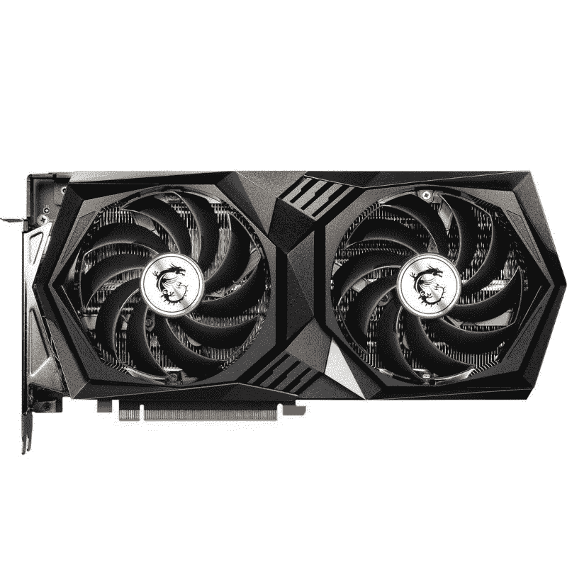
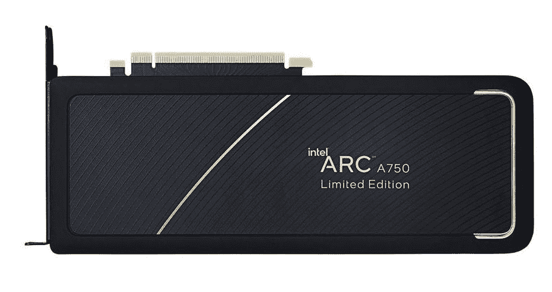
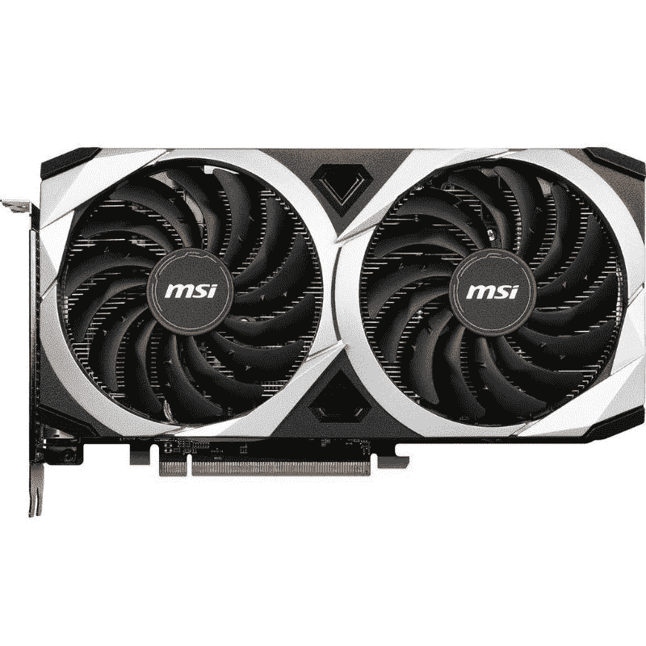

# 2023 年最佳预算显卡

> 原文：<https://www.xda-developers.com/best-budget-graphics-card/>

最近几年，对于预算购买 GPU 的人来说，日子很不好过；2020 年是这样，今天依然如此。AMD 和 Nvidia 只是不像以前那样提供好的超值卡。不过，对于注重价值的个人电脑用户来说，在 100 美元到 300 美元之间还是有一些不错的选择。这些显卡[远不是最好的](https://www.xda-developers.com/best-gaming-graphics-cards/)，但它们在 1080p 甚至在某些情况下 1440p 游戏中以良好的帧速率表现得足够好。

## 最佳预算 Nvidia 显卡:Nvidia GeForce RTX 3050

与上一代 50 级 GPU 相比，RTX 3050 的价格大幅上涨，从 GTX 1650 的 150 美元左右上涨到 3050 的 300 美元以上。对于你们中的许多人来说，这可能会让这张卡太贵而买不起，但它也是 Nvidia 自 2018 年的 20 和 16 系列以来推出的最便宜的 GPU。

3050 在性能方面有所欠缺，其性能水平与旧的 GTX 1660 Super 几乎没有区别。如果不是因为它现在和 3050 的价格差不多，我们会推荐 1660 Super。至少，你可以通过 3050 获得对 DLSS 的支持，这无疑将有助于支持该功能的密集标题。它还拥有 8GB 的 GDDR6 内存，比 1660 Super 的 6GB VRAM 高出一大截。

英伟达没有 3050 的创始人版，所以你必须从华硕和微星等供应商那里购买第三方卡。预计为 3050 支付大约 300 美元，尽管有时如果你幸运的话，你可能会找到一个低于 300 美元的。

 <picture></picture> 

MSI GeForce RTX 3050 GPU

##### 微星 GeForce RTX 3050

微星 GeForce RTX 3050 显卡提供可靠的性能，是寻求体验 1080p 游戏的游戏玩家的绝佳选择。

## 最佳预算 AMD 显卡:AMD 镭龙 RX 6600 XT

同样的 300 美元，你可以买一个 RTX 3050，你可以买 AMD 的镭龙 RX 6600 XT，这是我们的建议，除非你必须有一个英伟达 GPU。就性价比而言，6600 XT 是 AMD 最好的卡，也是整个市场上最好的卡。

与 RTX 3050 相比，6600 XT 快了 50%左右，误差取决于游戏。6600 XT 确实有一些缺点，即缺乏 DLSS 支持和较差的光线跟踪性能。然而，FSR (AMD 的 DLSS 替代品)经常出现在有 DLSS 的游戏中，3050 上的光线跟踪性能也不是很好，所以除非你需要一个 Nvidia GPU 来实现一个非常具体的功能，否则 6600 XT 通常会是一个更好的购买。

如果你找不到 300 美元左右的 RX 6600 XT，还有一个选择。RX 6650 XT 是 6600 XT 的更新版本，具有更高的内核和内存频率，使其性能略高。它的价格通常在 300 至 350 美元左右，比 6600 XT 贵，但由于速度更快，价格差不多。如果幸运的话，你甚至可以找到低于 300 美元的。

 <picture></picture> 

AMD Radeon RX 6600 XT GPU

##### AMD 镭龙 RX 6600 XT

AMD 镭龙 RX 6600 XT 对于那些希望以 1080p 分辨率玩游戏的人来说是一款出色的 GPU。它没有 RX 6700 XT 那么强大，但对于中档车型来说，它已经完成了任务。

## 最佳替代预算 AMD 显卡:AMD 镭龙 RX 6500 XT

我们推荐 RX 6500 XT 并不是因为它好，而是因为它比竞争对手耐用。低于 200 美元的价位，你几乎买不到别的东西，除非你想买二手的。嗯，有像 RX 6400 和 GTX 1630 这样的卡，但这些卡速度较慢，主要针对 SFF 机器。6500 XT 是默认的赢家。

6500 XT 与 RX 580 和 GTX 1650 Super 等较老的 GPU 大致相当，但速度约为更昂贵的 RX 6600 和 RX 6600 XT 的一半。不管怎样，这是假设我们谈论的是一台支持 PCIe 4.0 的电脑。6500 XT 需要 PCIe 4.0 才能以最佳方式运行，而在只有 PCIe 3.0 的电脑中，6500 XT 的性能会下降约 20%。想要购买 6500 XT 的人和拥有 PCIe 4.0 的人之间的重叠非常小，这使得 6500 XT 对于预算购买者来说是一个矛盾的 GPU。

但最终，6500 XT 是 200 美元以下的当代硬件的唯一选择。Nvidia 在这一类别中几乎没有提供任何东西，唯一的其他 AMD GPU 是 RX 6400，它基本上是一个较慢的 6500 XT，具有相同的 PCIe 问题。除了整个 PCIe 的事情，6500 XT 作为一个产品没有什么可怕的，只是太贵了。

##### 技嘉 AMD 镭龙 RX 6500 XT 游戏 OC

AMD 的镭龙 RX 6500 XT 为这一领域的新手提供了良好的 1080p 游戏性能。但是你将在它不寻常的结构限制下工作。

## 最佳预算英特尔显卡:英特尔 Arc A750

二十年来，英特尔首次尝试消费者专用显卡，纯粹专注于更注重预算的市场领域。Arc A750 并不便宜，但 289 美元的推荐价格足以让任何预算系统拥有强大的马力。它比英伟达 RTX 3050 更好，但在功能方面不相上下。

就性能而言，它与旗舰 [Arc A770](https://www.xda-developers.com/intel-arc-a770-review/) 相差不远，只有少量 Xe 和光线跟踪内核。在更广泛的背景下，A750 的性能与英伟达 RTX 3060 相当，性价比更具吸引力。与 RX 6600 相比，A750 的价值主张并不令人惊讶，RX 6600 通常价格更低，但性能相似。另一件要注意的事情是，如果您的主板不支持可调整大小栏，您应该避免英特尔 Arc 炼金术士 GPU，因为他们需要启用此功能，以实现良好的性能。

除了性能和光线跟踪，A750 还拥有 DisplayPort 2.0，甚至连 RTX 4090 都没有，以及 HDMI 2.1。此外，它是首批推出硬件 AV1 编码器的卡之一，非常适合想要走在前沿的内容创作者。旧游戏有一些问题，特别是那些依赖 DX9 的游戏，因为没有硬件支持。但像 DX12 和 Vulkan 这样的新技术在 A750 上表现出色。8GB 的 VRAM 比它的一些替代品更好。

 <picture></picture> 

Intel Arc A750 Limited Edition

##### 英特尔 Arc A750 8GB

英特尔更实惠的 Arc 7 显卡是这一类别中大多数游戏玩家的首选。

## 值得一看的预算 AMD 显卡:AMD 镭龙 RX 6600

AMD 公司的镭龙 RX 6600 基本上是一个削减 RX 6600 XT。从根本上说，这两个 GPU 之间真的没有什么不同，但 6600 可以在 220 美元至 250 美元的区域找到，这使得它更容易为预算购买者所接受，同时具有类似的性价比。

一般来说，你会发现 6600 XT 比普通的 6600 快 15%,这是因为 6600 的内核更少，内核时钟速度更低，VRAM 更慢。虽然你对较低的内核数无能为力，但你可以尝试对 6600 进行超频，以获得接近 6600 XT 的性能。与 RTX 3050 相比，6600 的速度大约快 30%。

阻止我们推荐 AMD 的 6600 作为最佳预算 GPU 的一个原因是它不一致的价格和可用性。你可以发现它的价格低至 220 美元，但在撰写本文时，库存中的型号非常少。一些 6600 XT 和 6650 XT 型号的价格不到 300 美元，这使得 6600 与性能更高的 GPU 非常接近。但是，如果你能在 220 美元的价位上找到 6600 的现货，这是一笔你应该接受的交易。

 <picture></picture> 

AMD Radeon RX 6600 graphics card

##### AMD 镭龙 RX 6600

AMD 镭龙 RX 6600 是一款面向 1080p 游戏玩家的经济型显卡。对于那些希望享受 1080p 游戏而又不想在高端卡上花太多钱的人来说，这是一个不错的选择。

## 入门级游戏的最佳 APU:AMD 锐龙 5 5600G

 <picture></picture> 

AMD Ryzen 5 5600G Processor

AMD 的锐龙 5 5600G 是目前市场上最好的 APU 之一，它非常适合那些希望构建一台经济实惠的入门级游戏 PC 而不需要显卡的人。它不仅拥有相当快的集成显卡，还拥有支持独立显卡的 CPU 能力。5600G 非常适合那些现在就想要一台游戏电脑，但以后才买得起真正的显卡的人。

在 CPU 方面，我们看到六个核心，基本时钟为 3.9GHz，加速时钟为 4.4GHz，以及 16MB 的三级高速缓存。锐龙 5 5600G 还携带 7 个 Vega 集成显卡内核，提供相对令人印象深刻的游戏性能。5600G 只兼容 AM4 主板，这既是优势也是劣势。由于 AM4 是最新一代，你有大量的廉价主板和 CPU 升级选项，但另一方面，你不能得到比锐龙 5000 更新的东西。但是对于预算构建来说，这些权衡是值得的。

谈到锐龙 5 5600G 的游戏性能，集成的 Vega 7 显卡足够强大，甚至可以在 720p 或 1080p 的低设置下运行一些现代 AAA 游戏。像*反恐精英:全球攻势*和*英雄联盟*这样的电子竞技游戏在 AMD 的集成显卡上也运行得很好。5600G 的价格约为 130 美元，是一笔非常划算的交易，并且让你可以选择在未来升级到更强大的独立 GPU。

 <picture></picture> 

AMD Ryzen 5 5600G Processor

##### AMD 锐龙 5 5600G

AMD 锐龙 5 5600G 是一个伟大的 APU，对于那些目前正在努力购买市场上的 GPU。

## 2022 年购买的最佳预算显卡:最终想法

由于 Nvidia 和 AMD 对预算购买者的忽视，GPU 市场的低端到中端市场受到了影响。Nvidia 卡尤其是一个糟糕的交易，让 AMD 和英特尔来收拾残局。一般来说，我们会推荐像 RX 6600 和 RX 6600 XT 这样的 AMD GPUs，因为它们提供了最佳的性价比。如果你绝对必须拥有 DLSS、光线追踪和其他 Nvidia 功能，RTX 3050 是一个选项。英特尔 Arc GPUs 也是一个可行的替代方案。

请访问我们的 [XDA 计算论坛](https://forum.xda-developers.com)进行更多讨论，并从我们社区的专家那里获得更多 GPU 建议。