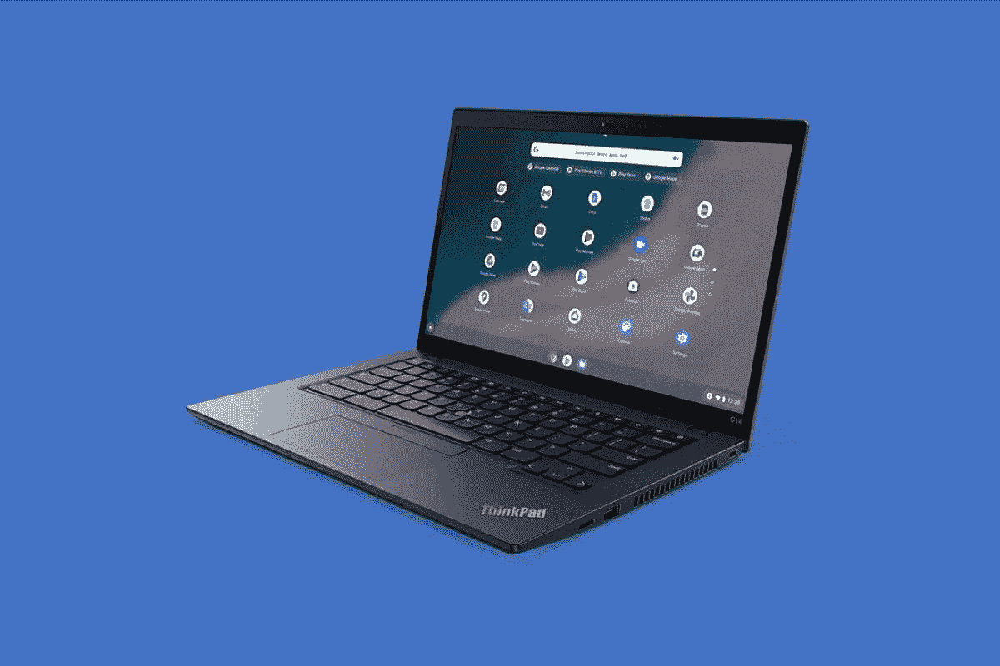

# 2023 年最佳商务 Chromebooks

> 原文：<https://www.xda-developers.com/best-business-chromebooks/>

Chromebooks 受到很多人的欢迎，从学生到日常用户。然而，ChromeOS 是商业的理想选择，这要归功于它的硬件价格和在任何机器上运行的适应性。你可能会在很多商业场合看到 ChromeOS。Chrome Enterprise 可以帮助你管理所有用户，实现基于云的安全协议。

您还可以轻松部署 Chrome OS 设备来促进您的业务交易。最后，[chrome box](https://www.xda-developers.com/best-chromeboxes/)在管理零售商店中的信息亭和其他自助服务站方面非常受欢迎。如果你需要一台商务用的 Chromebook，看看下面我们的精选。

## 最佳综合奖:惠普精英蜻蜓 Chromebook 

购买 Chromebooks 的企业应该获得最新最棒的；规格较老的型号就不行。好消息是，我们的首选，惠普精英蜻蜓 Chromebook 是一个完美的选择。它内置性能卓越的 12 代英特尔 CPU、出色的设计和更多高级功能，使其价值超过 1000 美元。

虽然你经常会发现 Windows 笔记本电脑采用英特尔最好的 CPU，但这在 Chromebooks 中并不常见，Chromebooks 以其价值而闻名。这款惠普精英版蜻蜓 Chromebook 则是另一个极端。从酷睿 i3 到酷睿 i7，英特尔第 12 代 U 系列芯片有多种选择。这些芯片然后与 8GB、16GB 或 32GB 的 RAM 配对；以及 128GB、256GB 或 512GB 的固态硬盘存储。正如我们在[我们的评论](http://www.xda-developers.com/hp-elite-dragonfly-chromebook-review/)中所发现的，当你将所有这些规格结合起来时，你会得到一个真正伟大的 Chromebook，用于处理数据密集的电子表格、运行网络应用程序等商业任务。即使是 Linux 应用程序在这台机器上也应该运行良好。

至于硬件，这是唯一一款配有触觉触控板的 Chromebook，有助于全天滚动网页。拖动窗口到位时，你几乎感觉不到震动，你甚至可以在它的表面上点击任何地方。它还是一个敞篷车，所以你可以把它变成一个平板电脑。借助惠普数字笔，商务人士可以在屏幕上签署文档、为文档添加注释以及在会议中做笔记。

您可以在其中一个出色的显示屏上完成所有任务:防眩光 WLED (1920 x 1280)、bright view LED(2256 x 1504)或 bright view WLED(1920 x 1280)。除了亮度为 1000 尼特的 BrightView WLED 外，400 尼特的亮度看起来都不错。无论您选择哪一种，您都将获得一个具有更高 3:2 纵横比的出色显示器，用于展示演示文稿，将 Chromebook 作为平板电脑使用，甚至观看屏幕上的内容。

我们唯一的问题是它的电池寿命一般，但这是这些高功率英特尔芯片的预期。

##### 惠普精英蜻蜓 Chromebook

惠普精英版蜻蜓 Chromebook 拥有非常棒的触觉触控板、最新的英特尔 CPU 和大量显示器选项，如果您需要一台商务 Chromebook，它将是我们的首选。

## 华硕最佳:华硕 Chromebook Flip CX5400 

有时你可能更喜欢某个特定的 Chromebook 制造商。如果你更喜欢华硕，那么我们建议华硕 Chromebook Flip CX5400。按照 2023 年的标准，它仍然非常适合在商业中使用。

引擎盖下是第 11 代英特尔酷睿 i3 或酷睿 i7 处理器，对于使用谷歌文档和网络浏览等常见业务任务来说仍然很好。以今天的标准来看，附带的 8GB 内存和 128GB 固态硬盘存储可能不算多，但它可以完成常见任务。它还有一个华硕的“ErgoLift”铰链，可以将键盘甲板抬高一点，以获得更舒适的打字角度。结合 1.5 毫米的按键行程，这可以帮助减轻打字时手腕的疼痛。

如果你打算将 Chromebook 带到现场，华硕 Chromebook Flip CX5400 也是一个不错的选择。与联想的 Windows ThinkPads 一样，这款设备采用全金属机箱，符合军用级别的耐用性。尽管感觉溢价，但它仍然是便携式的，厚度为 0.62 英寸，重量接近 3 磅。你可以很容易地将这个装置放入包中进行旅行。

我们最后要提到的是显示屏和手写笔。华硕 Chromebook Flip XC5400 拥有超薄边框、14 英寸 FHD 显示屏，支持华硕触控笔。由于这是一款支持笔的高分辨率显示器，您可以使用笔在文档上绘图和做笔记。完成后，只需将笔放入底盘即可。

##### 华硕 Chromebook Flip CX5400

华硕 Chromebook Flip CX5400 是一款 Chromebook。由于采用了英特尔第 11 代 CPU，以及支持 garaged 手写笔的 FHD 显示屏，它仍然拥有不错的规格。

## 最佳 Windows 应用 Chromebook:惠普精英 C640 G3 

ChromeOS 是一个很好的平台，但企业可能仍然需要不时使用 Windows 应用程序。幸运的是，HP Elite C640 G3 非常适合运行 Windows 应用程序。这是因为它可以运行[Parallels Desktop for ChromeOS](https://www.xda-developers.com/windows-10-chrome-os/)。有了这个软件，你可以在 ChromeOS 上运行 Windows 应用，比如微软 Office，或者几乎任何 Android 或 Linux 应用。

要运行 Parallels Desktop for ChromeOS，您需要一些非常高端的规格。这就是为什么 HP Elite C640 G3 拥有第 12 代英特尔 CPU、16GB RAM 和高达 512GB 的存储空间。特别是我们建议的机型，应该升级到英特尔酷睿 i7 CPU。甚至在商业之外，英特尔 Iris Xe 显卡甚至意味着这款 Chromebook 已经通过了 Steam 游戏的[认证(如果你想在休息时间做这件事的话)。](https://www.xda-developers.com/how-to-run-steam-chromebook/)

HP Elite C640 G3 还具有出色的显示屏和设计。我们建议购买 14 英寸 FHD 1920 x 1080 显示器的型号，亮度高达 1，000 尼特，可以产生清晰的图像。得益于端口数量，您还可以通过该显示器完成很多工作。在这里，您将获得一个 USB Type-C、两个 USB Type-A、一个耳机/麦克风组合和 HDMI 2.0，因此几乎不需要加密狗。惠普还提到，这款 Chromebook 具有防泼溅键盘，这应该有助于防止笔记本电脑受损，并减少对 IT 支持的需求。

说起来，这款 Chromebook 包含了 Chrome Enterprise 升级，让系统管理变得简单。为了安全？键盘上有一个指纹识别器的选项。网络摄像头也很棒，达到 500 万像素，高于其他 Chromebooks 典型的 1080p 网络摄像头。它的质量很高，非常适合视频会议。

##### 惠普精英 C640 G3

[惠普精英 C430 G3](https://www.hp.com/us-en/shop/pdp/hp-elite-c640-14-g3-chromebook-customizable-5z8l4av-mb#techSpecs) 是一款非常适合企业环境的 Chromebook。它与 Parallels for ChromeOS 兼容，因此可以运行 Windows。它还为第 12 代英特尔 CPU 打包了选项，为大 FHD 屏幕打包了选项，并打包了大量端口。

## 最佳 ThinkPad:联想 ThinkPad C14 chrome book Enterprise

 <picture></picture> 

ThinkPad C14 Chromebook Enterprise

通过对笔记本电脑的多年回顾，我们知道了一件事:ThinkPad 和商业是相辅相成的。这是因为它们的规格、耐用性和企业软件选项。虽然这可能会令人惊讶，但也有一款 ThinkPad Chromebook:联想 ThinkPad X14 chrome book Enterprise。

单从规格来看，你会发现这是一款相当强大的联想 Chromebook。这是另一款采用第 12 代英特尔酷睿 i5 处理器的 Chromebook，配有 10 个内核和 12 个线程，高于其他 chrome book。你还可以获得 8GB 的内存和 256GB 的固态硬盘存储，因此你可以在 Chrome 中运行一些标签或几个程序。

为了安全，这款 Chromebook 内部有谷歌的 Titan C 安全芯片。还有一个网络摄像头隐私快门和一个可选的指纹读取器。当你结合所有这三个功能时，这款 Chromebook 上的数据将保持超级安全，不会落入坏人之手。此外，还有博锐认证，这对于 IT 人员来说非常好，并且使 Chromebook 的部署和管理变得更加容易。

ThinkPads 也相当耐用。特别是这款，通过了 MIL-STD 810H 标准，所以在野外摔了也不容易坏。这也不意味着 Chromebook 必须很重。它的重量仅为 3.5 磅，厚度为 0.88 英寸，非常易于管理。

在设计的其他方面，我们想指出键盘、显示器和端口。这款 ThinkPad 的键盘看起来就像你在 Windows ThinkPad 上看到的一样，中间有一个标志性的小块，按键呈凹形。14 英寸的 FHD 显示屏也很棒。显示器顶部是一个 FHD 1080p 网络摄像头，它非常适合在网络通话中展示您的最佳状态。最后，在端口方面，有 USB-C Gen 1、Thunderbolt 4、两个 USB Type-A 端口、一个 microSD 读卡器、HDMI 2.0 和一个耳机/麦克风组合。这是一台连接非常好的机器，就像一些最好的 Windows 笔记本电脑一样。

##### 联想 ThinkPad C14 Chromebook

联想 ThinkPad C14 Chromebook 模仿 Windows 笔记本电脑，但运行 ChromeOS。它有一个很棒的键盘，1080p 网络摄像头和 12 代英特尔 CPU。

## 最佳便携式 Chromebook:联想 Chromebook Duet 5

商业中的一个新趋势是给员工提供 iPads 或 Android 平板电脑用于工作。如果你正在考虑这一点，但更喜欢 ChromeOS 驱动的设备，那么好消息是 ChromeOS 平板电脑已经上市，包括出色的联想 Chromebook Duet 5。

我们多次推荐这款平板电脑，理由很充分。我们[评测了联想 Chromebook Duet 5](https://www.xda-developers.com/lenovo-ideapad-duet-5-chromebook-review/) ，非常喜欢高通骁龙 7c 给日常性能带来的好处。像 iPad Pro 上的 M1 芯片一样，这是一个基于 Arm 的 SoC，因此它可以高效地运行 Android 应用程序，并在基于 web 的工作流中使用它。

我们也不能忘记提到展示。你看，这不是一台 IPS 或 LCD 面板的 Chromebook，而是一台 FHD 1080p 分辨率的 OLED 面板。这意味着您将获得色彩非常准确的显示屏，用于展示演示文稿、观看会议回放和欣赏多媒体内容。显示器也变得异常明亮，达到 500 尼特。最终，所有这些都意味着这款 Chromebook 平板电脑比普通 iPad 更能让您的内容栩栩如生。

这款 Chromebook 平板电脑的另一个伟大之处是联想在包装盒中包含了一个键盘。你甚至不能用 iPad 或 Surface 获得这些！你只要拉出支架，开始打字，不管是在你的桌子上还是你的膝盖上。当我们评论这款平板电脑时，我们为 XDA 打出了长长的帖子，真的很享受这种体验。如果你想在屏幕上画画或做笔记，你也可以购买一个可选的 USI 笔。

##### 联想 Chromebook Duet 5

感谢令人惊叹的有机发光二极管屏幕和随附的键盘，如果你将它与 iPad 相比较，这款 Chromebook 很难成为商务笔记本。

## 最佳基于 Arm 的 Acer Chromebook:宏碁 Chromebook Spin 513

商业运作并不总是在办公室或家里结束。有时候你需要出去走走。好消息是，有几款 Chromebook 提供 LTE 连接，包括宏碁 Chromebook Spin 513。这是一款基于 Arm 芯片的 Chromebook，但仍然值得推荐，因为它具有 LTE 连接功能，因此您在旅途中也可以始终保持连接，并获得良好的电池续航时间。

这款 Chromebook 由高通骁龙 7c 计算平台提供支持。如果你不习惯 Chromebook，这听起来可能很奇怪，但同样，如果你的业务主要是基于网络的任务，这种类型的 chrome book 芯片将毫无问题地为你提供动力。这款 Chromebook 可能没有获得运行 Windows 应用的认证，但它可以比英特尔设备更好地运行 Android 应用。这是因为许多应用程序都是为像这样基于 Arm 的芯片编写的。在其他规格中，至少可以获得 8GB 内存和 128GB 存储空间。电池寿命也应该很长，因为基于 Arm 的芯片非常节能。宏碁声称，这款 Chromebook 的电池续航时间可达 13.5 小时。

这款 Chromebook 的设计也很棒。它由铝制成，具有 2 合 1 外形，因此如果您愿意，可以将其用作平板电脑。该设备的总重量不到 2.56 磅，因此您也可以将它带出办公室。但与我们的首选不同，这款 Chromebook 在显示屏底部周围有一些更厚的边框。这有助于在平板模式下使用设备，但当它用作笔记本电脑时，你可能会发现挡板有点太分散注意力。如果我们一定要抱怨这个选择，虽然，它是关于那些厚厚的挡板。但除此之外，连接性仍然很好，有两个 USB-C 端口，两个 USB-A 端口和一个耳机插孔。

##### 宏碁 Chromebook Spin 513

这款 Chromebook 非常适合商用，主要归功于 LTE 支持，但设计也很棒。

## 最佳 Chromebox:华硕 Chromebox 4

不是每个企业都需要笔记本电脑。如果你需要为一个信息亭供电，或者只是想要自己的显示器和键盘，Chromeboxes 是一个很好的主意。Chromebox 是一款轻便小巧的机器，可以放在显示器后面或桌子旁边，你能买到的最好的产品是华硕 Chromebox 4。

该选项配备第十代英特尔酷睿或赛扬处理器和 DDR4-2666 内存，可实现更快、更流畅、更节能的性能。我们知道它不是最新的英特尔 CPU，但 Chromeboxes 并不真的是台式机的替代品。为了获得更大的功率，这些规格还可以配置到 Core i7 和 16GB 的 RAM。它还支持多达三个 4K 显示器，并配备了多功能的 USB-C 3.2 Gen 1 和 USB 3.2 Gen 2 Type-A 端口，用于快速数据传输。USB-C 还支持电源传输和显示端口连接。

该设备还可以让你享受你最喜欢的应用程序，通过 Google Play 轻松访问 Android 应用程序。然后，还有华硕 Chromebox Enterprise 4 选项，它使用 Chrome Enterprise 为企业提供更多工具。你还可以为这款 Chromebox 配置高达 256GB 的固态硬盘存储，这对于 ChromeOS 设备来说是一个令人印象深刻的数量，也足以支持和安装 Linux 应用程序。

总的来说，如果你需要一台可以运行基于网络的应用程序的机器，并且有一系列关于内部规格的选择，这就是你的 Chromebox。连接三台显示器的能力使其成为办公室的主力，应该是商业用户的首选。

##### 华硕 Chromebox 4

华硕 Chromebox 4 是一款出色的 Chromebox，具有快速的 CPU、紧凑的设计和广泛的端口。

这些是你能买到的最好的 Chromebooks。无论您选择哪种商用 Chrome OS 设备，您都将获得 Chrome OS 的灵活性和 Chrome Enterprise 的安全性。Chromebooks 还可以降低您的设备成本，使其成为任何规模企业的最佳硬件选择之一。如果我们必须选择一个，我们会选择惠普精英蜻蜓 Chromebook，它拥有您通过网络完成工作所需的一切。然而，如果你正在寻找一台用于野外工作的平板电脑，或者如果你想运行一个信息亭，那么这里有一些选项。