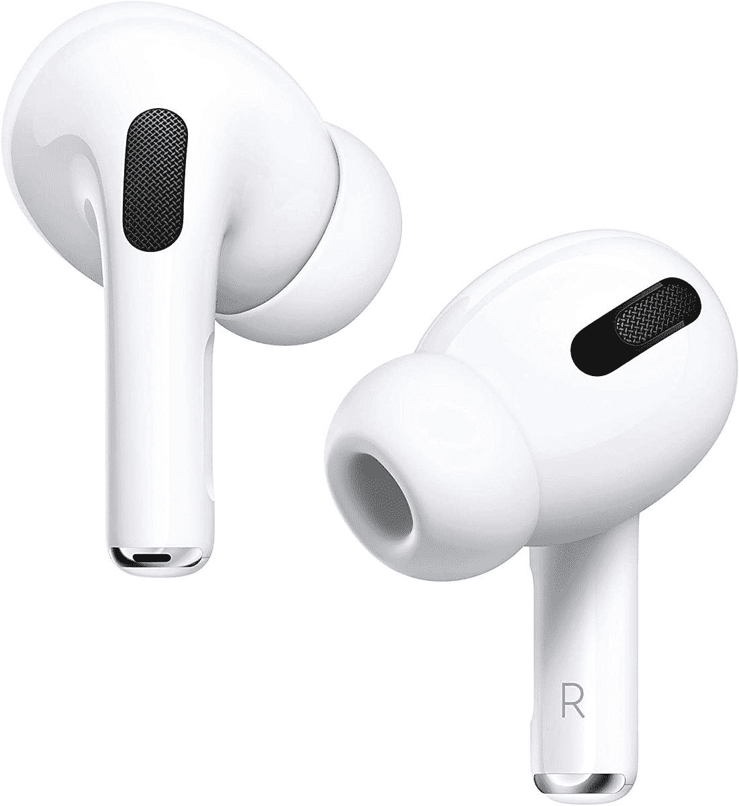

# 在百思买苹果购物活动期间，购买苹果 AirPods 最高可享受 40 美元的优惠

> 原文：<https://www.xda-developers.com/best-buy-apple-shopping-event-airpods/>

# 在百思买苹果购物活动期间，购买苹果 AirPods 最高可享受 40 美元的优惠

百思买目前正在出售大量苹果产品。让我们来看看你现在可以买到的最好的 AirPods 交易。

购买苹果产品从来都不是一个糟糕的时间，但百思买刚刚启动了一次闪购，这使它成为了挥霍你最喜爱的苹果设备的最佳时间之一。我们正在考虑苹果所有主要产品的大幅折扣，包括 iPhone、iPad、Mac 等。不过，你得赶快行动了，因为这些交易只在本周末有效。在这篇文章中，我们将看看 AirPods 上的一些[最划算的交易，所以准备好你的信用卡吧！](https://www.xda-developers.com/best-airpods-3-deals/)

*   <picture></picture>

    苹果 ai rpods Pro

    ##### 苹果 ai rpods Pro

    ai rpods Pro 是苹果的高级无线耳塞。这些配备了新的设计和主动噪音消除。

*   <picture></picture>

    苹果 AirPods 第三代

    ##### 苹果 AirPods 3

    苹果 AirPods 3 是苹果最新的 TWS 耳塞，标志着它们是苹果生态系统深处用户的最佳价值选择之一。

*   <picture></picture>

    苹果 AirPods 第二代带充电外壳

    ##### 苹果 AirPods 第二代

    这些是第二代经济型 AirPods，将与您的苹果设备完全集成，带来出色的整体体验。

## AirPods 配件和外壳的额外优惠

除了上面提到的 AirPods 列表，百思买还提供了一些 AirPods 配件和外壳的优惠。这是我们能够发现的一个快速列表。您可以点击下面的产品名称，访问百思买链接购买它们。

好了，这让我们得出了这个特殊列表的结论。你可能已经知道，苹果有一系列的 AirPods。事实上，你现在就能以折扣价买到它们，这让它们变得更好。苹果产品很少能以折扣价买到，所以我们建议你在它们没了之前抓住它们。除了 AirPods，正如我们前面提到的，百思买也在以折扣价提供许多其他苹果产品，所以一定要去看看。