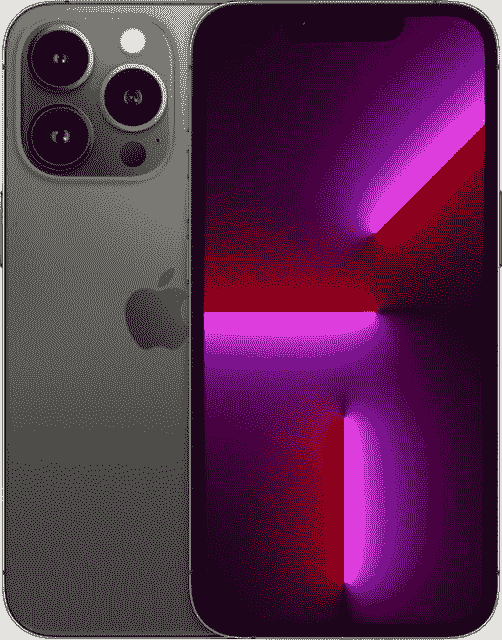
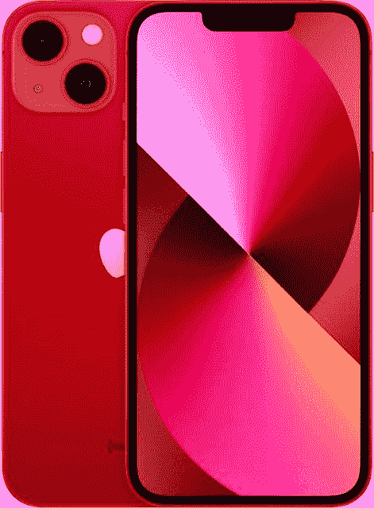

# 现在在百思买买一部新的 iPhone，你可以节省 200 美元

> 原文：<https://www.xda-developers.com/best-buy-apple-shopping-event-iphone/>

百思买刚刚开始了苹果购物活动，为所有苹果产品提供诱人的折扣。所有 iPhone 都有一些很大的折扣，从最新的 [iPhone 13](https://www.xda-developers.com/apple-iphone-13-review/) 系列到 2019 年的 iPhone 11 系列。为了使您的购买更容易，我们整理了一份活动期间所有可用 iPhone 交易的列表。如果你在一部你想要的 iPhone 上看到了一个不错的交易，只要点击它旁边的链接就可以马上订购。没有必要在百思买的网站上寻找最适合你的交易。

在我们跳到所有的 iPhone 交易之前，这里有几个我们认为你会喜欢的突出的交易。

*   <picture></picture>

    iPhone 13 Pro-Graphite，1TB(AT&T)

    ##### iPhone 13 Pro-Graphite，1TB(AT&T)

    Best Buy 最高可优惠 200 美元

*   <picture></picture>

    【一加】10 Pro

    ##### iPhone 13-Product Red，512GB(AT&T)

    Best Buy 在购买 512 GB、Product Red iPhone 13 时提供高达 200 美元的优惠。

不喜欢这些交易吗？别担心，在各种 iPhone SKUs 上还有很多其他的。查看下表，了解百思买正在进行的所有 iPhone 交易。要购买，点击产品名称，你会直接进入百思买的产品页面。

百思买的苹果购物活动将于 6 月 18 日星期六晚上 11:59 CT/12:59AM ET/9:59AM PT 结束。因此，请确保在活动结束前完成购买。零售商可能对上面提到的一些产品库存有限，你应该在缺货之前买到你梦想中的 iPhone。

完成购买前，请确保根据您的要求选择正确的托架、颜色和储物方案。请注意，一些颜色和储物方案的折扣比其他方案更高，因此，如果您想获得最佳性价比，您可能需要做出一些妥协。

如果你不想买新的 iPhone，那就去看看 AirPods 上的一些[最划算的交易，省下几块钱买一副新的 TWS 耳塞。](https://www.xda-developers.com/best-buy-apple-shopping-event-airpods/)