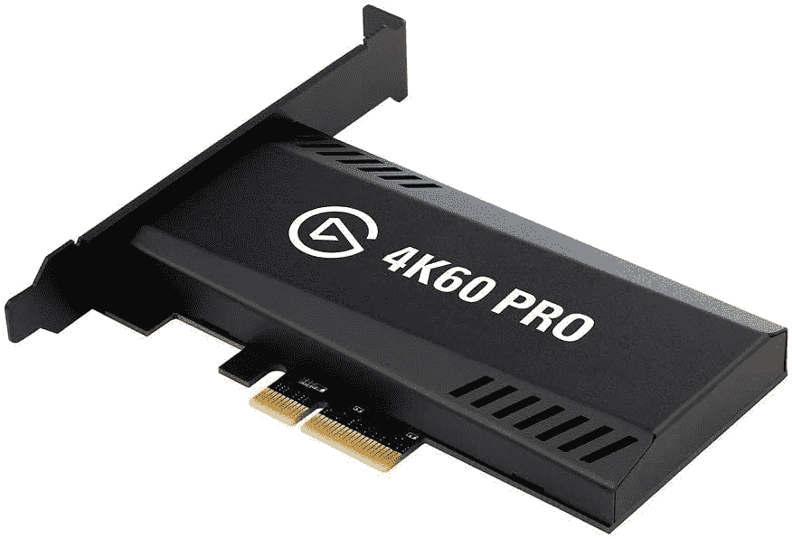
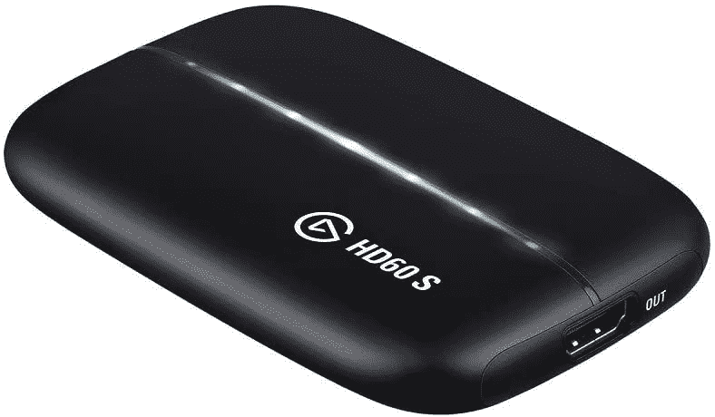
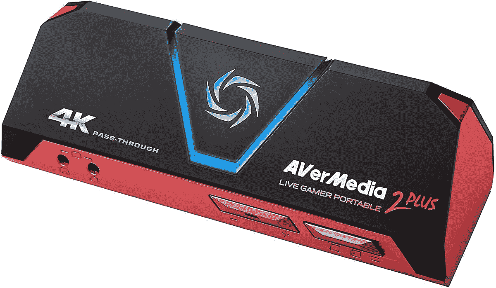
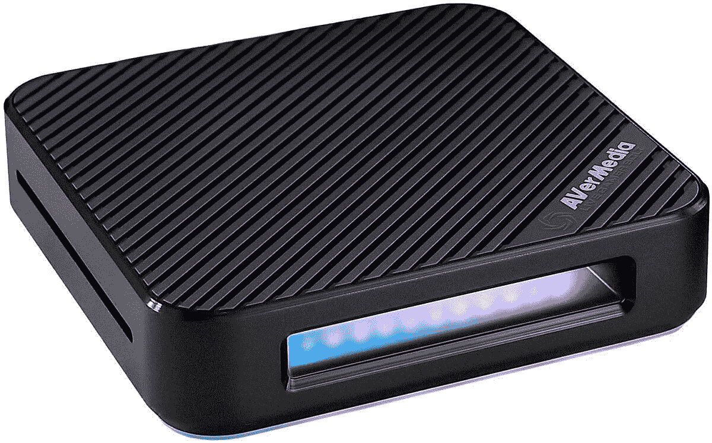
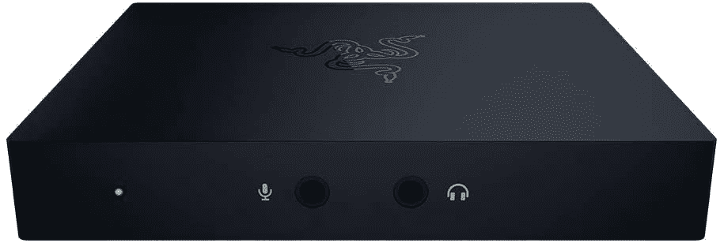

# 2023 年 Xbox 系列最佳捕捉卡

> 原文：<https://www.xda-developers.com/best-capture-cards-xbox-series-x-s/>

所以你终于能够得到 Xbox Series X，这是与因缺货和倒票而臭名昭著的 PlayStation 5 和 T2 并列的最新游戏机之一。或者也许你有 Xbox 系列，在[我们的评论](https://www.xda-developers.com/xbox-series-s-review/)中，我们认为这是一款适合精打细算的人的游戏机。不管怎样，这都是好消息！现在，你可能正着眼于下一步。也许你想记录你的游戏？或者是时候开始抽搐生涯了？如果是这样，你会想看看 Xbox 系列 X 采集卡。

大多数捕捉卡需要计算机来使用，这些捕捉卡可以与任何现代的控制台一起工作。但是，如果你想捕捉 X 系列的 4K 内容，或者只是想轻松录制视频，请确保选择合适的采集卡！

**浏览本文:**

## 最佳 Xbox Series X 采集卡:Elgato 4K60 Pro MK.2

Elgato 是最知名的抓卡品牌之一，这是有原因的。Elgato 卡很好地在价格和功能之间走钢丝，所以这种卡很受磁带和视频创作者的欢迎。他们有各种各样的卡可供选择，这取决于你想要什么，但其中最好的可以说是 Elgato 4K60 Pro MK.2。

正如你可能已经猜到的，Elgato 4K60 只需将它安装在电脑上，并将正确的 HDMI 电缆插入输入和输出端口，即可捕捉 4K 60 fps 的视频。捕捉卡适用于大多数流行的流媒体和录制应用程序，因为 Elgato 是游戏玩家中最受欢迎的选择，所以大多数应用程序都是为配合它而设计的。唯一真正的缺点是你需要把它安装到你的电脑上，而不是列表上的其他外部采集卡。然而，众所周知，内部采集卡在流式传输时延迟较小，所以如果您正在寻找一种能够很好地采集和流式传输的卡，这就是它。

 <picture></picture> 

Elgato 4K60 Pro MK.2

##### Elgato 4K60 Pro MK.2

不要弄乱其余的-如果你想要一张卡做所有的事情，你会想要得到 Elgato 4K60 Pro MK.2。你必须将它安装到你的计算机塔中，但作为回报，你可以很容易地捕捉 4K 音频和视频。

## 最佳外部采集卡:Elgato HD60 S

您可能有各种各样的原因想要使用外部采集卡。主要原因是不要为了一个捕获卡而打开你的 PC 塔，但是也有可能你没有地方放它。一个外部采集卡可以是一个简单的解决方案，因为你只需将它插入到您的控制台和 PC 和发挥！Xbox 系列 X 和 S 的最佳外部采集卡是 Elgato HD60 S。

Elgato HD60 S 有一个不言自明的名字，因为它可以以 60FPS 的速度拍摄 1080p 的镜头。这个捕捉卡不能*捕捉 4K 的镜头，但当谈到流媒体时，你通常会有 1080p 的分辨率，除非你和你的观众都有非常好的互联网。HD60 配有软件，但你可以选择 Streamlabs OBS。从那里，这实际上是一个即插即用的采集卡。易于使用，无需安装！*

 <picture></picture> 

Elgato HD60 S

##### 埃尔加托 HD60 S

Elgato HS60 S 可能是目前质量最好的捕捉卡。你不会得到 4K 视频，但它几乎可以即插即用任何现代游戏机，包括 Xbox 系列 x

为了正常工作，几乎所有的采集卡都需要插入 PC 或者物理安装在 PC 中。对于 Xbox Series X 采集卡来说，这可能会令人沮丧，因为您可能不想为了满足所有录制需求而被束缚在 PC 上！如果是你，那么你可以选择 aver media Live Gamer Portable 2 Plus。

与此列表中的所有其他采集卡不同，aver media Live Gamer Portable 2 Plus 有一个 MicroSD 插槽，因此您可以录制视频，而完全不需要插入 PC。这是捕捉视频片段的完美选择，无需将一堆电线连接到您的电脑或四处移动东西。当然，Live Gamer Portable 2 Plus 也可以用于更传统的流媒体和视频捕捉，并具有 4K 直通功能。这是一个非常漂亮的外部采集卡。

 <picture></picture> 

AVerMedia Live Gamer Portable 2 Plus

##### AVerMedia Live 玩家便携版 2 Plus

与大多数捕捉卡不同，aver media Live Gamer Portable 2 Plus 允许您在不插入 PC 的情况下捕捉镜头！有了 4K 的通行证，那些片段看起来也会很棒。

你想要绝对最好的 4K 视频吗？你可以通过 AVerMedia Live 玩家 Bolt 获得它，但你也必须支付几乎与 Xbox Series X 相同的费用才能获得它。你*确实*得到了你所支付的，而现场玩家博尔特是市场上最好的捕捉卡之一。

使用 AVerMedia Live 游戏玩家 Bolt，你可以以每秒 60 帧的速度捕捉 4K 视频，没有问题。对于高清视频捕捉，您将获得高达 240FPS 的速度。还有一个 7.1 环绕声直通，所以你的游戏听起来会很棒。低延迟不仅有助于游戏，也有助于减少数据流中的延迟。这几乎是市场上最强大的 Xbox 系列 X 采集卡。

除了价格，你还需要确保你有一个雷电 3 端口来使用游戏玩家 bolt。谢天谢地，[获得一个雷电 3 端口并不那么困难](https://www.amazon.com/VAVA-Adapter-MacBook-Thunderbolt-Delivery/dp/B084ZDPNTT?tag=xda-3s42u5m-20&ascsubtag=UUxdaUeUpU6900&asc_refurl=https%3A%2F%2Fwww.xda-developers.com%2Fbest-capture-cards-xbox-series-x-s%2F&asc_campaign=Short-Term)，如果它还没有内置在你的装备中的话。

 <picture></picture> 

AVerMedia Live Gamer Bolt

##### AVerMedia Live 玩家 Bolt

AVerMedia Live 游戏玩家 Bolt 并不便宜，但它是市场上最强大的捕捉卡之一。有了 4K，60 帧每秒的视频，你所有的游戏将看起来像水晶般清晰。

## 最佳记录采集卡:Razer Ripjaw HD

也许你只是想录些视频。流媒体远不是游戏内容创作的终极目标，有时你只是想要视频或文章的清晰、流畅的游戏体验。有了这个，你可以跳过 Elgatos 和 AVerMedias 的费用，选择 Razer Ripjaw HD。

Razer Ripjaw HD 支持 4K，60FPS 直通，并支持视频的各种分辨率。Ripjaw 也有无软件的音频管理(虽然如果我在使用任何采集卡时学到了任何关于音频的东西，那就是它会给你带来一些问题)。基本上，这将做你需要它来捕捉视频的一切，但价格通常比 AVerMedia 低，而且不必像 Elgato 4K60 Pro MK.2 那样直接安装到你的 PC 设备上。

 <picture></picture> 

Razer Ripsaw HD

##### Razer Ripsaw HD

只是想抓拍 Xbox 系列 X 的镜头？你可能想抓住雷蛇 Ripjaw 高清！它比这个列表中的其他捕获卡便宜一点，但仍然可以做你需要的事情。

* * *

你试用过哪些捕捉卡？我们强烈推荐 Elgato 和 AVerMedia 的产品，因为它们是业内最好的。你尝试过其他品牌并取得了一些成功吗？请在评论中告诉我们。