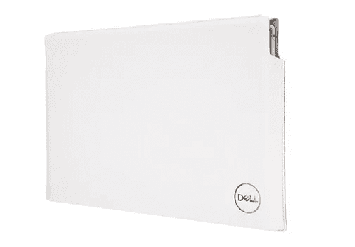
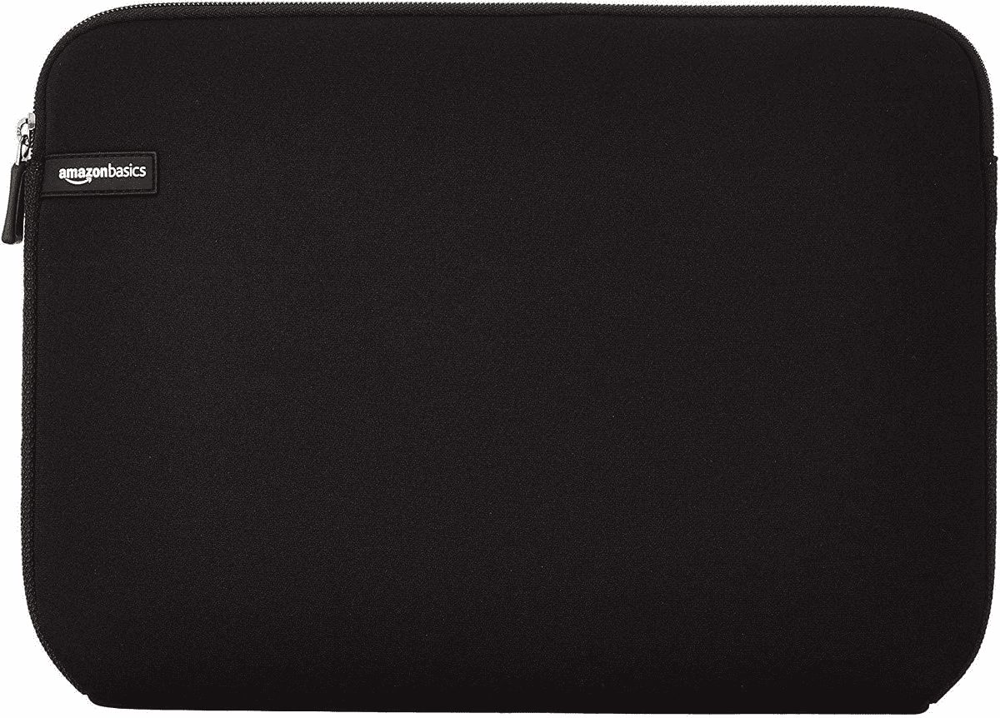

# 戴尔 XPS 13 的最佳案例(2022)

> 原文：<https://www.xda-developers.com/best-cases-dell-xps-13-2022/>

[戴尔 XPS 13](https://www.xda-developers.com/dell-xps-13-2022-review/) 一直是你每年都能买到的[最好的笔记本电脑](https://www.xda-developers.com/best-laptops/)之一，2022 款也不例外。与上一代相比，它确实有一些重大变化，但归根结底，这是一款高端笔记本电脑，带来了很多好处。当然，这也意味着它并不便宜，如果你花 1000 多美元买一台戴尔 XPS 13，可能值得多投资一点买一个保护它的外壳。

那里从来不缺少笔记本电脑的外壳和包，你几乎可以在任何地方找到它们。但是如果你不确定该买哪一个，我们会帮你的。我们收集了一些箱子和袋子，可以帮助您保护您的 Dell XPS 13，并使其更易于携带。让我们开始吧。

*   <picture></picture>

    戴尔专业保护套 13

    ##### 戴尔专业保护套 13

    戴尔官方专业保护套是保护您笔记本电脑安全的绝佳选择。它大小合适，你可以轻松地用手或用肩带携带，所以它最适合你的旅行风格。

*   <picture></picture>

    Nido 笔记本电脑套

    ##### Nido 14 寸笔记本电脑套

    想要多余的空间放你的配件吗？这款 Nidoo 包带有一个单独的袋子，因此您可以携带所有配件，空间更大。它还能让你在旅行时更容易打包。

*   <picture></picture>

    适用于 XPS 13 的戴尔 Premier 保护套

    ##### 戴尔 Premier 保护套 13

    它可能是为 XPS 13 的旧型号设计的，但戴尔 Premier 保护套绝对是一款外观惊艳的保护套，可以保护您的笔记本电脑免受日常碰撞和磨损。我们不能夸大它看起来有多棒。

*   <picture></picture>

    Tomtoc 笔记本电脑单肩包

    ##### Tomtoc 笔记本电脑单肩包

    这款 Tomtoc 包可以很好地保护您的笔记本电脑安全，具有额外的缓冲和加固的边角，它还具有额外的储物袋，因此您可以携带所有的配件。另外，你可以用肩带带着它。

*   <picture></picture>

    亚马逊基本款笔记本电脑套

    ##### 亚马逊基本款笔记本电脑套

    如果你不想花很多钱，只想得到最基本的保护，亚马逊基本款笔记本电脑套名副其实。不过，它仍然有几种颜色可供选择，所以你可以得到更个性化的东西。

*   <picture></picture>

    Bagsmart 笔记本电脑套

    ##### Bagsmart 笔记本电脑套

    想要更有格调一点的东西吗？这款 Bagsmart 袖套设计更加别致，可能正是你想要的。有黑色和粉色可选，可以选择更符合个人风格的。

*   <picture></picture>

    Nillkin 笔记本电脑保护套

    ##### Nillkin 笔记本电脑保护套带支架

    保护您的戴尔 XPS 13 固然很好，但如果您的保护套能做得更多呢？这款可以——开口翻盖可以兼作鼠标垫，如果你需要额外的高度来舒适地工作，这款包本身可以用作笔记本电脑支架。它还在一个纤薄的包装中提供了坚实的保护。

*   <picture></picture>

    戴尔 EcoLoop 城市背包

    ##### 戴尔 EcoLoop 城市背包

    如果你想要一个苗条的方式随身携带你的笔记本电脑，所有这些袖子都足够好，但对于长途旅行来说，背包可能是一个不错的选择。戴尔的这款看起来时尚而现代，而且有足够的空间来放置配件和您需要的任何东西。

这就是我们为 2022 年戴尔 XPS 13 推荐的机箱。这里有适合每个人的东西，你一定会找到你喜欢的东西。就个人而言，金马袖是最吸引人的，因为它提供了很好的保护，你可以从非常广泛的选择外观。然而，还有其他看起来更时尚的选择，你可能会更喜欢这些。或者，如果你经常旅行，背包可能是你的正确选择。

如果您还没有，可以使用以下链接购买戴尔 XPS 13 (2022)。就像以前的迭代一样，这是一个非凡的设备，它包装了一些受欢迎的升级和变化，包括新的外观和颜色可供选择。不过，如果你还不相信，你可以随时查看一下你现在能买到的最好的戴尔笔记本电脑。该公司有一些很好的选择，包括一些更大的笔记本电脑，如果你想要更强大的东西。

 <picture></picture> 

Dell XPS 13 9315

##### 戴尔 XPS 13 9315

全新的戴尔 XPS 13 进行了彻底的重新设计，有天空色和棕色可选。它也是有史以来最薄最轻的 XPS 笔记本电脑。