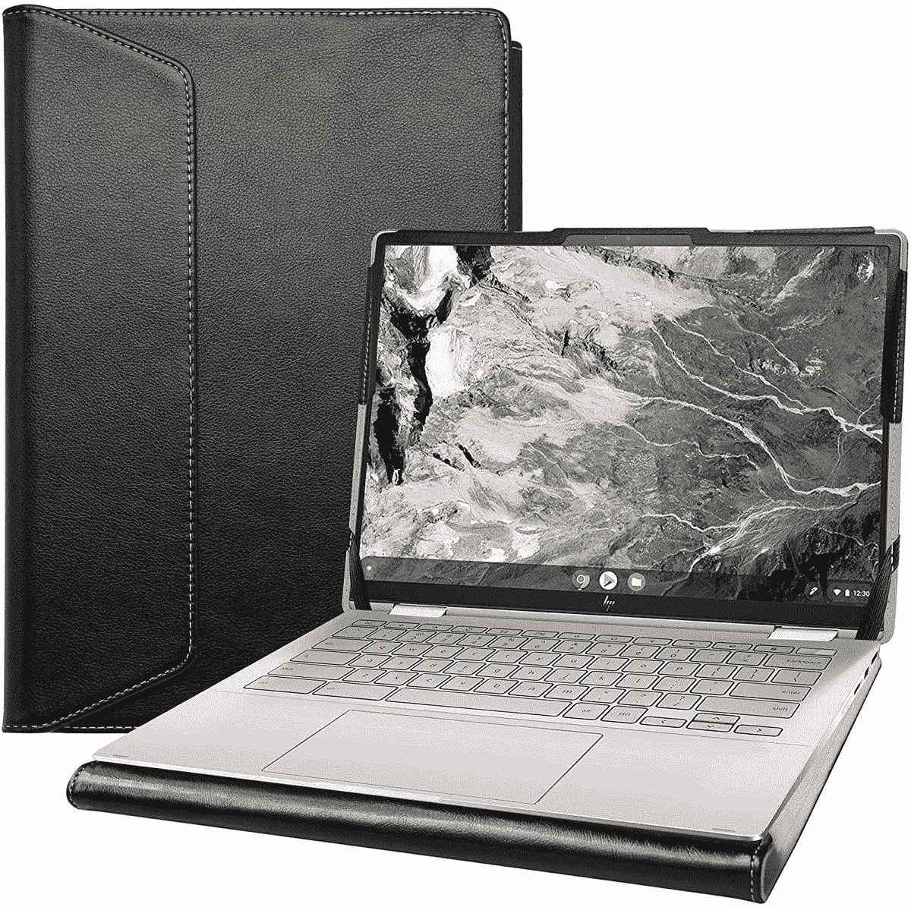
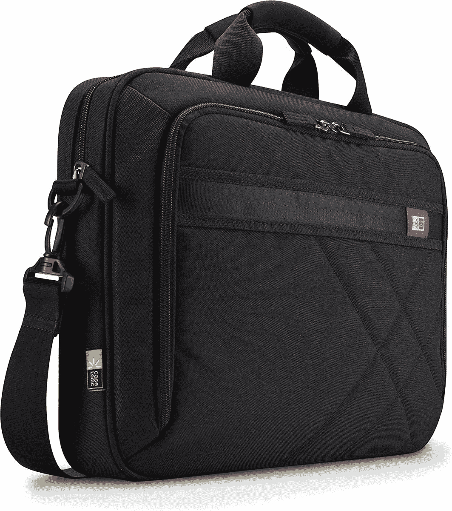
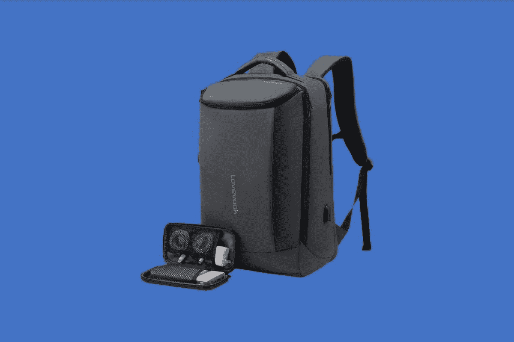

# 2023 年戴尔 XPS 17 的最佳案例

> 原文：<https://www.xda-developers.com/best-cases-dell-xps-17/>

# 2023 年戴尔 XPS 17 的最佳案例

看看戴尔 XPS 17 的一些最佳外壳、护盖和保护套，应该可以帮助您提供一些急需的保护。

[戴尔 XPS 17](https://www.xda-developers.com/dell-xps-17-2022-review/) 是目前最高端的 17 英寸笔记本电脑之一，也是你花钱能买到的[最好的戴尔笔记本电脑](https://www.xda-developers.com/best-dell-laptops/)之一。它拥有强大的功能，其英特尔酷睿 i9 CPU 选项以及英伟达 RTX 3060 显卡无与伦比，使其成为内容创作者理想的[最佳笔记本电脑](https://www.xda-developers.com/best-laptops/)。然而，像这样的高端笔记本电脑需要精心呵护。

如果你打算随身携带，你不会希望你的新设备最终被损坏。因此，如果您正在寻找最佳保护，请查看这些 XPS 17 案例。对于各种预算，有大量的选项可供选择，我们收集了九个我们能找到的最好的选项。

*   ##### NIDOO 17 英寸笔记本电脑保护套

    NIDOO 的这一选项是适用于戴尔 XPS 17 的绝佳基本保护套。它具有防水性，泡沫衬垫可以在您外出时保护您的笔记本电脑免受恶劣天气的影响。

    T13
*   ##### 适用于 XPS 17 的 mCover 保护套

    这是一款简单的透明外壳保护套，可以扣在您的 XPS 17 上，提供全方位保护，同时保持笔记本电脑的完美外观。它还配有可折叠的支脚，可以升高键盘以获得更好的打字角度，并从底部提供更好的气流。

*   <picture></picture>

    亚马逊基本款笔记本电脑套

    ##### 亚马逊基本款笔记本电脑套

    这款亚马逊基本款笔记本电脑套顾名思义这是 XPS 17 的基本保护套，提供简单的织物保护层。

*   <picture></picture>

    alap MK 保护套

    ##### alap MK 保护套戴尔 XPS 17 保护套

    兼容 2020 和 2021 型号的 XPS 17 alap MK 保护套皮革对开风格保护套。它可以很容易地用两根弹性橡皮筋绑在笔记本电脑上，并在底部提供适当的通风。

*   ##### Masa Kawa 17 寸真皮电脑包

    Masa Kawa 17 寸真皮电脑包是 XPS 17 中最豪华的一款。它有一个非常漂亮的皮革表面。还有许多储物格，你可以用来存放你的配件和其他科技产品。

*   ##### 多姆 ISO 17 寸防震笔记本电脑套

    这款套与 XPS 17 的其他任何一款都不一样。它防震，并提供额外的保护，从下降和擦伤。内部有多层保护和填充泡沫，真正保护您的 XPS 17 免受损坏。

    T17
*   ##### 肯辛顿 SP17 经典套

    肯辛顿是相当著名的品牌，所以你可能会因为这个原因而想为你的 XPS 17 考虑这个案例。这是一款经典的袖套，保证适合您的 XPS 17。它配有一个带衬垫的笔记本隔层、一个内部文件存储袋和一个带衬垫的肩带。

*   <picture></picture>

    机箱逻辑笔记本电脑和平板电脑公文包

    ##### 机箱逻辑笔记本电脑和平板电脑公文包

    适合 XPS 17 的 messenger 机箱，可提供充足的空间来携带额外的附件，包括充电器、硬盘、电缆等。它甚至有空间在笔记本电脑旁边放一个 10 英寸的平板电脑。

*   <picture></picture>

    Lovevook 商务背包

    ##### Lovevook 商务背包

    这不是一个案例，是一个背包，但对于那些忙碌的创作者来说，这是很棒的。它可以保护您的 XPS 17，并帮助您随身携带相机和充电器等功能设备。

如果您想要保护并有可能延长笔记本电脑的使用寿命，这些是戴尔 XPS 17 的一些最佳案例。想要更多吗？查看 XPS 17 的一些[最佳配件。我们还列出了今年你应该购买的](https://www.xda-developers.com/best-dell-xps-17-accessories/)[最佳笔记本电脑](https://www.xda-developers.com/best-laptops/)，以及 2021 年[最佳戴尔笔记本电脑](https://www.xda-developers.com/best-dell-laptops/)。此外，看看百思买提供的一些强烈推荐的[笔记本电脑。](https://www.xda-developers.com/best-laptops-available-at-best-buy/)

 <picture></picture> 

Dell XPS 17 9710

##### 戴尔 XPS 17 9720

如果您想要一个大屏幕，Dell XPS 17 采用了其较小兄弟产品的紧凑设计和强大规格，并将其提升了一个档次，以获得更好的体验