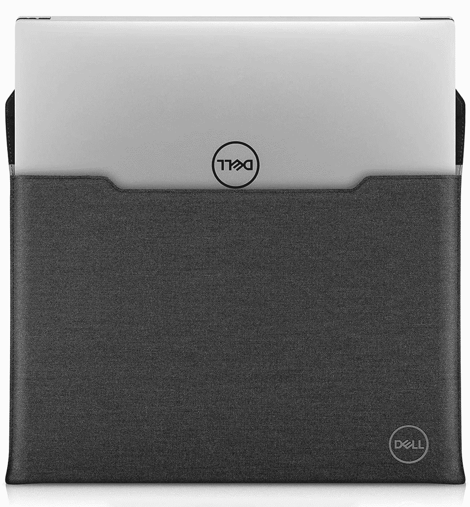

# 联想 Yoga 7i 的最佳案例(2022)

> 原文：<https://www.xda-developers.com/best-cases-for-the-lenovo-yoga-7i/>

# 联想 Yoga 7i 的最佳案例(2022)

拥有 14 英寸或 16 英寸的 Yoga 7i？这些保护套有助于保护您的新 2 合 1 设备免受损坏。

联想 Yoga 7i 14 英寸(2022)

如果你打算带着新的联想 Yoga 7i 去办公室、学校或其他任何地方，你需要保护好它。有了 360 度铰链和 16:10 宽高比的灵敏屏幕，你真的不希望你的新[联想笔记本电脑](https://www.xda-developers.com/best-lenovo-laptops/)在你的包里被损坏。

这就是为什么你会想看看这些最好的案例。我们收集了 14 英寸和 16 英寸 Yoga 7i 型号的几个案例。

## 14 英寸联想 Yoga 7i 手机套

*   ##### 联想 Urban 笔记本电脑保护套

    这是一款官方的联想保护套，与 Yoga 7i 配合非常棒。它纤薄、简约，并配有加固橡胶角，可保护您的二合一设备。

*   <picture></picture>

    联想 ThinkPad 袖套

    ##### 联想 ThinkPad 袖套

    虽然上面有 ThinkPad 的烙印，但是这款袖套对于 Yoga 7i 来说绝对不会错它具有全黑的专业外观，可以保护您的设备免受碰撞和冲击。甚至还有储物的侧袋。

*   ##### Lacdo 14 英寸笔记本电脑套

    这款 Lacdo 笔记本电脑套是你能买到的最好的不带手柄的 Yoga 7i 之一。它设计简洁，有多种经典颜色可供选择。甚至还有一些空间可以放置充电器和耳机。

*   ##### 惠普 Renew Business 14.1 寸包

    如果你在意环境，那么这就是你的 Yoga 7i 的电脑包。它有多个口袋，一个肩带，由回收材料制成，为每个人创造了一个更加绿色的世界。

    T17
*   <picture></picture>

    Targus Strata 笔记本电脑套

    ##### Targus Strata 笔记本电脑套

    Targus 制作出了令人惊艳的笔记本电脑套，从品牌上看这款包包不会错。它有一个肩带和一个手提把手，便于在路上使用。

*   ##### 亚马逊基本款 14 英寸笔记本电脑套

    这款亚马逊基本款套是 Yoga 7i 最便宜的套之一。它做了它应该做的事情，并防止你的 Yoga 7i 被划伤和凹陷，这要归功于轻薄的织物材料。它也有多种颜色。

## 16 英寸 Yoga 7i 包

*   ##### Tangbolibo 笔记本电脑套

    这是一款普通的笔记本电脑套，适用于 16 英寸 Yoga 7i。它有不同的颜色，提供 360 度的保护和抗冲击能力。甚至还有便于携带的把手和带子。

    T17
*   ##### Lacdo 笔记本电脑保护套

    这款来自 Lacdo 的笔记本电脑保护套尺寸为 16 英寸。它有一个经典的蓝橙相间的外观。它还有一个提手，前面还有一个储物格，可以存放你喜欢的配件。

*   ##### Kinmac 360 保护套

    颜色很多的 Yoga 7i 需要一个 16 寸的笔记本电脑套？这正是金马公司的产品所提供的。

    T37
*   <picture></picture>

    沃特菲尔德设计 PC sleeve case

    ##### 沃特菲尔德设计 PC Sleevecase

    这款沃特菲尔德的袖子可不是你普通的袖子。你可以用皮革或尼龙等优质材料定制一套适合你的瑜伽 7i。

*   <picture></picture>

    戴尔 Premier sleep 17

    ##### 戴尔 Premier sleep 17

    如果你不介意使用戴尔产品搭配你的联想 Yoga 7i，那么这款 sleep 很棒。与其他产品不同，它具有防水性，内部的超细纤维涂层可以在您插入和取出 Yoga 7i 时清洁和保护它。

*   ##### MOSISO 笔记本电脑套

    Mosio 的笔记本电脑套是为那些想给 Yoga 7i 增加一点独特外观的人准备的。它有各种不同的颜色，同时还提供一些基本的保护，防止碰撞和擦伤。

    T34

这些都是我们为联想 Yoga 7i 推荐的最佳保护套和保护套。对于 14 英寸 Yoga 7i 的最佳保护套，你会想要选择联想 Urban 笔记本电脑保护套，因为它采用了极简设计和橡胶角。Targus 和 Lacdo 还有其他更便宜的袖子，也有同样的功能。使用 16 英寸 Yoga 7i，尝试 Tangbolobo 笔记本电脑套或更高级的定制设计 Waterfielf PC 套不会出错。

有很多方法可以保护你的新瑜伽 7i，我们希望你找到一个适合你的。如果你还没有 Yoga 7i，而 Yoga 7i 具备成为[最好的联想设备](https://www.xda-developers.com/best-lenovo-laptops/)之一的条件，那就看看下面吧。

*   <picture></picture>

    联想 Yoga 7i

    ##### 联想 Yoga 7i (14 英寸)

    14 英寸型号的联想 Yoga 7i 包括第 12 代英特尔酷睿 U 系列处理器和 2.2K IPS 显示屏，在时尚的机箱中提供了性能和电池续航时间的完美平衡。

*   <picture></picture>

    联想 Yoga 7i (16 英寸)带弧形显卡

    ##### 联想 Yoga 7i 二合一(16 英寸)

    联想 Yoga 7i 是一款出色的可转换笔记本电脑，拥有强大的处理能力和出色的 GPU，可用于轻度游戏以及照片和视频编辑。

*   ##### 联想 Yoga 7i (16 寸英特尔 Arc)

    这款 16 寸联想 Yoga 7i 采用英特尔 Arc，该公司首款专用显卡。它为想要玩轻度游戏和编辑照片的用户提供了巨大的推动力。

    T34