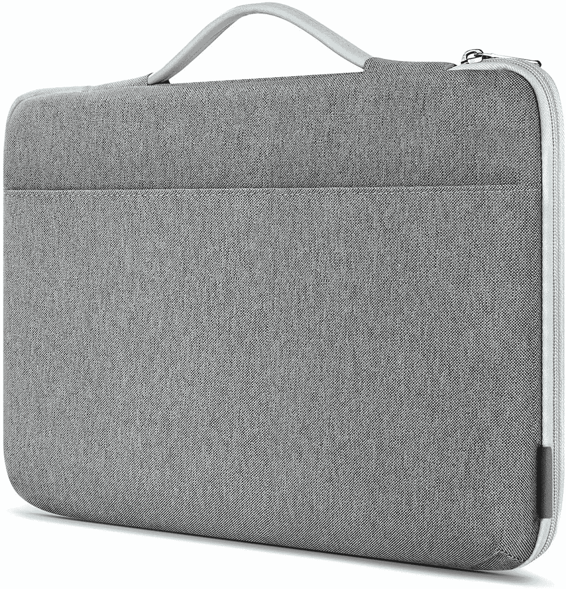
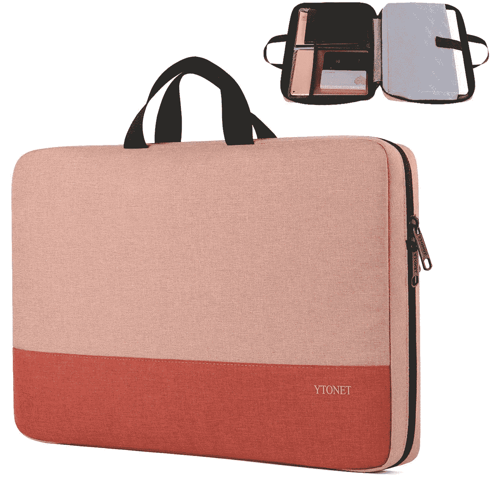
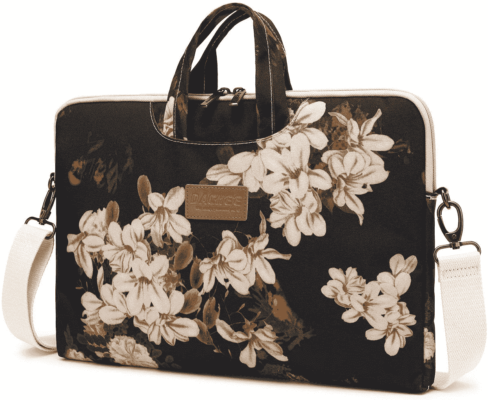
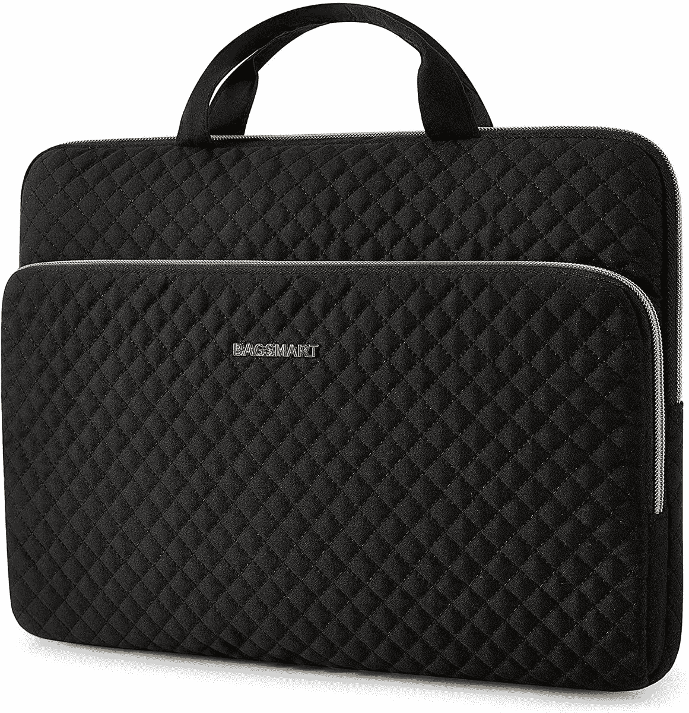
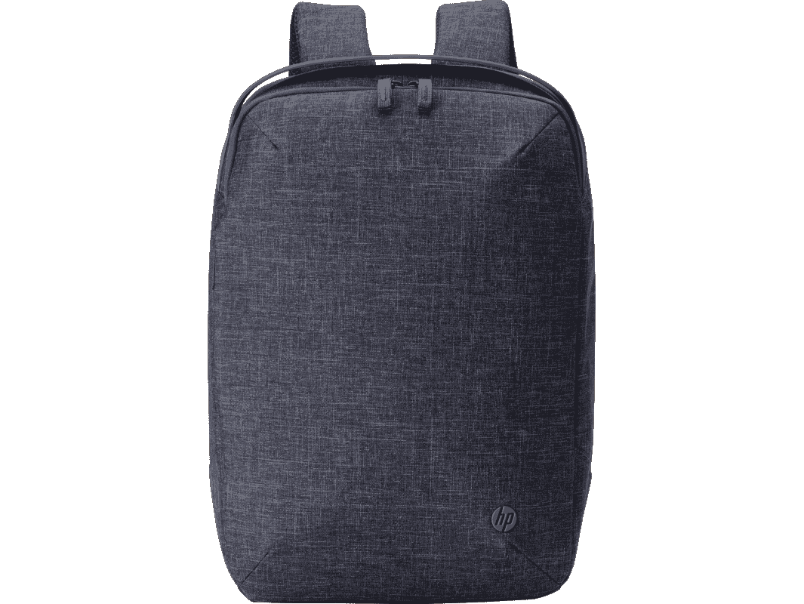
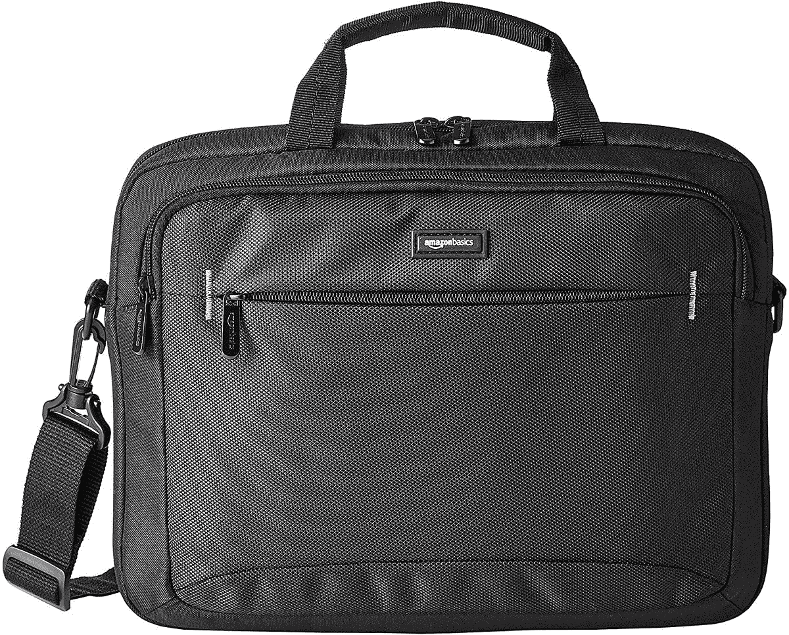
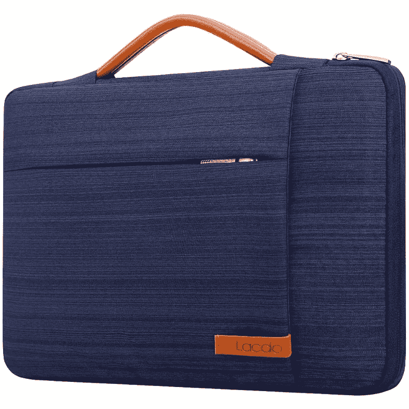
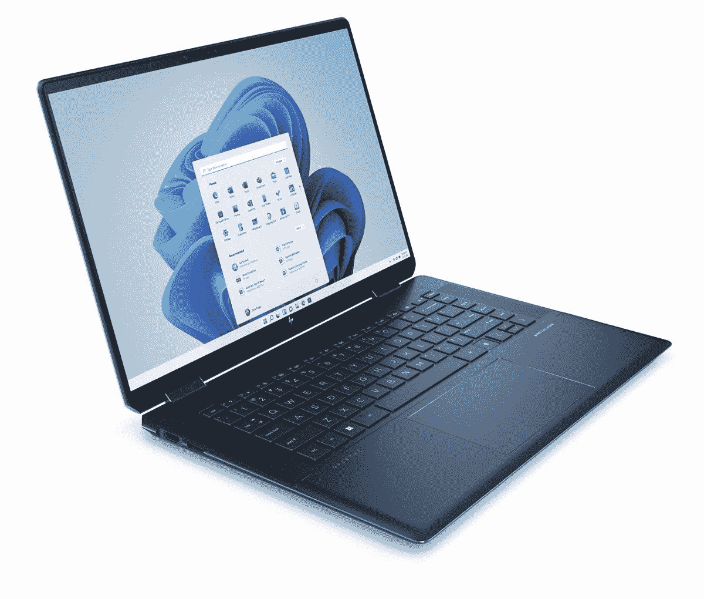

# 惠普 Spectre x360 的最佳案例(2022)

> 原文：<https://www.xda-developers.com/best-cases-hp-spectre-x360-2022/>

惠普最近刚刚推出了 [Spectre x360 2022](https://www.xda-developers.com/hp-spectre-x360-13-5-review/) 型号，有 13.5 英寸和 16 英寸两种型号。它们的目标受众略有不同，需要不同的功率水平，但这些都是非常高端的设备，也是你今天可以买到的一些[最好的笔记本电脑](https://www.xda-developers.com/best-laptops/)。它们不便宜，如果你打算买一个，重要的是要保证它们的安全，并确保它们尽可能长时间地使用。为了帮助您，我们收集了一些您可以为 HP Spectre x360 购买的最佳外壳，无论是 13.5 英寸还是 16 英寸型号。

我们已经将每种尺寸的箱子分开，但自然地，为大型号设计的箱子也会适合小型号，只是在那里会相当宽松。还要注意的是，许多这种外壳都有不同的尺寸，所以即使它们是针对特定型号列出的，你也可以买到与你的笔记本电脑尺寸相近的外壳。说完了，让我们直接进入案例。

## 惠普 Spectre x360 16 (2022)箱

*   <picture></picture>

    Inateck 笔记本电脑保护套

    ##### Inateck 笔记本电脑保护套

    寻找看起来仍然很棒的基本保护套？这款 Inateck 袖套正是如此，它采用简洁的设计，仍然可以保护您的笔记本电脑免受日常碰撞，并为您的附件留出一些空间。

*   <picture></picture>

    Ytonet 笔记本电脑套

    ##### Ytonet 笔记本电脑套

    这款 Ytonet 笔记本电脑套也为您的笔记本电脑提供了相当基本的保护，但它有几个颜色可供选择，包括一些漂亮的双色设计。不过，也有黑色和灰色。

*   <picture></picture>

    多米索笔记本电脑套

    ##### 多米索防震笔记本电脑套

    需要一点坚韧的东西吗？这款 DOMISO 保护套由硬质 EVA 材料制成，有助于保护您的笔记本电脑免受更大程度的碰撞和跌落。此外，它还可以安装一些配件。

*   <picture></picture>

    Dachee 笔记本电脑单肩包

    ##### Dachee 笔记本电脑单肩包

    想要符合你风格的东西吗？这款 Dachee 斜挎包有多种图案和颜色可供选择，让您可以用真正适合自己的东西来保护您的笔记本电脑。

*   <picture></picture>

    Bagsmart 笔记本电脑套

    ##### Bagsmart 笔记本电脑套

    这款笔记本电脑套的设计相对简单，但无论是黑色还是粉色，都是一款非常好看的配件，它既能保护您的笔记本电脑，又能为配件提供存储空间。

*   <picture></picture>

    Tomtoc 笔记本电脑单肩包

    ##### Tomtoc 360 保护型笔记本电脑单肩包

    这款 Tomtoc 电脑包为您的笔记本电脑提供了一个缓冲和柔软的隔层，让您在旅行时可以留在里面，它还包括额外的打孔，用于存放您所有的附件和您需要携带的任何东西。看起来也很棒。

*   <picture></picture>

    跗骨电脑包

    ##### 跗骨电脑包

    比你的笔记本电脑需要携带的东西多吗？这款宽敞的斜挎包可容纳您可能需要随身携带的所有物品，此外还能为您的笔记本电脑提供充分的保护。

*   <picture></picture>

    HP Renew Backpack

    ##### HP Renew Backpack

    HP 推出了一款由回收塑料瓶制成的背包，看起来仍然很棒。如果您想更舒适地携带笔记本电脑以及您可能需要的任何东西，这款背包是长途旅行的理想选择。

这些是我们为 16 英寸惠普 Spectre x360 推荐的机箱，但是如果你正在为 13.5 英寸的型号寻找一些东西，我们为你提供了更多的选择。

## 惠普 Spectre x360 13.5 (2022)机箱

*   <picture></picture>

    Nillkin 笔记本电脑套

    ##### Nillkin 笔记本电脑套带支架

    保护你的笔记本电脑固然很好，但如果你能做的不止这些，那就更好了。这款超薄袖套还可以使用开口翻盖作为鼠标垫，此外，如果您需要更舒适的角度来使用笔记本电脑，它还有一个内置的笔记本电脑支架。

*   <picture></picture>

    亚马逊基本款笔记本电脑包

    ##### 亚马逊基本款 14 英寸平板电脑包

    如果你想要一个有很多额外空间的包，这款亚马逊基本款包是一个非常实惠的选择。除了您的笔记本电脑，您还可以将附件、笔记本电脑和其他小型设备放入其中，它还有几个小袋子来帮助保持物品有序。

*   <picture></picture>

    Kinmac 360 笔记本电脑保护套

    ##### Kinmac 360 保护套

    这款 Kinmac 包是个人的最爱，采用多种材料和数吨填充物的组合，确保您的笔记本电脑在旅行中保持安全。它也有很多风格。

*   <picture></picture>

    Lacdo 笔记本电脑保护套

    ##### Lacdo 360 保护型笔记本电脑保护套

    如果你想要一个看起来很棒的相对简单的保护套，这款 Lacdo 有几种很好看的颜色，同时又不失优雅和保护性。此外，它还为额外的配件留出了一些空间。

*   <picture></picture>

    Bevegekos 笔记本电脑保护套

    ##### Bevegekos 笔记本电脑保护套

    想保护你的笔记本电脑而不花费很多？这款简单的袖套正是如此，但它仍然具有防水涂层和柔软的内部，因此您的笔记本电脑在旅行中可以保持安全。

如果您正在为您的 HP Spectre x360 (2022)寻找一个小尺寸和大尺寸的外壳，这些就是我们的建议。就个人而言，Kinmac 笔记本电脑保护套是我最喜欢的保护套之一，它融合了许多保护层，并有多种风格可供选择。虽然我们列出的是 13.5 英寸版本的笔记本电脑，但也有更大的型号，所以值得一试。

如果你还没有，你可以使用下面的链接购买 HP Spectre x360。较小的型号更适合便携性，而较大的型号适合需要更强大规格的用户，但它们都是惠普生产的最好的笔记本电脑。

 <picture></picture> 

HP Spectre x360 13.5

##### 惠普 Spectre x360 13.5

2022 HP Spectre x360 13.5 采用 3:2 显示屏和 10 核 12 线程的第 12 代英特尔处理器。

 <picture></picture> 

HP Spectre x360 16

##### 惠普 Spectre x360 16 (2022)

HP Spectre x360 16 配备了一个 16:10 的大显示屏，您可以根据自己的需求选择 28W 和 45W 处理器。