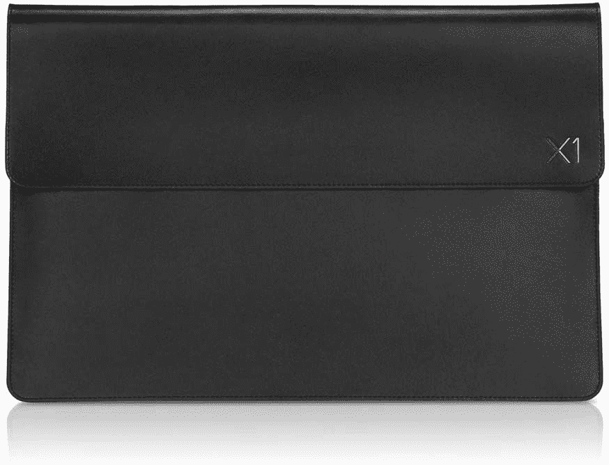
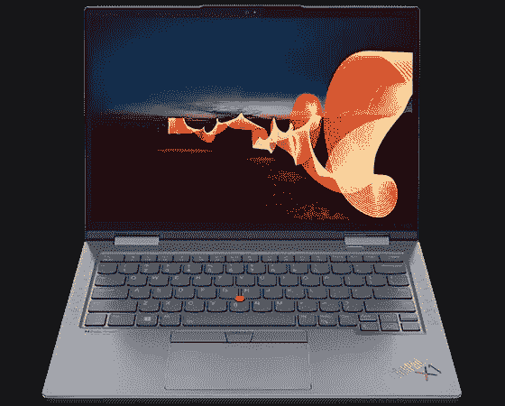

# 2023 年联想 ThinkPad X1 Yoga Gen 7 的最佳案例

> 原文：<https://www.xda-developers.com/best-cases-lenovo-thinkpad-x1-yoga-gen-7/>

# 2023 年联想 ThinkPad X1 Yoga Gen 7 的最佳案例

联想 ThinkPad X1 Yoga Gen 7 是一款令人惊叹的昂贵笔记本电脑，所以请用最好的箱子来尽可能地保护它。

新的 ThinkPad X1 Yoga Gen 7 无疑是 T2 最好的联想笔记本电脑之一，也是一款真正令人着迷的笔记本电脑。尽管所有[最好的 ThinkPad](https://www.xda-developers.com/best-thinkpads/)都有着传奇般的品质，但它是一款昂贵的笔记本电脑，也是你肯定想要保护的一款。无论是购买家用还是商用，一个高质量的外壳是与您的新联想 ThinkPad X1 Yoga 搭配的必备之选。

具体来说，你会想要一个好的袖子或袋子，而不是夹在笔记本电脑外面的东西。基本功能需要是制造质量、耐用性、它能在多大程度上保护您的笔记本电脑，以及确保它没有可能导致划痕的拉链或粗糙表面。考虑到所有这些，这些是联想 ThinkPad X1 Yoga 的最佳案例

*   <picture></picture>

    亚马逊基本款笔记本电脑保护套

    ##### 亚马逊基本款 14 英寸笔记本电脑保护套

    如果你想要的只是一个保护你的笔记本电脑的基本保护套，这个就够了。它的内部很柔软，可以防止刮伤，从顶部装载，而且轻薄，不会增加不必要的体积。

*   <picture></picture>

    Tomtoc 笔记本电脑单肩包

    ##### Tomtoc 14 英寸笔记本电脑包

    对于那些喜欢旅行而不仅仅是携带笔记本电脑的人来说，这是一款绝佳的选择。里面很柔软，并配有加固的边角，而外面有很大的口袋，可以放线缆、充电器、鼠标或任何你喜欢的东西。

*   <picture></picture>

    SMA tree 14 英寸硬质保护套

    ##### SMA tree 硬质笔记本保护套

    这款硬壳保护套提供了对刮擦、碰撞和跌落的终极保护。它还具有防水和耐磨的特性，超柔软的内饰可以容纳您的新 ThinkPad X1 Yoga。

*   <picture></picture>

    联想 ThinkPad X1 皮套

    ##### 联想 ThinkPad X1 皮套

    如果你喜欢为你的笔记本电脑外壳增加一些风格的想法，这款来自联想的官方 X1 套正合适。它外面是黑色皮革，里面是超细纤维，背面有一个文件套，可以存放所有重要的文件

*   <picture></picture>

    Nillkin 笔记本电脑套

    ##### Nillkin 笔记本电脑套带支架

    这款时尚的笔记本电脑套不仅仅是一个电脑包，它还是一个支架和鼠标垫。除了保护您的笔记本电脑不受外界影响，您还可以将它翻转过来，在任何地方设置一个移动桌面空间。

确实有一些很好的案例不仅保护了联想 ThinkPad X1 Yoga，而且在使用时看起来很好。每一个都服务于一个特定的需求，但是我们总是倾向于所列出的两个联想官方案例中的任何一个。两者都是高品质的，并且是专为 X1 系列设计的，因此您可以确信您的笔记本电脑将会非常适合。但是有选择总是好的。

联想 ThinkPad X1 Yoga 肯定会成为 2022 年[最佳商务笔记本电脑](https://www.xda-developers.com/best-business-laptops/)之一，它已经在 CES 2022 上首次亮相，现在可以购买。

 <picture></picture> 

Lenovo ThinkPad X1 Yoga Gen 7

##### 联想 ThinkPad X1 Yoga Gen 7

2022 年绝对最好的可转换笔记本电脑之一，配有有机发光二极管和内置笔，可提供最佳的数字画布体验