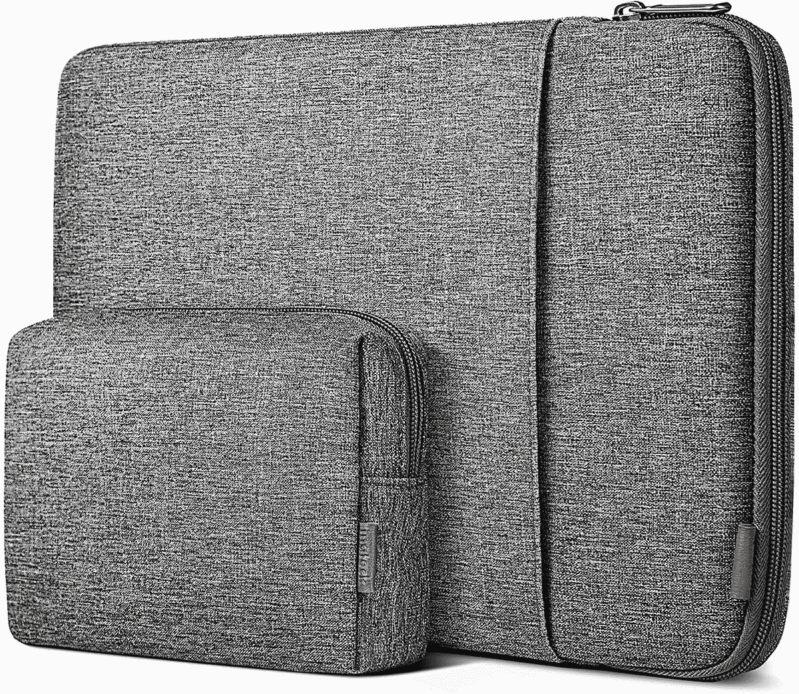
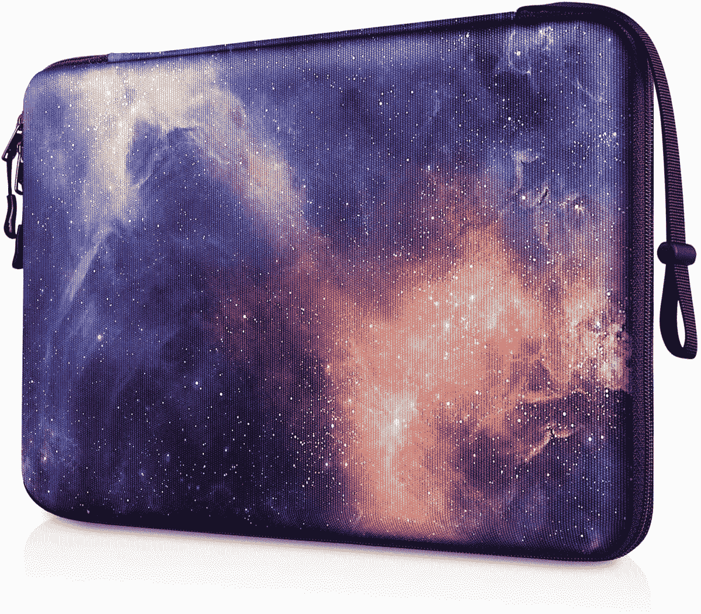
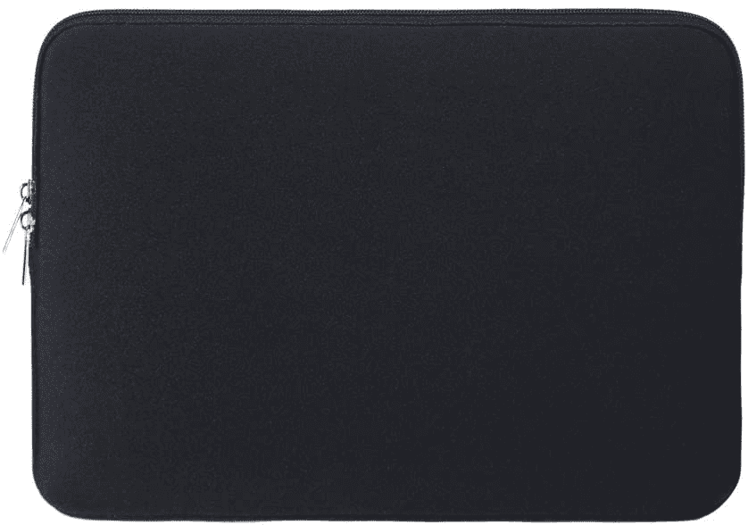
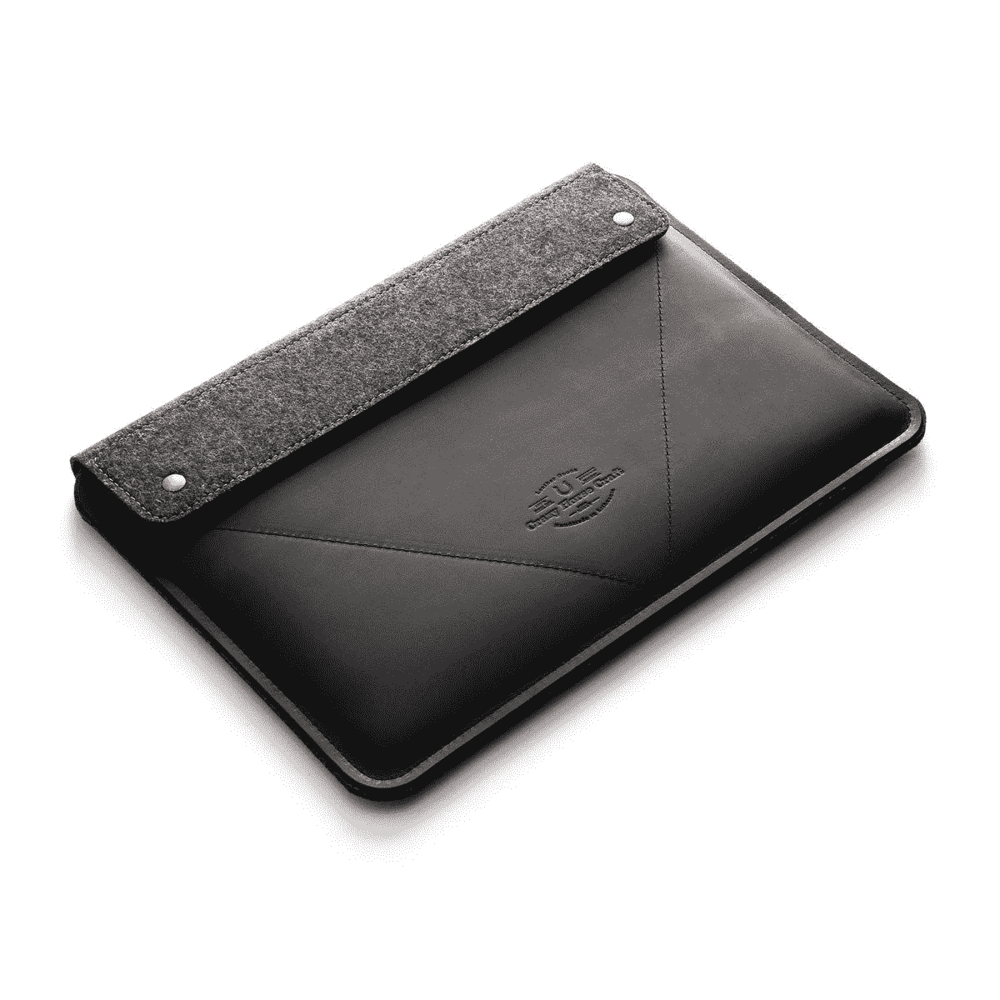

# MacBook Air M2 的最佳案例(2022 年)

> 原文：<https://www.xda-developers.com/best-cases-macbook-air-2022/>

# MacBook Air M2 的最佳案例(2022 年)

现有的最佳保护套将保护您的全新苹果 MacBook Air M2 (2022)免受潜在损坏。

苹果在 2022 年 WWDC 展会上发布了 M2 MacBook Air 和 T2 MAC OS Ventura。这款最新加入 [Macs](https://www.xda-developers.com/best-macs) 系列的产品配备了全新的机箱，并拥有四种令人惊叹的外观。考虑到它封装了 M2 芯片，你可能想看看苹果芯片的[最佳应用](https://www.xda-developers.com/best-apps-apple-silicon/)——因为它们是专门为这一系列处理器优化的。

如果你买了这款笔记本，首先要做的一件事就是为它买一个外壳。事故时有发生，一个案例可以帮助你避开一些潜在的伤害。毕竟，有划痕和/或凹痕的现代设备会看起来过时，并失去其高级感。你的 MacBook Air 值得拥有更好的。此外，在保护上花几块钱比在维修费用高出许多倍时后悔要好。这些是你能为 MacBook Air (2022)买到的最好的保护套。

## MacBook Air M2 的最佳案例(2022 年)

*   ##### Tomtoc 360 保护套

    这款保护套有缓冲系统和加固角，有四种颜色。它可以让你的 Mac 保持安全，避免潜在的损坏和刮擦，而且价格实惠。

*   <picture></picture>

    inate CK 笔记本电脑套

    ##### inate CK 笔记本电脑套

    也有四种颜色，这款套配有单独的配套袋子，可以存放你的 MacBook Air 的配件。它非常适合那些经常携带 MAC 电脑的人。

*   <picture></picture>

    fin PAC 硬套

    ##### fin PAC 硬套

    这款硬套为那些希望自己的 MacBooks 脱颖而出的人提供了一些独特的模式。这些包括大理石和银河灵感的，除了简单的颜色。

*   <picture></picture>

    rain year 软套

    ##### rain year 软套

    这款软套、加厚套有多种鲜艳的颜色可供选择。对于那些寻找一个简约，朴素的袖子来保护他们的 MacBook Air M2 的人来说，这是理想的选择。

*   <picture></picture>

    hyzo 手机套带支架

    ##### hyzo 笔记本电脑套

    有十几种颜色可选，这款手机套还可以充当 MacBook Air 的支架。它非常适合那些喜欢在工作时稍微倾斜设备的人。

*   <picture></picture>

    疯马歌舞秀皮套

    ##### 疯马歌舞秀皮套

    这款复古皮套是手工制作的，可以让你通过选择一些文字在上面盖章来个性化它。相对来说比较贵，但是是用优质材料做的。

*   ##### Spigen Rugged Armor Pro 笔记本电脑保护套

    这款 Spigen 保护套非常适合那些倾向于经常摔 MacBooks 的人。它提供了一个坚固的建筑，具有显著的抗冲击能力。此外，它还有一个专用的 AirTag 插槽，以防您将笔记本电脑放错地方。

    T34
*   ##### Mosiso 硬壳套

    这款硬壳有 40 多种颜色可选。对于那些不喜欢现有 MacBook Air 表面并希望展示更有活力的外观的人来说，这是理想的选择。更不用说，它增加了一个像样的保护层，可以最大限度地减少潜在的损害。

*   ##### Tangbolibo 笔记本电脑套

    有四种不同的颜色可供选择，这款普通的笔记本电脑套提供防水、手柄、360 度防震等功能。更重要的是，它配有一个手柄和一条带子，便于在旅途中使用。

    T17

* * *

新款 MacBook Air M2 (2022)有四种不同的颜色:午夜、星光、太空灰和银色。如果你不喜欢这些颜色，保护套可以帮助你隐藏 MacBook Air。有各种各样的设计和颜色来迎合大多数人的口味。箱子不仅有装饰作用，而且还增加了一层保护，防止意外的卵巢损伤。最终，安全总比后悔好，在这种特殊情况下，你并不需要花费很多精力或金钱来保持谨慎(双关语)。如果让我选择的话，我肯定会选择 [tomtoc 360 保护套](https://www.amazon.com/tomtoc-Protective-13-inch-Notebook-Accessory/dp/B01N590YOT?tag=xda-4lom9ot-20&ascsubtag=UUxdaUeUpU42214&asc_refurl=https%3A%2F%2Fwww.xda-developers.com%2Fbest-cases-macbook-air-2022%2F&asc_campaign=Commerce)以获得最佳的全方位保护。

除了新的饰面，MacBook Air M2 (2022)重新引入了我们心爱的 MagSafe 3 充电端口。除此之外，它保留了与前代机型相同的两个 Thunderbolt 4 端口和耳机插孔。不过，值得注意的是，在美国，它的起价高达 1199 美元。

 <picture></picture> 

Apple MacBook Air M2

##### 苹果 MacBook Air (2022)

2022 年的 MacBook Air 提供了快速的 M2 芯片和重新设计的支持 MagSafe 的机箱。