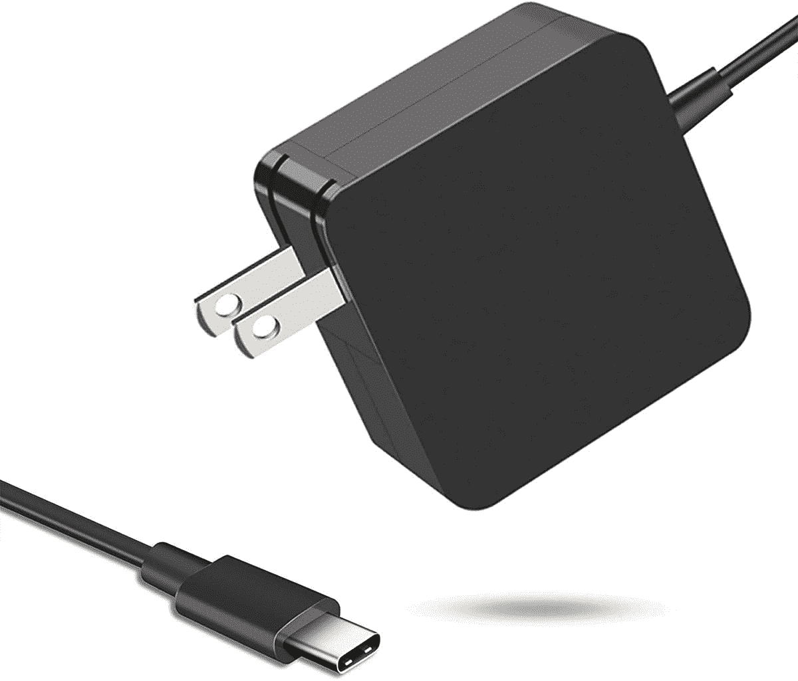
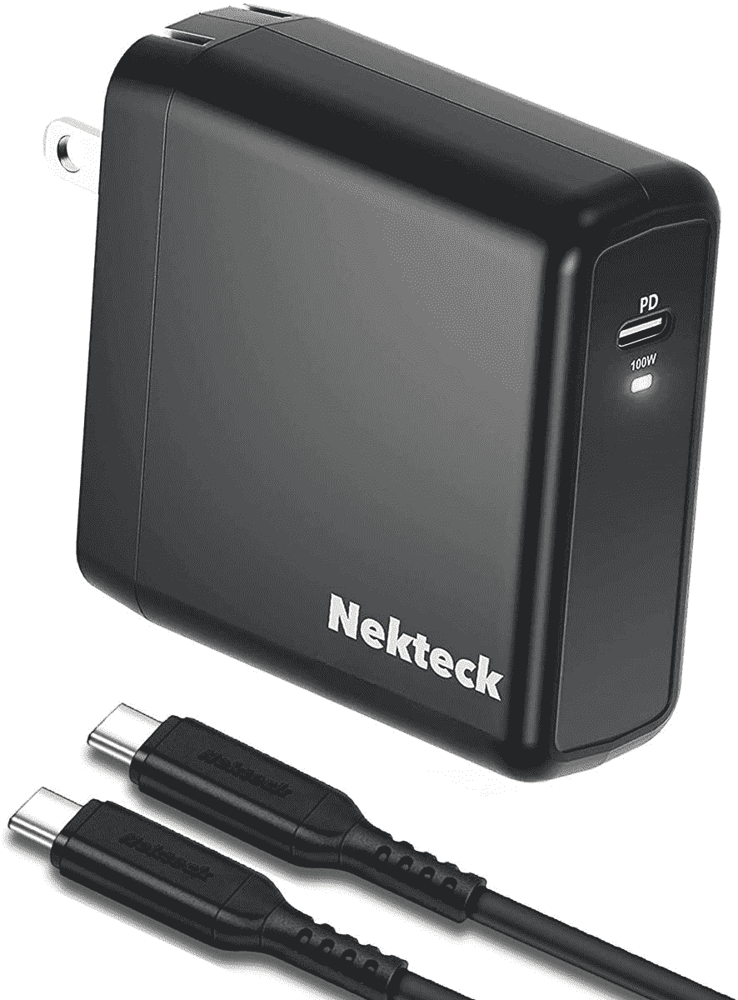
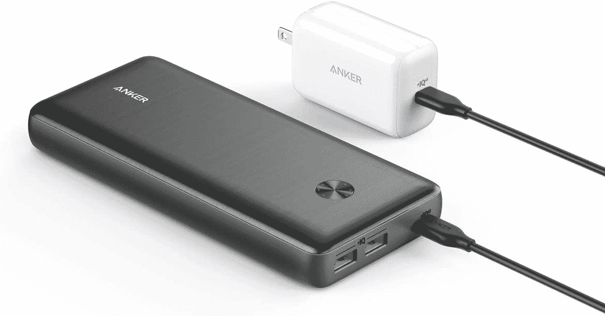

# Acer Swift 3 的最佳替代充电器(2022)

> 原文：<https://www.xda-developers.com/best-chargers-acer-swift-3-2022/>

# Acer Swift 3 的最佳替代充电器(2022)

您的宏碁 Swift 3 充电器丢失或放错地方了吗？这里有一些你能找到的保持笔记本电脑运行的最佳选择。

2022 年的新款 [Acer Swift 3 进行了一些重大升级。它拥有](https://www.xda-developers.com/acer-swift-3-2022-review/)[第 12 代英特尔 P 系列处理器](https://www.xda-developers.com/intel-12th-gen-alder-lake/)，更好的网络摄像头，以及作为新选项的更高分辨率显示屏。在这些变化中，端口也有所不同——新款宏碁 Swift 3 不再使用专有的筒式充电器。相反，你现在可以获得两个带有 Thunderbolt 和充电支持的 USB Type-C 端口。

如果你想旅行，这是一个好消息，因为它可以更容易地用一个充电器给更多的设备充电。如今大多数设备都支持 USB-C 充电，所以你可以使用同一个设备做任何事情。如果你碰巧把笔记本电脑附带的充电器放错了地方，或者碰巧坏了，这也是一个好消息，因为现在你可以更容易地更换它。找到一个 USB Type-C 电源适配器比找到一个特定的专有充电器要容易得多。因此，我们收集了一些您可以为 Acer Swift 3 购买的最佳充电器，以防您碰巧需要。

*   <picture></picture>

    亚马逊基本型 65W 充电器

    ##### 亚马逊基本型 65W GaN 充电器

    如果你想要一个实惠的选择，这款亚马逊基本型充电器符合宏基 Swift 3 的要求，同时又相当便宜。它也非常紧凑，有折叠叉，尽管它不包括电缆。

*   <picture></picture>

    Belkin 108 w 4 口充电器

    ##### Belkin boost charge Pro 108 w GaN 4 口充电器

    如果你想要一款真正能应付你所有设备的充电器，这是你身边最好的选择。即使所有其他端口都在使用，主端口也可以提供 65W 的功率，单独使用时可以提供 96W 的功率。

*   <picture></picture>

    PDUSBSZ 65W 充电器

    ##### 联想 65W USB-C 充电器

    这是又一款小巧的 65W 充电器，所以符合宏碁 Swift 3 的要求。不过，这款手机内置了一根线缆，所以你不需要购买或者担心丢失。它还有可折叠的支架，非常实惠。

*   <picture></picture>

    Nekteck 100W 充电器

    ##### Nekteck 100 w GaN USB-C 充电器

    这款 Nekteck 充电器可以提供高达 100 w 的功率，因此如果你有一台更耗电的笔记本电脑，它甚至可以工作。这也是为数不多的包含电缆的选项之一，因此您不必单独购买。

*   <picture></picture>

    Anker 737 Power Bank

    ##### Anker 737 Power core 26K

    如果您想让您的笔记本电脑运行更长时间，该套装包括一个 65W 的壁式充电器，还包括一个可以以 60W 的功率为您的笔记本电脑充电的 Power Bank，这样即使您外出也可以继续使用

*   <picture></picture>

    Hyphen-X 100W 四端口充电器

    ##### Hyphen-X 100 w 四端口 PD GaN 充电器

    与上面的 Belkin 充电器类似，这款充电器共有四个端口，功率高达 100 w。如果你使用多个端口，它就没有那么强大了，但它仍然非常快，而且比它的竞争对手便宜很多。

*   <picture></picture>

    可插拔的雷电坞站

    ##### 可插拔的 14 合 1 雷电 3 坞站

    如果你想要一个功能更多的充电器，这款可插拔坞站就是为你准备的。除了提供高达 96W 的功率外，它还有大量外围设备端口，非常适合在办公环境中使用。

*   <picture></picture>

    盗墓探险者 300

    ##### 盗墓探险者 300

    这并不适合所有人，但有时离家进行一次长途旅行也是不错的。如果你不能离开笔记本电脑，像这样的电源可以让你的笔记本电脑和其他设备充电几天。

这就是 2022 年你能为 Acer Swift 3 买到的最好的充电器。我们在一些选择上有点创意，但这也意味着每个人都有适合自己的东西。无论您是想要一个超级便宜的选择在家里使用，还是想要一个可以长途旅行的东西，我们这里都有适合您的东西。对于最新的 Swift 3，便携式充电器比以往任何时候都更加重要。由于新的 P 系列处理器会产生更多热量，新型号的电池寿命较短，因此您可能更经常需要额外的电源。

宏碁 Swift 3 的 2022 型号还不能购买，但你可以在下面查看一下，以防它很快上线。如果你不想等待，你可以随时查看你现在可以买到的最好的宏碁笔记本电脑，或者看看 T2 最好的笔记本电脑，看看其他公司都提供什么。

 <picture></picture> 

Acer Swift 3

##### 宏碁 Swift 3

Acer Swift 3 采用第 12 代英特尔处理器，最高配有四核高清显示屏和新的全高清网络摄像头。