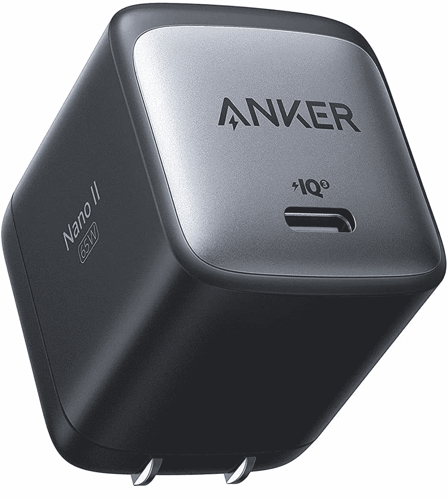
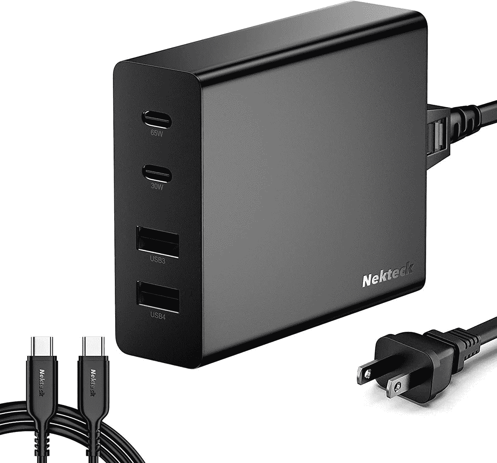
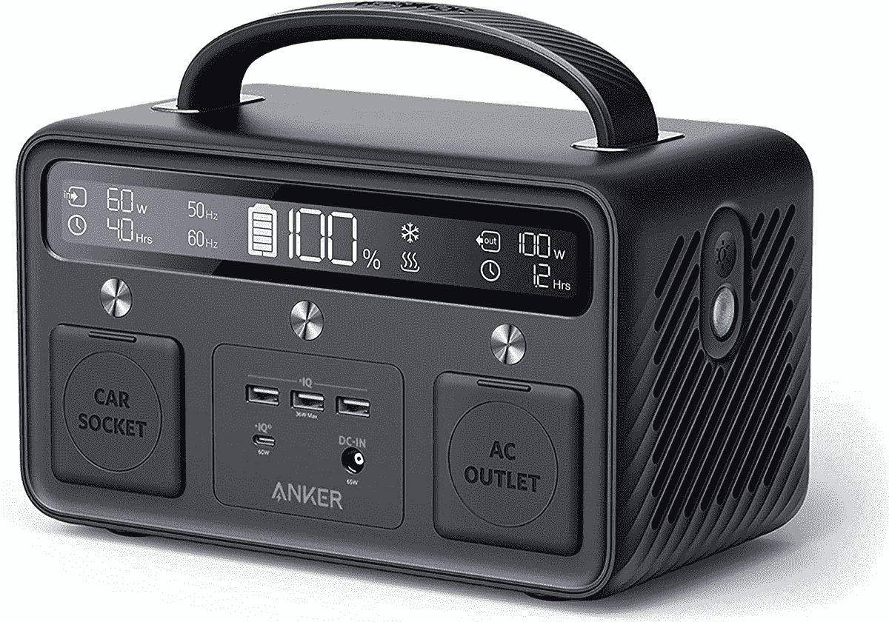

# 2023 年 Dell Latitude 5430 的最佳替代充电器

> 原文：<https://www.xda-developers.com/best-chargers-dell-latitude-5430/>

# 2023 年 Dell Latitude 5430 的最佳替代充电器

Dell Latitude 5430 的充电器停止工作了吗？这里有一些很棒的选项，你可以根据自己的充电需求购买。

我们已经看到了许多将于 2022 年推出的[商务笔记本电脑](https://www.xda-developers.com/best-business-laptops/)，其中，[戴尔 Latitude 5430](https://www.xda-developers.com/dell-latitude-5430/) 是最好的选择之一，如果你正在寻找一台没有太多花里胡哨的坚固笔记本电脑。这是主流商用笔记本电脑的定义，虽然它不会吸引很多人的目光，但如果您想按照自己的要求配置一切，第 12 代英特尔博锐处理器和广泛的配置一定会使它成为一个不错的选择。Dell Latitude 5430 的包装盒中还包括一个充电器，根据您的喜好，它可以在 60W 和 90W 之间。

因为这是一款相对较新的笔记本电脑，我们预计大多数人不会很快需要新的充电器，但事故确实会发生。也许你丢失或放错了盒子里的充电器，或者它因为这样或那样的原因停止工作了。如果你想继续使用你的 Dell Latitude 5430，你需要一个替换充电器，由于 USB Type-C 的神奇，找到一个充电器实际上相对容易。因此，如果你需要一个新的充电器，这里有几个我们推荐的好选择。

*   <picture></picture>

    亚马逊基本款 65W GaN 充电器

    ##### 亚马逊基本款 65W GaN 充电器

    官方充电器可以贵一点，如果需要更便宜的替代，亚马逊基本款是知名品牌。由于氮化镓冷却，这款 65W 充电器非常紧凑，但仍比戴尔的充电器便宜得多。

*   <picture></picture>

    Baseus 100W GaN II 快速充电器

    ##### Baseus 100 w GaN II USB-C 充电器

    戴尔 latitude 5430 最高可配 90W 充电器，因此如果您想要额外的电源，这款 Baseus 100 w 型号可能会适合您。这超出了你的需要，但它可以更快地为你的笔记本电脑充电，甚至可以在更耗电的设备上工作。

*   <picture></picture>

    Anker 715 65W 充电器

    ##### Anker 715 Nano II 65W 充电器

    想要尽可能最小的封装？Anker 715 充电器是一款非常小的充电器，仍然可以为您的笔记本电脑提供 65W 的功率。这更像是一个额外的选择，但是如果空间对你来说是有价值的，它值这个价钱。

*   <picture></picture>

    Nekteck 107 w 4 口充电器

    ##### Nekteck 107 w GaN 4 口 USB 充电器

    想给你的笔记本电脑多充电？Nekteck 107W 充电器可以从其主要的 USB-C 端口提供 65W 的功率，但其他端口也可以为您的手机、智能手表或其他设备充电，使它们更容易随身携带。

*   <picture></picture>

    PDUSBSZ 65W 充电器

    ##### 联想 65W USB-C 充电器

    如果你想要最便宜的选择和/或不想担心丢失线缆，这款充电器非常适合戴尔 Latitude 5430。它提供 65 瓦的功率，内置一根电缆，所有这些都是非常低的价格。

*   <picture></picture>

    戴尔笔记本电脑电源组

    ##### 戴尔笔记本电脑电源组

    如果您要进行长途旅行，需要您的笔记本电脑再坚持一段时间，此电源组可以为您的笔记本电脑提供 65 瓦的电力，让您继续工作更长时间。这不会取代你的充电器-事实上，你需要一个电源适配器来充电。

*   <picture></picture>

    可插拔雷电 3 坞站

    ##### 可插拔 TBT3-UDC3

    充电远不是你用这样一个坞站唯一能做的事情。虽然它支持高达 100 瓦的功率传输，但它也为您提供了更多的 USB 端口、HDMI、DisplayPort 等，因此您可以拥有完美的桌面设置，以提高工作效率。

*   <picture></picture>

    Anker 523 便携式电站

    ##### Anker 523 便携式电站

    如果你计划离家一段时间，但仍然需要你的笔记本电脑，像这样的便携式电站可能会派上用场。它有足够的电力为你的笔记本电脑充电多次，你甚至可以为其他设备充电。

这些就是我们为 Dell Latitude 5430 推荐的所有充电器。并非所有这些都是原始充电器的替代品，但我们包括了一些在更具体的情况下可能会派上用场的选项，因此涵盖了更多的用例。例如，如果您经常将笔记本电脑连接到一个有多个显示器和附件可以插入的桌子上，像上面的可插拔模型这样的 Thunderbolt dock 可以提供很大的帮助。

如果您有兴趣购买 Dell latitude 5430，可以通过下面的方式购买。正如我们所提到的，它的盒子里确实包括一个充电器，所以除非发生意外，否则你不会需要这个列表上的任何项目。另外，如果你想看更多的选择，你可以看看今天能买到的最好的笔记本电脑。

 <picture></picture> 

Dell Latitude 5430

##### 戴尔 Latitude 5430

Dell Latitude 5430 是一款高度可配置的商用笔记本电脑，采用第 12 代英特尔处理器和高端设计。