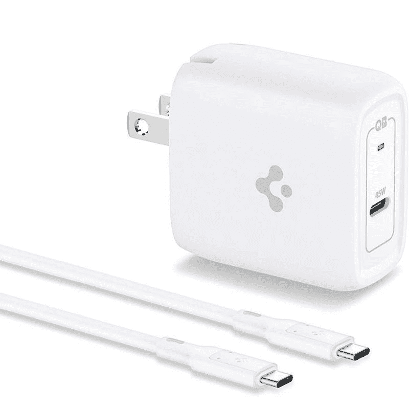
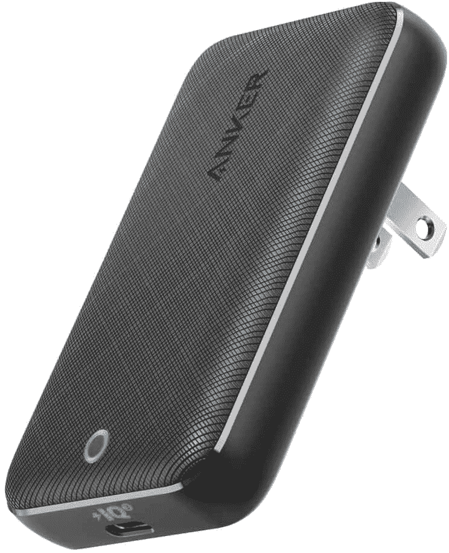
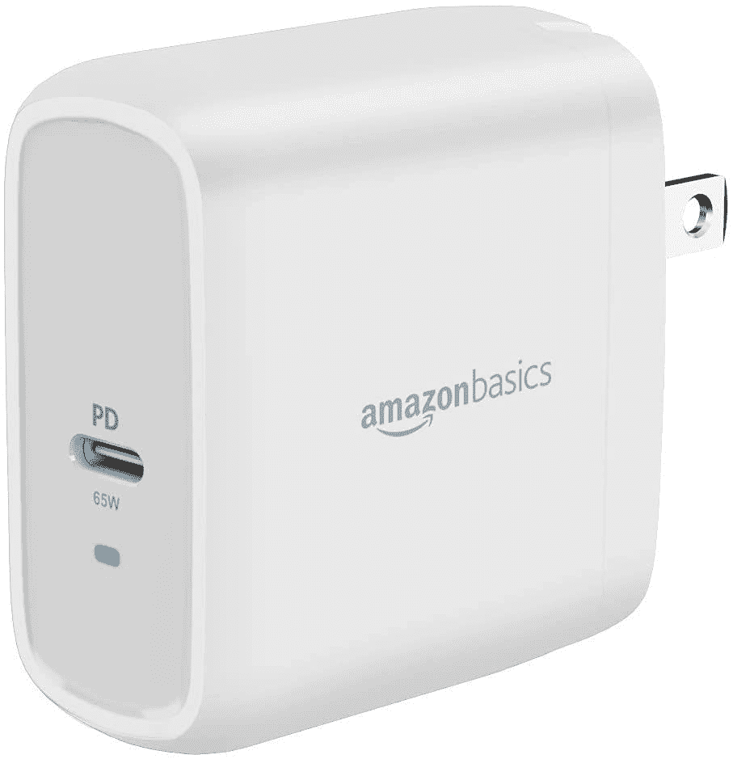
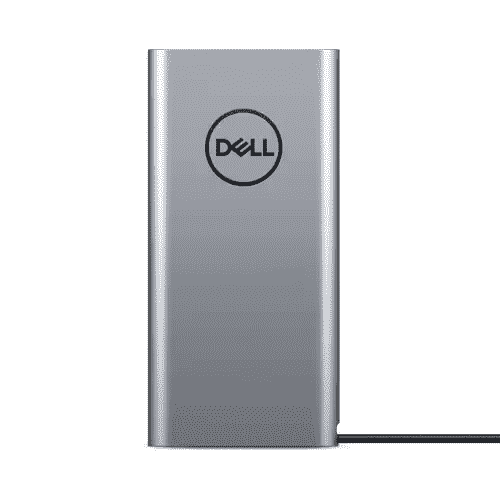

# 戴尔 XPS 13 二合一设备的最佳替代充电器(2022 年)

> 原文：<https://www.xda-developers.com/best-chargers-dell-xps-13-2-in-1-2022/>

2022 年的[戴尔 XPS 13 二合一](https://www.xda-developers.com/dell-xps-13-2-in-1-2022-review/)是一款高端 Windows 平板电脑，代表着该系列产品方向的重大变化，该系列产品过去由可变形笔记本电脑组成。这种全新的设计也对内部进行了一些改变，包括 9W 英特尔处理器和略小的电池。近年来，一些设备已经不再在包装盒中包含充电器，但谢天谢地，戴尔 XPS 13 二合一设备不是这样。在盒子里，你得到一个 45W 的充电器，你不应该有理由买一个新的。

尽管如此，意外还是会发生，你可能会丢失充电器，或者它可能会停止工作。如果您需要为 Dell XPS 13 2 合 1 设备更换充电器，我们可以为您提供帮助，我们已经从戴尔自己和其他公司收集了一些很好的选项。让我们深入研究一下。

*   <picture></picture>

    Spigen 45W USB-C 充电器

    ##### Spigen 45W ArcStation Pro GaN 充电器

    如果戴尔充电器对你来说有点太贵，Spigen 45W arc station Pro 是一个很好的替代选择。它的功能一样强大，但更紧凑，价格也低得多。

*   <picture></picture>

    Anker power port Atom III 45W

    ##### Anker power port Atom III 45W 充电器

    想要一个特别小巧的充电器？Anker 的这款非常纤薄，设计用于家具后面的狭小空间和其他地方。它仍然和官方充电器一样强大。

*   <picture></picture>

    亚马逊基本型 65W 充电器

    ##### 亚马逊基本型 65W GaN 充电器

    45W 充电器对于戴尔 XPS 13 二合一设备来说可能已经足够快了，但如果您希望它充电得更快呢？亚马逊基础 65W 充电器是最便宜的选择之一，考虑到它的功率，它仍然非常紧凑。

*   <picture></picture>

    戴尔 90W 超薄电源适配器

    ##### 戴尔 90W 超薄电源适配器

    如果你想要最快的充电速度但你只能信赖戴尔产品，官方 90W 充电器是你理想的解决方案。它很贵，但有 90W 的功率，是目前最快的充电器之一。

*   <picture></picture>

    Nekteck 100 w USB-C 充电器

    ##### Nekteck 100 w GaN USB-C 充电器

    戴尔的充电器可能更快，但 Nekteck 的这款更快，更小巧，也更便宜如果你不需要戴尔官方充电器，这是市场上最快的选择之一。它还包括所需的电缆。

*   <picture></picture>

    Tecknet 65W 三端口充电器

    ##### Tecknet 65W 三端口充电器

    如果您不仅想为您的戴尔 XPS 13 二合一设备充电，这款三端口充电器可以使用单个电源模块更轻松地为多个设备充电。不过，你需要自己提供电缆。

*   <picture></picture>

    Hyphen-X 100W 4 端口 USB 充电器

    ##### Hyphen-X 100 w 4 端口 PD GaN 充电器

    更进一步，这款 HyphenX 充电器为您提供四个端口和高达 100 w 的功率，使您可以一次为所有设备充电，并且充电速度非常快。再加上还是比较便宜的。

*   <picture></picture>

    戴尔笔记本电源板

    ##### 戴尔笔记本电源板

    有时你没有机会将笔记本电脑插入电源插座，所以一个电源板可能正是你所需要的。官方的戴尔 one 有一个 65Wh 的大电池，可以为你的笔记本电脑充电 65W，所以这是一个很好的选择。

如果您需要为 Dell XPS 13 2 合 1 设备购买新充电器，这些都是不错的选择。在本文中，我们重点关注 2022 型号，但事实上，这些应该适用于所有具有 USB Type-C 充电端口的型号。事实上，取决于你的笔记本电脑需要多少功率，这些可能适用于任何笔记本电脑。如果你想买一些能与大多数现代笔记本电脑兼容的东西，100 瓦的充电器可能是最好的选择，因为它能覆盖更多的地面。

可使用以下链接购买 2022 Dell XPS 13 二合一设备，并可选择添加 XPS Folio 和/或 XPS 触控笔。如果您对这款特定设备不感兴趣，如果您想了解一些其他选项，可以查看[最佳戴尔笔记本电脑](https://www.xda-developers.com/best-dell-laptops/)。或者，如果你对这种外形感兴趣，但又想要一些与众不同的东西，不妨来看看我们列出的[最佳 Windows 平板电脑](https://www.xda-developers.com/best-windows-tablets/)。

 <picture></picture> 

Dell XPS 13 2-in-1

##### 戴尔 XPS 13 二合一设备

Dell XPS 13 2 合 1 是一款时尚的 Windows 平板电脑，配有清晰的 3:2 显示屏、两个出色的摄像头和第 12 代英特尔处理器。它配有 45W USB-C 充电器，但你也可以找到其他选择。