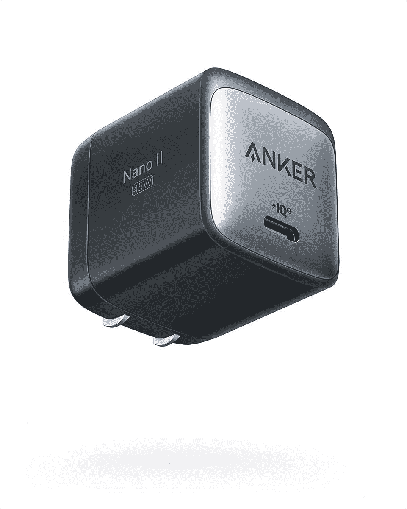
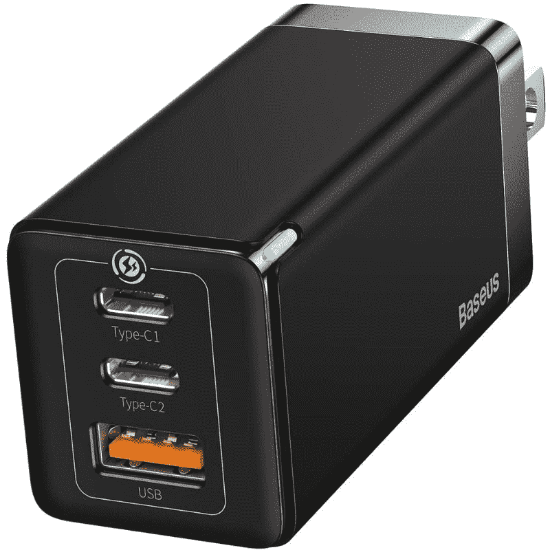
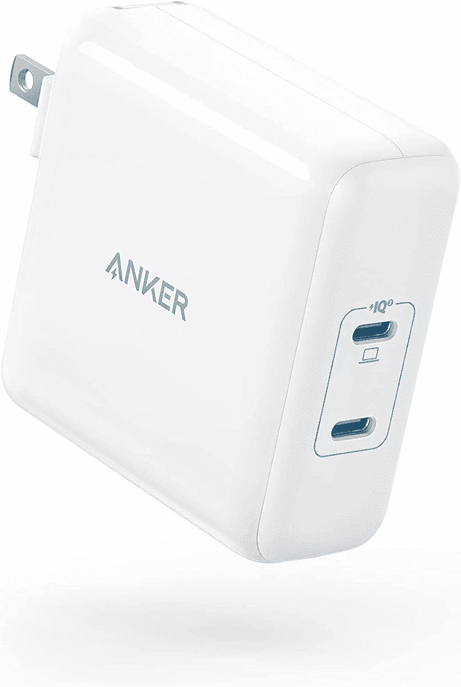

# 戴尔 XPS 13 的最佳替代充电器(2022)

> 原文：<https://www.xda-developers.com/best-chargers-dell-xps-13-2022/>

# 戴尔 XPS 13 的最佳替代充电器(2022)

戴尔 XPS 13 (2022)默认配有 45W 充电器，但如果你碰巧丢失或损坏了你的充电器，这里有一些替换充电器。

戴尔 XPS 13 是你每年都能买到的 T2 最好的笔记本电脑之一，2022 款也不例外。它采用了新的更薄的设计，现在更加丰富多彩，但它仍然是一款一如既往的伟大设备。虽然盒子里有充电器，但有时还是会发生意外。如果您丢失或放错了包装盒中的充电器，您将需要一个新的，我们已经收集了您可以为 Dell XPS 13 获得的最佳充电器。

当然，我们并不指望大多数人很快就真的需要一个新充电器，但如果你需要，我们随时可以提供帮助。从戴尔官方充电器到各种第三方选项，我们都能满足您的需求。我们甚至有一些选项，不仅仅是为您的笔记本电脑充电。让我们开始吧。

*   <picture></picture>

    Anker 713 充电器

    ##### Anker 713 Nano II 45W 充电器

    如果你想要一个便于旅行的东西，Anker 713 充电器可以为你提供与 XPS 13 附带的默认充电器相同的功率，但它要小得多。不过，不包括电缆，所以你需要自己带。

*   <picture></picture>

    Baseus 65W 3 口充电器

    ##### Baseus 65W GaN 3 口充电器

    如果你想更快地给笔记本电脑充电或者给其他设备充电，Baseus 65W 电源适配器可以帮上忙。它可以更快地给你的 XPS 13 充电，但你也可以同时使用其他端口给你的手机充电。

*   <picture></picture>

    戴尔 90W 超薄电源适配器

    ##### 戴尔 90W 超薄电源适配器

    想尽快给你的笔记本电脑充电吗？戴尔官方 90W 充电器可以做到这一点，因此您可以快速上路。自然更大更贵，但这是一种可靠的快速充电方式。

*   <picture></picture>

    内克 100W USB-C 充电器

    ##### 内克 100W GaN USB-C 充电器

    如果你想要最快的充电速度和更实惠的价格，内克 100W 充电器也是一个不错的选择。尽管更便宜，但它实际上比戴尔 XPS 13 的官方充电器更快。

*   <picture></picture>

    Anker power port III

    ##### Anker power port III 100W 充电器

    Anker power port III 走得更远，不仅给你 100 w 的最大功率，而且还有两个 USB 端口，所以你可以同时给两台笔记本电脑充电，尽管你也可以使用它

*   <picture></picture>

    Hyphen-X 100 w 4 口充电器

    ##### Hyphen-X 100 w 4 口 PD GaN 充电器

    要去旅行？Hyphen-X 100W 4 端口充电器意味着您可以根据自己的需要尽快为笔记本电脑充电，但由于共有 4 个端口，您也可以使用单个插座为所有设备充电。不过，当你连接更多设备时，充电速度会变慢。

*   <picture></picture>

    戴尔笔记本电脑电源银行

    ##### 戴尔笔记本电脑电源银行

    当你需要长时间远离电源插座时，一个电源银行可以帮你给笔记本电脑充电。凭借 65Wh 的容量和 65W 的充电速度，官方戴尔 one 可以快速为您的笔记本电脑充电，并可以大大延长电池寿命。

*   <picture></picture>

    Brydge Stone C

    ##### Brydge Stone Pro TB4

    戴尔 XPS 13 的端口并不多，所以如果您在办公桌上使用它，为什么不买一个 Thunderbolt 坞站，也可以为您提供更多的连接性呢？它比标准充电器贵得多，但如果你有很多想要使用的外设，它是值得的。

仅此而已。这些充电器涵盖了广泛的需求，即使它不仅仅是为您的戴尔 XPS 13 充电。无论您是想要一些基本的、实惠的还是更高级的工具，这里都有适合您的选择。就我个人而言，我更喜欢 Hyphen-X 充电器，因为同时给多个设备充电可能会很麻烦。但如果你碰巧有很多外设和显示器，像 Brydge Stone Pro TB4 这样的产品是不错的选择。

如果您还没有，可以使用以下链接购买戴尔 XPS 13。默认情况下，它配有 45W 的充电器，尽管它支持的充电速度远远高于这个数字。最新的型号还配备了第 12 代英特尔处理器和新的设计，有两个比以前稍微丰富多彩的版本。这无疑是本年度[最佳戴尔笔记本电脑](https://www.xda-developers.com/best-dell-laptops/)之一，所以我们建议您去看看。

 <picture></picture> 

Dell XPS 13 9315

##### 戴尔 XPS 13 9315

全新的戴尔 XPS 13 进行了彻底的重新设计，有天空色和棕色可选。盒子里有一个 45W 的充电器，但你也可以使用更快的充电器。