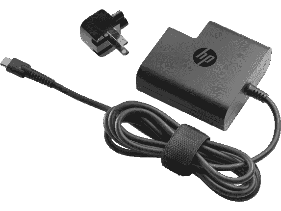
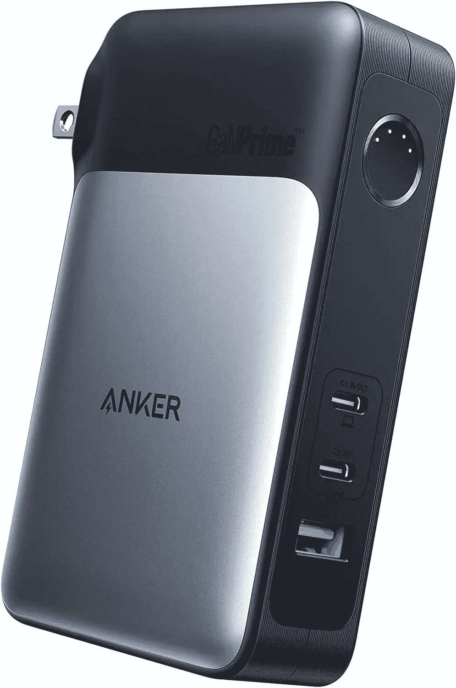

# HP EliteBook 840 G9 的最佳替代充电器

> 原文：<https://www.xda-developers.com/best-chargers-hp-elitebook-840-g9/>

惠普 EliteBook 840 是惠普最受欢迎的[商务笔记本电脑](https://www.xda-developers.com/best-business-laptops/)之一，尤其是在高端市场。与 EliteBook 1000 或 Elite 蜻蜓系列相比，它的价格更合理，是性能和功能的最佳平衡。与手机不同，笔记本电脑的盒子里仍然有充电器，所以你不需要很快买一个新的，但事故可能会发生。如果您丢失了 HP EliteBook 840 G9 的充电器，我们收集了一些替换充电器来帮助您。

在我们开始之前，值得一提的是，HP EliteBook 840 G9 在包装盒中附带了一个 65W 的充电器，虽然您可能可以用更低的瓦数充电，但 65W 绝对是推荐的，尤其是在英特尔 P 系列处理器如此耗电的情况下。我们在这个列表中重点关注 65W 或更高的功率，因此您可以放心，您的笔记本电脑将像使用官方充电器一样快速充电。

*   <picture></picture>

    Baseus 100W GaN II 快速充电器

    ##### Baseus 100W GaN II USB-C 充电器

    65W 对于惠普 EliteBook 840 G9 来说已经足够了，但是这款 100 w 充电器给你带来了高达 100 w 的功率，所以它几乎可以为任何超极本充电贵不了多少，所以是防未来的好办法。

*   <picture></picture>

    Emaks 65W USB-C 充电器

    ##### Emaks 65W USB-C 充电器

    花 50 美元买一个充电器可能有些捉襟见肘。如果你想要更实惠的东西，Emaks 的这个选项会给你 65W 的充电，价格比几乎任何其他选项都低。

*   <picture></picture>

    HP 65W 旅行适配器

    ##### HP 65W USB-C 电源适配器

    想找一个可以带着上路的充电器？这款惠普官方充电器具有更紧凑的设计和可更换的电源插头，因此您可以在不同国家使用它，同时保持时尚的外形。当然还是 65W 充电。

*   <picture></picture>

    Anker 736 100W 充电器

    ##### Anker 736 Nano II 100 w 充电器

    拥有 100 w 和三个端口，这款 Anker 充电器可以同时为你的笔记本电脑、手机甚至智能手表充电。

*   <picture></picture>

    Hyphen-X 100 w 4 端口 USB 充电器

    ##### Hyphen-X 100 w 4 端口 PD GaN 充电器

    这款更便宜的充电器带有更多端口，因此您只需一块砖就可以为您的 HP EliteBook 840 G9 以及您的所有设备充电。它不包括电缆，但如果你想减少混乱，这是一个很好的选择。

*   <picture></picture>

    HP Thunderbolt Dock G4

    ##### HP Thunderbolt Dock G4

    当然，你可能只需要一个充电器，但如果你还想给笔记本电脑添加一些端口呢？HP Thunderbolt Dock G4 提供高达 120W 的功率，它有一系列端口可以用来连接更多的外围设备，包括多个外部显示器。如果你花很多时间在办公室，那是很棒的。

*   <picture></picture>

    Anker 733 电源板

    ##### Anker 733 GanPRime Power core 65W 电源板

    如果你的充电器不插电工作会怎样？这款 10，000mAh Anker 电源库可兼作壁式充电器，无论是在家里还是在路上，它都能提供高达 65W 的电力。

*   <picture></picture>

    jack ery Explorer 300

    ##### jack ery Explorer 300

    当你打算长期远离电源插座时，像这样的大容量电源可以让你的笔记本电脑供电几天，这样你就可以去野营旅行，仍然可以使用你的笔记本电脑。它有两个成熟的交流插座和一个 60W 的 USB-C 端口(以及其他端口),因此您有几个选择。

这些是您可以为 HP EliteBook 840 G9 购买的最佳充电器选项。有很多选择，但这一选择包括一些官方型号，一些更便宜的选项，以及一些可以做更多事情的充电器。这里有适合每个人的东西，所以你一定会找到你喜欢的东西。我个人喜欢 Hyphen-X 100W 充电器这样的多功能性，但如果你宁愿坚持使用官方充电器，惠普也有几个选项供你选择。

如果你还没有，你可以使用下面的链接直接从惠普购买 HP EliteBook 840 G9。惠普允许您根据自己的喜好配置笔记本电脑，包括各种处理器、内存和存储配置等。如果你想要看起来有点不同的东西，请查看一下[最佳惠普笔记本电脑](https://www.xda-developers.com/best-hp-laptops/)，或者也许是[最佳笔记本电脑](https://www.xda-developers.com/best-laptops/)，这样你也可以从其他公司找到一些不错的选择。

 <picture></picture> 

HP EliteBook 840 G9

##### 惠普 EliteBook 840 G9

HP EliteBook 840 G9 是一款高端商务笔记本电脑，采用英特尔 P 系列处理器和简洁柔和的设计。