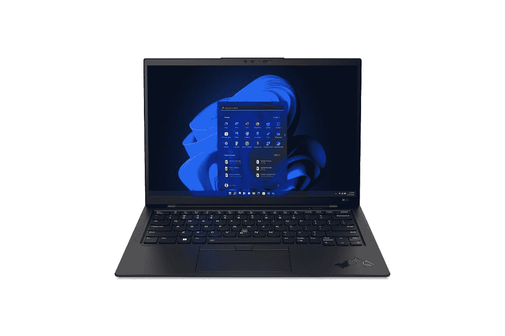

# 2023 年联想 ThinkPad X1 Carbon Gen 10 最佳替代充电器

> 原文：<https://www.xda-developers.com/best-chargers-lenovo-thinkpad-x1-carbon-gen-10/>

# 2023 年联想 ThinkPad X1 Carbon Gen 10 最佳替代充电器

联想 ThinkPad X1 Carbon Gen 10 的盒子里有一个 65W 的充电器，但我们为它收集了一些最好的替代充电器。

新款联想 ThinkPad X1 Carbon Gen 10 是 2022 年[最佳商务笔记本电脑](https://www.xda-developers.com/best-business-laptops/)之一。今年更新的新型号配备了升级的第 12 代英特尔酷睿处理器、改进的网络摄像头等。如果你想了解这款新笔记本的更多信息，我们建议你看看我们的 [ThinkPad X1 Carbon Gen 10 评测](https://www.xda-developers.com/lenovo-thinkpad-x1-carbon-gen-10-review/)。这款新笔记本还配有一个更大的 65W 充电器。如果你想为联想 ThinkPad X1 Carbon Gen 10 笔记本电脑购买替代充电器，那么我们在这里收集了一些选项。

为了获得最佳充电速度，我们建议您购买与包装盒中包含的充电器功率相同或更高的充电器。从基本的 65W 充电器到瓦数更高的适配器，我们在本文中添加了一些选项，可以帮助您在丢失包装盒中包含的充电器时为联想 ThinkPad X1 Carbon 充电。所以，不要再浪费时间了，让我们开始吧:

* * *

## 2022 年联想 ThinkPad X1 Carbon Gen 10 最佳替代充电器

### 联想 65W USB-C GaN 电源适配器

联想 65W GaN 是联想 ThinkPad X1 Carbon Gen 10 笔记本电脑的可靠替代充电器。它使用 GaN 技术，这使得它比其他许多 65W 充电器更小。我们在这里添加的这个特定列表没有 USB 电缆，所以你必须使用现有的电缆或单独购买一条。

**Affiliate Links**

Amazon

[View at Amazon](https://www.amazon.com/Lenovo-Adapter-Foldable-Portable-G0A6GC65WW/dp/B0916GDHKW/?tag=xda-1mcpo3o-20&ascsubtag=UUxdaUeUpU40783&asc_refurl=https%3A%2F%2Fwww.xda-developers.com%2Fbest-chargers-lenovo-thinkpad-x1-carbon-gen-10%2F&asc_campaign=Short-Term)

### 联想 65W USB-C GaN 电源适配器

联想的 65W 交流电源适配器本质上只是笔记本电脑包装盒内电源适配器的替代品。这是一个相当简单的充电器，适合即插即用，无需担心单独的电缆。然而，与 65W GaN 充电器不同，这款充电器的整体尺寸有点大。

**Affiliate Links**

Amazon

[View at Amazon](https://www.amazon.com/Lenovo-4X20M26268-Included-Original-Packaging/dp/B06Y2YPWSM/?tag=xda-1mcpo3o-20&ascsubtag=UUxdaUeUpU40783&asc_refurl=https%3A%2F%2Fwww.xda-developers.com%2Fbest-chargers-lenovo-thinkpad-x1-carbon-gen-10%2F&asc_campaign=Short-Term)

### Nekteck 100W GaN USB-C 充电器

如今，许多笔记本电脑和智能手机的充电器都没有电缆。虽然如果你有现有的电缆，这不一定是一个问题，但我们希望添加一个带电缆的便携式 GaN 充电器。在这方面，Nekteck 100W USB-C 电缆是一个可靠的选择。它可以很好地与 ThinkPad X1 Carbon 配合使用，并以最大速度充电。

**Affiliate Links**

Amazon

[View at Amazon](https://www.amazon.com/Nekteck-Certified-Foldable-Charging-Compatible/dp/B089FC1TRF?tag=xda-1mcpo3o-20&ascsubtag=UUxdaUeUpU40783&asc_refurl=https%3A%2F%2Fwww.xda-developers.com%2Fbest-chargers-lenovo-thinkpad-x1-carbon-gen-10%2F&asc_campaign=Short-Term)

### Baseus 65W GaN 3 端口充电器

如果你正在为你的笔记本电脑寻找一个小充电器，那么我们认为 Baseus 65 3 端口充电器是一个很好的选择。它不仅可以全速为你的 ThinkPad X1 Carbon Gen 10 充电，还配有额外的端口，可用于为其他设备充电。如果你同时给所有设备充电，速度会稍微慢一些，但我们认为这是一个很好的选择。

**Affiliate Links**

Amazon

[View at Amazon](https://www.amazon.com/Charger-Baseus-Adapter-Delivery-Foldable/dp/B083J229RJ?tag=xda-1mcpo3o-20&ascsubtag=UUxdaUeUpU40783&asc_refurl=https%3A%2F%2Fwww.xda-developers.com%2Fbest-chargers-lenovo-thinkpad-x1-carbon-gen-10%2F&asc_campaign=Short-Term)

### Belkin BoostCharge Pro 108W GaN 4 端口充电器

如果你正在寻找一个强大的多端口充电器，以便在给笔记本电脑充电的同时给其他设备充电，那么 Belkin 108W 4 端口充电器可能就是你的选择。这款充电器最大的优点之一是，在给其他设备充电时，您可以获得笔记本电脑的最高充电速度。

**Affiliate Links**

belkin

[View at Belkin](https://www.belkin.com/us/chargers/wall/boost-charge-pro-4-port-gan-charger-108w/p/p-wch010/)

### Anker 737 PowerCore 26K

这款充电器与我们在本系列中提到的几乎所有选项都不同。Anker 便携式充电器配有壁式充电器，在家时可以正常使用。然而，你还可以获得一个大型的电源库，可以为你的笔记本电脑提供 60W 的功率，这对于你在旅途中非常有用。

**Affiliate Links**

Store

[View at Store](https://shop-links.co/1784586564160105406?u1=df77a838-1bbc-4a57-9a35-ea1d38282819)

Amazon

[View at Amazon](https://www.amazon.com/Anker-PowerCore-Charger-Delivery-Portable/dp/B08537MKBS?tag=xda-1mcpo3o-20&ascsubtag=UUxdaUeUpU40783&asc_refurl=https%3A%2F%2Fwww.xda-developers.com%2Fbest-chargers-lenovo-thinkpad-x1-carbon-gen-10%2F&asc_campaign=Short-Term)

* * *

这让我们得出了 2022 年联想 ThinkPad X1 Carbon Gen 10 最佳充电器的结论。市场上并不缺少充电器，但如果你想为笔记本电脑可靠地充电，我们认为这些是值得考虑的。如果我们选择，那么我们认为 Belkin 108W 4 端口充电器是一个值得考虑的可靠选择。这将确保您可以同时为多个设备充电，而不必寻找更多的充电点。或者，你也可以选择一些简单的东西，如 Anker Powercore，它本质上也给你一个电源库。

如果你有兴趣，我们会在下面留下购买联想 ThinkPad X1 Carbon Gen 10 笔记本的链接。如果你仍然不确定是否购买这款笔记本电脑，那么你可能会考虑看看我们收集的[最佳 ThinkPad](https://www.xda-developers.com/best-thinkpads/)，看看你是否能找到其他选择。或者，你也可以查看我们收集的[最佳笔记本电脑](https://www.xda-developers.com/best-laptops/)，看看目前为止我们看到的 2022 系列中是否有其他笔记本引起你的注意。

 <picture></picture> 

Lenovo ThinkPad X1 Carbon Gen 9

##### 联想 ThinkPad X1 碳第 10 代

联想 ThinkPad X1 Carbon Gen 10 内部装有一块 57 瓦时的电池，可以使用包装盒中附带的 65 瓦充电器进行充电。