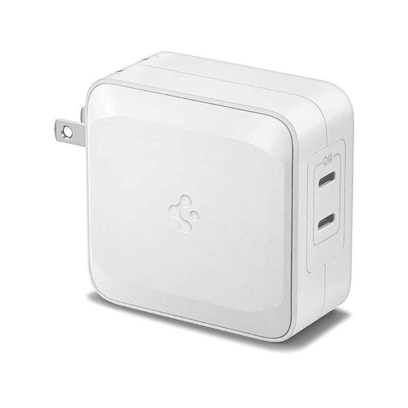

# 联想 ThinkPad X1 Yoga Gen 7 的最佳替代充电器

> 原文：<https://www.xda-developers.com/best-chargers-lenovo-thinkpad-x1-yoga-gen-7/>

# 联想 ThinkPad X1 Yoga Gen 7 的最佳替代充电器

您是否丢失或放错了联想 ThinkPad X1 Yoga 附带的充电器？以下是您可以获得的一些替换选项。

联想的 ThinkPad X1 Yoga Gen 7 是 2022 年你能买到的[最好的商务笔记本电脑](https://www.xda-developers.com/best-business-laptops/)之一。它采用了英特尔的最新硬件，拥有漂亮的显示屏和新的 4K 超高清+有机发光二极管配置选项，网络摄像头已全面升级为 1080p 传感器，为您提供更好的视频通话和会议质量。为了保持整个系统的运行，联想 ThinkPad X1 Yoga 配备了 57 瓦时的电池，该电池由随附的 65 瓦充电器充电。

但是如果你丢失了充电器或者它因为某种原因停止工作了，会发生什么呢？值得庆幸的是，如果你需要为你的笔记本电脑买一个新的充电器，我们不会缺少选择，我们已经收集了一些你现在可以购买的最好的充电器。其中一些是相当基本的充电器，但其他人有一些更有趣的功能，你可能也会喜欢。让我们开始吧。

 <picture></picture> 

Lenovo 65W GaN Charger

##### 联想 65W USB-C GaN 电源适配器

联想笔记本电脑没有比联想充电器更好的充电方式了吧？联想销售这种紧凑型 65W 充电器，使用氮化镓来保持凉爽，因此它比典型的笔记本电脑充电器小得多。

 <picture></picture> 

Baseus 65W 3-port charger

##### Baseus 65W GaN 3 端口充电器

也想要能给手机充电的东西吗？这款 65W Baseus 充电器有三个端口，因此您可以插入更多设备。但是，如果同时插入其他设备，笔记本电脑的充电速度会变慢。

 <picture></picture> 

Spigen Arcstation Pro

##### Spigen 45W ArcStation Pro GaN 充电器

如果你想获得最快的充电速度，Spigen Arcstation Pro 的功率高达 100W。它有两个端口，如果你同时使用两个端口，每个端口可以给你 45 瓦的功率。

 <picture></picture> 

PDUSBSZ 65W Charger

##### 联想 65W USB-C 充电器

如果你碰巧很容易丢失充电电缆，这款充电器是个不错的选择。这是一个非常便宜和紧凑的充电器，但由于它提供 65W 的功率，它仍然是联想 ThinkPad X1 Yoga 的一个很好的匹配。

 <picture></picture> 

Emaks 65W USB-C charger

##### Emaks 65W USB-C 充电器

我们今天看到的许多充电器都将所有的元件内置在插头中，但对一些人来说。将电源适配器与插头分开可能更好。这是一个便宜的 65W 充电器，正是这样做的。

 <picture></picture> 

Belkin 108W 4-Port charger

##### Belkin BoostCharge Pro 108W GaN 4 端口充电器

想从同一块砖上为所有设备充电吗？这款来自 Belkin 的 108W 充电器可以为您的笔记本电脑提供高达 96W 的功率，即使在使用其他端口时，主端口仍然可以提供 65W 的功率。

 <picture></picture> 

Omni 20c+

##### 全能 Omni 20c+

需要在旅途中给笔记本电脑充电吗？Omni 20c+是一个大型电源组，支持通过 USB-C 传输 60W 的功率。但是，您可以使用电源组中内置的墙上插座来更快地充电。

 <picture></picture> 

Kensington Thunderbolt 4 Docking Station

##### Kensington SD5700T Thunderbolt 4 扩展坞

给你的笔记本电脑充电已经足够有用了，但是给你的笔记本电脑增加功能怎么样呢？这个肯辛顿坞站增加了更多的 USB 型端口和三个 Thunderbolt 下游端口，用于显示器等设备。

 <picture></picture> 

Jackery Explorer 300

##### Jackery Explorer 300

如果你打算离开插座几天，像这样的大型便携式发电站可能是你所需要的。它有两个墙上插座和一个 USB-C 端口，可以提供 60W 的功率。另外，它足够让你坚持几天。

这些就是我们为联想 ThinkPad X1 Yoga Gen 7 推荐的所有充电器选项。到最后，我们有了更多的选择，这让我们有点疯狂，但它们可能对有特殊需求的人有用。当然，如果你只需要一个充电器来代替盒子里的充电器，基本选项也可以。但我们也不认为大多数用户需要更换他们现有的充电器，因为笔记本电脑仍然是最近才出现的。

如果你还没有，你可以购买下面的联想 ThinkPad X1 Yoga Gen 7。这是本年度[最佳笔记本电脑](https://www.xda-developers.com/best-laptops/)之一，尤其是如果你想要一台可靠且外观经典的笔记本电脑来工作的话。它拥有高端的性能、多功能的可转换设计，以及使 ThinkPads 脱颖而出的标志性元素，如红色的 TrackPoint 和触摸板上方的重复鼠标按钮。

 <picture></picture> 

Lenovo ThinkPad X1 Yoga Gen 7

##### 联想 ThinkPad X1 Yoga Gen 7

联想 ThinkPad X1 Yoga Gen 7 是一款功能强大的敞篷电脑，采用第 12 代英特尔处理器，最高可配超高清+有机发光二极管显示屏。此外，您可以通过全高清网络摄像头获得它。