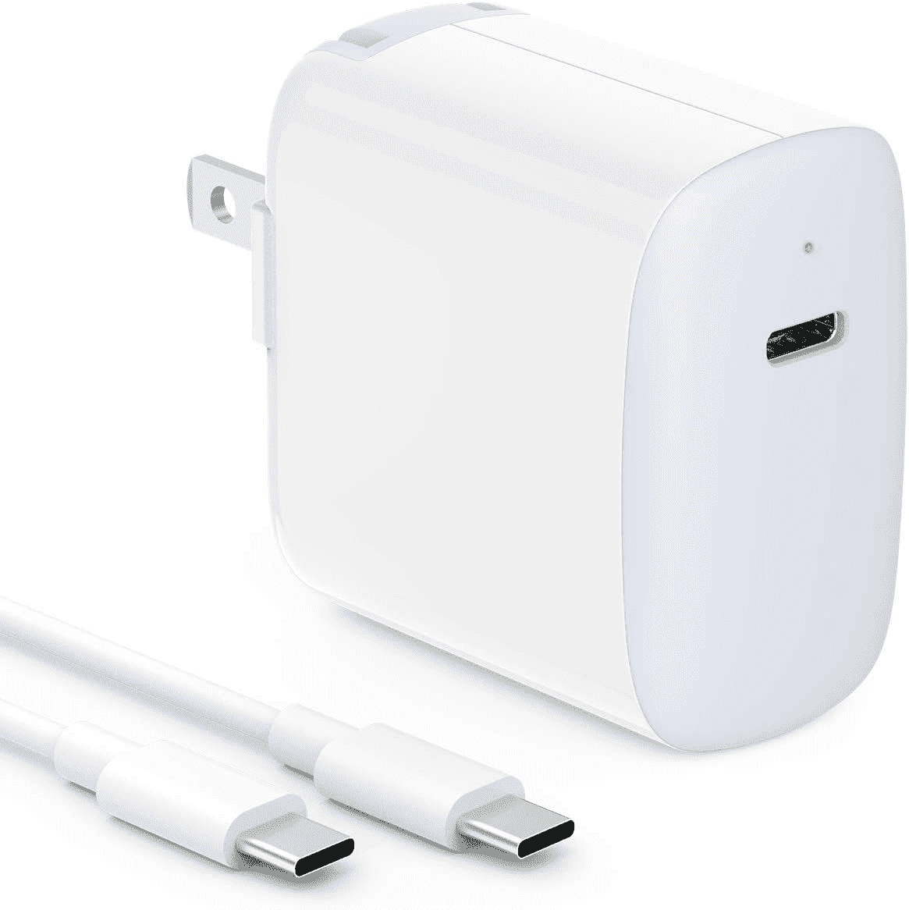

# MacBook Air 的最佳充电器(2022)

> 原文：<https://www.xda-developers.com/best-chargers-macbook-air-2022/>

2022 MacBook Air 是一款非常棒的笔记本电脑，拥有全新的设计，新的颜色可供选择，新的 M2 处理器承诺比以前更高的性能。我们还没有到笔记本电脑不再配备充电器的地步，所以附带的电源适配器和电缆应该足以让你使用很长时间。但意外总会发生，如果你碰巧丢失或损坏了 MacBook Air 附带的充电器，你就需要更换一个。

为了帮助你做到这一点，我们收集了一些你现在可以买到的最好的充电器，它们可以与 MacBook Air 配合使用。最新型号的盒子里有一个 30W 的电源适配器，尽管你也可以得到一个 35W 的双端口适配器，或 67W 的快速充电适配器。如果你只关心官方选项，我们也在下面列出了它们，但是有一些很棒的第三方选项，它们更便宜并且功能相同(甚至更好)。

*   <picture></picture>

    苹果 30W USB-C 电源适配器

    ##### 苹果 30W USB-C 电源适配器

    如果你想要 MacBook Air 自带的官方基本充电器，就是它了。它提供 30W 的功率，并有一个 USB-C 端口，尽管你需要自己的电缆或单独购买。

*   <picture></picture>

    Anker 713 充电器

    ##### Anker 713 Nano II 45W 充电器

    如果你想要一个特别小巧的替代品，Anker 713 45W 充电器是一个很棒的选择。它甚至比苹果的官方充电器更强大，但它要小得多。它不包括电缆，所以你需要有一个。

*   <picture></picture>

    Ifeart 30W 充电器

    ##### Ifeart 30W 充电器

    不想花大钱买新充电器？这个 30W 的电源适配器可能是一个很好的选择——在提供相同功率的情况下，它比苹果的充电器便宜得多，如果你没有 USB-C 电缆，你还可以在盒子里得到一根 USB-C 电缆。

*   <picture></picture>

    苹果 67W USB-C 电源适配器

    ##### 苹果 67W USB-C 电源适配器

    想让笔记本电脑充电更快？苹果的 67W 充电器可以比标准的 30W 适配器更快地为 MacBook Air 充电。不过，你需要使用自己的电缆。

*   <picture></picture>

    Baseus 100W 壁式充电器

    ##### Baseus 100 w 壁式充电器

    苹果官方快速充电器高达 67W，但如果你想要更强大的东西，这款来自 Baseus 的 100 w 充电器是个不错的选择。这比 MacBook Air 需要的速度快，但像这样的 100W 充电器也可以给各种笔记本电脑充电。

*   <picture></picture>

    Nekteck 100W 充电器

    ##### Nekteck 100 w GaN USB-C 充电器

    如果你想要更合理的价格，Nekteck 100 w 充电器是一个更实惠的选择，还包括一根 USB-C 线。它可以为你的 MacBook Air 充电，但也适用于更多耗电的笔记本电脑。

*   <picture></picture>

    苹果 35W 双口充电器

    ##### 苹果 35W 双口充电器

    在 2022 款 MacBook Air 旁边，苹果做了一个双口 USB-C 充电器，可以同时给笔记本电脑和手机充电。这不是一个非常快速的充电器，但它有支持苹果的世界旅行适配器套件的好处，你可能会喜欢。

*   <picture></picture>

    Anker power port III 100 w

    ##### Anker power port III 100 w 充电器

    苹果的双端口充电器如果你实际上想同时给两台设备充电，速度并不是很快。有了这个，你可以从每个端口获得更多的电力，所以你的两个连接设备快速充电，同时进行。

*   <picture></picture>

    Hyphen-X 100 w 4 口充电器

    ##### Hyphen-X 100 w 4 口 PD GaN 充电器

    如果你有一堆设备，想用一块砖全部给它们充电，这是个好办法。100 瓦功率分配到四个端口，您可以为所有设备快速充电，节省墙壁插座的空间。它也有黑色和白色两种选择。

如果你碰巧需要更换，这些是你可以为 2022 年的 MacBook Air 购买的最好的充电器。苹果公司的官方产品可能是一些人的最爱，但第三方产品肯定更便宜，功能也更强大。多端口充电器尤其如此，它可以支持更多设备，充电速度比苹果的 35W 双充电器快得多。

如果你还没有，你可以使用下面的链接购买 2022 MacBook Air。由于新的苹果 M2 处理器，更新的设计和升级的显示器，它很容易成为你现在可以买到的最好的苹果电脑之一。如果你还没有完全信服，也许可以看看[最好的笔记本电脑](https://www.xda-developers.com/best-laptops/)，看看还有什么。Windows 世界中也有一些很棒的选项。

##### 苹果 MacBook Air (2022)

2022 年的 MacBook Air 由新的苹果 M2 芯片驱动，另外它有一个新的更高的显示屏和全新的设计。它还非常轻薄，便于随身携带。